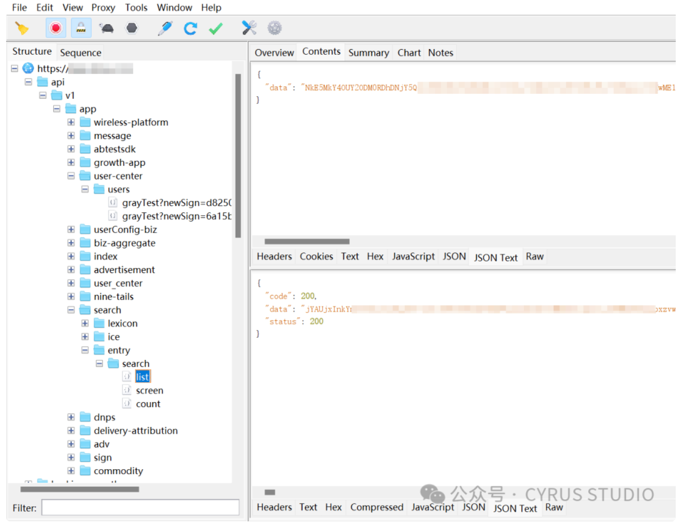

# 移动安全面试八股文

## 目录

- [安卓逆向面试题汇总](#安卓逆向面试题汇总)
- [常见的加固手段有哪些](#常见的加固手段有哪些)
- [安卓逆向反调试的手段有哪些](#安卓逆向反调试的手段有哪些)
  - [ptrace检测](#ptrace检测)
  - [TracerPid检测：](#TracerPid检测)
  - [自带调试检测函数android.os.Debug.isDebuggerConnected()](#自带调试检测函数androidosDebugisDebuggerConnected)
  - [3）arm汇编 B、BL、BX、BLX区别和指令含义](#3arm汇编-BBLBXBLX区别和指令含义)
  - [4）ida 使用 快捷键](#4ida-使用-快捷键)
  - [5）frida hook原理 xposed注入原理](#5frida-hook原理-xposed注入原理)
  - [6）inline hook原理](#6inline-hook原理)
  - [7) ollvm 代码混淆了解过吗 ，一般怎么处理](#7-ollvm-代码混淆了解过吗-一般怎么处理)
  - [FART脱壳的步骤主要分为哪三步？每一步的实现原理是什么？](#FART脱壳的步骤主要分为哪三步每一步的实现原理是什么)
- [Android 下常见反抓包方案与绕过](#Android-下常见反抓包方案与绕过)
  - [No Proxy（无代理模式）](#No-Proxy无代理模式)
  - [通过 VPN 绕过 No Proxy](#通过-VPN-绕过-No-Proxy)
  - [检测 VPN](#检测-VPN)
  - [ADB 代理抓包的原理](#ADB-代理抓包的原理)
  - [如何检测和防御 ADB 代理？](#如何检测和防御-ADB-代理)
  - [SSL Pinning](#SSL-Pinning)
  - [OkHttp 如何实现 SSL Pinning？](#OkHttp-如何实现-SSL-Pinning)
- [移动安全面试题—混淆](#移动安全面试题混淆)
  - [Java 层混淆和 so 层混淆的发展，介绍一下：](#Java-层混淆和-so-层混淆的发展介绍一下)
  - [Java 层混淆如何进行反混淆：Java 层反混淆的方法包括：](#Java-层混淆如何进行反混淆Java-层反混淆的方法包括)
  - [ollvm混淆的原理，手段，列举指令替换的例子，如何实现的控制流平坦化](#ollvm混淆的原理手段列举指令替换的例子如何实现的控制流平坦化)
  - [ollvm 混淆及实现](#ollvm-混淆及实现)
  - [ollvm 分析方法](#ollvm-分析方法)
  - [解决 ollvm 的初步思路](#解决-ollvm-的初步思路)
  - [ollvm 中的困难点](#ollvm-中的困难点)
  - [控制流平坦化的解决](#控制流平坦化的解决)
  - [符号执行解决虚假控制流](#符号执行解决虚假控制流)
  - [针对 SO 里的点字符加密解决](#针对-SO-里的点字符加密解决)
  - [ollvm 中的不透明谓词及解决](#ollvm-中的不透明谓词及解决)
  - [SO 层 OLLVM 反混淆](#SO-层-OLLVM-反混淆)
  - [除了使用 ollvm 混淆，还可以尝试以下方法来保护代码，同时避免性能损失：](#除了使用-ollvm-混淆还可以尝试以下方法来保护代码同时避免性能损失)

# **安卓逆向面试题汇总**

面试官经常问的几个问题如下：

1.常见的加固手段有哪些

2.安卓反调试一般有哪些手段，怎么去防范

3.arm汇编 b bl bx blx 这些指令是什么意思

4.ida xx操作的快捷键是哪个？

5.Xposed hook 原理 frida hook 原理

6.inline hook原理

7.ollvm 代码混淆你了解吗？要怎么去处理

上面是一个汇总的目录，下面一个一个仔细拆分 详细说说

# **常见的加固手段**有哪些

网上有的人把安卓壳分成五代壳，有人分成三代壳。

不同的人对这块的，具体的区分和看法不同，但是五代壳更细分一些。

在加固厂商内部，用的是五代壳的标准，当然他们PPT已经出现了第6 ,7 ,8代壳。 &#x20;
我入行以及搬砖的时候，周围人用的基本都是下图的标准，所以我这里用五代壳来描述。


上面的图把安卓五代壳的优缺点，实现逻辑讲的非常好。大佬们理解了上面这两张图，回答第一个问题基本就ok了。

但是，大哥们既然看到了我这个文章，大佬们就可以风骚一点多说一些，说些面试官也不知道的。 &#x20;

毕竟， 唬不住5k,唬得住50k &#x20;
说完上面的大概就是个及格分，说点下面的，面试官如果不了解这块的话当时就被你给唬住了。

大佬们如果在公司负责甲方安全，采购过企业版加固，或者在加固厂商搬过砖的话就会知道。 &#x20;
加固虽然大体上分为免费版和企业版。 &#x20;
免费版里面有的公司基本没啥加固选项，上传个apk应用包梭哈就完事了。

比如这种。


有的公司还是 比较人性化的，用户可以根据自己需求选择加固选项。比如这种


可以看到，免费版这里，厂商玩的花样并不多，有的就是上传一个包，啥加固选项没有，有的虽然有，加固选项也就几个。

但是企业版这里，厂商们花样都比较多。 &#x20;
假设某加固公司，企业版实现了6个功能（一般是十几个 二十几个 我这里做个比喻）。 &#x20;
功能如下：

1.sovmp加固

2.密钥白盒

3.反xposed frida

4.源代码深度混淆

5.h5加固

6.ollvm混淆

这上面的功能是插件化的，你可以根据实际应用场景选择其中几个功能，也可以都要。 &#x20;
比如你的app根本么有h5页面，你选个h5加固不是白花钱吗。 &#x20;
这里套餐不同，价格也是不同的。（企业壳大概一年几万吧） &#x20;
销售那里不同的功能组合有不同的报价，就像A公司选了1,3,5。你选了 2,4,6. 虽然都是企业版，但是你和别人的企业版还是有区别的。

说这些就是表示，不同apk即使用了同一家厂商的企业版加固，加固策略，选择的加固方式也是不一样的。

而且，一些行业的客户，加固厂商各自也会有针对行业的一些加固手法。 &#x20;
比如一些手游，加固厂商就会有一些反外挂的操作，针对内存读写的强检测，一些金融客户哪，因为对用户信息保密程度要求高，就会做一些安全键盘和防录屏截屏操作。

这里一些加固公司还把加固方式也做成了插件化，比如一个apk,同时用2代壳和4代壳的加固方式都用上。2代壳不落地加载结合4代壳dexvmp，或者3代壳指令抽取结合4代壳dexvmp，这里混合也是他们的常用套路，不会影响app正常运行。

说到这里有的大佬可能会疑惑，2代3代4代不是不同的加固方式吗？是怎么结合的哪？这里我解释一下 &#x20;
假设加固厂商拿到了一个未加固的dex, 那么2 3 4代壳子是怎么结合的。

1.dex比较重要的部分，比如算法部分，登录模块，这块的方法内容被抽取转换成自定义的指令格式，然后调用系统底层的jni方法执行。(4代壳dexvmp)

1. 其他不重要方法体直接抽空， 单独加密，运行的时候方法体内容再动态还原(3代抽取)。
2. 加载这个dex的时候（现在的dex已经经过了上面2步处理 里面的方法很多被抽空，一些被dexvmp保护）, 并不是写出到文件系统用 dexclassloader这样的api去加载, 而是读到内存中直接加载，直接调用c层API加载内存中的dex（2代不落地加载）

还有一些更深度的定制，反正有钱就是大爷，你钱多干啥都可以商量，一般企业壳加固后你还是可以看到厂商的特征加固文件。比如你看到libjiagu.so就觉得是360 ，深度定制后，特征文件你一个都找不到，而且还可以实现一些定制化的需求。


企业版功能插件化，套餐化，加壳方式组合这些东西，一般来说很多人是不知道的，所以说说这些，能很快的把你从众多普通面试者中区分出来。


把这一点说上，到时候面试官说不定因为过于欣赏你，把他大学刚毕业，没有男朋友的妹妹介绍给你了。

所以，当面试官问加固方式这块的时候，你除了把两张图的内容说清楚，还可以清清嗓子，一脸高手寂寞的神情。

悠悠地说： &#x20;
其实吧，很多我搞过的企业壳，看的出来挺多都是定制化的，有的是2代壳结合4代壳的加固，有的是2代3代混合4代。 &#x20;
感觉很多企业壳根据不同的业务场景，买了不同的加固套餐，比如xx应用，我脱壳的时候，发现有 清场sdk, ollvm混淆。另一个企业壳根本就没有这些，大部分逻辑在后端，不过也搞了密钥白盒和H5加固。 &#x20;
还有一些游戏的企业壳，内存读写明显防护是比较厉害的。金融这块的也基本都有安全键盘，和防截屏的一些保护。 &#x20;
这时候，状若无意的对面试官说：“你说是吧”。

perfect.

# **安卓逆向反调试的手段有哪些**

这里比较常用的反调试手段有

#### ptrace检测

背景知识：ptrace是linux提供的API, 可以监视和控制进程运行，可以动态修改进程的内存，寄存器值。一般被用来调试。ida调试so，就是基于ptrace实现的。

因为一个进程只能被ptrace一次, 所以进程可以自己ptrace自己，这样ida和别的基于ptrace的工具和调试器或就无法调试这个进程了。 &#x20;
实现代码:

```c 
int check_ptrace()
```


定位方法：直接在ptrace函数下断点。 &#x20;
绕过方法：手动patch，或者用frida之类的工具hook ptrace直接返回0. &#x20;
实例演示


#### TracerPid检测：

背景知识:TracerPid是进程的一个属性值，如果为0，表示程序当前没有被调试，如果不为0，表示正在被调试, TracerPid的值是调试程序的进程id。 &#x20;
实现代码：

```c++ 
#define MAX_LENGTH 260
```


相关特征

定位方法：一般检测TracerPid都会读取 /proc/进程号/status 这个文件所以可以直接搜索 /status 这种字符串，这里也会用到getpid, fgets这种API,所以也可以通过这两个api定位。

绕过手法：

1.直接手动patch, nop掉调用

1. 编译内核，修改linux kernel源代码，让 TracerPid永久为0. 修改方法 [https://cloud.tencent.com/developer/article/1193431](https://cloud.tencent.com/developer/article/1193431 "https://cloud.tencent.com/developer/article/1193431")

实例演示：

这里用android studio 调试app 查看app进程对应的 status，status里查看TracerPid的值


可以看到TracerPid的值 是调试器的进程id。


没被调试的时候，TracerPid的值是0。

#### 自带调试检测函数android.os.Debug.isDebuggerConnected()

背景知识:自带调试检测api, 被调试时候返回 true, 否则返回 false。

```java 
import static android.os.Debug.isDebuggerConnected;
```


相关特征 定位方法：直接搜索isDebuggerConnected函数名即可。

绕过手法：frida之类的工具直接hook函数，直接返回false.


检测调试器端口 比如 ida 23946 frida 27042 之类的

背景知识：调试器服务端默认会打开一些特定端口，方便客户端通过电脑usb线，或者直接通过局域网进行连接。

实现代码:

```javascript 
//返回找到的特征端口数量
```


相关特征 定位方法：读取端口时，一般都会读取 /proc/net/tcp文件，所以可以搜索关键字，或者 popen（管道执行命令） fgets（读取文件行）这种api进行定位。

案例演示：

这里启动 frida\_server，然后查看/proc/net/tcp文件内容，果然发现了frida\_server对应的端口。


绕过手法：换个端口就可。

android\_server 换端口 &#x20;
这里注意 -p 和 端口之间是没有空格的 直接连接

```bash 
/data/local/tmp/android_server -p8888//运行android_server  以端口8888运行
```


根据时间差反调试

背景知识：在关键逻辑的开始和结束的地方，获取当前的秒数。结束时间减去开始时间，如果超过一定时间，认定是在调试。因为程序运行速度很快的，卡到2-3秒执行完，除非你逻辑好多，算法很复杂，要不基本不大可能。绕过方法：手动nop掉。

案例演示：


这里不用说的太全，说几个常见的就行了。说全了时间也不太够。

### **3）arm汇编 B、BL、BX、BLX区别和指令含义**

这里对这几条指令有个简单记忆的方法 那就是对几条指令中的字母单独记忆，然后遇到字母的组合，就把字母代表的含义加起来就可了。

单独记忆法：

字母 B: 跳转 类似jmp &#x20;
字母 L: 把下一条指令地址存入LR寄存器 &#x20;
字母 X: arm和thumb指令的切换

注意：这样去记 是为了快速记住上面几条指令的含义 而不是 单字母本身在汇编里面有这些含义

所以，4条指令的的含义就是

1.B 这里跟x86汇编的 jmp比较像，可以理解成无条件跳转

2.BL ：这里理解成 字母B + 字母L 作用是 把下一条指令地址存入LR寄存器 然后跳转。像x86汇编里面的 call , 只不过call指令把下一条指令的地址压入栈，BL是把下一条指令的地址放到 LR寄存器。

3.BX 这里理解成 字母B + 字母X 这里表示跳转到一个地址，同时切换指令模式 当前如果是arm 就会切换成 Thumb 如果是Thumb 就会切换成arm

4.BLX 这里是 字母B + 字母L + 字母X 表示跳转到一个新的地址，跳转的时候把下一条指令地址存入LR寄存器 同时切换指令模式 arm转thumb thumb转arm

可以这样去理解：blx = call + 切换指令模式

### **4）ida 使用 快捷键**

G ：跳转到指定地址


Shift + F12：字符串窗口，用于字符串搜索


Y：修改变量类型 函数声明快捷键


除了修改变量类型 也可以修改函数的返回值类型 和 参数类型


X : 查看 变量 常量 函数 的引用


在定位算法的时候 用x查看关键变量的引用也是很有效的一种方式


同样可以按X查看常量的引用 定位一些字符串到底在哪个函数还是蛮好用的


Ctrl+S:查看节表


### **5）frida hook原理 xposed注入原理**

frida注入原理

frida 注入是基于 ptrace实现的。frida 调用ptrace向目标进程注入了一个frida-agent-xx.so文件。后续骚操作是这个so文件跟frida-server通讯实现的 &#x20;
ida调试也是基于 ptrace实现的。 &#x20;
那为什么有人能动静结合用 frida 和 ida一起调试哪？一个进程只能被ptrace一次,那这里为啥两个能结合？ &#x20;
答案是：先用frida注入，然后用调试器调试。 &#x20;
frida在使用完ptrace之后 马上就释放了，并没有一直占用，所以ida后续是可以附加，继续使用ptrace的。


2.xposed注入原理 &#x20;
安卓所有的APP进程是用 Zygote(孵化器)进程启动的。 &#x20;
Xposed替换了 Zygote 进程对应的可执行文件/system/bin/app\_process,每启动一个新的进程，都会先启动xposed替换过的文件，都会加载xposed相关代码。这样就注入了每一个app进程。

### **6）inline hook原理**

这里 我画了一个图，大佬们自己看图 &#x20;
原理描述：修改函数头，跳转到自定义函数，自定义函数就是自己想执行的逻辑，执行完自己的逻辑再跳转回来。


### **7) ollvm 代码混淆了解过吗 ，一般怎么处理**

一般这个难度的问题会放到靠后，除非你在简历里就写了自己锤过很多 ollvm混淆过的代码. &#x20;
这里大佬们要是实在不会 对这块没啥了解，也建议大佬们挣扎一下，把下面我列的说一下 。也能争取点卷面分

ollvm是一个代码混淆的框架 &#x20;
这个框架通过以下三种方式实现了代码混淆


这三种可以全部选择。也可以随意组合，具体怎样组合看具体根据具体场景去决定。

下面一个一个详细讲解

1.被混淆前的源代码 在ida中的样子在没有使用控制流平坦化之前 代码在反编译工具里面看的都是比较清晰的

```c++ 
#include <cstdio>
```


拖入ida后 流程图如下 这里可以看到流程还是很清晰的


下面是 源代码 加了不同参数后 被ollvm混淆后的样子


这里我用自己的话简单描述 ollvm的3种混淆方式

1.fla 控制流平坦化： &#x20;
混淆前混淆后如下图所示：混淆前： &#x20;


混淆后：


代码本来是依照逻辑顺序执行的，控制流平坦化是把，原来的代码的基本块拆分。

把本来顺序执行的代码块用 switch case打乱分发，根据case值的变化，把原本代码的逻辑连接起来。让你不知 道代码块的原本顺序。让逆向的小老弟一眼看过去不知道所以然，不知道怎么去分析。

2.bcf 虚假控制流：一般是通过全局变量，构造恒等式（一定会成立），和恒不等式（一定不成立），插入大量这种看似有用，实际上就是在为难你的代码。

```bash 
if(x == 0)
```


上面写了两段伪代码。假设 x的值是0 y的值是1 &#x20;
那么 在上面的代码中 &#x20;
if(x == 0) 这个条件一定是成立的 &#x20;
if(y == 0)这个条件是一定不成立的。

bcf虚假控制流，通过构造x,y 这种全局变量。让编译器不能推断x,y的值.(不透明维词) &#x20;
通过大量插入一些跟上面类似的恒等式，和恒不等式（不可达分支），然后在这些分支在里面写一些代码，把原逻辑串联起来。


只是把 x = x + 1 这样的代码 替换成类似于 x = x + 2 + 1 – 2 这样的代码

增大代码体积，把简单的指令变复杂。增大分析的难度

这里，大佬们在回答 ollvm这块的话 把我上面写的说一下就大概差不多了。

面试官如果问大佬们怎么解决：

大佬们可以这么说

通过unicorn 模拟执行去除控制流平坦化

[https://bbs.pediy.com/thread-252321.htm](https://bbs.pediy.com/thread-252321.htm "https://bbs.pediy.com/thread-252321.htm")

通过angr 符号执行 去除控制流平坦化

[https://security.tencent.com/index.php/blog/msg/112](https://security.tencent.com/index.php/blog/msg/112 "https://security.tencent.com/index.php/blog/msg/112")

通过angr 符号执行 去除虚假控制流

[https://bbs.pediy.com/thread-266005.htm](https://bbs.pediy.com/thread-266005.htm "https://bbs.pediy.com/thread-266005.htm")

通过Miasm符号执行移除OLLVM虚假控制流

[https://www.52pojie.cn/thread-995577-1-1.html](https://www.52pojie.cn/thread-995577-1-1.html "https://www.52pojie.cn/thread-995577-1-1.html")

**总结**

上面讲解了安卓逆向面试中，经常问的几个技术问题，背后的原理，该怎么回答。

当然除了技术篇，还会问一些发展方向，技术追求，看你稳定性之类的。

## FART脱壳的步骤主要分为哪三步？每一步的实现原理是什么？

A：FART脱壳的步骤主要分为三步：

内存中DexFile结构体完整dex的dump，主动调用类中的每一个方法，并实现对应CodeItem的dump，通过主动调用dump下来的方法的CodeItem进行dex中被抽取的方法的修复。

1.第一步的实现原理是通过选择合适的时机点获取到应用解密后的dex文件最终依附的Classloader，进而通过java的反射机制最终获取到对应的DexFile的结构体，并完成dex的dump。

1. 第二步的实现原理是基于ArtMethod类中的Invoke方法，在jni中扮演着至关重要的地位。通过构造出自己的invoke函数，在该函数中再调用ArtMethod的Invoke方法从而完成主动调用，并在ArtMethod的Invoke函数中首先进行判断，当发现是我们自己的主动调用时就进行方法体的dump并直接返回，从而完成对壳的欺骗，达到方法体的dump。
2. 第三步的实现原理是，由于壳在完成对内存中加载的dex的解密后，该dex的索引区即stringid，typeid,methodid,classdef和对应的data区中的string列表并未加密，而对于classdef中类函数的CodeItem部分可能被加密存储或者直接指向内存中另一块区域，我们只需要使用dump下来的method的CodeItem来解析对应的被抽取的方法即可。

# Android 下常见反抓包方案与绕过

常见反抓包手段：

- • No Proxy（禁用代理）
- • 启用 HTTPS + SSL Pinning
- • 使用 DNS-over-HTTPS / DoT（隐藏 DNS 请求）
- • 检查系统代理（Java 层检查 System.getProperty("http.proxyHost")）
- • 检测 VPN 或 adb 代理
- • 使用 native 层自己实现网络请求（绕过 Java 层）
- • 证书双向校验

## No Proxy（无代理模式）

所谓 “无代理模式” 实际上是通过主动避免走系统代理，从而规避传统的中间人抓包。

设置 OkHttp 不使用系统代理，直接访问服务器：

```kotlin 
val client = OkHttpClient.Builder()
    .proxy(Proxy.NO_PROXY) // 禁用系统代理
    .build()
```


设置 NO\_PROXY 后，Charles 并没有抓取到 [httpbin.org](http://httpbin.org "httpbin.org") 相关请求，App 中请求 [httpbin.org](http://httpbin.org "httpbin.org") 正常

## 通过 VPN 绕过 No Proxy

使用vpn比如茶壶这些进行绕过

如果使用 VPN 或全局代理，NO\_PROXY 也无法绕过抓包。比如，通过第三方代理应用 Drony 强制 APP 走代理。Drony 是一款强大的 Android 代理客户端，支持认证代理、多协议、PAC 脚本、规则过滤及 DNS 加密，且无需 root。

Drony：[https://drony.en.uptodown.com/android/download](https://drony.en.uptodown.com/android/download "https://drony.en.uptodown.com/android/download")

## 检测 VPN

通过代码检测 VPN 是否活跃

```kotlin 
/**
 * 检测 VPN 是否活跃
 */
fun isVpnActive(context: Context): Boolean {
    val connectivityManager = context.getSystemService(Context.CONNECTIVITY_SERVICE) as? ConnectivityManager
        ?: return false
    val networks = connectivityManager.allNetworks
    for (network in networks) {
        val caps = connectivityManager.getNetworkCapabilities(network)
        if (caps != null && caps.hasTransport(NetworkCapabilities.TRANSPORT_VPN)) {
            return true
        }
    }
    return false
}
```


## ADB 代理抓包的原理

1、在 PC 上启动抓包代理，例如：

- • Charles、Burp Suite、mitmproxy
- • 监听端口：127.0.0.1:8888


2、通过 ADB 命令将 Android 的 HTTP/HTTPS 流量重定向到主机代理端口：

```bash 
adb shell settings put global http_proxy 127.0.0.1:8888
```


这会在设备系统层设置代理，但不会在 Wi-Fi 设置中显示。

3、启用 TCP 端口转发（USB 隧道）：

`adb reverse tcp:8888 tcp:8888`

表示让设备端口 8888 流量经由 USB 隧道转发到电脑的 127.0.0.1:8888

4、设备中所有默认使用 HTTP 代理的流量（如 WebView、默认 Java 网络库）将经过代理服务，可被抓包。



设置代理：

`adb shell settings put global http_proxy 127.0.0.1:8888`

清除代理：

`adb shell settings put global http_proxy :0`

检查当前代理设置：

```bash 
adb shell settings get global http_proxy
```


## 如何检测和防御 ADB 代理？

通过代码检测 ADB 代理，或者 No Proxy 也能绕过 ADB 代理。

```kotlin 
/**
 * 检测是否通过 ADB 设置了 HTTP 代理（常用于抓包）
 */
fun isAdbProxyEnabled(): Boolean {
    val proxyHost = System.getProperty("http.proxyHost")
    val proxyPort = System.getProperty("http.proxyPort")
    if (proxyHost == "127.0.0.1" && proxyPort == "8888") {
        // 可能为 adb proxy 抓包
        return true
    }
    return false
}
```


## SSL Pinning

SSL Pinning（证书锁定） 是指 App 在客户端中内置并只信任特定的服务器证书或公钥，而不是信任系统或第三方根证书。

常见方式：

| 类型          | 描述                          |   |   |   |   |   |
| ----------- | --------------------------- | - | - | - | - | - |
| 证书级 Pinning | 验证服务端证书是否与内置证书完全一致          |   |   |   |   |   |
| 公钥级 Pinning | 提取服务端证书的公钥并进行匹配             |   |   |   |   |   |
| SPKI Hash   | 校验公钥 DER 格式的 SHA-256 哈希是否匹配 |   |   |   |   |   |

## OkHttp 如何实现 SSL Pinning？

# 移动安全面试题—混淆

### Java 层混淆和 so 层混淆的发展，介绍一下：

- Java 层混淆：主要通过修改类、方法和变量名称，以及插入无关代码等手段，使得逆向分析变得困难。常见的 Java 层混淆工具有 ProGuard、DexGuard 等。这些工具在 Android 开发中得到了广泛应用，以保护应用的源代码和逻辑。
- so 层混淆：主要针对 Native 代码（C/C++）进行混淆，包括改变函数名、变量名、数据结构等，以及插入无关代码等。so 层混淆可以进一步提升应用的安全性，防止攻击者轻易分析应用的内部结构和逻辑。

### Java 层混淆如何进行反混淆：Java 层反混淆的方法包括：

- 根据代码逻辑和调用关系，推测原始的类、方法和变量名称。
- 使用反编译工具（如 jadx、JD-GUI 等）和调试器（如 Android Studio 的调试功能）进行代码分析。
- 分析应用的行为，推断出关键功能和逻辑。
- 如果有 ProGuard 的映射文件（mapping.txt），可以使用它还原混淆后的代码。

### ollvm混淆的原理，手段，列举指令替换的例子，如何实现的控制流平坦化

ollvm（Obfuscator-LLVM）是一个基于 LLVM 编译器基础结构的开源代码混淆器。它的主要目标是提高逆向工程的难度，以保护软件的知识产权。ollvm 通过引入多种混淆技术来实现这一目标。以下是 ollvm 的一些主要混淆手段：

1. 指令替换：ollvm 通过替换常见的指令，使得生成的二进制代码更难以分析。例如，将一个简单的加法操作替换为多个异或、与、或操作。具体来说，ollvm 可以将一个加法操作替换为以下形式：

`a + b = ((a ^ b) ^ (a & b) <<1)`

这样的替换会增加逆向分析的难度，同时不影响程序的功能。

1. 控制流平坦化：控制流平坦化是一种流行的混淆技术，它通过将程序的控制流程结构转换为一个状态机，使得代码更难以阅读和分析。在 ollvm 中，控制流平坦化的实现方法如下：通过这种方法，原始程序的控制流结构被扁平化，变得难以分析。
   - 将原始程序的基本块（basic blocks）转换为状态机的状态；
   - 在每个基本块的末尾添加一个跳转指令，根据当前状态（一个变量）跳转到下一个状态；
   - 将所有基本块的跳转指令统一放在一个“调度器”（dispatcher）中，根据当前状态选择执行哪个基本块。

ollvm 的混淆原理基于 LLVM 编译器的中间表示（Intermediate Representation，IR）。在将源代码编译为目标代码的过程中，ollvm 修改了 LLVM IR，以实现上述混淆手段。具体地说，ollvm 在 LLVM 优化阶段之后添加了自定义的混淆转换（pass），以实现指令替换和控制流平坦化等混淆技术。

### ollvm 混淆及实现

ollvm（Obfuscator-LLVM）是一个基于 LLVM 编译器框架的混淆器，主要有以下几种混淆技术：控制流平坦化（Control Flow Flattening）、指令替换（Instruction Substitution）、不透明谓词（Opaque Predicate）等。ollvm 通过在编译阶段将这些混淆技术应用于源代码，以增加代码的复杂度和难以分析性。

### ollvm 分析方法

针对 ollvm 混淆的代码，可以尝试使用以下方法进行分析：

- 静态分析：使用反编译工具（如 JADX、Ghidra 等）还原代码，然后通过人工分析或者脚本辅助去识别和还原混淆部分。
- 动态分析：使用动态分析工具（如 Frida、GDB 等）在运行时 Hook 或者调试目标应用，以观察和修改混淆的行为。

### 解决 ollvm 的初步思路

要解决 ollvm 混淆，首先需要对混淆技术有深入的理解。针对不同的混淆方法，可以尝试以下策略：

- 控制流平坦化：通过分析虚假控制流，还原真实的控制流图。
- 指令替换：识别并还原被替换的指令，以恢复原始语义。
- 不透明谓词：识别不透明谓词，将其替换为真实的条件表达式。

### ollvm 中的困难点

ollvm 的混淆技术使代码变得更难以阅读和分析。其中，控制流平坦化和不透明谓词可能是比较困难的点，因为它们涉及到复杂的控制流和条件逻辑。

### 控制流平坦化的解决

- 通过静态分析，识别虚假跳转和分支，还原真实的控制流图。
- 使用动态分析工具（如 Frida、GDB 等），在运行时观察控制流的行为，辅助还原控制流图。

### 符号执行解决虚假控制流

符号执行是一种程序分析技术，可以处理虚假控制流。它通过将程序的输入表示为符号变量，生成约束条件，并求解这些约束，以确定真实的控制流路径。

### 针对 SO 里的点字符加密解决

- 静态分析：分析加密算法，编写脚本对密文进行解密。
- 动态分析：使用动态分析工具（如 Frida、GDB 等），在运行时 Hook 加密解密函数，获取解密后的内容。

### ollvm 中的不透明谓词及解决

不透明谓词是一种混淆技术，它在控制流中插入始终为真或始终为假的条件，以迷惑分析者。要解决不透明谓词，可以尝试以下方法：

- 静态分析：识别不透明谓词的特征，将其替换为真实的条件表达式。
- 动态分析：使用动态分析工具（如 Frida、GDB 等），在运行时观察条件表达式的行为，辅助识别和还原不透明谓词。

### SO 层 OLLVM 反混淆

- 静态分析：使用反编译工具（如 Ghidra、IDA Pro 等）对 SO 文件进行静态分析，识别混淆模式并尝试还原。
- 动态分析：使用动态分析工具（如 Frida、GDB 等）在运行时观察和修改混淆行为，辅助反混淆。

### 除了使用 ollvm 混淆，还可以尝试以下方法来保护代码，同时避免性能损失：

- 代码混淆：通过对代码进行简单的混淆，如变量名替换、函数重排等，可以提高分析难度，但不会对性能产生显著影响。
- 加密算法优化：选择性能较高的加密算法，如 AES、ChaCha20 等，可以在保证安全的同时减少性能损失。
- 白盒加密：使用白盒加密技术将关键算法和数据嵌入到程序中，使得即使在被逆向分析的情况下，攻击者也难以获取关键信息。这种方法对性能的影响相对较小。 &#x20;
